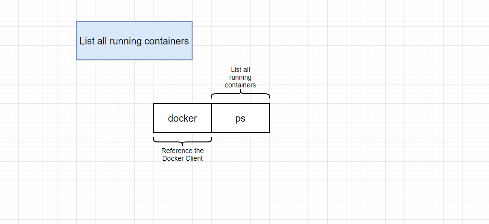
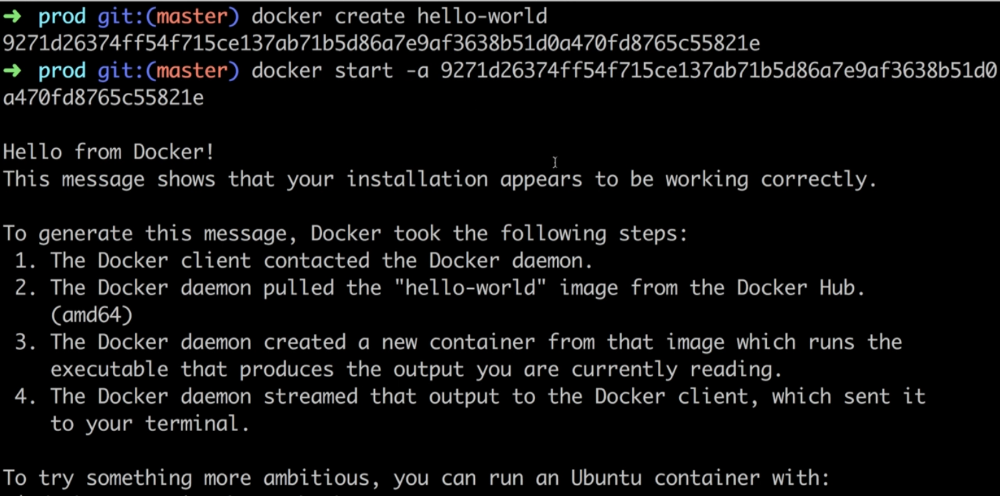
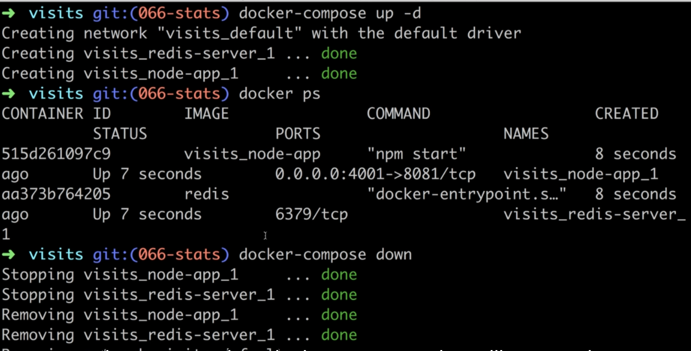

## 1. Dive Into Docker!
### 1. Why Use Docker

https://github.com/StephenGrider/DockerCasts


Docker makes it really easy to install and run software without worrying about setup or dependencies

https://github.com/Duy-Phuong/docker-docs/tree/master/Source/Udemy%20-%20Docker%20and%20Kubernetes%20The%20Complete%20Guide/git%20repo/DockerCasts/diagrams


### 2. What is Docker
### 3. Docker for MacWindows
### 4. Installing Docker on MacOS
### 5. Installing Docker for Windows Home users.html

If you are a Windows Home user, you will not be able install the Docker for Windows Desktop edition, as it requires Hyper-V virtualization. This is supported only by Windows Professional and Enterprise editions.

**Windows Home users will need to install Docker Toolbox** which uses VirtualBox instead.

Installer link is available here:

https://docs.docker.com/toolbox/overview/#ready-to-get-started

You may also need to enable virtualization in your computer's BIOS settings. This will be different for each manufacturer, please refer to their documentation on which keys to use to access these settings on reboot.

***Note\***

A major difference between the course lecture using Docker Desktop vs. Docker Toolbox is that you will not be able to use localhost anymore.

Instead, you will need to access your machine with the IP address **192.168.99.100**

### 6. Installing Docker for Windows - Professional and Enterprise Editions
### 7. More Windows Setup - Professional and Enterprise Editions
### 8. One Last Piece of Windows Setup - Professional and Enterprise Editions
### 9. Installing Docker on Linux.html

If you wish, Docker can also be installed on many different types of Linux distributions. This note covers how to install with Ubuntu, but the [Docker docs](https://docs.docker.com/install/) have instructions for CentOS, Debian and Fedora as well.


**Installation**

**Note\*: These steps were successfully completed with Ubuntu Desktop 18 LTS*

The docs for Ubuntu installation suggest setting up a Docker repository to install and update from.

This is where you should start:

https://docs.docker.com/install/linux/docker-ce/ubuntu/#set-up-the-repository

After completing the installation steps, test out Docker:

```
sudo docker run hello-world
```

This should download and run the test container printing *"hello world"* to your console.


**Installing Docker Compose**

Unlike the Mac and Windows Docker Desktop versions, we must manually install Docker Compose. See the instructions for the installation steps (Click on the tab for Linux)

https://docs.docker.com/compose/install/#install-compose

After completing, test your installation:

```
docker-compose -v
```

This should print the version and build numbers to your console.


**Run without Sudo**

Follow these instructions to run Docker commands without sudo:

https://docs.docker.com/install/linux/linux-postinstall/#manage-docker-as-a-non-root-user

The docker group will likely already be created, but you still need to add your user to this group.


**Start on Boot**

Follow these instructions so that Docker and its services start automatically on boot:

https://docs.docker.com/install/linux/linux-postinstall/#configure-docker-to-start-on-boot


*You may need to restart your system before starting the course material.*

### 10. Using the Docker Client


### 11. But Really...What's a Container


### 12. How's Docker Running on Your Computer


## 2. Manipulating Containers with the Docker Client

### 1. Docker Run in Detail

Folder 2


### 2. Overriding Default Commands


>  command: is the first command executed in the image


> ls and echo: is command inside busy box not hello-world

### 3. Listing Running Containers




Then we run `docker ps` => see container; if we stop, we cannot see any container here

```shell
# list all container
docker ps --all
```


### 4. Container Lifecycle





The second time run without `-a` flag, if we have `-a` docker will observe output from image and print it in my terminal


### 5. Restarting Stopped Containers


### 6. Removing Stopped Containers


### 7. Retrieving Log Outputs


### 8. Stopping Containers


=> give the container a little time to shut down, wait about 10s


=> shut down immediately


### 9. Multi-Command Containers

Redis is in-memory app

After we install redis, run `redis-cli`, `redis-server`

```shell
docker run redis
# Then run redis-cli outside the container => err
```


=> Must install inside container

### 10. Executing Commands in Running Containers


### 11. The Purpose of the IT Flag


### 12. Getting a Command Prompt in a Container


=> we can access inside the context of the container

Run `redis-cli` and `d` or `ctrl D or exit	` as well

sh is a name of the program that run inside the container(command processor or shell)


### 13. Starting with a Shell


start a shell immediately after the first start up

### 14. Container Isolation

## 3. Building Custom Images Through Docker Server

### 1. Creating Docker Images


```shell
mkdir redis-image
cd redis-image
docker build .
# conatainer-id get from the last line of `docker build .`
docker run conatainer-id
```

DOCKERFILE

```dockerfile
# Use an existing docker image as a base
FROM alpine

# Download and install a dependency
RUN apk add --update redis

# Tell the image what to do when it starts
# as a container
CMD ["redis-server"]
```


### 2. Building a Dockerfile

### 3. Dockerfile Teardown


### 4. What's a Base Image

### 5. The Build Process in Detail

### 6. A Brief Recap

### 7. Rebuilds with Cache


If we had build it, it will be stored in the cache


### 8. Tagging an Image


### 9. Manual Image Generation with Docker Commit


Create new image

> Don't encourage


## 4. Making Real Projects with Docker

### 1. Project Outline


### 2. Node Server Setup


### 3. Server Code.html

This lecture is for people who didn't want to write out the code in the last video. **If you already created the index.js file and package.json file, skip this section!**


Here's what you'll need to do:

1) Create a new file called `package.json` and copy paste the following into it:

```js
{
  "dependencies": {
    "express": "*"
  },
  "scripts": {
    "start": "node index.js"
  }
}
```

2) Create a new file called `index.js` and copy paste the following into it:

```js
const express = require('express');

const app = express();

app.get('/', (req, res) => {
  res.send('How are you doing');
});

app.listen(8080, () => {
  console.log('Listening on port 8080');
});
```

### 4. A Few Planned Errors

https://hub.docker.com/_/node

Dockerfile

```dockerfile
# Specify a base image
FROM node:alpine

WORKDIR /usr/app

# Install some depenendencies
COPY ./package.json ./
RUN npm install
COPY ./ ./

# Default command
CMD ["npm", "start"]
```


### 5. Base Image Issues

### 6. A Few Missing Files

### 7. Copying Build Files

### 8. Container Port Mapping


### 9. Specifying a Working Directory


### 10. Unnecessary Rebuilds

### 11. Minimizing Cache Busting and Rebuilds

```dockerfile
# Install some depenendencies
COPY ./package.json ./
RUN npm install
COPY ./ ./
```

When we run again to see change in file index(adjust constantly), we don't have to rebuild by the way that we copy package.json to current working directory

## 5. Docker Compose with Multiple Local Containers

### 1. App Overview


### 2. App Server Code

package.json

```json
{
  "dependencies": {
    "express": "*",
    "redis": "2.8.0"
  },
  "scripts": {
    "start": "node index.js"
  }
}
```

index.js

```js
const express = require('express');
const redis = require('redis');

const app = express();
const client = redis.createClient();
client.set('visits', 0);

app.get('/', (req, res) => {
  client.get('visits', (err, visits) => {
    res.send('Number of visits is ' + visits);
    client.set('visits', parseInt(visits) + 1);
  });
});

app.listen(8081, () => {
  console.log('Listening on port 8081');
});

```


### 3. Completed Node Code.html

### 4. Assembling a Dockerfile

Dockerfile

```dockerfile
FROM node:alpine
WORKDIR "/app"
COPY ./package.json ./
RUN npm install
COPY . .
CMD ["npm", "start"]
```


### 5. Introducing Docker Compose


### 6. Docker Compose Files


### 7. Networking with Docker Compose


`build .`: find and build form this image

```js
const redisClient = redis.createClient({
  host: 'redis-server',
  port: 6379 // default port in redis
});
```

run `docker-compose up`

### 8. Docker Compose Commands


### 9. Stopping Docker Compose Containers





### 10. Container Maintenance with Compose

Crash in node app


### 11. Automatic Container Restarts


### 12. Container Status with Docker Compose


## 6. Creating a Production-Grade Workflow

### 1. Development Workflow

### 10. Quick Note for Windows Users.html

### 11. Docker Volumes

### 12. Bookmarking Volumes

### 13. Shorthand with Docker Compose

### 14. Overriding Dockerfile Selection

### 15. Do We Need Copy

### 16. Executing Tests

### 17. Live Updating Tests

### 18. Docker Compose for Running Tests

### 19. Shortcomings on Testing

### 2. Flow Specifics

### 20. Need for Nginx

### 21. Multi-Step Docker Builds

### 22. Implementing Multi-Step Builds

### 23. Running Nginx

### 3. Docker's Purpose

### 4. Project Generation

### 5. More on Project Generation

### 6. Necessary Commands

### 7. Creating the Dev Dockerfile

### 8. Duplicating Dependencies

### 9. Starting the Container

## 7. Continuous Integration and Deployment with AWS

### 1. Services Overview

### 10. Automated Deployments

### 11. Exposing Ports Through the Dockerfile

### 12. Build Still Failing.html

### 13. Workflow With Github

### 14. Redeploy on Pull Request Merge

### 15. Deployment Wrapup

### 16. Environment Cleanup.html

### 2. Github Setup

### 3. Travis CI Setup

### 4. Travis YML File Configuration

### 5. A Touch More Travis Setup

### 6. Automatic Build Creation

### 7. AWS Elastic Beanstalk

### 8. More on Elastic Beanstalk

### 9. Travis Config for Deployment

## 8. Building a Multi-Container Application

### 1. Single Container Deployment Issues

### 10. Fetching Data in the React App

### 11. Rendering Logic in the App

### 12. Exporting the Fib Class

### 13. Routing in the React App

### 2. Application Overview

### 3. A Quick Note.html

### 4. Application Architecture

### 5. Worker Process Setup

### 6. Express API Setup

### 7. Connecting to Postgres

### 8. More Express API Setup

### 9. Generating the React App

## 9. Dockerizing Multiple Services

### 1. Checkpoint Files.html

### 10. Routing with Nginx

### 11. Building a Custom Nginx Image

### 12. Starting Up Docker Compose

### 13. Troubleshooting.html

### 14. Troubleshooting Startup Bugs

### 15. Opening Websocket Connections

### 2. Checkpoint Catchup

### 3. Dockerizing a React App - Again!

### 4. Dockerizing Generic Node Apps

### 5. Adding Postgres as a Service

### 6. Docker-compose Config

### 7. Environment Variables with Docker Compose

### 8. The Worker and Client Services

### 9. Nginx Path Routing

## 10. A Continuous Integration Workflow for Multiple Images
### 1. Production Multi-Container Deployments

2

### 2. Production Dockerfiles
### 3. Multiple Nginx Instances
### 4. Altering Nginx's Listen Port
### 5. A Quick Fix.html
### 6. Cleaning Up Tests
### 7. Github and Travis CI Setup
### 8. Travis Configuration Setup
### 9. Pushing Images to Docker Hub

### 10. Successful Image Building


## 11. Multi-Container Deployments to AWS
### 1. Multi-Container Definition Files
### 10. ElastiCache Redis Creation
### 11. Creating a Custom Security Group
### 12. Applying Security Groups to Resources
### 13. Setting Environment Variables
### 14. IAM Keys for Deployment
### 15. Travis Deploy Script
### 16. Container Memory Allocations
### 17. Verifying Deployment
### 18. A Quick App Change
### 19. Making Changes
### 2. Finding Docs on Container Definitions
### 20. Cleaning Up AWS Resources
### 3. Adding Container Definitions to DockerRun
### 4. More Container Definitions
### 5. Forming Container Links
### 6. Creating the EB Environment
### 7. Managed Data Service Providers
### 8. Overview of AWS VPC's and Security Groups
### 9. RDS Database Creation
## 12. Onwards to Kubernetes!
### 1. The Why's and What's of Kubernetes
### 10. Connecting to Running Containers
### 11. The Entire Deployment Flow
### 12. Imperative vs Declarative Deployments
### 2. Kubernetes in Development and Production
### 3. Setup on MacOS
### 4. Setup on Linux.html
### 5. Mapping Existing Knowledge
### 6. Adding Configuration Files
### 7. Object Types and API Versions
### 8. Running Containers in Pods
### 9. Service Config Files in Depth
## 13. Maintaining Sets of Containers with Deployments
### 1. Updating Existing Objects
### 10. Updating Deployment Images
### 11. Rebuilding the Client Image
### 12. Triggering Deployment Updates
### 13. Imperatively Updating a Deployment's Image
### 14. Multiple Docker Installations
### 15. Reconfiguring Docker CLI
### 16. Why Mess with Docker in the Node
### 2. Declarative Updates in Action
### 3. Limitations in Config Updates
### 4. Running Containers with Deployments
### 5. Deployment Configuration Files
### 6. Walking Through the Deployment Config
### 7. Applying a Deployment
### 8. Why Use Services
### 9. Scaling and Changing Deployments
## 14. A Multi-Container App with Kubernetes
### 1. The Path to Production
### 10. Combining Config Into Single Files
### 11. The Worker Deployment
### 12. Reapplying a Batch of Config Files
### 13. Creating and Applying Redis Config
### 14. Last Set of Boring Config!
### 15. The Need for Volumes with Databases
### 16. Kubernetes Volumes
### 17. Volumes vs Persistent Volumes
### 18. Persistent Volumes vs Persistent Volume Claims
### 19. Claim Config Files
### 2. Checkpoint Files.html
### 20. Persistent Volume Access Modes
### 21. Where Does Kubernetes Allocate Persistent Volumes
### 22. Designating a PVC in a Pod Template
### 23. Applying a PVC
### 24. Defining Environment Variables
### 25. Adding Environment Variables to Config
### 26. Creating an Encoded Secret
### 27. Passing Secrets as Environment Variables
### 28. Environment Variables as Strings
### 3. A Quick Checkpoint
### 4. Recreating the Deployment
### 5. NodePort vs ClusterIP Services
### 6. The ClusterIP Config
### 7. Applying Multiple Files with Kubectl
### 8. Express API Deployment Config
### 9. Cluster IP for the Express API
## 15. Handling Traffic with Ingress Controllers
### 1. Load Balancer Services
### 10. Testing Ingress Locally
### 11. The Minikube Dashboard
### 2. A Quick Note on Ingresses
### 3. One Other Quick Note!
### 4. Behind the Scenes of Ingress
### 5. More Behind the Scenes of Ingress
### 6. Optional Reading on Ingress Nginx.html
### 7. Setting up Ingress Locally
### 8. Creating the Ingress Configuration
### 9. Fix for ingress-service.yaml Configuration.html
## 16. Kubernetes Production Deployment
### 1. The Deployment Process
### 10. Don't Forget to Cleanup!.html
### 11. Kubernetes Dashboard on Google Cloud
### 12. Travis Deployment Overview
### 13. Installing the Google Cloud SDK
### 14. Generating a Service Account
### 15. Running Travis CLI in a Container
### 16. Encrypting a Service Account File
### 17. More Google Cloud CLI Config
### 18. Running Tests with Travis
### 19. Custom Deployment Providers
### 2. Google Cloud vs AWS for Kubernetes
### 20. Unique Deployment Images
### 21. Unique Tags for Built Images
### 22. Updating the Deployment Script
### 23. Configuring the GCloud CLI on Cloud Console
### 24. Creating a Secret on Google Cloud
### 25. Helm Setup
### 26. Kubernetes Security with RBAC
### 27. Assigning Tiller a Service Account
### 28. Ingress-Nginx with Helm
### 29. The Result of Ingress-Nginx
### 3. Creating a Git Repo
### 30. Finally - Deployment!
### 31. Did I Really Type That
### 32. Verifying Deployment
### 33. A Workflow for Changing in Prod
### 34. Merging a PR for Deployment
### 35. That's It!  What's Next
### 4. Linking the Github Repo to Travis
### 5. Free Google Cloud Credits.html
### 6. Creating a Google Cloud Project
### 7. Linking a Billing Account
### 8. Kubernetes Engine Init
### 9. Creating a Cluster with Google Cloud
## 17. HTTPS Setup with Kubernetes
### 1. HTTPS Setup Overview
### 10. Ingress Config for HTTPS
### 11. It Worked!
### 12. Google Cloud Cleanup.html
### 13. Local Environment Cleanup.html
### 2. Domain Purchase
### 3. Domain Name Setup
### 4. Cert Manager Install
### 5. How to Wire Up Cert Manager
### 6. Issuer Config File
### 7. Certificate Config File
### 8. Deploying Changes
### 9. Verifying the Certificate
## 18. Local Development with Skaffold
### 1. Awkward Local Development
### 2. Installing Skaffold
### 3. The Skaffold Config File
### 4. Live Sync Changes
### 5. Automatic Shutdown
### 6. Testing Live Sync with the API Server


======== list file ========

Process finished with exit code 0