- [Docker and Kubernetes: The Complete Guide](#docker-and-kubernetes-the-complete-guide)
  - [1. Dive Into Docker!](#1-dive-into-docker)
    - [1. Why Use Docker](#1-why-use-docker)
    - [2. What is Docker](#2-what-is-docker)
    - [3. Docker for MacWindows](#3-docker-for-macwindows)
    - [4. Installing Docker on MacOS](#4-installing-docker-on-macos)
    - [5. Installing Docker for Windows Home users.html](#5-installing-docker-for-windows-home-usershtml)
    - [6. Installing Docker for Windows - Professional and Enterprise Editions](#6-installing-docker-for-windows---professional-and-enterprise-editions)
    - [7. More Windows Setup - Professional and Enterprise Editions](#7-more-windows-setup---professional-and-enterprise-editions)
    - [8. One Last Piece of Windows Setup - Professional and Enterprise Editions](#8-one-last-piece-of-windows-setup---professional-and-enterprise-editions)
    - [9. Installing Docker on Linux.html](#9-installing-docker-on-linuxhtml)
    - [10. Using the Docker Client](#10-using-the-docker-client)
    - [11. But Really...What's a Container](#11-but-reallywhats-a-container)
    - [12. How's Docker Running on Your Computer](#12-hows-docker-running-on-your-computer)
  - [2. Manipulating Containers with the Docker Client](#2-manipulating-containers-with-the-docker-client)
    - [1. Docker Run in Detail](#1-docker-run-in-detail)
    - [2. Overriding Default Commands](#2-overriding-default-commands)
    - [3. Listing Running Containers](#3-listing-running-containers)
    - [5. Restarting Stopped Containers](#5-restarting-stopped-containers)
    - [6. Removing Stopped Containers](#6-removing-stopped-containers)
    - [7. Retrieving Log Outputs](#7-retrieving-log-outputs)
    - [8. Stopping Containers](#8-stopping-containers)
    - [9. Multi-Command Containers](#9-multi-command-containers)
    - [10. Executing Commands in Running Containers](#10-executing-commands-in-running-containers)
    - [11. The Purpose of the IT Flag](#11-the-purpose-of-the-it-flag)
    - [12. Getting a Command Prompt in a Container](#12-getting-a-command-prompt-in-a-container)
    - [13. Starting with a Shell](#13-starting-with-a-shell)
    - [14. Container Isolation](#14-container-isolation)
  - [3. Building Custom Images Through Docker Server](#3-building-custom-images-through-docker-server)
    - [1. Creating Docker Images](#1-creating-docker-images)
    - [2. Building a Dockerfile](#2-building-a-dockerfile)
    - [3. Dockerfile Teardown](#3-dockerfile-teardown)
    - [4. What's a Base Image](#4-whats-a-base-image)
    - [5. The Build Process in Detail](#5-the-build-process-in-detail)
    - [6. A Brief Recap](#6-a-brief-recap)
    - [7. Rebuilds with Cache](#7-rebuilds-with-cache)
    - [8. Tagging an Image](#8-tagging-an-image)
    - [9. Manual Image Generation with Docker Commit](#9-manual-image-generation-with-docker-commit)
  - [4. Making Real Projects with Docker](#4-making-real-projects-with-docker)
    - [1. Project Outline](#1-project-outline)
    - [2. Node Server Setup](#2-node-server-setup)
    - [3. Server Code.html](#3-server-codehtml)
    - [4. A Few Planned Errors](#4-a-few-planned-errors)
    - [5. Base Image Issues](#5-base-image-issues)
    - [6. A Few Missing Files](#6-a-few-missing-files)
    - [7. Copying Build Files](#7-copying-build-files)
    - [8. Container Port Mapping](#8-container-port-mapping)
    - [9. Specifying a Working Directory](#9-specifying-a-working-directory)
    - [10. Unnecessary Rebuilds](#10-unnecessary-rebuilds)
    - [11. Minimizing Cache Busting and Rebuilds](#11-minimizing-cache-busting-and-rebuilds)
  - [5. Docker Compose with Multiple Local Containers](#5-docker-compose-with-multiple-local-containers)
    - [1. App Overview](#1-app-overview)
    - [2. App Server Code](#2-app-server-code)
    - [3. Completed Node Code.html](#3-completed-node-codehtml)
    - [4. Assembling a Dockerfile](#4-assembling-a-dockerfile)
    - [5. Introducing Docker Compose](#5-introducing-docker-compose)
    - [6. Docker Compose Files](#6-docker-compose-files)
    - [7. Networking with Docker Compose](#7-networking-with-docker-compose)
    - [A Docker/docker-compose setup with Redis and Node/Express](#a-dockerdocker-compose-setup-with-redis-and-nodeexpress)
    - [8. Docker Compose Commands](#8-docker-compose-commands)
    - [9. Stopping Docker Compose Containers](#9-stopping-docker-compose-containers)
    - [10. Container Maintenance with Compose](#10-container-maintenance-with-compose)
    - [11. Automatic Container Restarts](#11-automatic-container-restarts)
    - [12. Container Status with Docker Compose](#12-container-status-with-docker-compose)
  - [6. Creating a Production-Grade Workflow](#6-creating-a-production-grade-workflow)
    - [1. Development Workflow](#1-development-workflow)
    - [2. Flow specifics](#2-flow-specifics)
    - [3. Docker's Purpose](#3-dockers-purpose)
    - [4. Project Generation](#4-project-generation)
    - [5. More on Project Generation](#5-more-on-project-generation)
    - [6. Necessary Commands](#6-necessary-commands)
    - [7. Creating the Dev Dockerfile](#7-creating-the-dev-dockerfile)
    - [8. Duplicating Dependencies](#8-duplicating-dependencies)
    - [9. Starting the Container](#9-starting-the-container)
    - [10. Quick Note for Windows Users.html](#10-quick-note-for-windows-usershtml)
    - [11. Docker Volumes](#11-docker-volumes)
    - [12. Bookmarking Volumes](#12-bookmarking-volumes)
    - [13. Shorthand with Docker Compose](#13-shorthand-with-docker-compose)
    - [14. Overriding Dockerfile Selection](#14-overriding-dockerfile-selection)
    - [15. Do We Need Copy](#15-do-we-need-copy)
    - [16. Executing Tests](#16-executing-tests)
    - [17. Live Updating Tests](#17-live-updating-tests)
    - [18. Docker Compose for Running Tests](#18-docker-compose-for-running-tests)
    - [19. Shortcomings on Testing](#19-shortcomings-on-testing)
    - [20. Need for Nginx](#20-need-for-nginx)
    - [21. Multi-Step Docker Builds](#21-multi-step-docker-builds)
    - [22. Implementing Multi-Step Builds](#22-implementing-multi-step-builds)
    - [23. Running Nginx](#23-running-nginx)
  - [7. Continuous Integration and Deployment with AWS](#7-continuous-integration-and-deployment-with-aws)
    - [1. Services Overview](#1-services-overview)
    - [2. Github Setup](#2-github-setup)
    - [3. Travis CI Setup](#3-travis-ci-setup)
    - [4. Travis YML File Configuration](#4-travis-yml-file-configuration)
    - [5. A Touch More Travis Setup](#5-a-touch-more-travis-setup)
    - [6. Automatic Build Creation](#6-automatic-build-creation)
    - [7. AWS Elastic Beanstalk](#7-aws-elastic-beanstalk)
    - [8. More on Elastic Beanstalk](#8-more-on-elastic-beanstalk)
    - [9. Travis Config for Deployment](#9-travis-config-for-deployment)
    - [10. Automated Deployments](#10-automated-deployments)
    - [11. Exposing Ports Through the Dockerfile](#11-exposing-ports-through-the-dockerfile)
    - [12. Build Still Failing.html](#12-build-still-failinghtml)
    - [13. Workflow With Github](#13-workflow-with-github)
    - [14. Redeploy on Pull Request Merge](#14-redeploy-on-pull-request-merge)
    - [15. Deployment Wrapup](#15-deployment-wrapup)
    - [16. Environment Cleanup.html](#16-environment-cleanuphtml)
  - [8. Building a Multi-Container Application](#8-building-a-multi-container-application)
    - [1. Single Container Deployment Issues](#1-single-container-deployment-issues)
    - [2. Application Overview](#2-application-overview)
    - [3. A Quick Note.html](#3-a-quick-notehtml)
    - [4. Application Architecture](#4-application-architecture)
    - [5. Worker Process Setup](#5-worker-process-setup)
    - [6. Express API Setup](#6-express-api-setup)
    - [7. Connecting to Postgres](#7-connecting-to-postgres)
    - [8. More Express API Setup](#8-more-express-api-setup)
    - [9. Generating the React App](#9-generating-the-react-app)
    - [10. Fetching Data in the React App](#10-fetching-data-in-the-react-app)
    - [11. Rendering Logic in the App](#11-rendering-logic-in-the-app)
    - [12. Exporting the Fib Class](#12-exporting-the-fib-class)
    - [13. Routing in the React App](#13-routing-in-the-react-app)
  - [9. Dockerizing Multiple Services](#9-dockerizing-multiple-services)
    - [1. Checkpoint Files.html](#1-checkpoint-fileshtml)
    - [2. Checkpoint Catchup](#2-checkpoint-catchup)
    - [3. Dockerizing a React App - Again!](#3-dockerizing-a-react-app---again)
    - [4. Dockerizing Generic Node Apps](#4-dockerizing-generic-node-apps)
    - [5. Adding Postgres as a Service](#5-adding-postgres-as-a-service)
- [How to use this image](#how-to-use-this-image)
  - [start a postgres instance](#start-a-postgres-instance)
  - [... or via `psql`](#-or-via-psql)
  - [... via `docker stack deploy` or [`docker-compose`](https://github.com/docker/compose)](#-via-docker-stack-deploy-or-docker-compose)
    - [6. Docker-compose Config](#6-docker-compose-config)
    - [7. Environment Variables with Docker Compose](#7-environment-variables-with-docker-compose)
    - [8. The Worker and Client Services](#8-the-worker-and-client-services)
    - [9. Nginx Path Routing](#9-nginx-path-routing)
    - [10. Routing with Nginx](#10-routing-with-nginx)
    - [11. Building a Custom Nginx Image](#11-building-a-custom-nginx-image)
    - [12. Starting Up Docker Compose](#12-starting-up-docker-compose)
    - [13. Troubleshooting.html](#13-troubleshootinghtml)
    - [14. Troubleshooting Startup Bugs](#14-troubleshooting-startup-bugs)
    - [15. Opening Websocket Connections](#15-opening-websocket-connections)
  - [10. A Continuous Integration Workflow for Multiple Images](#10-a-continuous-integration-workflow-for-multiple-images)
    - [1. Production Multi-Container Deployments](#1-production-multi-container-deployments)
    - [2. Production Dockerfiles](#2-production-dockerfiles)
    - [3. Multiple Nginx Instances](#3-multiple-nginx-instances)
    - [4. Altering Nginx's Listen Port](#4-altering-nginxs-listen-port)
    - [5. A Quick Fix.html](#5-a-quick-fixhtml)
    - [6. Cleaning Up Tests](#6-cleaning-up-tests)
    - [7. Github and Travis CI Setup](#7-github-and-travis-ci-setup)
    - [8. Travis Configuration Setup](#8-travis-configuration-setup)
    - [9. Pushing Images to Docker Hub](#9-pushing-images-to-docker-hub)
    - [10. Successful Image Building](#10-successful-image-building)
  - [11. Multi-Container Deployments to AWS](#11-multi-container-deployments-to-aws)
    - [1. Multi-Container Definition Files](#1-multi-container-definition-files)
    - [2. Finding Docs on Container Definitions](#2-finding-docs-on-container-definitions)
    - [3. Adding Container Definitions to DockerRun](#3-adding-container-definitions-to-dockerrun)
    - [4. More Container Definitions](#4-more-container-definitions)
    - [5. Forming Container Links](#5-forming-container-links)
    - [6. Creating the EB Environment](#6-creating-the-eb-environment)
    - [7. Managed Data Service Providers](#7-managed-data-service-providers)
    - [8. Overview of AWS VPC's and Security Groups](#8-overview-of-aws-vpcs-and-security-groups)
    - [9. RDS Database Creation](#9-rds-database-creation)
    - [10. ElastiCache Redis Creation](#10-elasticache-redis-creation)
    - [11. Creating a Custom Security Group](#11-creating-a-custom-security-group)
    - [12. Applying Security Groups to Resources](#12-applying-security-groups-to-resources)
    - [13. Setting Environment Variables](#13-setting-environment-variables)
    - [14. IAM Keys for Deployment](#14-iam-keys-for-deployment)
    - [15. Travis Deploy Script](#15-travis-deploy-script)
    - [16. Container Memory Allocations](#16-container-memory-allocations)
    - [17. Verifying Deployment](#17-verifying-deployment)
    - [18. A Quick App Change](#18-a-quick-app-change)
    - [19. Making Changes](#19-making-changes)
    - [20. Cleaning Up AWS Resources](#20-cleaning-up-aws-resources)
  - [12. Onwards to Kubernetes!](#12-onwards-to-kubernetes)
    - [1. The Why's and What's of Kubernetes](#1-the-whys-and-whats-of-kubernetes)
    - [2. Kubernetes in Development and Production](#2-kubernetes-in-development-and-production)
    - [3. Setup on MacOS](#3-setup-on-macos)
    - [4. Setup on Linux.html](#4-setup-on-linuxhtml)
      - [**Install VirtualBox:**](#install-virtualbox)
      - [**Install Kubectl**](#install-kubectl)
      - [**Install Minikube**](#install-minikube)
    - [5. Mapping Existing Knowledge](#5-mapping-existing-knowledge)
    - [6. Adding Configuration Files](#6-adding-configuration-files)
    - [7. Object Types and API Versions](#7-object-types-and-api-versions)
    - [8. Running Containers in Pods](#8-running-containers-in-pods)
    - [9. Service Config Files in Depth](#9-service-config-files-in-depth)
    - [10. Connecting to Running Containers](#10-connecting-to-running-containers)
    - [11. The Entire Deployment Flow](#11-the-entire-deployment-flow)
    - [12. Imperative vs Declarative Deployments](#12-imperative-vs-declarative-deployments)
  - [13. Maintaining Sets of Containers with Deployments](#13-maintaining-sets-of-containers-with-deployments)
    - [1. Updating Existing Objects](#1-updating-existing-objects)
    - [2. Declarative Updates in Action](#2-declarative-updates-in-action)
    - [3. Limitations in Config Updates](#3-limitations-in-config-updates)
    - [4. Running Containers with Deployments](#4-running-containers-with-deployments)
    - [5. Deployment Configuration Files](#5-deployment-configuration-files)
    - [6. Walking Through the Deployment Config](#6-walking-through-the-deployment-config)
    - [7. Applying a Deployment](#7-applying-a-deployment)
    - [8. Why Use Services](#8-why-use-services)
    - [9. Scaling and Changing Deployments](#9-scaling-and-changing-deployments)
    - [10. Updating Deployment Images](#10-updating-deployment-images)
    - [11. Rebuilding the Client Image](#11-rebuilding-the-client-image)
    - [12. Triggering Deployment Updates](#12-triggering-deployment-updates)
    - [13. Imperatively Updating a Deployment's Image](#13-imperatively-updating-a-deployments-image)
    - [14. Multiple Docker Installations](#14-multiple-docker-installations)
    - [15. Reconfiguring Docker CLI](#15-reconfiguring-docker-cli)
    - [16. Why Mess with Docker in the Node](#16-why-mess-with-docker-in-the-node)
  - [14. A Multi-Container App with Kubernetes](#14-a-multi-container-app-with-kubernetes)
    - [1. The Path to Production](#1-the-path-to-production)
    - [2. Checkpoint Files.html](#2-checkpoint-fileshtml)
    - [3. A Quick Checkpoint](#3-a-quick-checkpoint)
    - [4. Recreating the Deployment](#4-recreating-the-deployment)
    - [5. NodePort vs ClusterIP Services](#5-nodeport-vs-clusterip-services)
    - [6. The ClusterIP Config](#6-the-clusterip-config)
    - [7. Applying Multiple Files with Kubectl](#7-applying-multiple-files-with-kubectl)
    - [8. Express API Deployment Config](#8-express-api-deployment-config)
    - [9. Cluster IP for the Express API](#9-cluster-ip-for-the-express-api)
    - [10. Combining Config Into Single Files](#10-combining-config-into-single-files)
    - [11. The Worker Deployment](#11-the-worker-deployment)
    - [12. Reapplying a Batch of Config Files](#12-reapplying-a-batch-of-config-files)
    - [13. Creating and Applying Redis Config](#13-creating-and-applying-redis-config)
    - [14. Last Set of Boring Config!](#14-last-set-of-boring-config)
    - [15. The Need for Volumes with Databases](#15-the-need-for-volumes-with-databases)
    - [16. Kubernetes Volumes](#16-kubernetes-volumes)
    - [17. Volumes vs Persistent Volumes](#17-volumes-vs-persistent-volumes)
    - [18. Persistent Volumes vs Persistent Volume Claims](#18-persistent-volumes-vs-persistent-volume-claims)
    - [19. Claim Config Files](#19-claim-config-files)
    - [20. Persistent Volume Access Modes](#20-persistent-volume-access-modes)
    - [21. Where Does Kubernetes Allocate Persistent Volumes](#21-where-does-kubernetes-allocate-persistent-volumes)
    - [22. Designating a PVC in a Pod Template](#22-designating-a-pvc-in-a-pod-template)
    - [23. Applying a PVC](#23-applying-a-pvc)
    - [24. Defining Environment Variables](#24-defining-environment-variables)
    - [25. Adding Environment Variables to Config](#25-adding-environment-variables-to-config)
    - [26. Creating an Encoded Secret](#26-creating-an-encoded-secret)
    - [27. Passing Secrets as Environment Variables](#27-passing-secrets-as-environment-variables)
    - [28. Environment Variables as Strings](#28-environment-variables-as-strings)
  - [15. Handling Traffic with Ingress Controllers](#15-handling-traffic-with-ingress-controllers)
    - [1. Load Balancer Services](#1-load-balancer-services)
    - [2. A Quick Note on Ingresses](#2-a-quick-note-on-ingresses)
    - [3. One Other Quick Note!](#3-one-other-quick-note)
    - [4. Behind the Scenes of Ingress](#4-behind-the-scenes-of-ingress)
    - [5. More Behind the Scenes of Ingress](#5-more-behind-the-scenes-of-ingress)
    - [6. Optional Reading on Ingress Nginx.html](#6-optional-reading-on-ingress-nginxhtml)
    - [7. Setting up Ingress Locally](#7-setting-up-ingress-locally)
      - [minikube-](#minikube-)
      - [GCE_GKE](#gce_gke)
    - [8. Creating the Ingress Configuration](#8-creating-the-ingress-configuration)
    - [9. Fix for ingress-service.yaml Configuration.html](#9-fix-for-ingress-serviceyaml-configurationhtml)
    - [10. Testing Ingress Locally](#10-testing-ingress-locally)
    - [11. The Minikube Dashboard](#11-the-minikube-dashboard)
  - [16. Kubernetes Production Deployment](#16-kubernetes-production-deployment)
    - [1. The Deployment Process](#1-the-deployment-process)
    - [2. Google Cloud vs AWS for Kubernetes](#2-google-cloud-vs-aws-for-kubernetes)
    - [3. Creating a Git Repo](#3-creating-a-git-repo)
    - [4. Linking the Github Repo to Travis](#4-linking-the-github-repo-to-travis)
    - [5. Free Google Cloud Credits.html](#5-free-google-cloud-creditshtml)
    - [6. Creating a Google Cloud Project](#6-creating-a-google-cloud-project)
    - [7. Linking a Billing Account](#7-linking-a-billing-account)
    - [8. Kubernetes Engine Init](#8-kubernetes-engine-init)
    - [9. Creating a Cluster with Google Cloud](#9-creating-a-cluster-with-google-cloud)
    - [10. Don't Forget to Cleanup!.html](#10-dont-forget-to-cleanuphtml)
    - [11. Kubernetes Dashboard on Google Cloud](#11-kubernetes-dashboard-on-google-cloud)
    - [12. Travis Deployment Overview](#12-travis-deployment-overview)
    - [13. Installing the Google Cloud SDK](#13-installing-the-google-cloud-sdk)
    - [14. Generating a Service Account](#14-generating-a-service-account)
    - [15. Running Travis CLI in a Container](#15-running-travis-cli-in-a-container)
    - [16. Encrypting a Service Account File](#16-encrypting-a-service-account-file)
    - [17. More Google Cloud CLI Config](#17-more-google-cloud-cli-config)
    - [18. Running Tests with Travis](#18-running-tests-with-travis)
    - [19. Custom Deployment Providers](#19-custom-deployment-providers)
    - [20. Unique Deployment Images](#20-unique-deployment-images)
    - [21. Unique Tags for Built Images](#21-unique-tags-for-built-images)
    - [22. Updating the Deployment Script](#22-updating-the-deployment-script)
    - [23. Configuring the GCloud CLI on Cloud Console](#23-configuring-the-gcloud-cli-on-cloud-console)
    - [24. Creating a Secret on Google Cloud](#24-creating-a-secret-on-google-cloud)
    - [25. Helm Setup](#25-helm-setup)
    - [From Script](#from-script)
    - [26. Kubernetes Security with RBAC](#26-kubernetes-security-with-rbac)
    - [27. Assigning Tiller a Service Account](#27-assigning-tiller-a-service-account)
    - [28. Ingress-Nginx with Helm](#28-ingress-nginx-with-helm)
    - [29. The Result of Ingress-Nginx](#29-the-result-of-ingress-nginx)
    - [30. Finally - Deployment!](#30-finally---deployment)
    - [31. Did I Really Type That](#31-did-i-really-type-that)
    - [32. Verifying Deployment](#32-verifying-deployment)
    - [33. A Workflow for Changing in Prod](#33-a-workflow-for-changing-in-prod)
    - [34. Merging a PR for Deployment](#34-merging-a-pr-for-deployment)
    - [35. That's It!  What's Next](#35-thats-it--whats-next)
  - [17. HTTPS Setup with Kubernetes](#17-https-setup-with-kubernetes)
    - [1. HTTPS Setup Overview](#1-https-setup-overview)
    - [2. Domain Purchase](#2-domain-purchase)
    - [3. Domain Name Setup](#3-domain-name-setup)
    - [4. Cert Manager Install](#4-cert-manager-install)
    - [5. How to Wire Up Cert Manager](#5-how-to-wire-up-cert-manager)
    - [6. Issuer Config File](#6-issuer-config-file)
    - [7. Certificate Config File](#7-certificate-config-file)
    - [8. Deploying Changes](#8-deploying-changes)
    - [9. Verifying the Certificate](#9-verifying-the-certificate)
    - [10. Ingress Config for HTTPS](#10-ingress-config-for-https)
    - [11. It Worked!](#11-it-worked)
    - [12. Google Cloud Cleanup.html](#12-google-cloud-cleanuphtml)
    - [13. Local Environment Cleanup.html](#13-local-environment-cleanuphtml)
  - [18. Local Development with Skaffold](#18-local-development-with-skaffold)
    - [1. Awkward Local Development](#1-awkward-local-development)
    - [2. Installing Skaffold](#2-installing-skaffold)
    - [3. The Skaffold Config File](#3-the-skaffold-config-file)
    - [4. Live Sync Changes](#4-live-sync-changes)
    - [5. Automatic Shutdown](#5-automatic-shutdown)
    - [6. Testing Live Sync with the API Server](#6-testing-live-sync-with-the-api-server)


----

# Docker and Kubernetes: The Complete Guide

## 1. Dive Into Docker!

https://www.udemy.com/course/docker-and-kubernetes-the-complete-guide/

### 1. Why Use Docker

https://github.com/StephenGrider/DockerCasts


Docker makes it really easy to install and run software without worrying about setup or dependencies

https://github.com/Duy-Phuong/docker-docs/tree/master/Source/Udemy%20-%20Docker%20and%20Kubernetes%20The%20Complete%20Guide/git%20repo/DockerCasts/diagrams


### 2. What is Docker
### 3. Docker for MacWindows
### 4. Installing Docker on MacOS
### 5. Installing Docker for Windows Home users.html

If you are a Windows Home user, you will not be able install the Docker for Windows Desktop edition, as it requires Hyper-V virtualization. This is supported only by Windows Professional and Enterprise editions.

**Windows Home users will need to install Docker Toolbox** which uses VirtualBox instead.

Installer link is available here:

https://docs.docker.com/toolbox/overview/#ready-to-get-started

You may also need to enable virtualization in your computer's BIOS settings. This will be different for each manufacturer, please refer to their documentation on which keys to use to access these settings on reboot.

***Note\***

A major difference between the course lecture using Docker Desktop vs. Docker Toolbox is that you will not be able to use localhost anymore.

Instead, you will need to access your machine with the IP address **192.168.99.100**

### 6. Installing Docker for Windows - Professional and Enterprise Editions
### 7. More Windows Setup - Professional and Enterprise Editions
### 8. One Last Piece of Windows Setup - Professional and Enterprise Editions
### 9. Installing Docker on Linux.html

If you wish, Docker can also be installed on many different types of Linux distributions. This note covers how to install with Ubuntu, but the [Docker docs](https://docs.docker.com/install/) have instructions for CentOS, Debian and Fedora as well.


**Installation**

**Note\*: These steps were successfully completed with Ubuntu Desktop 18 LTS*

The docs for Ubuntu installation suggest setting up a Docker repository to install and update from.

This is where you should start:

https://docs.docker.com/install/linux/docker-ce/ubuntu/#set-up-the-repository

After completing the installation steps, test out Docker:

```
sudo docker run hello-world
```

This should download and run the test container printing *"hello world"* to your console.


**Installing Docker Compose**

Unlike the Mac and Windows Docker Desktop versions, we must manually install Docker Compose. See the instructions for the installation steps (Click on the tab for Linux)

https://docs.docker.com/compose/install/#install-compose

After completing, test your installation:

```
docker-compose -v
```

This should print the version and build numbers to your console.


**Run without Sudo**

Follow these instructions to run Docker commands without sudo:

https://docs.docker.com/install/linux/linux-postinstall/#manage-docker-as-a-non-root-user

The docker group will likely already be created, but you still need to add your user to this group.


**Start on Boot**

Follow these instructions so that Docker and its services start automatically on boot:

https://docs.docker.com/install/linux/linux-postinstall/#configure-docker-to-start-on-boot


*You may need to restart your system before starting the course material.*

### 10. Using the Docker Client


That starts up that docker client or the Dockers CLI.

Again the docker cli is in charge of taking commands from you kind of doing a little bit of processing

on them and then communicating the commands over to something called the Dockers server and it's that

Docker server that is really in charge of the heavy lifting.

When we ran the command docker run Hello world.

That meant that we wanted to start up a new container using the image with the name of hello world the

hello world image has a tiny little program inside of it whose sole purpose sole job is to print out

the message that you see right here.

The first thing that the Dockers server did was check to see if it already had a local copy like a copy

on your personal machine of the hello world image or hello world file.

So the docker server looked into something called the image cache.

Now because you and I just installed docker on our personal computers that image cache is currently

empty.

We have no images that have already been downloaded before.

So because the image cache was empty the Dockers server decided to reach out to a free service called

docker hub the Docker hub is a repository of free public images that you can freely download and run

on your personal computer so server or reach out to docker hub and said hey I'm looking for an image

called Hello world.

### 11. But Really...What's a Container


e.g: Chrome need python v2 but node js need python v3???

=> name spacing or control groups technical solve problems


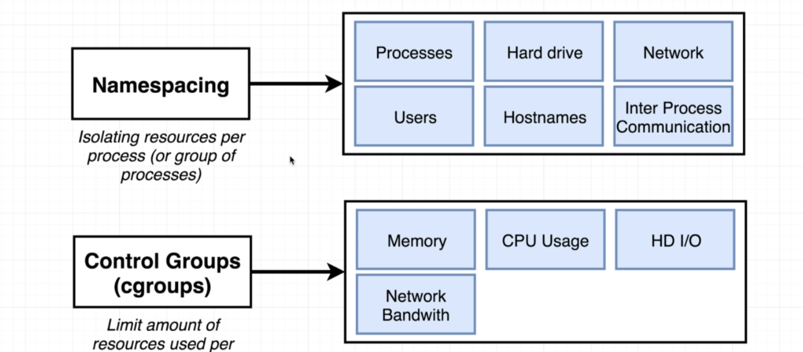

=> name spacing: direct it to specific area on the hardware

These are all things that we can use **named spacing** for to essentially limit the resources we're kind
of redirect requests for resource from a particular process very closely related to this idea of some
name spacing is another feature called **control groups** a control group can be used to limit the amount
of resources that a particular process can use.
So name spacing is for saying hey this area of the harddrive is for this process a control group can
be used to limit the amount of memory that a process can use the amount of CPU the amount of hard drive
input input or the input output and the amount of network bandwidth as we

So these two features put together it can be used to really kind of isolate a single process and limit
the amount of resources it can talk to and the amount of bandwidth essentially that it can make use
of.

> 2 cách trên chỉ apply for linux, not macs and windows

### 12. How's Docker Running on Your Computer


## 2. Manipulating Containers with the Docker Client

### 1. Docker Run in Detail

Folder 2


### 2. Overriding Default Commands


>  command: is the first command executed in the image


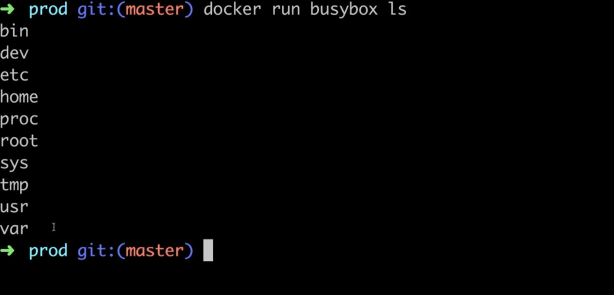

```shell
Admin@LAPTOP-QO8E8EAL MINGW64 ~
$ docker run busybox echo hi
Unable to find image 'busybox:latest' locally
latest: Pulling from library/busybox
ea97eb0eb3ec: Pulling fs layer
ea97eb0eb3ec: Verifying Checksum
ea97eb0eb3ec: Download complete
ea97eb0eb3ec: Pull complete
Digest: sha256:bde48e1751173b709090c2539fdf12d6ba64e88ec7a4301591227ce925f3c678
Status: Downloaded newer image for busybox:latest
hi

Admin@LAPTOP-QO8E8EAL MINGW64 ~
$ docker run busybox ls
bin
dev
etc
home
proc
root
sys
tmp
usr
var

```


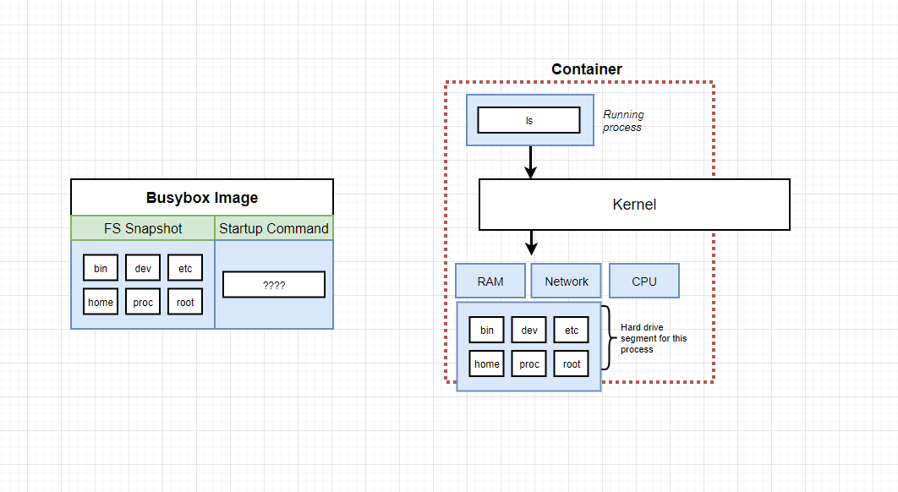


> ls and echo: is command inside busy box not hello-world

### 3. Listing Running Containers


Then we run `docker ps` => see container; if we stop, we cannot see any container here

```shell
# list all container
docker ps --all
```

https://docs.docker.com/compose/reference/ps/


```shell
Admin@LAPTOP-QO8E8EAL MINGW64 /d/git-docs/docker/Source/HANDS ON DOCKER for JAVA Developers (master)
$ docker ps -a
CONTAINER ID   IMAGE         COMMAND     CREATED          STATUS                      PORTS     NAMES
419d39c28a05   hello-world   "/hello"    2 minutes ago    Created                               sharp_noether
a05f6883e86b   busybox       "ls"        16 minutes ago   Exited (0) 16 minutes ago             fervent_lewin
15244a63f5c2   busybox       "echo hi"   16 minutes ago   Exited (0) 16 minutes ago             pensive_davinci

Admin@LAPTOP-QO8E8EAL MINGW64 /d/git-docs/docker/Source/HANDS ON DOCKER for JAVA Developers (master)
$ docker start -a 419d39c28a05

Hello from Docker!
This message shows that your installation appears to be working correctly.

To generate this message, Docker took the following steps:
 1. The Docker client contacted the Docker daemon.
 2. The Docker daemon pulled the "hello-world" image from the Docker Hub.
    (amd64)
 3. The Docker daemon created a new container from that image which runs the
    executable that produces the output you are currently reading.
 4. The Docker daemon streamed that output to the Docker client, which sent it
    to your terminal.

To try something more ambitious, you can run an Ubuntu container with:
 $ docker run -it ubuntu bash

Share images, automate workflows, and more with a free Docker ID:
 https://hub.docker.com/

For more examples and ideas, visit:
 https://docs.docker.com/get-started/

Admin@LAPTOP-QO8E8EAL MINGW64 /d/git-docs/docker/Source/HANDS ON DOCKER for JAVA Developers (master)
$ docker ps
CONTAINER ID   IMAGE     COMMAND   CREATED   STATUS    PORTS     NAMES

Admin@LAPTOP-QO8E8EAL MINGW64 /d/git-docs/docker/Source/HANDS ON DOCKER for JAVA Developers (master)
$ docker start -a 15244a63f5c2
hi

```


The second time run without `-a` flag, if we have `-a` docker will observe output from image and print it in my terminal

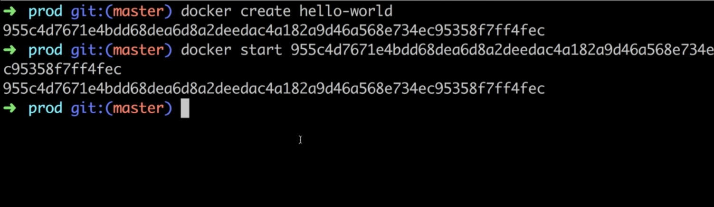


### 5. Restarting Stopped Containers


### 6. Removing Stopped Containers


```shell
Admin@LAPTOP-QO8E8EAL MINGW64 /d/git-docs/docker/Source/HANDS ON DOCKER for JAVA Developers (master)
$ docker ps -a
CONTAINER ID   IMAGE         COMMAND     CREATED          STATUS                      PORTS     NAMES
419d39c28a05   hello-world   "/hello"    2 minutes ago    Created                               sharp_noether
a05f6883e86b   busybox       "ls"        16 minutes ago   Exited (0) 16 minutes ago             fervent_lewin
15244a63f5c2   busybox       "echo hi"   16 minutes ago   Exited (0) 16 minutes ago             pensive_davinci


Admin@LAPTOP-QO8E8EAL MINGW64 /d/git-docs/docker/Source/HANDS ON DOCKER for JAVA Developers (master)
$ docker system prune
WARNING! This will remove:
  - all stopped containers
  - all networks not used by at least one container
  - all dangling images
  - all dangling build cache

Are you sure you want to continue? [y/N] y
Deleted Containers:
419d39c28a054eccf01669a1093e55cb145eb388d8583e22e615288a44b3ccb8
c2be1203bd4293081f04ce4c4d29b848a642e4d47d8b3ad6bbc0d3500215222c
15244a63f5c2c60066aec71ef857bb3ee02152fa8da1604262c1fdd21ae739ae

```


### 7. Retrieving Log Outputs

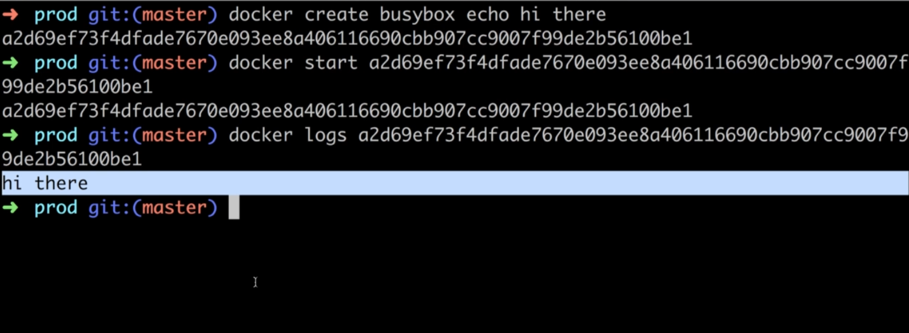

### 8. Stopping Containers


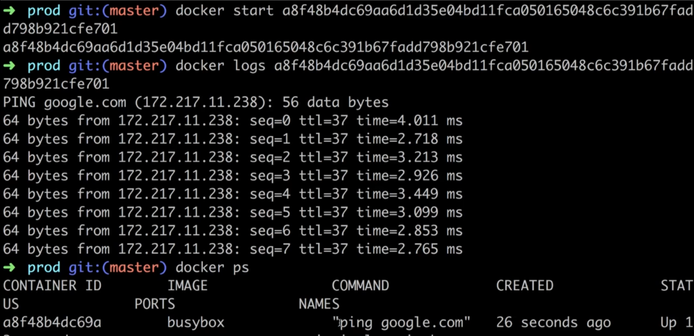


=> give the container a little time to shut down, wait about 10s

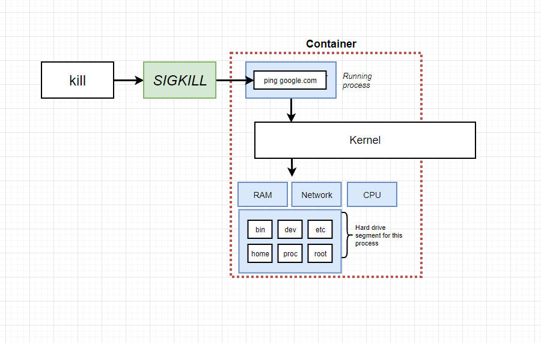

=> shut down immediately


### 9. Multi-Command Containers

Redis is in-memory app

After we install redis, run `redis-cli`, `redis-server`

```shell
docker run redis
# Then run redis-cli outside the container => err
```


=> Must install inside container

### 10. Executing Commands in Running Containers

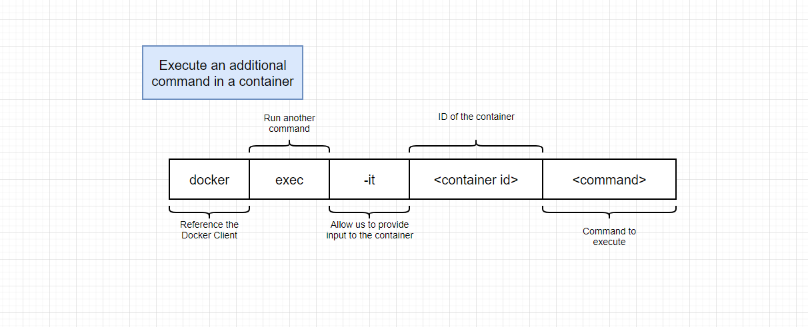


### 11. The Purpose of the IT Flag

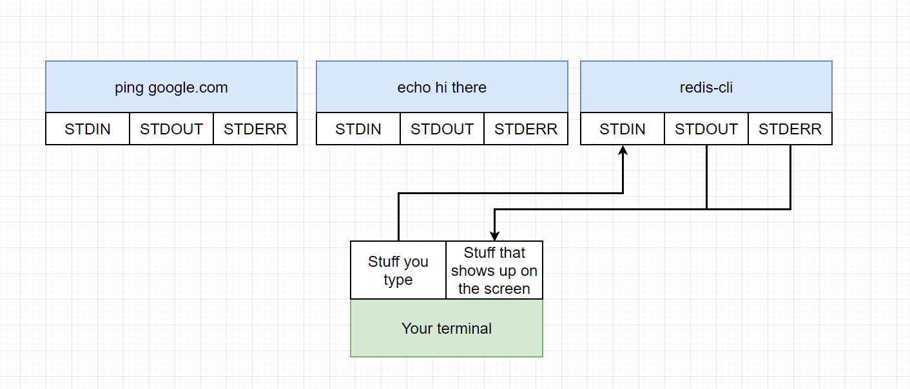


### 12. Getting a Command Prompt in a Container


=> we can access inside the context of the container

Run `redis-cli` and `d` or `ctrl D or exit	` as well

sh is a name of the program that run inside the container(command processor or shell)


### 13. Starting with a Shell


start a shell immediately after the first start up

### 14. Container Isolation

## 3. Building Custom Images Through Docker Server

### 1. Creating Docker Images

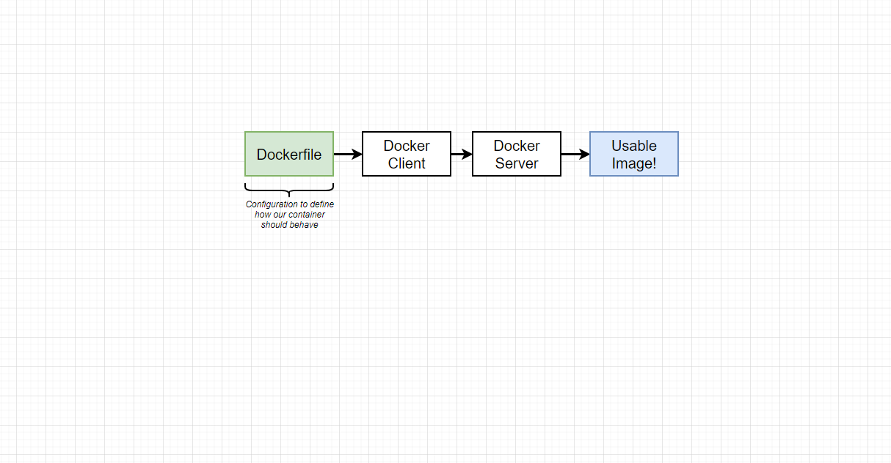

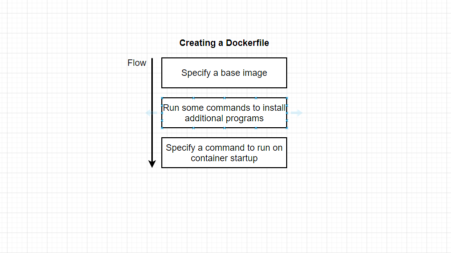

```shell
mkdir redis-image
cd redis-image
docker build .
# conatainer-id get from the last line of `docker build .`
docker run conatainer-id
```

DOCKERFILE

```dockerfile
# Use an existing docker image as a base
FROM alpine

# Download and install a dependency
RUN apk add --update redis

# Tell the image what to do when it starts
# as a container
CMD ["redis-server"]
```


### 2. Building a Dockerfile

### 3. Dockerfile Teardown

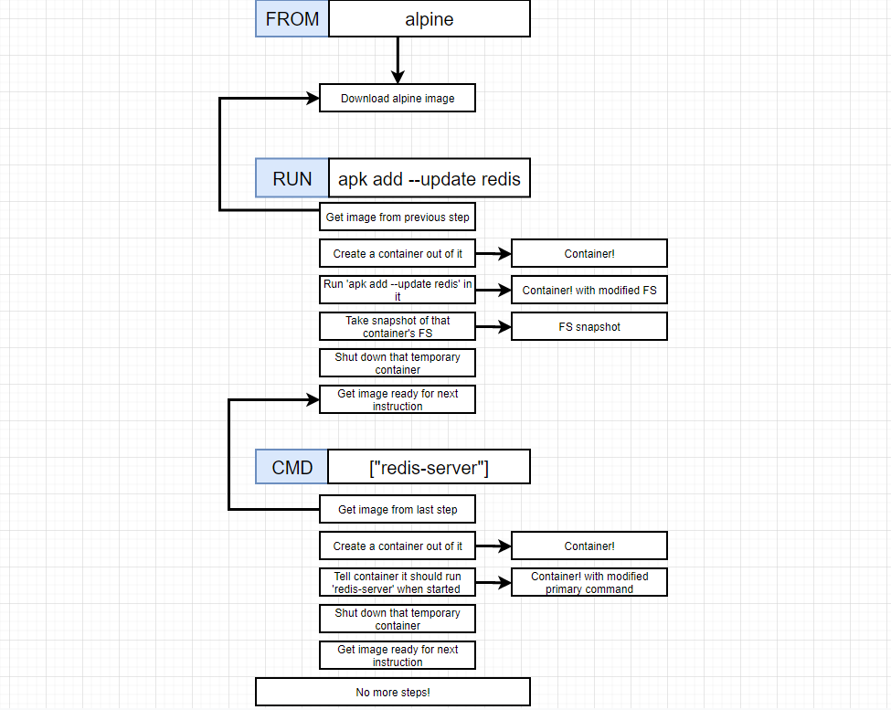

### 4. What's a Base Image

### 5. The Build Process in Detail

### 6. A Brief Recap

### 7. Rebuilds with Cache

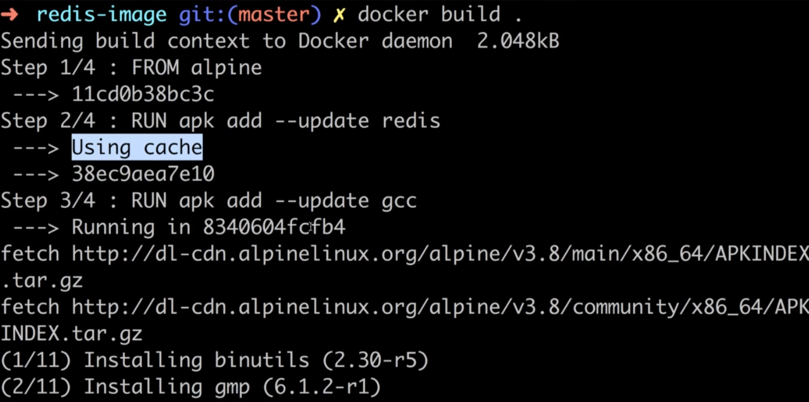

If we had build it, it will be stored in the cache


### 8. Tagging an Image

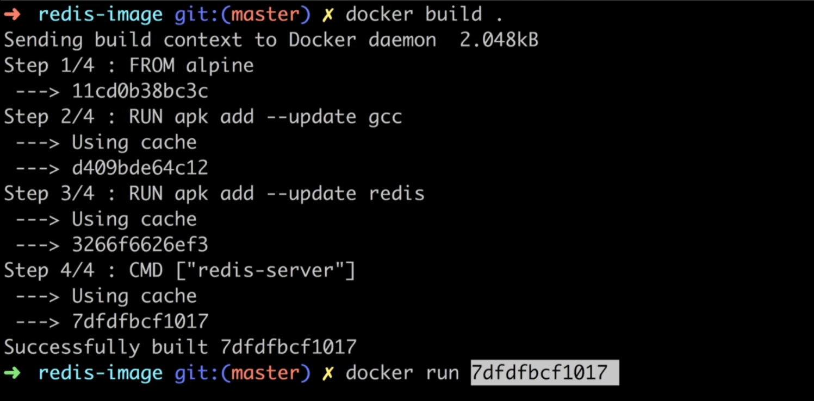


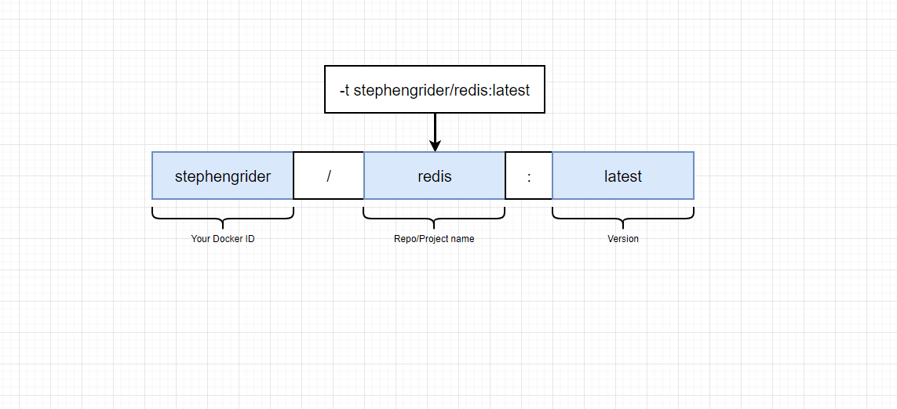


### 9. Manual Image Generation with Docker Commit


Now we open the second terminal on windows


Create new image

> Don't encourage


## 4. Making Real Projects with Docker

### 1. Project Outline


### 2. Node Server Setup


### 3. Server Code.html

This lecture is for people who didn't want to write out the code in the last video. **If you already created the index.js file and package.json file, skip this section!**


Here's what you'll need to do:

1) Create a new file called `package.json` and copy paste the following into it:

```js
{
  "dependencies": {
    "express": "*"
  },
  "scripts": {
    "start": "node index.js"
  }
}
```

2) Create a new file called `index.js` and copy paste the following into it:

```js
const express = require('express');

const app = express();

app.get('/', (req, res) => {
  res.send('How are you doing');
});

app.listen(8080, () => {
  console.log('Listening on port 8080');
});
```

### 4. A Few Planned Errors

https://hub.docker.com/_/node

Dockerfile

```dockerfile
# Specify a base image
FROM node:alpine

WORKDIR /usr/app

# Install some depenendencies
COPY ./package.json ./
RUN npm install
COPY ./ ./

# Default command
CMD ["npm", "start"]
```

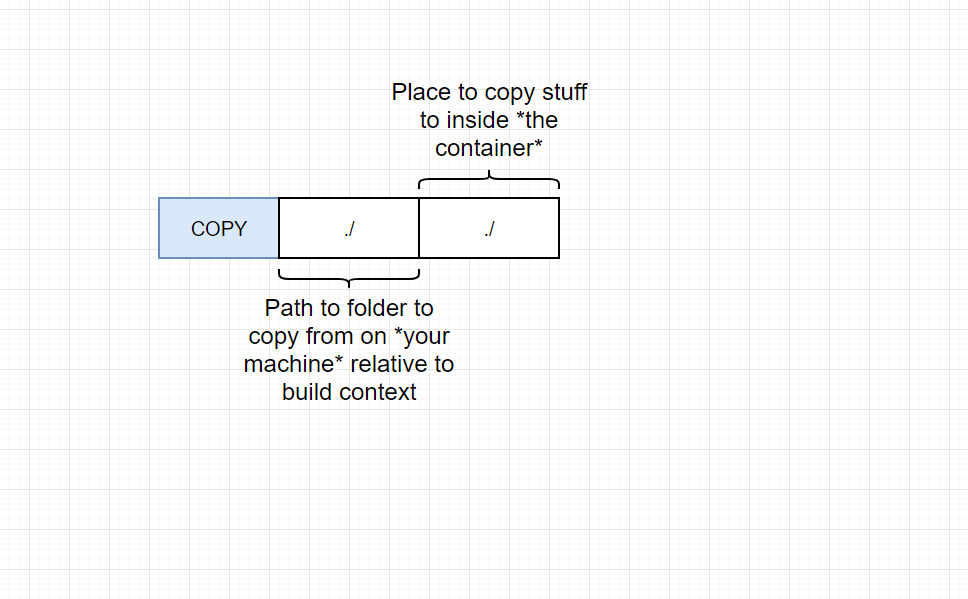

### 5. Base Image Issues

### 6. A Few Missing Files

### 7. Copying Build Files

### 8. Container Port Mapping

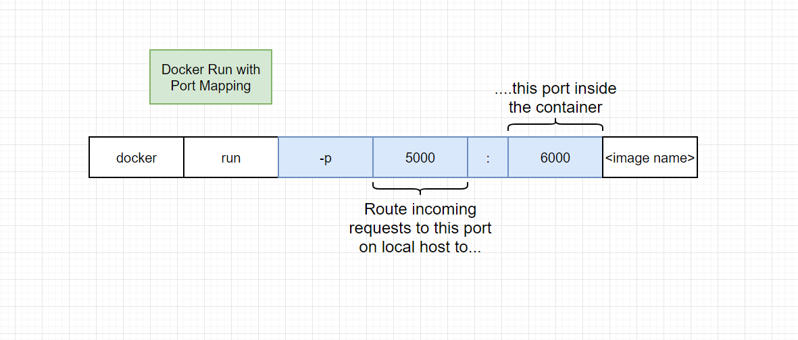

### 9. Specifying a Working Directory

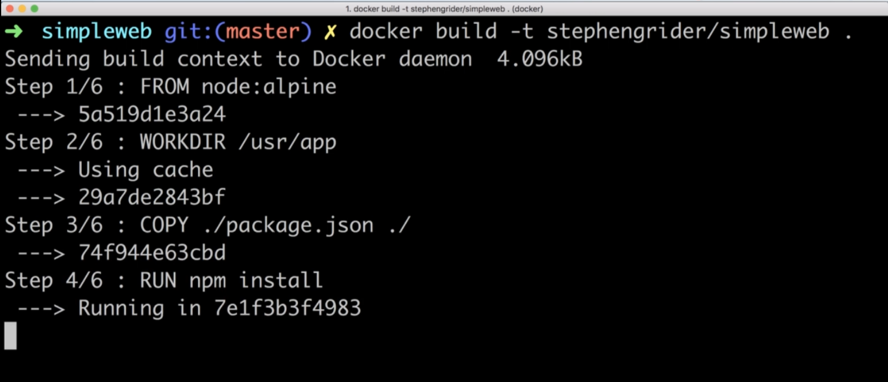


### 10. Unnecessary Rebuilds

### 11. Minimizing Cache Busting and Rebuilds

```dockerfile
# Install some depenendencies
COPY ./package.json ./
RUN npm install
COPY ./ ./
```

When we run again to see change in file index(adjust constantly), we don't have to rebuild by the way that we copy `package.json` to current working directory

Adjust content in `index.js` file => run build command =>Adjust content in `index.js` file => run build command => it use cache and run faster

```js
app.get('/', (req, res) => {
  res.send('How are you doing'); // change content in this line to see the effect on the website
});
```


## 5. Docker Compose with Multiple Local Containers

### 1. App Overview

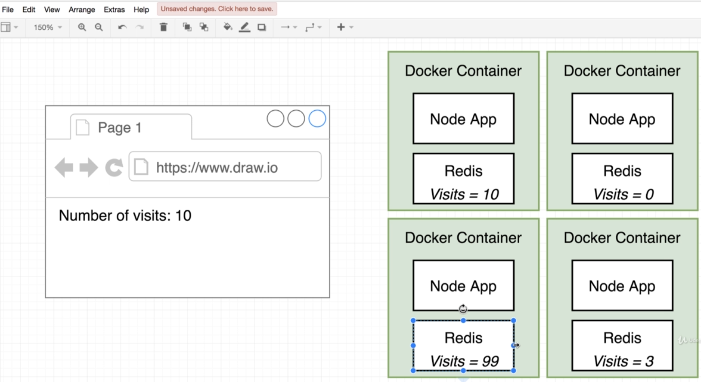

=> There is no need to create multiple instance with redis, scale up and the result like below:


### 2. App Server Code

D:\git-docs\docker\Source\Udemy - Docker and Kubernetes The Complete Guide\git repo\DockerCasts\complex\server

package.json

```json
{
  "dependencies": {
    "express": "*",
    "redis": "2.8.0"
  },
  "scripts": {
    "start": "node index.js"
  }
}
```

index.js

```js
const express = require('express');
const redis = require('redis');

const app = express();
const client = redis.createClient();
client.set('visits', 0);

app.get('/', (req, res) => {
  client.get('visits', (err, visits) => {
    res.send('Number of visits is ' + visits);
    client.set('visits', parseInt(visits) + 1);
  });
});

app.listen(8081, () => {
  console.log('Listening on port 8081');
});

```


### 3. Completed Node Code.html

D:\git-docs\docker\Source\Udemy - Docker and Kubernetes The Complete Guide\5. Docker Compose with Multiple Local Containers

### 4. Assembling a Dockerfile

Dockerfile

```dockerfile
FROM node:alpine
WORKDIR "/app"
COPY ./package.json ./
RUN npm install
COPY . .
CMD ["npm", "start"]
```

Run

```shell
docker build .
# get container id and user
# or 

docker build -t test:latest . 
docker run test
```

You can see some error


app attempt to to start but there's no register server running for it to connect

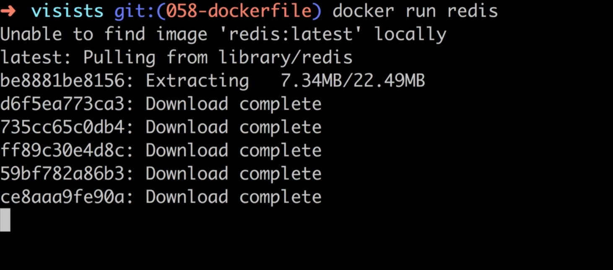

Run to pull down redis => start on local machine

Open the second terminal run 

```shell
docker run test
```

Then we also see an error again


Even though you run a redis server inside a separate container

What's the problem?

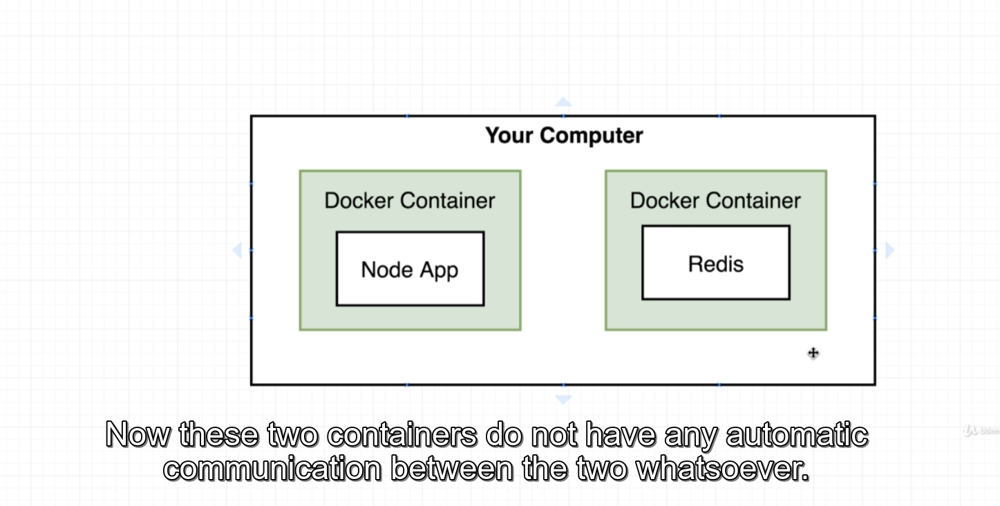


### 5. Introducing Docker Compose

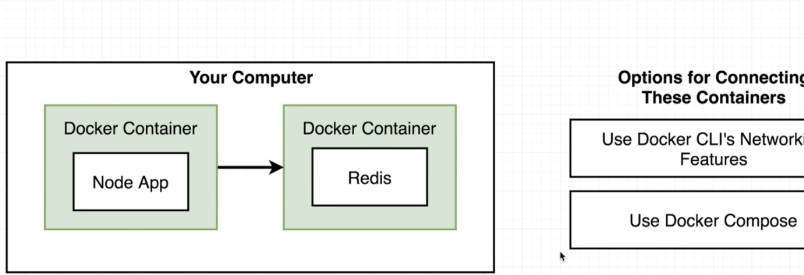


### 6. Docker Compose Files

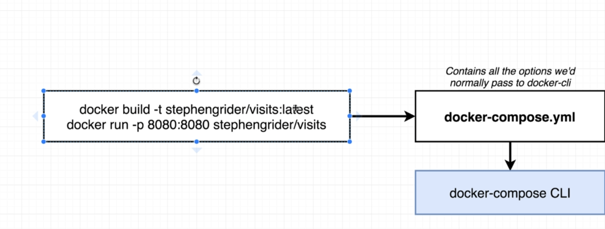


### 7. Networking with Docker Compose

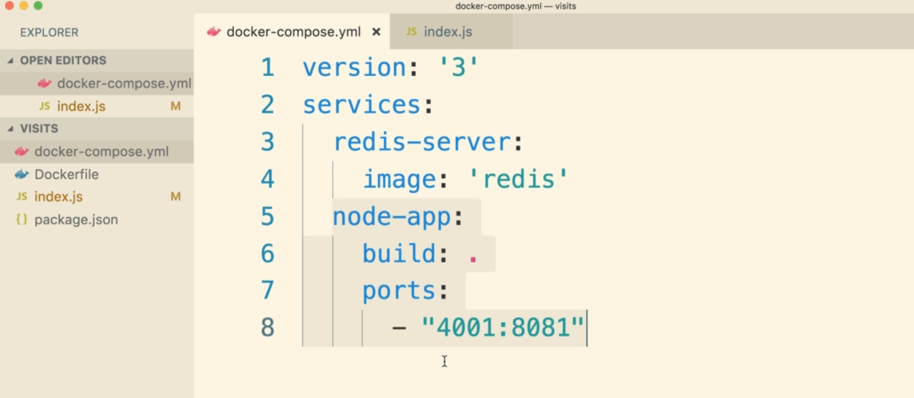

`docker build .`: find and build form this image

```js
// add
// const client = redis.createClient();
const client = redis.createClient({
  host: 'redis-server',     // get host name from docker-compose file
  port: 6379 // default port in redis
});
```

You ony need to run this command: `docker-compose up`

### A Docker/docker-compose setup with Redis and Node/Express

https://codewithhugo.com/setting-up-express-and-redis-with-docker-compose/

Docker-compose

```ini
version: '3'
services:
  redis-server:
    image: 'redis'
    expose: 
      - 6379
  node_app:
    build: .
    ports: 
      - "4001:8081"

```

```shell
Admin@LAPTOP-QO8E8EAL MINGW64 /d/git-docs/docker/Source/Udemy - Docker and Kubernetes The Complete Guide/5. Docker Compose with Multiple Local Containers/3.1 visits.zip/visits (master)
$ docker-compose up                                                                                                     Creating network "visits_default" with the default driver
Building node_app
Step 1/6 : FROM node:alpine
alpine: Pulling from library/node
0a6724ff3fcd: Pull complete                                                                                             8817a809f361: Pull complete                                                                                             7ded8c6c28da: Pull complete                                                                                             9639362e749c: Pull complete                                                                                             Digest: sha256:deac0ca3214e4fde93179b5444ec20d46c06fba58cc2c08dd10d98fbd60cb6d5
Status: Downloaded newer image for node:alpine
 ---> 46437a676663
Step 2/6 : WORKDIR "/app"
 ---> Running in a7263a6d9097
Removing intermediate container a7263a6d9097
 ---> c0afa729644b
Step 3/6 : COPY ./package.json ./
 ---> e8cfb29fa58a
Step 4/6 : RUN npm install
 ---> Running in 9ed52155d9be

added 54 packages, and audited 54 packages in 2s

found 0 vulnerabilities
npm notice
npm notice New minor version of npm available! 7.0.15 -> 7.3.0
npm notice Changelog: <https://github.com/npm/cli/releases/tag/v7.3.0>
npm notice Run `npm install -g npm@7.3.0` to update!
npm notice
Removing intermediate container 9ed52155d9be
 ---> 6d5ae3b8be7f
Step 5/6 : COPY . .
 ---> 6e3844629f8b
Step 6/6 : CMD ["npm", "start"]
 ---> Running in 6c979adc5102
Removing intermediate container 6c979adc5102
 ---> 533de53e64d4

Successfully built 533de53e64d4
Successfully tagged visits_node_app:latest
WARNING: Image for service node_app was built because it did not already exist. To rebuild this image you must use `docker-compose build` or `docker-compose up --build`.
Creating visits_node_app_1     ... done                                                                                 Creating visits_redis_server_1 ... done                                                                                 Attaching to visits_node_app_1, visits_redis_server_1
redis_server_1  | 1:C 23 Dec 2020 18:14:12.681 # oO0OoO0OoO0Oo Redis is starting oO0OoO0OoO0Oo
redis_server_1  | 1:C 23 Dec 2020 18:14:12.681 # Redis version=6.0.9, bits=64, commit=00000000, modified=0, pid=1, just started
redis_server_1  | 1:C 23 Dec 2020 18:14:12.681 # Warning: no config file specified, using the default config. In order to specify a config file use redis-server /path/to/redis.conf
redis_server_1  | 1:M 23 Dec 2020 18:14:12.684 * Running mode=standalone, port=6379.
redis_server_1  | 1:M 23 Dec 2020 18:14:12.684 # WARNING: The TCP backlog setting of 511 cannot be enforced because /proc/sys/net/core/somaxconn is set to the lower value of 128.
redis_server_1  | 1:M 23 Dec 2020 18:14:12.684 # Server initialized
redis_server_1  | 1:M 23 Dec 2020 18:14:12.684 # WARNING overcommit_memory is set to 0! Background save may fail under low memory condition. To fix this issue add 'vm.overcommit_memory = 1' to /etc/sysctl.conf and then reboot or run the command 'sysctl vm.overcommit_memory=1' for this to take effect.
redis_server_1  | 1:M 23 Dec 2020 18:14:12.684 # WARNING you have Transparent Huge Pages (THP) support enabled in your kernel. This will create latency and memory usage issues with Redis. To fix this issue run the command 'echo madvise > /sys/kernel/mm/transparent_hugepage/enabled' as root, and add it to your /etc/rc.local in order to retain the setting after a reboot. Redis must be restarted after THP is disabled (set to 'madvise' or 'never').
redis_server_1  | 1:M 23 Dec 2020 18:14:12.685 * Ready to accept connections
node_app_1      |
node_app_1      | > start
node_app_1      | > node index.js
node_app_1      |
node_app_1      | Listening on port 8081
node_app_1      | node:events:353
node_app_1      |       throw er; // Unhandled 'error' event
node_app_1      |       ^
node_app_1      |
node_app_1      | Error: getaddrinfo ENOTFOUND redis-server
node_app_1      |     at GetAddrInfoReqWrap.onlookup [as oncomplete] (node:dns:67:26)
node_app_1      | Emitted 'error' event on RedisClient instance at:
node_app_1      |     at RedisClient.on_error (/app/node_modules/redis/index.js:406:14)
node_app_1      |     at Socket.<anonymous> (/app/node_modules/redis/index.js:279:14)
node_app_1      |     at Socket.emit (node:events:376:20)
node_app_1      |     at emitErrorNT (node:internal/streams/destroy:188:8)
node_app_1      |     at emitErrorCloseNT (node:internal/streams/destroy:153:3)
node_app_1      |     at processTicksAndRejections (node:internal/process/task_queues:80:21) {
node_app_1      |   errno: -3008,
node_app_1      |   code: 'ENOTFOUND',
node_app_1      |   syscall: 'getaddrinfo',
node_app_1      |   hostname: 'redis-server'
node_app_1      | }
node_app_1      | npm ERR! code 1
node_app_1      | npm ERR! path /app
node_app_1      | npm ERR! command failed
node_app_1      | npm ERR! command sh -c node index.js
node_app_1      |
node_app_1      | npm ERR! A complete log of this run can be found in:
node_app_1      | npm ERR!     /root/.npm/_logs/2020-12-23T18_14_14_021Z-debug.log
visits_node_app_1 exited with code 1
```

=> Create **visits_default** network

Now I want to take a look at the very first line right here.
The very first line says creating network visits underscore default.
It's like I said before when you just create a new set of containers or services with Docker compose
**it's going to automatically make a network for you that's going to join those different containers together.**
After that we can see that it is creating an image for our node application.

> If we have an error when connecting => change docker file => run `docker-compose up --build` to fix

```shell
Admin@LAPTOP-QO8E8EAL MINGW64 /d/git-docs/docker/Source/Udemy - Docker and Kubernetes The Complete Guide/git repo/DockerCasts/visits-5 (master)
$ docker-compose up --build
WARNING: Found orphan containers (visits-5_redis_server_1) for this project. If you removed or renamed this service in your compose file, you can run this command with the --remove-orphans flag to clean it 
up.
Building node_app
Step 1/6 : FROM node:alpine
 ---> 46437a676663
Step 2/6 : WORKDIR "/app"
 ---> Using cache
 ---> c0afa729644b
Step 3/6 : COPY ./package.json ./
 ---> Using cache
 ---> e8cfb29fa58a
Step 4/6 : RUN npm install
 ---> Using cache
 ---> 6d5ae3b8be7f
Step 5/6 : COPY . .
 ---> 659a8bb21bce
Step 6/6 : CMD ["npm", "start"]
 ---> Running in 20671cdded28
Removing intermediate container 20671cdded28
 ---> e5eccdb95278

Successfully built e5eccdb95278
Successfully tagged visits-5_node_app:latest
Starting visits-5_redis-server_1 ... done
Recreating visits-5_node_app_1   ... done
Attaching to visits-5_redis-server_1, visits-5_node_app_1
redis-server_1  | 1:C 23 Dec 2020 18:33:48.327 # oO0OoO0OoO0Oo Redis is starting oO0OoO0OoO0Oo
redis-server_1  | 1:C 23 Dec 2020 18:33:48.327 # Redis version=6.0.9, bits=64, commit=00000000, modified=0, pid=1, just started
redis-server_1  | 1:C 23 Dec 2020 18:33:48.327 # Warning: no config file specified, using the default config. In order to specify a config file use redis-server /path/to/redis.conf
redis-server_1  | 1:M 23 Dec 2020 18:33:48.328 * Running mode=standalone, port=6379.
redis-server_1  | 1:M 23 Dec 2020 18:33:48.328 # WARNING: The TCP backlog setting of 511 cannot be enforced because /proc/sys/net/core/somaxconn is set to the lower value of 128.
redis-server_1  | 1:M 23 Dec 2020 18:33:48.328 # Server initialized
redis-server_1  | 1:M 23 Dec 2020 18:33:48.328 # WARNING overcommit_memory is set to 0! Background save may fail under low memory condition. To fix this issue add 'vm.overcommit_memory = 1' to /etc/sysctl.conf and then reboot or run the command 'sysctl vm.overcommit_memory=1' for this to take effect.
redis-server_1  | 1:M 23 Dec 2020 18:33:48.329 # WARNING you have Transparent Huge Pages (THP) support enabled in your kernel. This will create latency and memory usage issues with Redis. To fix this issue 
run the command 'echo madvise > /sys/kernel/mm/transparent_hugepage/enabled' as root, and add it to your /etc/rc.local in order to retain the setting after a reboot. Redis must be restarted after THP is disabled (set to 'madvise' or 'never').
redis-server_1  | 1:M 23 Dec 2020 18:33:48.329 * Ready to accept connections
node_app_1      | 
node_app_1      | > start
node_app_1      | > node index.js
node_app_1      |
node_app_1      | Listening on port 8081
Gracefully stopping... (press Ctrl+C again to force)
Stopping visits-5_node_app_1     ... 
Stopping visits-5_redis-server_1 ... 
```


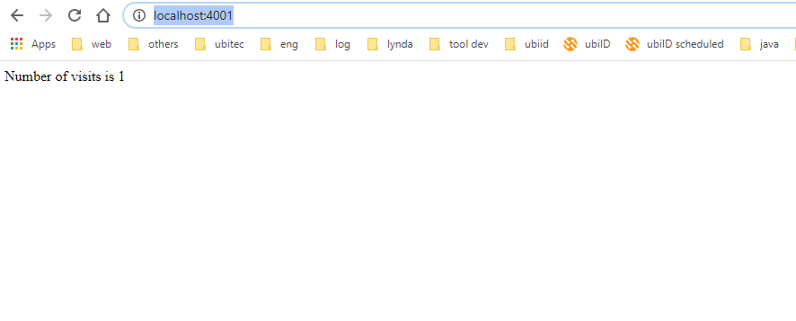

### 8. Docker Compose Commands


### 9. Stopping Docker Compose Containers

Create an image run in the background: redis

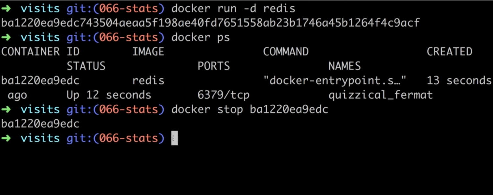


### 10. Container Maintenance with Compose

Add line 13


Crash in node app


### 11. Automatic Container Restarts

Adjust in docker-compose file


Add line 6

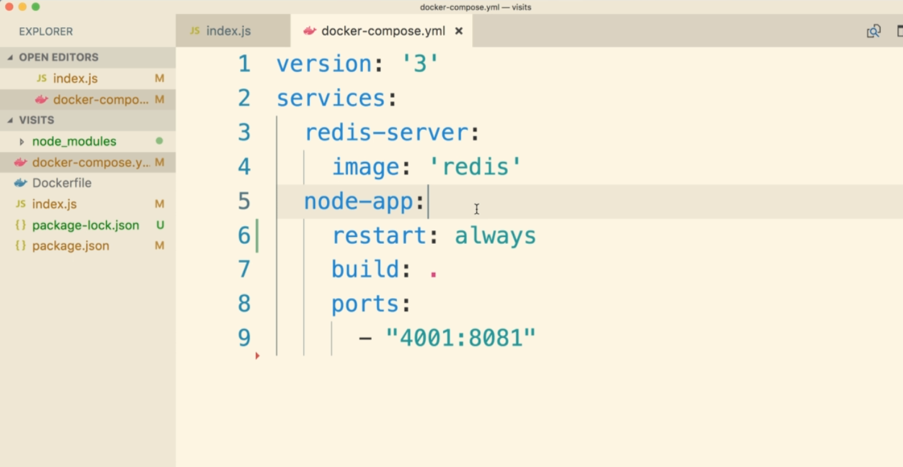


Another case: Replace on-failure on line 6

run `docker-compose up`


You need to change status != 0 => see restart

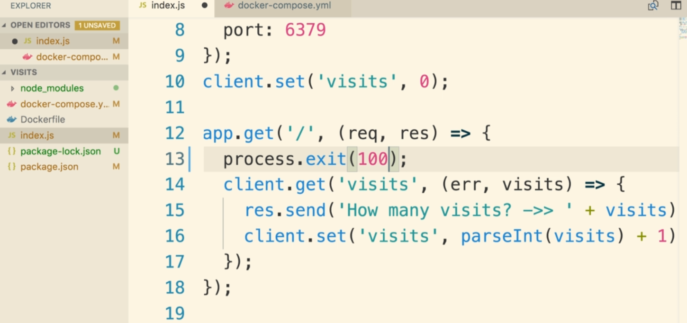

In this case, I use 100 number to replace 0 by 100

If you don't see node app is restarted => Run `docker-compose up --build` to rebuild 


### 12. Container Status with Docker Compose

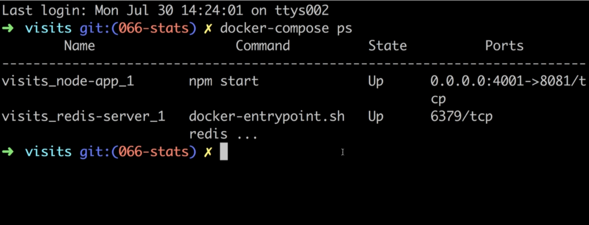


## 6. Creating a Production-Grade Workflow

### 1. Development Workflow

Process of dev

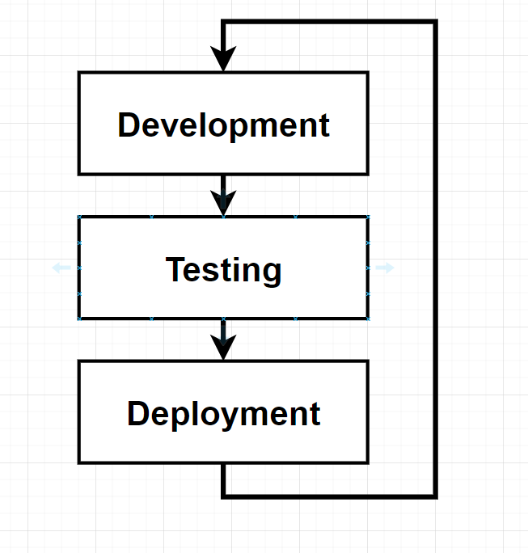


### 2. Flow specifics


Travis CI will deploy your application to AWS

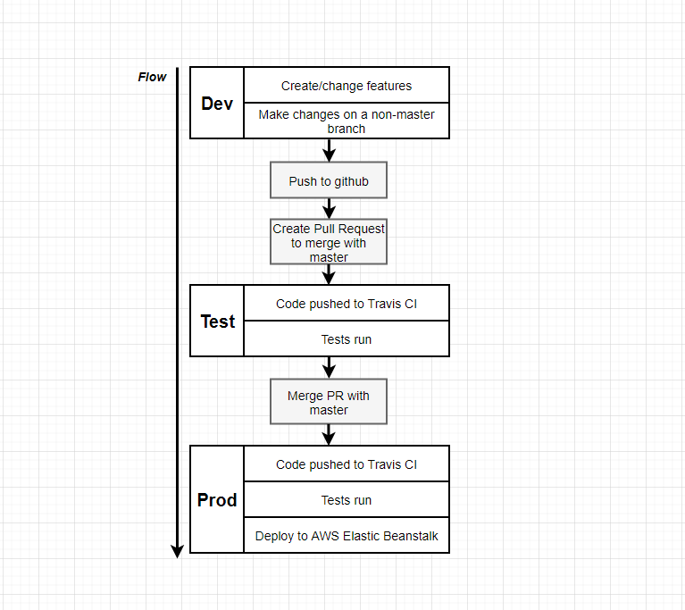


### 3. Docker's Purpose


=> you have to install node js


### 4. Project Generation


### 5. More on Project Generation

```shell
npm install -g create-react-app
create-react-app frontend

```

command with react app

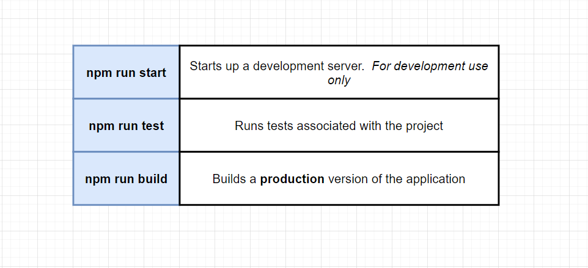


```shell
npm run build
npm run test

```


create one file for production in `build/` folder

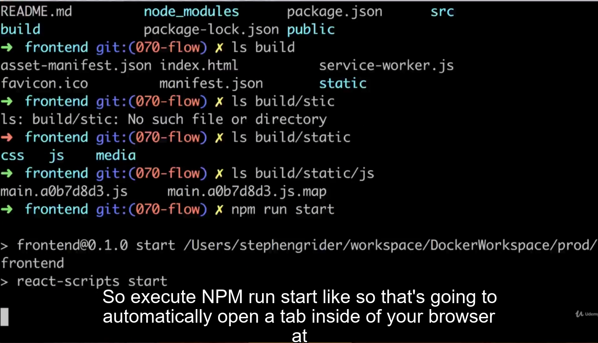

open application in the browser


### 6. Necessary Commands

### 7. Creating the Dev Dockerfile

Create 2 Dockerfile

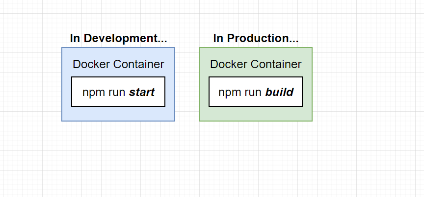


Build

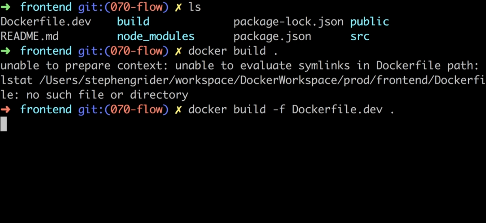

> You have to add `-f` flag to specify the name of the docker file


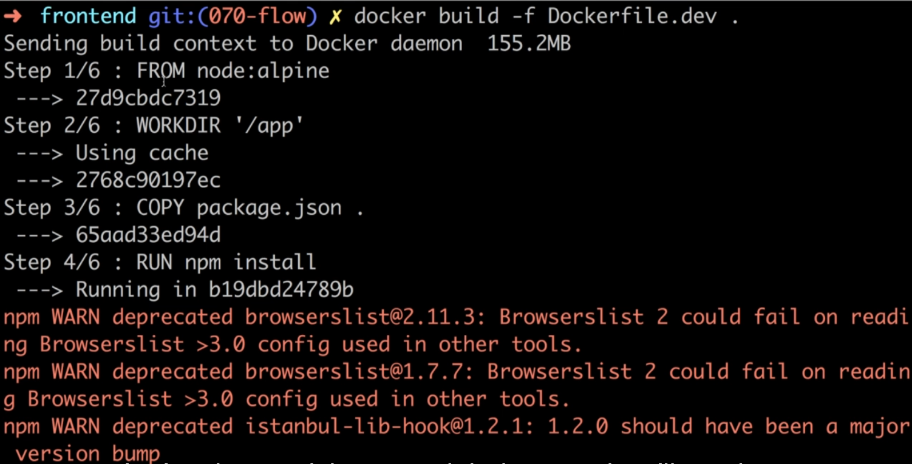

You can see some warning => ok


### 8. Duplicating Dependencies

You will remove the node modules in the working directory since we have install it in the docker file => run again


### 9. Starting the Container

run `docker build -f Dockerfile.dev .`

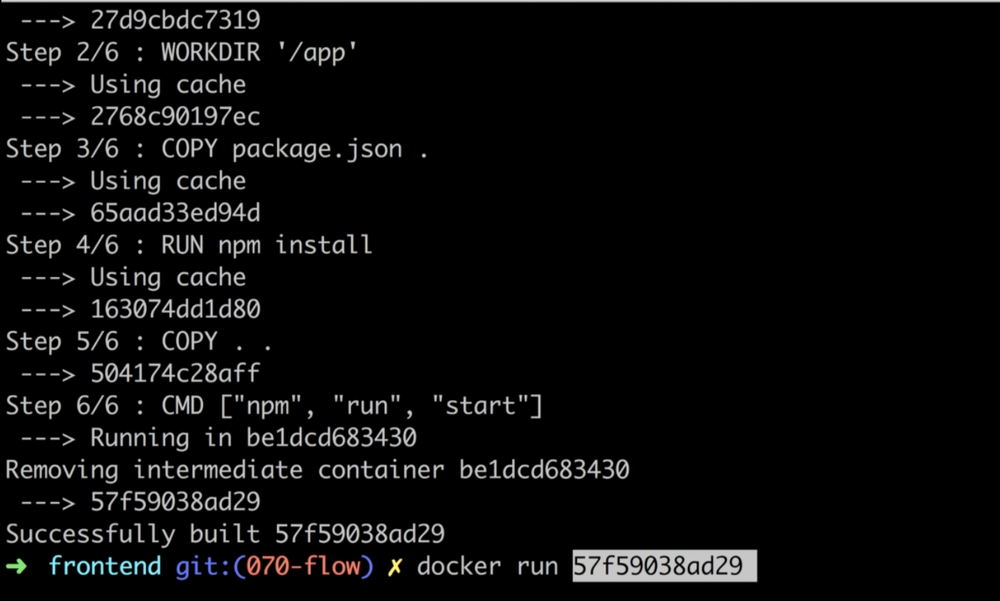


Navigate to localhost:3000 => err

So we must mount the port from the container to your machine => run command again


### 10. Quick Note for Windows Users.html

If you are running on **Windows, please read this:** Create-React-App has some issues detecting when files get changed on Windows based machines. To fix this, please do the following:

1. In the root project directory, create a file called `.env`
2. Add the following text to the file and save it: `CHOKIDAR_USEPOLLING=true`
3. That's all!

For more on why this is required, you can check out: https://facebook.github.io/create-react-app/docs/troubleshooting#npm-start-doesn-t-detect-changes

### 11. Docker Volumes

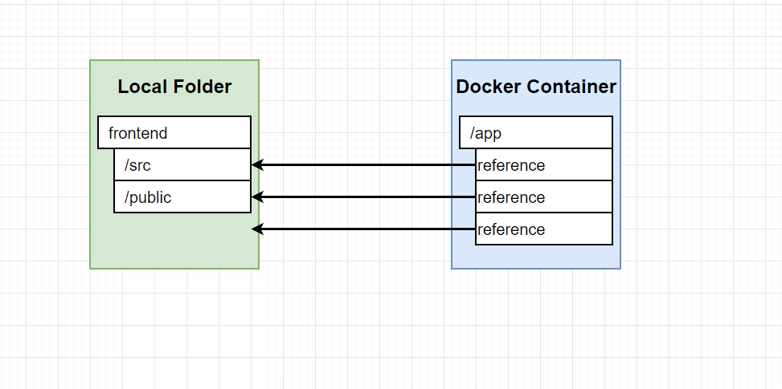

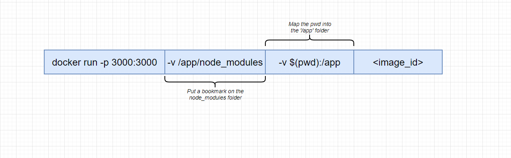

```shell
docker build -f Dockerfile.dev .

```

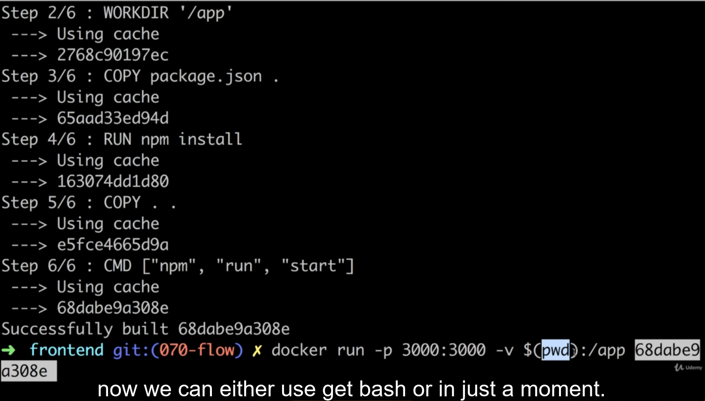

You can see some errors

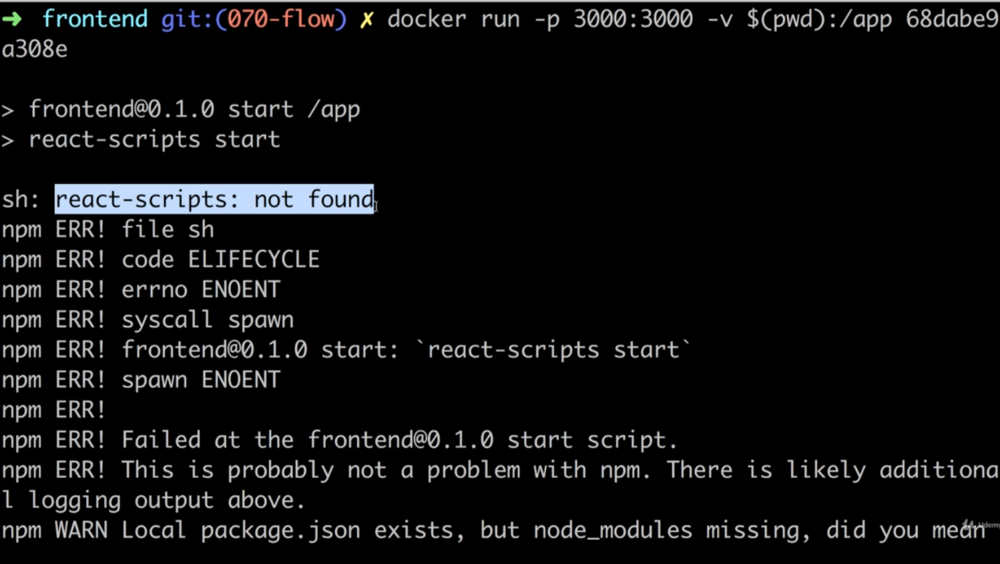


### 12. Bookmarking Volumes

When we set up a mapping current dir to `/app` folder => we don't have `/node_modules` folder => override since it is empty

 

=> automatically change if we change code in the app


### 13. Shorthand with Docker Compose

docker-compose.yml

```ini
version: '3'
services:
  web:
    build:
      context: .
      dockerfile: Dockerfile.dev
    ports: 
      - "3000:3000"
    volumes:
      - /app/node_modules
      - .:/app

```


### 14. Overriding Dockerfile Selection


default: `build: .` but now we add `dockerfile: Dockerfile.dev` to docker-compose file to specify the file when we run `docker-compose up`

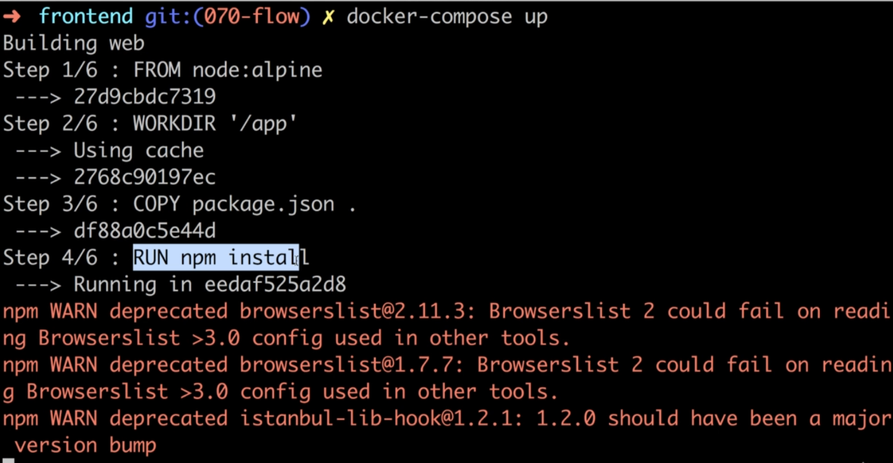

### 15. Do We Need Copy

Dockerfile.dev

```ini
FROM node:alpine

WORKDIR '/app'

COPY package.json .
RUN npm install

COPY . .

CMD ["npm", "run", "start"]
```

`COPY . .` you can keep it since in the future you can don't want to use the docker-compose anymore


### 16. Executing Tests

```shell
docker build -f Dockerfile.dev .
# copy image id in the last line

```


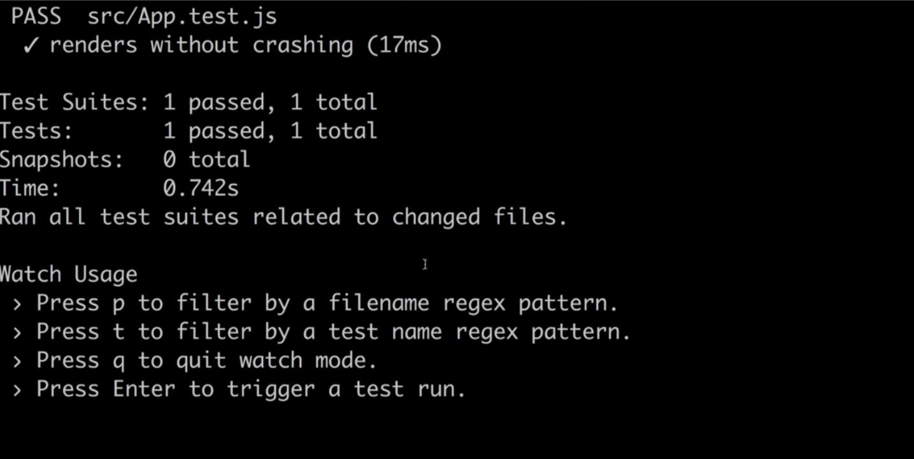


> Now once you try hitting enter right now if you do so you'll notice that **the tests appear to not run**.
>
> When we run docker run by default we get a connection to standard out inside the container.
>
> But for us to actually trigger where we get any input into the container itself we have to hook up to
>
> standard in as well.
>
> We can do so by adding on the `-it` options to see docker run.

Then run


=> full screen


### 17. Live Updating Tests

Change in App.test.js

```js
import React from 'react';
import ReactDOM from 'react-dom';
import App from './App';

it('renders without crashing', () => {
  const div = document.createElement('div');
  ReactDOM.render(<App />, div);
  ReactDOM.unmountComponentAtNode(div);
});

// add new
it('renders without crashing', () => {
  const div = document.createElement('div');
  ReactDOM.render(<App />, div);
  ReactDOM.unmountComponentAtNode(div);
});

```

=> the test will not be updated

**Solution**: Using docker compose with volume

> Docker-compose currently only have one service is web

```ini
version: '3'
services:
  web:
    build:
      context: .
      dockerfile: Dockerfile.dev
    ports: 
      - "3000:3000"
    volumes:
      - /app/node_modules
      - .:/app
```


Run


Reuse


If we remove the last one to test it will be updated


### 18. Docker Compose for Running Tests

```ini
version: '3'
services:
  web:
    build:
      context: .
      dockerfile: Dockerfile.dev
    ports: 
      - "3000:3000"
    volumes:
      - /app/node_modules
      - .:/app
  tests:
    build:
      context: .
      dockerfile: Dockerfile.dev
    volumes:
      - /app/node_modules
      - .:/app
    command: ["npm", "run", "test"]

```

=> add new service: test

Update content for docker compose file


If we remove or add the last one, the test it will be updated


### 19. Shortcomings on Testing


It's very hard to set up input from command in the terminal to docker

Now we try to attach to stdin of container:


Input q, t, ... => not work 


I want to open up a second or now a third terminal window inside of here.
We're going to start up a shell instance inside that run a container and we're going to explore some
of the different running processes.
So I'm going to again do `docker ps` again.
So remember what this does this is going to run a new command inside the container with this ID with
`-it` right here.
We are starting up a connection to standard in on this new command that we are going to run.
And then `sh` over here on the very end is going to start up essentially a new shell or a kind of a
command prompt inside the terminal shell is very similar to bash or Z shell if you use that.
It's essentially just allowing us to enter some commands directly into the container.
So I get to run that you see that we get our command prompt right here and then we're going to run P.S.
which is going to print out all the running processes that we have going on inside the container.
So this is the reason why `docker attach` did not quite work the way we expected.


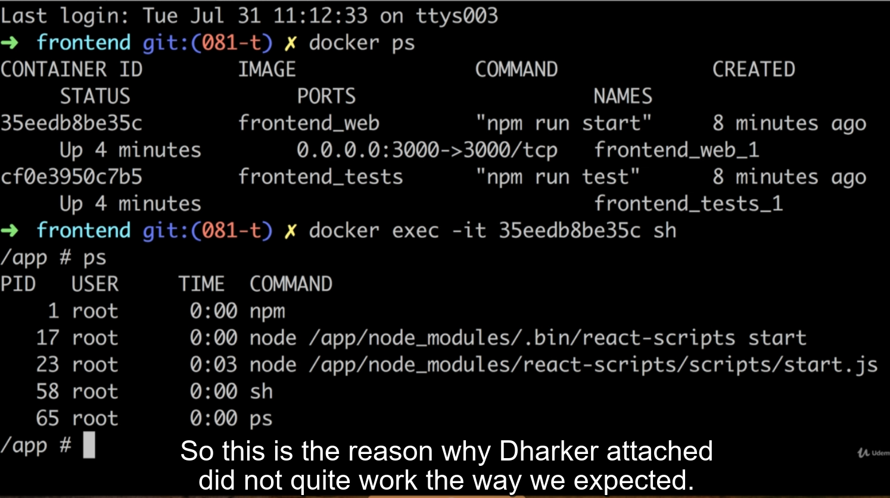


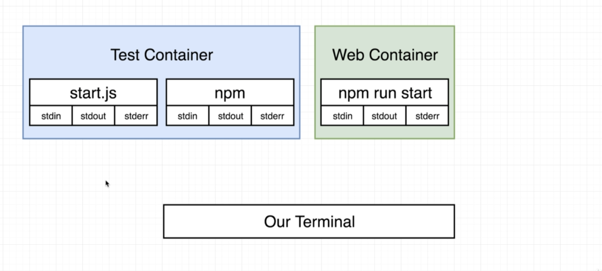


Notice how we have a PID right here.
`1` for the command `npm`. => line 1
We've then got a separate process running for `react-script starts` and yet another id for some other
scripts `start.js` thing right here.
All right.
So why is the text that we're entering into the attached window over here not showing up.
It all comes down to the different processes that have been created inside the container.
You see when we run `npm run test` we're not actually running directly `npm run test`.
In reality what is running is the process NPM and then NPM looks at the additional arguments we are
providing specifically `run test` and it uses those additional arguments to decide what to do.
So it's going to eventually start up a second process that is actually running our tests and that is
one of these two right here.
I'll be honest I don't actually know which one it is.
It's essentially just one of the two.
And so we might imagine that hey let's just say it's this one right here.
That's a process that is running our test suite so we can kind of imagine that there is a second process
in here called Start.
And this is the process that is actually executing our test suite and receiving commands over standard
in to understand when to filter down the test suite or rerun them or whatever it might be.
The problem is that when we when we run dock or attach we always attach to standard in the primary process
of the container or the process with the process id of one.
And so that's always going to be the direct NPM command.
But it's not the NPM command that is in charge of receiving those key presses and interpreting all those
kind of different options we have of the P T and q an end to right here.
It's the secondary process that was started by NPM.

> And so ideally to be able to interact with that test suite we would want to attach to that other command
> or that other running process.
> Then of course the with docker attached that is just not an option any time we'd run docker or attached. 

=> 2 way: docker compose or run exec


### 20. Need for Nginx


### 21. Multi-Step Docker Builds


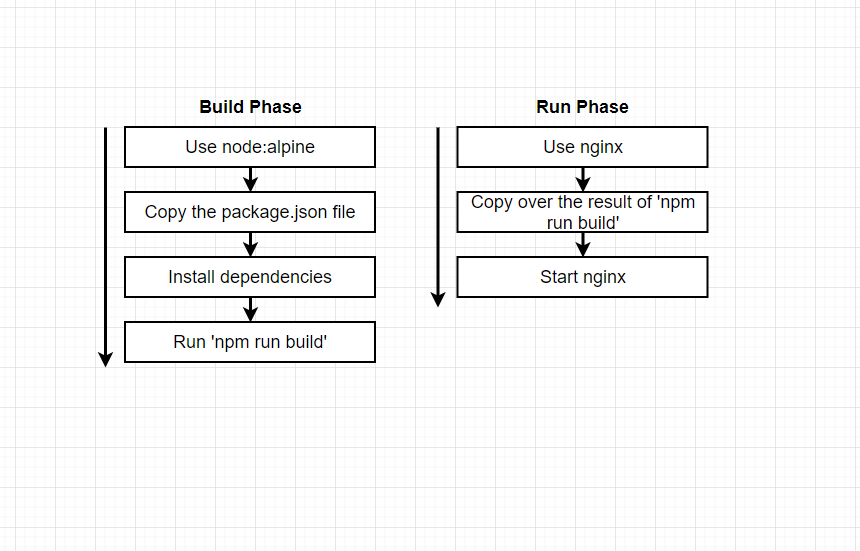


D:\git-docs\docker\Source\Udemy-Docker ....\git repo\DockerCasts\frontend\Dockerfile


Dockerfile

```ini
FROM node:alpine as builder
WORKDIR '/app'
COPY package*.json ./
RUN npm install
COPY . .
RUN npm run build

FROM nginx
EXPOSE 80
# See in https://hub.docker.com/_/nginx
COPY --from=builder /app/build /usr/share/nginx/html
```

https://hub.docker.com/_/nginx

> Check copy folder in above link
>
> So this is saying I want to copy over something from that other phase that we just we're working on
> in this case we want to copy something over from the builder phase.
>
> Copy app/build to nginx folder

### 22. Implementing Multi-Step Builds

### 23. Running Nginx

Run

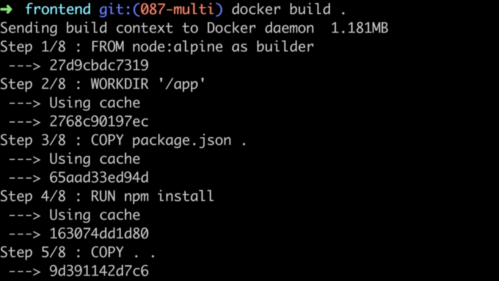

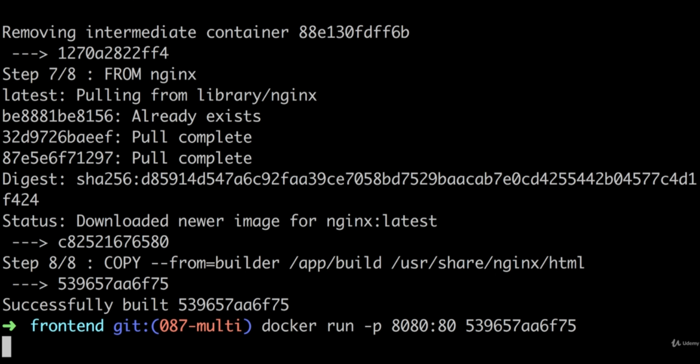


## 7. Continuous Integration and Deployment with AWS

### 1. Services Overview

[GitHub - StephenGrider/docker-react](https://github.com/StephenGrider/docker-react)


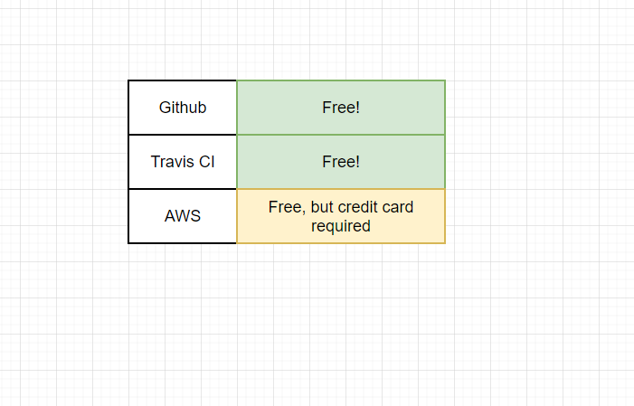


### 2. Github Setup


### 3. Travis CI Setup

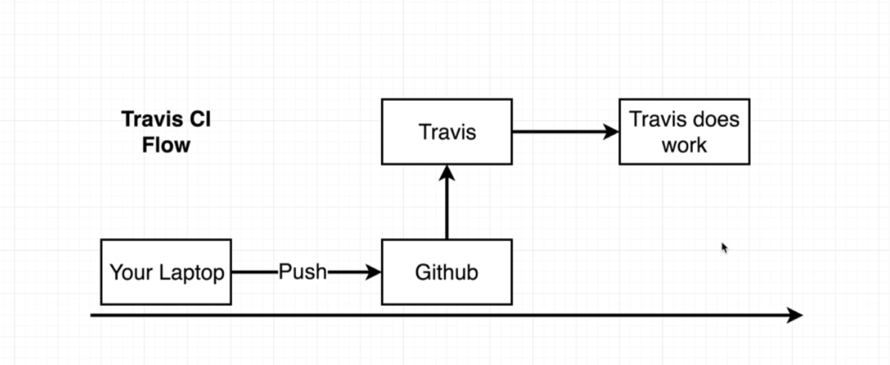

Create an account on travis-ci, turn on dashboard on the setting

https://travis-ci.org/


Sign in and authorize travis ci

Create app name `docker`

click on logo/ Profile


Filter and find your repo => enable button setting for this repo


### 4. Travis YML File Configuration

Create a .yml file to teach travis ci how to do


D:\git-docs\docker\Source\Udemy - Docker and Kubernetes The Complete Guide\git repo\DockerCasts\frontend

.travis.yml

```ini
sudo: required
services:
  - docker

before_install:
  - docker build -t stephengrider/docker-react -f Dockerfile.dev .

# show the metrics
script:
  - docker run stephengrider/docker-react npm run test -- --coverage


```


### 5. A Touch More Travis Setup

RUN `docker run <container-id> npm run test -- --coverage`

để xem result được displayed


### 6. Automatic Build Creation


  


### 7. AWS Elastic Beanstalk


> Easiest way to get started with production docker instance, run single container
>
> Now to be clear elastic beanstalk is most appropriate when you're running exactly one container at a
>
> time.
>
> We can start up multiple copies of the same container but at the end of the day.
>
> Easiest way to run one single container.

Click create new app


Only change platform to docker and click **create environment**

  


### 8. More on Elastic Beanstalk


Open this link to see


The benefit to elastic beanstalk is that it monitors the amount of traffic that's come in to our virtual

machine right here.

And as soon as that traffic reaches a certain threshold elastic beanstalk is going to automatically

add in additional virtual machines to handle that traffic.

So as soon as they request comes in it's going to go to the load balancer load balancers going to find

the note here with the least amount of traffic and that will route that request to that particular virtual

machine.

Our application running inside of the dock or container will then respond to that request and the user

will eventually get the file that they are looking for.

So that's pretty much it.

The benefit to plastic beanstalk is that it's going to automatically scale everything up for us.

All right so now we've got a better idea of how elastic things stock is doing things for us.


### 9. Travis Config for Deployment

.yml

```ini
sudo: required
services:
  - docker

before_install:
  - docker build -t stephengrider/docker-react -f Dockerfile.dev .

script:
  - docker run stephengrider/docker-react npm run test -- --coverage

deploy:
  provider: elasticbeanstalk
  region: "us-west-2"
  app: "docker"
  env: "Docker-env"
  bucket_name: "elasticbeanstalk-us-west-2-306476627547"
  bucket_path: "docker"
  on:
    branch: master
  access_key_id: $AWS_ACCESS_KEY
  secret_access_key:
    secure: "$AWS_SECRET_KEY"


```


Copy url, Docker-env is env


Go back service


Looking for us-west-2


bucket path by default is equal to the app name


### 10. Automated Deployments


Search IAM in the service(use to manage API keys)


AIM is the service that is used to manage API keys


Go to tab User => click add user


click next


Search beanstack


Then we click create user


> Click on show chỉ show 1 lần


Scroll down


Save key to travis ci


Check result


### 11. Exposing Ports Through the Dockerfile


See spinner

>NOTE
>
>So the reason that I'm showing you this kind of spinner right here before the deploy actually finishes
>
>up is that when this finishes there's actually going to be a little bit of an issue.
>
>We're going to see that after deploy completes successfully if we tried navigating to URL in the title => page it's
>
>just not going to load up.

If you recall every time that we've ran a Web server inside of a docker container we've had to do something

like `docker run -p 3000:3000 sfdfd`

And then we did that port mapping and then specified the container or whatever it might have been.

So the port mapping right there is done because by default no can port inside of the container gets

exposed to the outside world.

=> We have to very directly set up that port mapping ourselves.


add line 9

And actually in most environments the expose instruction is really supposed to be communication to you

and I as developers this is really something for you and I to read inside of a docker file and understand

oh this container probably needs to get a port mapped to port 80.

> Now AWS elastic beanstalk is just a little bit different elastic beanstalk when it starts up your docker
>
> container.
>
> It's going to look at this Dockerfile and it's going to look for the Expose instruction and then whatever
>
> port you list in there is what elastic beanstalk is going to map directly **automatically**.


Result something like that


### 12. Build Still Failing.html

If you still see a failed deployment, try the following two steps:

**Fix One:**

The `npm install` command frequently times out on the t2.micro instance that we are using. An easy fix is to bump up the instance type that Elastic Beanstalk is using to a t2.small.

Note that a t2.small is outside of the free tier, so you will pay a tiny bit of money (likely less than one dollar if you leave it running for a few hours) for this instance. Don't forget to close it down! Directions for this are a few videos ahead in the lecture titled 'Environment Cleanup'.


**Fix Two:**

Try editing the 'COPY' line of your Dockerfile like so:

```
COPY package*.json ./
```

Sometimes AWS has a tough time with the '.' folder designation and prefers the long form `./`

### 13. Workflow With Github

Click on the URL and see app work


[GitHub - StephenGrider/docker-react](https://github.com/StephenGrider/docker-react)

create feature branch and pull request


### 14. Redeploy on Pull Request Merge


Merge PR if all check is ok


### 15. Deployment Wrapup

### 16. Environment Cleanup.html

Remember, we need to delete the resources we created or you might end up paying real money for them. To clean up the Elastic Beanstalk instance we created, do the following:

***1) Go to the Elastic Beanstalk dashboard, where you should see a page that looks like this:\***


***2) On the top right hand side click the 'Actions' button\***


3) ***Click on 'Delete Application' then confirm the delete\***


>  **Note**: it might take a few minutes for the dashboard to update and show that your app is being deleted. Be a little patient!

## 8. Building a Multi-Container Application

### 1. Single Container Deployment Issues


Problems


### 2. Application Overview


Fibonacy sequence


Mock

### 3. A Quick Note.html

In the next few videos we're going to write a lot of Javascript code. You might not be interested in writing Javascript - ***if you don't want to put the app together from scratch then skip to Section #9\***. Over there you'll find the completed code ready to download, so you can focus just on the Docker stuff and not worry about any Javascript!


### 4. Application Architecture


### 5. Worker Process Setup


### 6. Express API Setup

D:\git-docs\docker\Source\Udemy - Docker and Kubernetes The Complete Guide\git repo\DockerCasts\complex


package.json

```json
{
  "dependencies": {
    "nodemon": "1.18.3",
    "redis": "2.8.0"
  },
  "scripts": {
    "start": "node index.js",
    "dev": "nodemon"
  }
}
```

worker/ index.js

```js
const keys = require('./keys');
const redis = require('redis');

const redisClient = redis.createClient({
  host: keys.redisHost,
  port: keys.redisPort,
  retry_strategy: () => 1000
});
const sub = redisClient.duplicate();

function fib(index) {
  if (index < 2) return 1;
  return fib(index - 1) + fib(index - 2);
}

sub.on('message', (channel, message) => {
  redisClient.hset('values', message, fib(parseInt(message)));
});
sub.subscribe('insert');

// listen and calculate => insert into a hash of values

```

worker/keys.js

```js
module.exports = {
  redisHost: process.env.REDIS_HOST,
  redisPort: process.env.REDIS_PORT
};

```


=> mean ok


### 7. Connecting to Postgres

server/keys.js

```js
module.exports = {
  redisHost: process.env.REDIS_HOST,
  redisPort: process.env.REDIS_PORT,
  pgUser: process.env.PGUSER,
  pgHost: process.env.PGHOST,
  pgDatabase: process.env.PGDATABASE,
  pgPassword: process.env.PGPASSWORD,
  pgPort: process.env.PGPORT
};

```

index.js

```js
const keys = require('./keys');

// Express App Setup
const express = require('express');
const bodyParser = require('body-parser');
const cors = require('cors');

const app = express();
app.use(cors());
app.use(bodyParser.json());

// Postgres Client Setup
const { Pool } = require('pg');
const pgClient = new Pool({
  user: keys.pgUser,
  host: keys.pgHost,
  database: keys.pgDatabase,
  password: keys.pgPassword,
  port: keys.pgPort
});
pgClient.on('error', () => console.log('Lost PG connection'));

pgClient
  .query('CREATE TABLE IF NOT EXISTS values (number INT)')
  .catch(err => console.log(err));

// Redis Client Setup
const redis = require('redis');
const redisClient = redis.createClient({
  host: keys.redisHost,
  port: keys.redisPort,
  retry_strategy: () => 1000
});
const redisPublisher = redisClient.duplicate(); // => pub or sub

// Express route handlers

app.get('/', (req, res) => {
  res.send('Hi');
});

app.get('/values/all', async (req, res) => {
  // const values = await pgClient.query('SELECT * from values');
  // res.send(values.rows);
  res.send([1, 2, 3]);
});

app.get('/values/current', async (req, res) => {
  redisClient.hgetall('values', (err, values) => {
    res.send(values);
  });
});

app.post('/values', async (req, res) => {
  const index = req.body.index;

  if (parseInt(index) > 40) {
    return res.status(422).send('Index too high');
  }

  redisClient.hset('values', index, 'Nothing yet!');
  redisPublisher.publish('insert', index);
  pgClient.query('INSERT INTO values(number) VALUES($1)', [index]);

  res.send({ working: true });
});

app.listen(5000, err => {
  console.log('Listening');
});

```


### 8. More Express API Setup

### 9. Generating the React App

Fib.js

```js
import React, { Component } from 'react';
import axios from 'axios';

class Fib extends Component {
  state = {
    seenIndexes: [],
    values: {},
    index: ''
  };

  componentDidMount() {
    this.fetchValues();
    this.fetchIndexes();
  }

  async fetchValues() {
    const values = await axios.get('/api/values/current');
    this.setState({ values: values.data });
  }

  async fetchIndexes() {
    const seenIndexes = await axios.get('/api/values/all');
    this.setState({
      seenIndexes: seenIndexes.data
    });
  }

  handleSubmit = async event => {
    event.preventDefault();

    await axios.post('/api/values', {
      index: this.state.index
    });
    this.setState({ index: '' });
  };

  renderSeenIndexes() {
    return this.state.seenIndexes.map(({ number }) => number).join(', ');
  }

  renderValues() {
    const entries = [];

    for (let key in this.state.values) {
      entries.push(
        <div key={key}>
          For index {key} I calculated {this.state.values[key]}
        </div>
      );
    }

    return entries;
  }

  render() {
    return (
      <div>
        <form onSubmit={this.handleSubmit}>
          <label>Enter your index:</label>
          <input
            value={this.state.index}
            onChange={event => this.setState({ index: event.target.value })}
          />
          <button>Submit</button>
        </form>

        <h3>Indexes I have seen:</h3>
        {this.renderSeenIndexes()}

        <h3>Calculated Values:</h3>
        {this.renderValues()}
      </div>
    );
  }
}

export default Fib;

```


### 10. Fetching Data in the React App

### 11. Rendering Logic in the App

### 12. Exporting the Fib Class

### 13. Routing in the React App

App.js

```js
import React, { Component } from 'react';
import logo from './logo.svg';
import './App.css';
import { BrowserRouter as Router, Route, Link } from 'react-router-dom';
import OtherPage from './OtherPage';
import Fib from './Fib';

class App extends Component {
  render() {
    return (
      <Router>
        <div className="App">
          <header className="App-header">
            
            <h1 className="App-title">Fib Calculator UPDATED!</h1>
            <Link to="/">Home</Link>
            <Link to="/otherpage">Other Page</Link>
          </header>
          <div>
            <Route exact path="/" component={Fib} />
            <Route path="/otherpage" component={OtherPage} />
          </div>
        </div>
      </Router>
    );
  }
}

export default App;

```


## 9. Dockerizing Multiple Services

### 1. Checkpoint Files.html

***If you skipped over putting the app together from scratch\***, download the attached Checkpoint.zip file. You'll need it in the next section to get all caught up.

C:\Users\Admin\Downloads\[FreeCourseSite.com] Udemy - Docker and Kubernetes The Complete Guide\9. Dockerizing Multiple Services


### 2. Checkpoint Catchup


### 3. Dockerizing a React App - Again!


folder complex-elastic-beanstalk

client/Dockerfile.dev

```ini
FROM node:alpine
WORKDIR '/app'
COPY ./package.json ./
RUN npm install
COPY . .
CMD ["npm", "run", "start"]
```

Run 


If we have some warning, it is ok


Run container 

### 4. Dockerizing Generic Node Apps

server/Dockerfile.dev

```ini
FROM node:alpine
WORKDIR "/app"
COPY ./package.json ./
RUN npm install
COPY . .
CMD ["npm", "run", "dev"]
```

package.json

```json
{
  "dependencies": {
    "express": "4.16.3",
    "pg": "7.4.3",
    "redis": "2.8.0",
    "cors": "2.8.4",
    "nodemon": "1.18.3",
    "body-parser": "*"
  },
  "scripts": {
    "dev": "nodemon",
    "start": "node index.js"
  }
}

```

nodemon make app auto restart if we have any change

worker/Dockerfile.dev

```ini
FROM node:alpine
WORKDIR "/app"
COPY ./package.json ./
RUN npm install
COPY . .
CMD ["npm", "run", "dev"]
```


Copy image id after build and run


=> result like that is ok then CTRL C

Do similarly with worker


### 5. Adding Postgres as a Service


Run command


https://hub.docker.com/_/postgres


You will see


=> mean ok


**Summary**

# How to use this image

## start a postgres instance

```
$ docker run --name some-postgres -e POSTGRES_PASSWORD=mysecretpassword -d postgres
```

The default `postgres` user and database are created in the entrypoint with `initdb`.

> The postgres database is a default database meant for use by users, utilities and third party applications.
>
> [postgresql.org/docs](http://www.postgresql.org/docs/9.5/interactive/app-initdb.html)

## ... or via `psql`

```
$ docker run -it --rm --network some-network postgres psql -h some-postgres -U postgres
psql (9.5.0)
Type "help" for help.

postgres=# SELECT 1;
 ?column? 
----------
        1
(1 row)
```

## ... via [`docker stack deploy`](https://docs.docker.com/engine/reference/commandline/stack_deploy/) or [`docker-compose`](https://github.com/docker/compose)

Example `stack.yml` for `postgres`:

```
# Use postgres/example user/password credentials
version: '3.1'

services:

  db:
    image: postgres
    restart: always
    environment:
      POSTGRES_PASSWORD: example

  adminer:
    image: adminer
    restart: always
    ports:
      - 8080:8080
```


### 6. Docker-compose Config


### 7. Environment Variables with Docker Compose


When we set up env in docker-compose file => apply at runtime

https://hub.docker.com/_/redis


port 6379 default 

Add new env


```ini
version: '3'
services:
  postgres:
    image: 'postgres:latest'
  redis:
    image: 'redis:latest'
  api:
    build:
      dockerfile: Dockerfile.dev
      context: ./server
    volumes:
      - /app/node_modules
      - ./server:/app
    environment:
      - REDIS_HOST=redis
      - REDIS_PORT=6379
      - PGUSER=postgres
      - PGHOST=postgres
      - PGDATABASE=postgres
      - PGPASSWORD=postgres_password
      - PGPORT=5432
```


Rebuild it again


=> ok


### 8. The Worker and Client Services


=> missing setting port mapping ?? => nginx


### 9. Nginx Path Routing


### 10. Routing with Nginx


To tell nginx location of the upstream => use directive `server`

After sever directive we declare service name in the docker-compose file

e.g: server api:5000;


### 11. Building a Custom Nginx Image

Go to docker hub check nginx

nginx/Dockerfile

```ini
FROM nginx
COPY ./default.conf /etc/nginx/conf.d/default.conf
```


Add some values


### 12. Starting Up Docker Compose

Force to rebuild everythings


=> every maybe crash => but it is ok we'll fix it

### 13. Troubleshooting.html

Hi! Its entirely possible that you might run into a bug or two when you start up this set of containers with docker-compose.

Are you able to enter a number into the react app, but it appears to never be calculated, as seen in this screenshot?


If that's the case, then you can try adding in environment variables to the 'worker' entry in the docker-compose file, like so:

```
worker:
  environment:
    - REDIS_HOST=redis
    - REDIS_PORT=6379
```

Then restart docker-compose.

The next section also has a couple of other possible troubleshooting tips.


### 14. Troubleshooting Startup Bugs

Run again `docker-compose up` in the `complex` folder


Test


F12

Essentially we're seeing this error message because any time our react application boots up in development

mode it wants to keep a active connection to the development server and be notified of any time that some file changes now.

You know normally we wouldn't really worry about that too much but as it stands by not setting up this

Web socket connection we're actually going to very significantly impact the performance of our application

which we can see by entering in a value to this input right here.


### 15. Opening Websocket Connections

Add line 16->21


Ctrl c => `docker-compose up --build`


Run `docker-compose up` again


## 10. A Continuous Integration Workflow for Multiple Images
### 1. Production Multi-Container Deployments

D:\git-docs\docker\Source\Udemy - Docker and Kubernetes The Complete Guide\git repo\DockerCasts\complex-elastic-beanstalk

[GitHub - StephenGrider/multi-docker](https://github.com/StephenGrider/multi-docker)


### 2. Production Dockerfiles

create /worker/Dockerfile

```ini
FROM node:alpine
WORKDIR "/app"
COPY ./package.json ./
RUN npm install
COPY . .
CMD ["npm", "run", "start"]
```

Do similarly for server and nginx folder


### 3. Multiple Nginx Instances

client/Dockerfile

```ini
FROM node:alpine as builder
WORKDIR '/app'
COPY ./package.json ./
RUN npm install
COPY . .
RUN npm run build

FROM nginx
EXPOSE 3000
COPY ./nginx/default.conf /etc/nginx/conf.d/default.conf
COPY --from=builder /app/build /usr/share/nginx/html
```


### 4. Altering Nginx's Listen Port

client/nginx/

```ini
server {
  listen 3000;

  location / {
    # We copy build in dockerfile in folder client/
    root /usr/share/nginx/html; 
    index index.html index.htm;
  }
}
```

client/Dockerfile

```ini
FROM node:alpine as builder
WORKDIR '/app'
COPY ./package.json ./
RUN npm install
COPY . .
RUN npm run build

FROM nginx
EXPOSE 3000
COPY ./nginx/default.conf /etc/nginx/conf.d/default.conf
COPY --from=builder /app/build /usr/share/nginx/html
```


### 5. A Quick Fix.html

In the last section we added on some Nginx config to the client side project, but I neglected to add one line that would get the Nginx server to work correctly when using React Router!

In the **client/nginx/default.conf** file, please add the following line:

```ini
server {
  listen 3000;

  location / {
    root /usr/share/nginx/html;
    index index.html index.htm;
    try_files $uri $uri/ /index.html;  <<------Add this!!!!
  }
}
```

### 6. Cleaning Up Tests

App.test.js change content in this file to run without error

```js
import React from 'react';
import ReactDOM from 'react-dom';
import App from './App';

it('renders without crashing', () => {});

```


### 7. Github and Travis CI Setup


Run these commands


### 8. Travis Configuration Setup


.travis.yml

```ini
sudo: required
services:
  - docker

before_install:
  - docker build -t stephengrider/react-test -f ./client/Dockerfile.dev ./client

script:
  - docker run stephengrider/react-test npm test -- --coverage

after_success:
  - docker build -t stephengrider/multi-client ./client
  - docker build -t stephengrider/multi-nginx ./nginx
  - docker build -t stephengrider/multi-server ./server
  - docker build -t stephengrider/multi-worker ./worker
  # Log in to the docker CLI
  - echo "$DOCKER_PASSWORD" | docker login -u "$DOCKER_ID" --password-stdin
  # Take those images and push them to docker hub
  - docker push stephengrider/multi-client
  - docker push stephengrider/multi-nginx
  - docker push stephengrider/multi-server
  - docker push stephengrider/multi-worker

deploy:
  provider: elasticbeanstalk
  region: us-west-1
  app: multi-docker
  env: MultiDocker-env
  bucket_name: elasticbeanstalk-us-west-1-306476627547
  bucket_path: docker-multi
  on:
    branch: master
  access_key_id: $AWS_ACCESS_KEY
  secret_access_key:
    secure: $AWS_SECRET_KEY

```


### 9. Pushing Images to Docker Hub


Scroll down


Add new DOCKER ID


### 10. Successful Image Building


## 11. Multi-Container Deployments to AWS
### 1. Multi-Container Definition Files


Now we have many dockerfile => don't know what to run

=> Create new file


Look like we set up docker-compose


The biggest difference that you're going to see between these two files is that in the docker compose

file it's going to contain some information about how to build an image using a docker file.

Right that's what we're doing inside of docker compose.

If you go up the docker compose file right now you'll see that in each service we had the different

build directions.


### 2. Finding Docs on Container Definitions


So Elastic beanstalk doesn't actually know how to work with containers especially a multi container environment.

Behind the scenes when you tell a Elastic beanstalk to host a set of containers it's actually delegating

that hosting off to another service that is provided in Amazon called the **elastic container service**

which is abbreviated very frequently as e.c.s you work with Amazon e.c.s by creating files that are

called Task definitions and a task definition is essentially a file that tells us how to run one single

container.

Each of these task definition files are very similar almost identical to the container definitions that

you and I are going to write inside of our docker run AWS json file.

gg: https://docs.aws.amazon.com/AmazonECS/latest/developerguide/task_definitions.html

https://docs.aws.amazon.com/AmazonECS/latest/developerguide/task_definition_parameters.html

Format to follow

https://docs.aws.amazon.com/AmazonECS/latest/developerguide/task_definition_parameters.html#container_definitions


### 3. Adding Container Definitions to DockerRun

And so when we say **hostname** right here we're essentially giving every other container in this group

of containers the **ability to access this container right here by trying to make a request with a hostname**

of client. - like name of service and it is accessed in the nginx folder

Dockerrun.aws.json

```json
{
  "AWSEBDockerrunVersion": 2,
  "containerDefinitions": [
    {
      "name": "client",
      "image": "stephengrider/multi-client",
      "hostname": "client",
      "essential": false,
      "memory": 128
    },
    {
      "name": "server",
      "image": "stephengrider/multi-server",
      "hostname": "api",
      "essential": false,
      "memory": 128
    },
    {
      "name": "worker",
      "image": "stephengrider/multi-worker",
      "hostname": "worker",
      "essential": false,
      "memory": 128
    },
    {
      "name": "nginx",
      "image": "stephengrider/multi-nginx",
      "hostname": "nginx",
      "essential": true,
      "portMappings": [
        {
          "hostPort": 80,
          "containerPort": 80
        }
      ],
      "links": ["client", "server"],
      "memory": 128
    }
  ]
}

```


### 4. More Container Definitions

So the next one that we're going to put on is a flag called **essential** or we're going to set it to false

by default the essential flag is something that we've not seen before in any other docker concept.

The essential flag essentially means that this container right here is not considered to be as you might

guess essential.

So what would it mean if we mark this thing as is essential **true**.

If we marked a container as essential true and this container ever crashes for any reason whatsoever

then **all the other containers in this group of containers will be closed down** at the same time.


### 5. Forming Container Links

```json
 {
      "name": "nginx",
      "image": "stephengrider/multi-nginx",
      "hostname": "nginx",
      "essential": true,
      "portMappings": [
        {
          "hostPort": 80,
          "containerPort": 80
        }
      ],
      "links": ["client", "server"], => communicate to other services by name of container definition in json file
      "memory": 128
    }
```


https://jsonlint.com/

validate json file is valid


### 6. Creating the EB Environment


Create new app


### 7. Managed Data Service Providers


> We miss redis and postgres


### 8. Overview of AWS VPC's and Security Groups


> Now in each of these different regions by default you get something created a that is called a virtual
>
> private cloud or VPC for short of the VPC essentially is kind of its own private little network so that
>
> any instance are any different service that you create is isolated to just your account and it doesn't
>
> get automatically shared with like someone else's AWS account.
>
> Now before we move on just one thing to make really clear here in each of the **different regions** or data
>
> centers around the world you automatically get **one default VPC created**.


Click on your VPC on the left hand side you can see the default VPC


### 9. RDS Database Creation


Search RDS


Next

Scroll down and enter your pass


Then we click next

Enetr your db name


See new db here


### 10. ElastiCache Redis Creation


Choose t2 and choose which we want to use


We don't need any replicas because we definitely do not have high performance demands for our application.

So going to change replicas to none.


Add name and choose 2 check box above


Then we click create


### 11. Creating a Custom Security Group


We see the new one


Port range base on the docker-compose file


> => Allow any traffic from any other AWS service that has this security group


### 12. Applying Security Groups to Resources

Search service name cache


Go to redis tab => click on check box => choose Modify


Then we click Modify

**Maintenance windows**

Now normally when we make a change to a class cache cluster it's going to try to schedule that maintenance

for some very specific time.

Usually some overnight period where hopefully not a lot of people are using our service but making changes

to a security group doesn't actually require a maintenance window.

Even though the thing is going to tell you that it does.

So we can just click on modify and it will immediately start to change the security groups on there.

---


Scroll down


The result


IN the dashboard


Confirm


### 13. Setting Environment Variables


Copy all except port


Then we we will use it to create ENV


=> Apply


### 14. IAM Keys for Deployment

.travis.yml add

```ini
deploy:
  provider: elasticbeanstalk
  region: us-west-1
  app: multi-docker
  env: MultiDocker-env
  bucket_name: elasticbeanstalk-us-west-1-306476627547
  bucket_path: docker-multi
  on:
    branch: master
  access_key_id: $AWS_ACCESS_KEY
  secret_access_key:
    secure: $AWS_SECRET_KEY
```


Search 


Choose all checkboxs


Store it

Go to travis


### 15. Travis Deploy Script


We can copy subdomain to region


App, env name is multi-docker like image above

```ini
bucket_name: elasticbeanstalk-us-west-1-306476627547
bucket_path: docker-multi
```

Search s3


Find


Copy bucket name


### 16. Container Memory Allocations


128MB


### 17. Verifying Deployment


Click download to see


Open app to check it is ok or not


### 18. A Quick App Change

Change title of the header in app.js => push

observe

### 19. Making Changes


### 20. Cleaning Up AWS Resources


RDS


ElasticCache


Delete 3 instance


Wait  a minutes


## 12. Onwards to Kubernetes!
### 1. The Why's and What's of Kubernetes

D:\git-docs\docker\Source\Udemy - Docker and Kubernetes The Complete Guide\git repo\DockerCasts\diagrams\12


We have 4 container running at the same time


scale up => multiple users access worker at the same time


What is behind the sence?


### 2. Kubernetes in Development and Production

https://kubernetes.io/vi/docs/tasks/tools/install-minikube/

https://kubernetes.io/docs/tutorials/kubernetes-basics/create-cluster/cluster-intro/


A Kubernetes cluster consists of two types of resources:

- The **Master** coordinates the cluster
- **Nodes** are the workers that run applications


Multiple container type


kubectl: is used for local and production


**minikube** is a program that is used to create this virtual machine

or this single node on your computer in order to interact with this thing.

You and I are going to be using a program called **kubectl** is that program that is used to

interact with a kubernetes cluster in general and manage what all the different nodes are doing and what

different containers they are running so the reason I'm showing you this diagram right here is that

we're going to start using a lot of different programs to work with kubernetes.


### 3. Setup on MacOS


https://brew.sh/

```shell
/bin/bash -c "$(curl -fsSL https://raw.githubusercontent.com/Homebrew/install/HEAD/install.sh)"
```


Now we install VirtualBox and install minikube


### 4. Setup on Linux.html

These instructions were tested on a laptop with the desktop version of Linux Mint 19 Cinnamon installed. Current Ubuntu desktop version's setup should be the same. Your experience may vary if using an RHEL / Arch / Other distribution or non desktop distribution like Ubuntu server, or lightweight distributions which may omit many expected tools.


#### **Install VirtualBox:**

Find your Linux distribution and download the .deb package, using a graphical installer here should be sufficient. If you use a package manager like apt to install from your terminal, you will likely get a fairly out of date version.

https://www.virtualbox.org/wiki/Linux_Downloads

After installing, check your installation to make sure it worked:

```
VBoxManage —version
```


As an alternative you can use (or maybe you have to use) KVM instead of VirtualBox. Here are some great instructions that can be found in this post (Thanks to Nick L. for sharing):

https://computingforgeeks.com/install-kvm-centos-rhel-ubuntu-debian-sles-arch/


#### **Install Kubectl**

In your terminal run the following:

```
curl -LO https://storage.googleapis.com/kubernetes-release/release/$(curl -s https://storage.googleapis.com/kubernetes-release/release/stable.txt)/bin/linux/amd64/kubectl
chmod +x ./kubectl
sudo mv ./kubectl /usr/local/bin/kubectl
```


Check your Installation:

```
kubectl version
```


See also official docs:
https://kubernetes.io/docs/tasks/tools/install-kubectl/#install-kubectl-on-linux


#### **Install Minikube**

In your terminal run the following:

```
curl -Lo minikube https://storage.googleapis.com/minikube/releases/latest/minikube-linux-amd64 && chmod +x minikube
sudo install minikube /usr/local/bin
```


Check your installation:

```
minikube version
```


Start Minikube:

```
minikube start
```


See also official docs:

https://kubernetes.io/docs/tasks/tools/install-minikube/

### 5. Mapping Existing Knowledge


Short term goal


See how docker-compose works 


diagram-14 slide 2


D:\git-docs\docker\Source\Udemy - Docker and Kubernetes The Complete Guide\git repo\DockerCasts\simplek8s


### 6. Adding Configuration Files


client-pod.yaml

```yaml
apiVersion: v1
kind: Pod
metadata:
  name: client-pod
  labels:
    component: web
spec:
  containers:
    - name: client
      image: stephengrider/multi-client
      ports:
        - containerPort: 3000

```

I want to open up for connecting to from the outside world.

Just as we did before over inside of our docker compose file going to have a single entry here and I'll

say container port is 3000 like so I guess that's our first configuration file.


client-node-port.yaml

```yaml
apiVersion: v1
kind: Service
metadata:
  name: client-node-port
spec:
  type: NodePort
  ports:
    - port: 3050
      targetPort: 3000
      nodePort: 31515
  selector:
    component: web

```


### 7. Object Types and API Versions

D:\git-docs\docker\Source\Udemy - Docker and Kubernetes The Complete Guide\git repo\DockerCasts\diagrams\12


Pod is object is used to run container

Service => set up networking


### 8. Running Containers in Pods


Create a pod in virtual machine 

So the requirement of a POD is that we must run one or more containers inside of it.

Now when I say one or more containers you might very quickly Think back to the multi container application

that we put together as well as pull up a quick diagram of that thing.

> The purpose of a POD is meant to group it.
>
> It is the purpose of a POD is to allow that grouping of containers with a very similar purpose or containers
>
> that absolutely positively must be deployed together and must be running together in order for application
>
> to work correctly.


If you remove one of it => still work 

e.g


If the postgres container goes away the logger 100 percent worthless.

No two ways about it.

The logger is completely useless at that point in time.


We're going to give that container an arbitrary **name** of client the name of and right here is for our

purposes largely going to be related to logging and giving us the ability to reference this running

container.

But if we were running other containers inside of here as well we could also use this **name** property

to get some networking or connections between these different containers that are running inside the

single pod.

The **image** property. That's the name of the image or the repository on docker hub that this container is going to be

container ports: that on this container there we're going to create we want to expose port three thousand to the outside


### 9. Service Config Files in Depth

Now very quickly on **metadata** the **name** is pretty much what you would expect it's going to name the pod

that gets created.

And this is mostly used for a lot of logging purposes.

Now the other piece of information inside of metadata is **labels** right here with component web.

And that's very tightly coupled to the other config file that we're going to start to discuss right

now.

So in this section we're going to focus on the second config file we put together the one with a kind of service.

So let's talk about what's going on inside here.

diagrams 13


4 subtypes

```ini
spec:
  type: NodePort
```

The purpose of the node port service is to expose a container to the outside world or in other words

to be able to allow you like you as a developer on your computer to open up your web browser and access

that running container a node port service is only good for development purposes.

And we do not use node port as a service type in site of production environments outside of one or two

very specific exceptions.


Now one show you a series of diagrams to give you a better idea of what this service is doing for us.

its proxy is going to inspect the request and decide how to route it to different services or different

pods that we may have created inside of this note.


### 10. Connecting to Running Containers

diagrams 12 - 18


> Nếu là pods thì thay `services = pods`


`1/1` So the first number right here is the number of pods that are running.

And the second number is the number of copies that we want to have.

As we start to scale our application we might want to have multiple copies of the exact same pod running.

And so when that happens you would expect to see one right here change to two three four five whatever

it might be.

We then see that the status is running.


> Access to localhost:35151 => not work


ask minikube to get ip


### 11. The Entire Deployment Flow

D:\git-docs\docker\Source\Udemy - Docker and Kubernetes The Complete Guide\git repo\DockerCasts\diagrams\10

10 - 8


Copy container id


Restart change to 1 => auto restart for us


It's going to reach out to docker hub and it's going to find the multi worker image right here.

It's going to copy or download that image and store it on some local image cache inside each It's these

notes.

4 pods


You see the master is always continuously pulling each of these different notes.

It's watching every single one.

And any time that something happens inside one of these nodes the master gets all notification so we

can kind of imagine that when I ran `docker kill` and then I killed that container we can imagine that one

of these containers essentially fell away like so.

So the Master then got a little notification that said hey little issue here.

One of our containers just up and died completely gone.

And so the master very temporarily updated its little list of responsibilities to say OK I need four

copies of multi worker but I now have three copies running. => using image to create container


So the big lesson here is that you and I as developers work with this master you and I do not work directly

with the notes over here.

In other words you and I are never going to reach into a node with some serious commands and attempt

to manually start a container inside of one of them.

Instead we're always going to use the kubernetes command line tool which is going to send all of our

commands off to the master.

It's then up to the master and the different programs that are running inside this thing to reach out

to some appropriate node and create the appropriate container or essentially update the state I mean

update the appropriate or update the appropriate note.

It's up to the master to reach out to some node and tell it to do some amount of work to fulfill the

master's little list of responsibilities.

The next big thing to take notice of is that the master is **always watching** each of these different notes

and each time that some container or some object for that matter runs into some issue the master is

going to automatically attempt to recreate that object inside of some given note until it's list of

responsibilities is 100 percent balanced out.

### 12. Imperative vs Declarative Deployments


## 13. Maintaining Sets of Containers with Deployments
### 1. Updating Existing Objects

D:\git-docs\docker\Source\Udemy - Docker and Kubernetes The Complete Guide\git repo\DockerCasts\diagrams\14


### 2. Declarative Updates in Action

```ini
apiVersion: v1
kind: Pod
metadata:
  name: client-pod
  labels:
    component: web
spec:
  containers:
    - name: client
    # change
      image: stephengrider/multi-worker 
      ports:
        - containerPort: 9999

```


Run


### 3. Limitations in Config Updates

Change `containerPort: 9999` to 9999


so you will see errors


### 4. Running Containers with Deployments


### 5. Deployment Configuration Files

Create file client-deployment.yaml

```yaml
apiVersion: apps/v1
kind: Deployment
metadata:
  name: client-deployment
spec:
  replicas: 1
  selector:
    matchLabels:
      component: web
  template:
    metadata:
      labels:
        component: web
    spec:
      containers:
        - name: client
          image: stephengrider/multi-client
          ports:
            - containerPort: 3000

```

So first off **replicas** as you might guess this is specifying the number of different pods that this deployment

is supposed to make.

And remember every one of those pods that it creates are going to be absolutely identical in nature.

So at this point we are saying hey deployment create exactly one pod using this template down here.

If we wanted to we could very easily change this up to something like five.


**selector**:

14


=> master will create pods for you


### 6. Walking Through the Deployment Config
### 7. Applying a Deployment


Remember when you delete a container or stop a container I should say the containers given 10 seconds

to resolve and then eventually it just gets killed.

That's what happens in the docker world.

And the same thing is what happens when we delete a running pod.

It's gets 10 seconds to resolve and eventually turn itself off and then after those 10 seconds the thing

automatically just gets axed entirely.


We have ones across the board for **desired** current up to date and available desired is a reference to
the **number of replicas** or the **number of pods** that this deployment wants to eventually have.
So at present inside of our configuration file we said that we want exactly 1 replica running and so
we have desired of one.
We then see **current** sets the number of pods that are up and running.
We have up to date which is also one.
So at any point in time that you make a configuration change to your deployment specifically a configuration
change the template down here the deployment would automatically mark all the existing pods as being
out of date.
And so we might see up to date go down to zero.

And then finally **available** right here is the number of pods controlled by this deployment that are ready

and available to accept incoming client traffic or essentially just successfully running their containers

with the appropriate configuration for each one OK.


### 8. Why Use Services


See react app works 


> Giả sử bên ngoài có ip của pods những sẽ k access được or pod có ip khác => don't care since we have service find by selector


Now the really important column to take notice of here is the IP column.
Every single pod that we create gets its own IP address assigned to it.
So we just deployed our deployment just two seconds ago and that created a pod.
It was randomly assigned an IP address of 1 7 2 1 7 0 6.
This is an IP address that is internal to our virtual machine.
So you and I cannot visit that IP or at least we cannot visit it very easily.
It is an IP address that has been assigned to the pod inside of our node right here.


### 9. Scaling and Changing Deployments

Thay port `- containerPort: 9999` test


> App sẽ k work vì xài port 3000

It saw that we changed the container port.

And so rather than trying to update the existing pod that already existed it deleted that pod and completely

recreated it with a new container port value right here.


It will print out information of pods

You can see


Change `replicas: 5`


Change

```ini
spec:
      containers:
        - name: client
          image: stephengrider/multi-worker 
          ports:
            - containerPort: 9999
```


### 10. Updating Deployment Images

How would we somehow get our deployment to pull down that latest version and recreate all of our pods

using that latest version.


Change back

```ini
apiVersion: apps/v1
kind: Deployment
metadata:
  name: client-deployment
spec:
  replicas: 1
  selector:
    matchLabels:
      component: web
  template:
    metadata:
      labels:
        component: web
    spec:
      containers:
        - name: client
          image: stephengrider/multi-client
          ports:
            - containerPort: 3000

```


### 11. Rebuilding the Client Image


Change app title

Navigate to client folder `docker build -t ___/multiclient .`


push to docker hub


### 12. Triggering Deployment Updates


=> unchange


Delete: Our users would essentially not be able to access our application entirely.

And so everything about deleting these pods just kind of seems like a bad idea.


Cách 2 phải change file config để chỉ ra version với command phải attached version


### 13. Imperatively Updating a Deployment's Image

14-19


RUN


Disable cache and reload

### 14. Multiple Docker Installations


Run


pull from docker hub => save to cache


Terminal thứ 2 run docker ps => nothing

My first terminal window over here this one where I run `docker ps` and I see no running containers whatsoever.
This copy of the docker client or the doc Seelye is connecting to the Dockers server that is running
on my local computer.
And again this is the copy of Dockers server that was installed with docker from Mac in the second terminal
window.
I bet you can guess what's going on in the second terminal window over here.
I have configured my local copy of doc or client not to connect to my local doc or server.
Instead I have reconfigured it to talk to the copy of Dockers server running inside of the virtual machine.
So inside of this very specific terminal window right here when I do a docker P.S. My copy of docker
client the doctor client is reaching into the virtual machine.
It's getting in contact with the copy of docker server inside there and it's asking it hey what different
containers are you running.
And so that's why inside of this terminal window right here I see this big list of Kubernetes related
containers including the multiclass and container right here.


### 15. Reconfiguring Docker CLI


=> see all containers

> Only apply for the current terminal

Open new terminal


When docker is invoked it's going to look at a set of environment variables to decide what copy of docker 
server it is supposed to connect to an attempt to execute this command.
So when we run this minikube docker and command with the eval command especially it's going to set up
some new environment variables that we're going to tell Docker cli to reach into the virtual machine
to find the copy of docker server that is supposed to work work with.
And if you look at this docker host variable right here you might even be able to recognize the IP address.
It's actually the IP address of your Minikube server.


Especially since I told you when we first started looking at Kubernetes that you and I as developers
do not mess around with the inner workings of the virtual machine.
Remember I told you we don't mess around with the virtual machine ourselves.
We leave it up to the master to change the configuration of the virtual machine or change the different
containers running inside there.

### 16. Why Mess with Docker in the Node


copy id


## 14. A Multi-Container App with Kubernetes
### 1. The Path to Production

15


So everything you see here is in a single node.

When we deployed out there we'll have the option to expand to multiple notes so we won't necessarily
just be limited to one single virtual machine for all these different objects that we're going to create.
But right now we're just going to kind of imagine that it's all sitting on one single note.
Now this diagram is showing the general overall architecture that we're going to use for us moving our
multa container app into the world of Kubernetes
You'll notice that there are some very familiar pieces in here.
So we've got the multi client set of pods all being managed by deployment.
We've got the multi server member that's the Express API being managed by deployment and they'll notice
that I've also added in readiness as it did this time around.
And postscripts as a POD this time around as well.
So back on the multi container deployment on Amazon Web Services when we used elastic beanstalk we delegated
to these outside services provided by AWS to manage our redis and postgres needs.
Now that we're moving over to Kubernetes we're going to put things things put these things together
in a production environment ourselves rather than relying upon some outside service to do it for us.
The overall purpose of the app is going to stay the same.

I know it's kind of a silly example but it works and it allows us to have a couple of different services
that work together in a nice fashion and you will notice that inside this diagram there are a couple
of new terms as well.
So for example on the far left hand side is something called an **ingress service**.
You'll notice that rather than having the node ports on our deployment for multi client that we had
previously we now have a **cluster IP** and it looks like just about every deployment that we put together
with the exception of the multi worker right here has a cluster IP Pena's somewhat attached to it.
So of course we're going to talk about what an ingress is and what a cluster IP is as well.
The other new piece of terminology that you'll notice inside of here is something called a postscripts
PVC PVC stands for persistent volume claim.


### 2. Checkpoint Files.html

Attached to this section is a ZIP file with the current state of my 'complex' multi-container project. If you made any changes to your copy of the multi-container project, or if you didn't get it working, then download this zip file and use my copy. 

Its extremely important that your project files are identical to mine at this point - if anything is different then a lot of the Kubernetes stuff is going to appear to just not "work" for some mysterious reason.

C:\Users\Admin\Downloads\[FreeCourseSite.com] Udemy - Docker and Kubernetes The Complete Guide\14. A Multi-Container App with Kubernetes

### 3. A Quick Checkpoint


To make sure it work correctly

Then click CTRL C => run `docker-compose up` in the second time

See in run on port 3050


### 4. Recreating the Deployment


Remove folder nginx and add k8s

D:\git-docs\docker\Source\Udemy - Docker and Kubernetes The Complete Guide\git repo\DockerCasts\complex\k8s

client-deployment.yaml

```yaml
apiVersion: apps/v1
kind: Deployment
metadata:
  name: client-deployment
spec:
  replicas: 3
  selector:
    matchLabels:
      component: web
  template:
    metadata:
      labels:
        component: web
    spec:
      containers:
        - name: client
          image: stephengrider/multi-client
          ports:
            - containerPort: 3000

```


### 5. NodePort vs ClusterIP Services


ow we made use of a note port which is going to expose a single pod or a cluster of pods to the outside
world.
And that's why you and I were able to type in a IP or specifically the IP for our minikube virtual machine
and then a port in the 3000 range.
It was completely the node port that allowed us to access our running pod inside of our browser.
Now the cluster IP is a little bit more restrictive form of networking the cluster IP is going to allow
any other object inside of our cluster to access the object that the cluster IP is pointing at.
But nobody from the outside world.
So in other words people like you and me or anyone inside their web browser can access the object that
the service is married up to or pointing to.

Well it means that when we assign a cluster IP to any of these deployments you see here anything else
running **inside of our cluster can access whatever object the cluster IP is pointing at**.
So in other words this cluster IP right here is going to provide access for everything else inside of
here to the redis deployment.
It's what's going to allow the multi worker pod to eventually connect to the copy of redis that it's
running gear.
If we did not have this cluster IP service then the redis part would be completely unreachable and
nothing inside of our cluster would be allowed to access that running pod.
So that's what the cluster IP is all about.
It provides access to an object most commonly a set of pods to everything else inside of our cluster.
And the one thing I want to really clear about is that a cluster IP is not like a node port in that
it does not allow traffic to come in from the outside world.


### 6. The ClusterIP Config

client-cluster-ip-service.yaml

```yaml
apiVersion: v1
kind: Service
metadata:
  name: client-cluster-ip-service
spec:
  type: ClusterIP
  selector:
    component: web
  ports:
    - port: 3000
      targetPort: 3000

```

> Không có nodePort vì k access từ outside được


### 7. Applying Multiple Files with Kubectl


e.g

Change `labels` to `label` => try to apply


If we have any errors, we can see the error


### 8. Express API Deployment Config


server-deployment.yaml

```yaml
apiVersion: apps/v1
kind: Deployment
metadata:
  name: server-deployment
spec:
  replicas: 3
  selector:
    matchLabels:
      component: server # you can use anything e.g partOfApp: label
  template:
    metadata:
      labels:
        component: server
    spec:
      containers:
        - name: server
          image: stephengrider/multi-server
          ports:
            - containerPort: 5000
          env:
            - name: REDIS_HOST
              value: redis-cluster-ip-service
            - name: REDIS_PORT
              value: '6379'
            - name: PGUSER
              value: postgres
            - name: PGHOST
              value: postgres-cluster-ip-service
            - name: PGPORT
              value: '5432'
            - name: PGDATABASE
              value: postgres
            - name: PGPASSWORD
              valueFrom:
                secretKeyRef:
                  name: pgpassword
                  key: PGPASSWORD

```


### 9. Cluster IP for the Express API

server-cluster-ip-service.yaml

```yaml
apiVersion: v1
kind: Service
metadata:
  name: server-cluster-ip-service
spec:
  type: ClusterIP
  selector:
    component: server # Khớp với labels bên kia
  ports:
    - port: 5000
      targetPort: 5000

```


### 10. Combining Config Into Single Files


Copy and paste => hard to find


### 11. The Worker Deployment

worker-deployment.yaml

```yaml
apiVersion: apps/v1
kind: Deployment
metadata:
  name: worker-deployment
spec:
  replicas: 1
  selector:
    matchLabels:
      component: worker
  template:
    metadata:
      labels:
        component: worker
    spec:
      containers:
        - name: worker
          image: stephengrider/multi-worker # add tới đây
          env:
            - name: REDIS_HOST
              value: redis-cluster-ip-service
            - name: REDIS_PORT
              value: '6379'

```

In other words there is no other object whatsoever no other service no other image no container no nothing
that needs to directly connect to the multi worker and try to get some information out of it.
The multi worker is going to connect to something else inside of application but nothing is going to
make a unprompted request into the multi worker.
And as such the multi worker does not need to have any port assigned to it and it does not need to have
any service assigned to it either.
We only make use of services when we want to have requests going into a set of pods or into a single
pod for that matter.
And because that's not the case here.

### 12. Reapplying a Batch of Config Files


Xem logs


### 13. Creating and Applying Redis Config

redis-deployment.yaml

```yaml
apiVersion: apps/v1
kind: Deployment
metadata:
  name: redis-deployment
spec:
  replicas: 1
  selector:
    matchLabels:
      component: redis
  template:
    metadata:
      labels:
        component: redis
    spec:
      containers:
        - name: redis
          image: redis
          ports:
            - containerPort: 6379

```

redis-cluster-ip-service.yaml

```yaml
apiVersion: v1
kind: Service
metadata:
  name: redis-cluster-ip-service
spec:
  type: ClusterIP
  selector:
    component: redis
  ports:
    - port: 6379
      targetPort: 6379

```


### 14. Last Set of Boring Config!

postgres-deployment.yaml

```yaml
apiVersion: apps/v1
kind: Deployment
metadata:
  name: postgres-deployment
spec:
  replicas: 1
  selector:
    matchLabels:
      component: postgres
  template:
    metadata:
      labels:
        component: postgres
    spec:
      volumes:
        - name: postgres-storage
          persistentVolumeClaim:
            claimName: database-persistent-volume-claim
      containers:
        - name: postgres
          image: postgres
          ports:
            - containerPort: 5432 # add tới đây
          volumeMounts:
            - name: postgres-storage
              mountPath: /var/lib/postgresql/data
              subPath: postgres
          env:
            - name: PGPASSWORD
              valueFrom:
                secretKeyRef:
                  name: pgpassword
                  key: PGPASSWORD

```

postgres-cluster-ip-service.yaml

```yaml
apiVersion: v1
kind: Service
metadata:
  name: postgres-cluster-ip-service
spec:
  type: ClusterIP
  selector:
    component: postgres
  ports:
    - port: 5432
      targetPort: 5432

```

Run command to check

### 15. The Need for Volumes with Databases


crash


volumes exist outside host machine

replicas là 2 => dùng chung volumes => same problems

Now I want you to recall that I told you yeah we can set up postgres to have like some amount of
replication or a clustering that's going to improve the availability and performance of our database
just to make sure it's really clear.
If we just like bump that up to replicas like to right there we would end up with a situation like this
where we have two pods that might be accessing the same volume having two different databases access
the same file system without them being aware of each other and have them very distinctly cooperate
with each other is a recipe for disaster.
So at no point in time are you ever going to want to just arbitrarily Dial-Up replicas to to like so
and attempt to have two copies of postscripts accessing the same volume.
Now that's not just isolated to the world of postscripts many other databases you're going to find the
same problem.


### 16. Kubernetes Volumes


The volume is tied to the pod and so is the pod itself ever dies the volume dies and goes away as well.

So a volume and Kubernetes will survive container restarts inside of a pod.

But if the pod itself for whatever reason ever gets recreated or terminated deleted whatever happens

then the pod and the volume inside of it poof totally gone.


### 17. Volumes vs Persistent Volumes

xem lại


Last section we had said that a **volume is going to be some long term storage** that is tied to a pod when
the pod is created the volume is created if a container crashes for any reason the volume will stick
around.
The **volume** will persist and so we had said that if we end up with a new postscripts container for whatever
reason no problem it can really connect back to this existing volume that had been created.
And so we can kind of imagine that the old container might fall away and it gets replaced with this
new one still gets access to all that volume data.


So now let's compare and contrast that against a **persistent volume** with a persistent falling whom we
are creating some type of long term durable storage that is **not tied to any specific POD or any specific**
**container.**
So you can kind of imagine that that persistent volume is **outside the pod** completely separate from the pod.
If this container crashes for any reason or if it needs to be created recreated for any reason no problem
whatsoever.
The old container will fall away and the new one it can connect to that persistent volume that exists
outside the pot.


So that's a big difference between a normal volume and a persistent volume.
Essentially we're talking about the lifecycle of the volume itself with a normal volume.
It's tied to the lifecycle of the pod with a persistent volume.
It's going to last for all time or essentially until you and I as developers whereas the administrators
decide to delete it for some reason or if they persist in volume we can recreate a container we can
recreate a pod no problem.
The volume is still going to stick around with all the data that you would expect to have.
All right so that's the differences between a persistent volume and a volume.

### 18. Persistent Volumes vs Persistent Volume Claims


PVC: is advertisement, it cannot store anything

If sale associate don't have 1T => request factory


### 19. Claim Config Files

database-persistent-volume-claim.yaml

```yaml
apiVersion: v1
kind: PersistentVolumeClaim
metadata:
  name: database-persistent-volume-claim
spec:
  accessModes:
    - ReadWriteOnce
  resources:
    requests:
      storage: 2Gi

```


### 20. Persistent Volume Access Modes


### 21. Where Does Kubernetes Allocate Persistent Volumes


What's happen behind the scene


you run get storage class you're going to see all the
different options on your computer that Cooper has for creating a persistent volume.
Right now we have a single option called **standard**.
It is the default option.
So if we do not specify a storage class with our persistent volume claim the standard option will be
used by default and the provision for or essentially how kubernetes is going to decide how to provision
or create this persistent volume is by using the minikube host path option.
I want you to also do a `kubectl. describe storageclass` as well and you'll see some more information
about that option right there.
So when you do so it tells you in very broad terms.
Yes we have a provision for it that is minikube hostpath minikube hosts path means exactly what
we saw over here minikube hostpath means that when we ask Kubernetes to create this persistent volume
it's going to look on the host machine to minikube hostpath And it's going to make a little slice of space on your
personal harddrive.


So in other words right now inside of our local environment we are setting up this persistent volume
claim without designating a storage class name.
And we did not designate that option because we are relying upon the default.
And like I just said the default for us is to create a little slice on our hard drive to use for this
persistent volume.
But when you put your application up to kubernetes on Google Cloud or AWS the standard option is
not going to be minikube-hostpath.

### 22. Designating a PVC in a Pod Template

```ini
  template:
    metadata:
      labels:
        component: postgres
    spec:
    # ----------  add start
      volumes:
        - name: postgres-storage
          persistentVolumeClaim:
          # name from claim
            claimName: database-persistent-volume-claim
    # ----------  add end
      containers:
        - name: postgres
          image: postgres
          ports:
            - containerPort: 5432
          # add
          volumeMounts:
            - name: postgres-storage
              mountPath: /var/lib/postgresql/data
              subPath: postgres
```

OK so this right here is what sets up the request on the pod to reach out to kubernetes and say I
need some type of long term storage that meets all the requirements that are laid out inside of this
database persistent volume claim object.
And that's what we had just put together over here.
So this line alone is what's going to make companies realize that it needs to go over to either the
local hard drive.


**volumeMounts** and volumes above are identical

We're then going to put in a mount path the Mount path is designating where inside the container.
This story should be made available.
So in other words you're going to put in a little folder reference right here and then anything that
the container stores at that folder are inside that directory will be actually stored inside of our
volume number.

This is at the end of the day pretty darn similar to the docker volume.

So if this was just a normal application where we're just trying to set up some persistent storage that's
really all we have to do both postgres postgres in particular we're going to put in one additional
little option here.
So as an additional option I'm going to also put in sub path is postgres like so the path option
means that any data inside the container that is stored inside of Mt path is going to be stored inside
a folder called `postgres` inside of the actual persistent volume claim.
So if we ran our application for some amount of time and then saved some data to our `postgres` state
base and then eventually opened up our persistent volume we would see that all the data that was saved
to this folder is nested inside of a folder called postgres inside the persistent volume.

### 23. Applying a PVC


### 24. Defining Environment Variables

15-25


> Yellow: consistence constant value
>
> So the two host values these are also going to be constant values that do not need to change over time
> or anything like that.
> But I want to remind you about the purpose of the host environment variables.
> These are essentially URL of sorts that are going to tell multi worker and multi server how
> to connect to read us and postscripts in the first place.

how we can tell multi worker to connect over to this rightest pod somehow through

this cluster IP service and we're going to do this by providing a value to the host environment variable.


In file redis-cluster-ip-service.yaml we had specified the name for IP service


### 25. Adding Environment Variables to Config

worker-deployment.yaml

```yaml
apiVersion: apps/v1
kind: Deployment
metadata:
  name: worker-deployment
spec:
  replicas: 1
  selector:
    matchLabels:
      component: worker
  template:
    metadata:
      labels:
        component: worker
    spec:
      containers:
        - name: worker
          image: stephengrider/multi-worker
          env:
            - name: REDIS_HOST
              value: redis-cluster-ip-service
            - name: REDIS_PORT
              value: '6379'
```

Add env: value of host get from cluster ip configuration file

server-deployment.yaml

```yaml
apiVersion: apps/v1
kind: Deployment
metadata:
  name: server-deployment
spec:
  replicas: 3
  selector:
    matchLabels:
      component: server
  template:
    metadata:
      labels:
        component: server
    spec:
      containers:
        - name: server
          image: stephengrider/multi-server
          ports:
            - containerPort: 5000
          # add
          env:
            - name: REDIS_HOST
              value: redis-cluster-ip-service
            - name: REDIS_PORT
              value: '6379'
            - name: PGUSER
              value: postgres
            - name: PGHOST
              value: postgres-cluster-ip-service
            - name: PGPORT
              value: '5432'
            - name: PGDATABASE
              value: postgres
            - name: PGPASSWORD
              valueFrom:
                secretKeyRef:
                  name: pgpassword
                  key: PGPASSWORD

```


### 26. Creating an Encoded Secret

15-28


type of secret: `docker-registry` or `tls`

tls is relevant to https set up


server and postgres file add

```yaml
# PGPASSWORD in the first line can be anything but server is looking for PGPASSWORD => we set PGPASSWORD
           - name: PGPASSWORD
              valueFrom:
                secretKeyRef:
                  name: pgpassword
                  key: PGPASSWORD # map to command
```


Now you can see some error like:


### 27. Passing Secrets as Environment Variables

### 28. Environment Variables as Strings

We're seeing this message right here because inside of our server deployment file and our worker as
well.
We provided some environment variables as integers.
So right here our reddest port has a integer value are essentially a number as 6 3 7 9.
And that report is 5 4 3 2.

=> Thay trong server and worker env port number to string to fix:  `6379` -> `'6379'`


## 15. Handling Traffic with Ingress Controllers
### 1. Load Balancer Services


Traffic


We would make a configuration file of type service and a subtype of load balancer.
When you set that up you're going to essentially allow access to one specific set of pods inside of
your application.
Remember the goal of a service is to kind of manage access or provide networking to reach a set of pots.
And so a load balancer only is going to give you access to one set of pots.
In our case our application has to set 2 of pods we want to exposed to the outside world which is 100
percent common.
Your application might need to have a very similar type of setup.
So a **load balancer** would not be able to give us access to both the multi server set and the multi client
as well.


It's going to reach out to your cloud provider so be it.
AWS or Google Cloud or whoever else you might be using and it's going to create a load balancer using
their configuration or definition of what a load balancer is.
So the AWS world you might get a **classic load balancer or an application load balancer**.
There's one other third kind of load balancer that escapes me out of my head as well.
kubernetes is going to tell AWS hey I need like a.
Application load balance or a classic load balancer.
So it's going to set up this external resource outside of your cluster and then it's going to automatically
configure that load balancer to send traffic into your cluster and access the load balancer service
that has been set up to govern access to this very specific set of pots.
So that's what a load balancer does.


### 2. A Quick Note on Ingresses


Use ngin ingress


totally separate


### 3. One Other Quick Note!


google cloud


### 4. Behind the Scenes of Ingress


And the reason I'm giving you this reminder about how all this stuff works is that this deployment object

right here is what we refer to as a type of controller in kubernetes a controller is any type of

object that constantly works to make some desired state a reality inside of our cluster.

it is a controller.
It is something that's going to look at our current state.
It's going to look at the desired state and then create some infrastructure that's going to make our
desired state a reality.
So in the case of our particular ingress controller which is as you might guess using NGINX behind
the scenes when we feed in this config file the controller is going to create a pod running NGINX.
That's going to have a very particular set of rules to make sure that traffic comes in and gets sent
off to the appropriate different services inside of our cluster.
So you can kind of think that this entire setup around ingress looks a little something like this.


We have our ingress config over here which is our config file that describes all the routing rules that
we want to have inside of our application that's going to be fed into kubernetes where an ingress
controller is going to be constantly working behind the scenes to make sure that all of the routing
rules that we define inside the ingress config are actually implemented and met.


### 5. More Behind the Scenes of Ingress


This config is going to be fed into a deployment that is running both our controller at the ingress

https://cloud.google.com/load-balancing

Well behind the scenes on Google Cloud at the load balancer service is still being used and you wouldn't
quite know it unless you actually looked at some of the source code or config files that set all this
stuff up.
So incoming traffic will come to the Google Cloud load balancer that load balancer is going to send
that traffic to a load balancer service inside the cluster which is going to eventually get that traffic
in to the `nginx pod` that gets created by our ingress controller.
It's then up to that nginx pod to eventually send that traffic off to the appropriate service inside
of our application other the multi client or the multi server.

the default back end is used for a series of health checks to essentially make sure that your cluster

is working the way that it should be working.


**NGINX example:**

NGINX project is not actually going to send traffic over to the cluster IPs service and allow that to do some amount of load balancing.

Instead the cluster IP service does still exist and it still is working to essentially keep track of
all these different ports.
But that's how we get a in-coming request to the next pod right here the nginx pod is going to actually
route the request directly to one of these different parts completely **bypassing** that cluster IP service.
The reason that this is done is to allow for features like say sticky sessions which is a reference
to the fact that we sometimes want to make sure that if one user sent to request our application we
want to make sure that both those requests go to the exact same server.
And there's some cases where that feature is extremely handy and actually a 100 percent necessary to
have.
So that's just one example of why we were making use of this ingress nginX project as opposed to
kind of doing our own build it yourself solution.


### 6. Optional Reading on Ingress Nginx.html

Just in case you wanted to understand ingress-nginx a bit better, check out this article by Hongli Lai - https://www.joyfulbikeshedding.com/blog/2018-03-26-studying-the-kubernetes-ingress-system.html. Hongli is an absolute genius, he co-created Phusion Passenger, an extremely popular webserver that integrates with Nginx.


### 7. Setting up Ingress Locally

https://github.com/kubernetes/ingress-nginx

=> https://kubernetes.github.io/ingress-nginx/deploy/

>  mandatory command is removed??


#### minikube[-](https://kubernetes.github.io/ingress-nginx/deploy/#minikube)

For standard usage:

```
minikube addons enable ingress
```

#### GCE_GKE

```shell
kubectl apply -f https://raw.githubusercontent.com/kubernetes/ingress-nginx/controller-v0.43.0/deploy/static/provider/cloud/deploy.yaml
```

google cloud => go to file above to see load blancer


### 8. Creating the Ingress Configuration


ingress-service.yaml

```yaml
apiVersion: extensions/v1beta1
kind: Ingress
metadata:
  name: ingress-service
  annotations:
    kubernetes.io/ingress.class: nginx
    nginx.ingress.kubernetes.io/rewrite-target: /$1 # remove /api
spec:
  rules:
    - http:
        paths:
          - path: /?(.*)
            backend:
              serviceName: client-cluster-ip-service
              servicePort: 3000
          - path: /api/?(.*)
            backend:
              serviceName: server-cluster-ip-service
              servicePort: 5000

```


### 9. Fix for ingress-service.yaml Configuration.html

In the previous lecture we created our ingress-service.yaml configuration file. There has recently been an update to how we need to specify some of these rules.

Three lines need to be changed - the annotation of rewrite-target and the two path identifiers:

```yaml
apiVersion: extensions/v1beta1
kind: Ingress
metadata:
  name: ingress-service
  annotations:
    kubernetes.io/ingress.class: nginx
    nginx.ingress.kubernetes.io/rewrite-target: /$1
    # UPDATE THIS LINE ABOVE
spec:
  rules:
    - http:
        paths:
          - path: /?(.*)
          # UPDATE THIS LINE ABOVE
            backend:
              serviceName: client-cluster-ip-service
              servicePort: 3000
          - path: /api/?(.*)
          # UPDATE THIS LINE ABOVE
            backend:
              serviceName: server-cluster-ip-service
              servicePort: 5000
```

### 10. Testing Ingress Locally


=> 192.168.99.100:31515


security issue on the url with https => forces use https 


### 11. The Minikube Dashboard


> if you make changes on the dashboard they do not get somehow persisted back over to the folders
>
> and files that we've created inside of our project directory.

## 16. Kubernetes Production Deployment
### 1. The Deployment Process

16


gg: google cloud cost calculator

[Google Cloud Platform Pricing Calculator](https://cloud.google.com/products/calculator/?utm_source=google&utm_medium=cpc&utm_campaign=japac-VN-all-en-dr-bkws-all-all-trial-e-dr-1009882&utm_content=text-ad-none-none-DEV_c-CRE_248037466737-ADGP_Hybrid | AW SEM | BKWS ~ T1 | EXA | General | M%3A1 | VN | en | calculator | pricing-KWID_43700029827987824-kwd-166601605930&userloc_1028581-network_g&utm_term=KW_google cloud cost calculator&gclid=CjwKCAiAuoqABhAsEiwAdSkVVDoBOW1LWSZZitwq4BzUBzdto0FM5edwY4mU8t5WNBi7h4E0z4ql3hoC0KgQAvD_BwE)

tab kubernetes


### 2. Google Cloud vs AWS for Kubernetes


### 3. Creating a Git Repo

Create new repo


### 4. Linking the Github Repo to Travis


### 5. Free Google Cloud Credits.html

In the next section we are going to start creating our project on Google Cloud.

Remember, creating Kubernetes clusters on Google Cloud costs real money! If you are sensitive to spending money, you can try getting some free Google Cloud credits using this link: https://console.cloud.google.com/freetrial/signup/0. *Note that if you already have a Google Cloud account you will have to sign out of it and create a new account in order to get those free credits.*

### 6. Creating a Google Cloud Project

Go to


Click on the dropdown


### 7. Linking a Billing Account


### 8. Kubernetes Engine Init


Have spiner => ok


### 9. Creating a Cluster with Google Cloud


I recommend that you select a zone close to wherever you are trying to serve traffic to or alternatively

just to that zone that is close to your geographic location.


### 10. Don't Forget to Cleanup!.html

**Remember, as long as this cluster is running you will be billed real life money!**

**If you need to stop the course for \*any reason\* remember to shut down this cluster.** Directions for cleaning up the Google Cloud cluster can be found in a lecture at the very end of this course. Here's a direct link to it: [**https://www.udemy.com/docker-and-kubernetes-the-complete-guide/learn/v4/t/lecture/11684242?start=0**](https://www.udemy.com/docker-and-kubernetes-the-complete-guide/learn/v4/t/lecture/11684242?start=0)


### 11. Kubernetes Dashboard on Google Cloud


You can check out **workloads** right here.
This is going to be a page that's going to eventually show all the different pods and deployments that
are along to our application.
At present we have nothing running on our cluster.
So this window is completely empty.
We then have the **services** tab as you might guess this is all about different services that we create
inside of our cluster like the cluster IP service or a load balancer if we create one or the node for
services all that kind of stuff.
You're going to see eventually show up on the services tab.

Now **applications** right here is really talking about different kinds of plug ins so we can install and
make use of inside of our cluster.
So this is not talking about different pods or deployments so we're running this is talking about some
third party software that might run inside of our cluster.
We're not going to make use of any third party stuff.
So we are going to generally ignore the Applications tab.
The **configuration** is going to show all the different environment variables or secrets that we set up
inside of our cluster.
You'll recall that we have one secret in use right now which stores our postscripts password.
So eventually we're going to see that secret appear on the configuration tab.
Then finally **storage** is going to list all the different persistent volumes and persistent volumes claims
that are set up inside of our cluster.


see storage class


### 12. Travis Deployment Overview


### 13. Installing the Google Cloud SDK

.travis.yml

```yaml
sudo: required
services:
  - docker
before_install:
  - curl https://sdk.cloud.google.com | bash > /dev/null;
  - source $HOME/google-cloud-sdk/path.bash.inc
  - gcloud components update kubectl
  - gcloud auth activate-service-account --key-file service-account.json

```

So this right here is going to look at the default install directory of Google Cloud SDK which is again
by default at home.
Google Cloud SDK and it's going to source the file `path.bash.inc`.
Essentially that just means that there is some configuration that's going to modify our shell inside
of Travis CI inside this file and we're going to apply that additional configuration through the
source command.
Again these two lines configuration right here kind of something that you would look up ahead of time
and just be told hey run these two commands.
And it's going to set up Google Cloud locally on your machine for you.
OK so then after we install this thing we're going to make sure that Google Cloud or the Selye is going
to also install the kubectl command the same one that you and I have been using throughout this
course to manipulate our communities cluster to do so.


### 14. Generating a Service Account


=> download file va k commit key to git


### 15. Running Travis CLI in a Container


install ruby by docker


Windows thì thay dấu () => {}


Copy and rename


Change location, notice that Github name is case sensitive


You must add this command to yaml file


-> use this file service-account.json.enc


### 16. Encrypting a Service Account File


### 17. More Google Cloud CLI Config


Copy us-central-a và lấy get-credentials=`multi-cluster` like above

travis.yml

```yaml
sudo: required
services:
  - docker
env:
  global:
    - SHA=$(git rev-parse HEAD)
    - CLOUDSDK_CORE_DISABLE_PROMPTS=1
before_install:
  # add
  - openssl aes-256-cbc -K $encrypted_0c35eebf403c_key -iv $encrypted_0c35eebf403c_iv -in service-account.json.enc -out service-account.json -d
  - curl https://sdk.cloud.google.com | bash > /dev/null;
  - source $HOME/google-cloud-sdk/path.bash.inc
  - gcloud components update kubectl
  - gcloud auth activate-service-account --key-file service-account.json
  # add
  - gcloud config set project skilful-berm-214822
  - gcloud config set compute/zone us-central1-a
  - gcloud container clusters get-credentials multi-cluster
```


### 18. Running Tests with Travis


Docker id is identical to DOCKER_USERNAME


```yaml
sudo: required
services:
  - docker
env:
  global:
    - SHA=$(git rev-parse HEAD)
    - CLOUDSDK_CORE_DISABLE_PROMPTS=1
before_install:
  - openssl aes-256-cbc -K $encrypted_0c35eebf403c_key -iv $encrypted_0c35eebf403c_iv -in service-account.json.enc -out service-account.json -d
  - curl https://sdk.cloud.google.com | bash > /dev/null;
  - source $HOME/google-cloud-sdk/path.bash.inc
  - gcloud components update kubectl
  - gcloud auth activate-service-account --key-file service-account.json
  - gcloud config set project skilful-berm-214822
  - gcloud config set compute/zone us-central1-a
  - gcloud container clusters get-credentials multi-cluster
  # add
  - echo "$DOCKER_PASSWORD" | docker login -u "$DOCKER_USERNAME" --password-stdin
  - docker build -t stephengrider/react-test -f ./client/Dockerfile.dev ./client

script:
  - docker run stephengrider/react-test npm test -- --coverage

```


### 19. Custom Deployment Providers


```yaml
# add to travis.yml
deploy:
  provider: script
  script: bash ./deploy.sh
  on:
    branch: master

```


### 20. Unique Deployment Images


deploy.sh

```shell
docker build -t stephengrider/multi-client -t -f ./client/Dockerfile ./client
docker build -t stephengrider/multi-server -t -f ./server/Dockerfile ./server
docker build -t stephengrider/multi-worker -t -f ./worker/Dockerfile ./worker

docker push stephengrider/multi-client
docker push stephengrider/multi-server
docker push stephengrider/multi-worker

kubectl apply -f k8s
kubectl set image deployments/server-deployment server=stephengrider/multi-server
kubectl set image deployments/client-deployment client=stephengrider/multi-client
kubectl set image deployments/worker-deployment worker=stephengrider/multi-worker
```

server-deployment là tên lấy từ file config metadata


### 21. Unique Tags for Built Images


```shell
docker build -t stephengrider/multi-client:latest -t stephengrider/multi-client:$SHA -f ./client/Dockerfile ./client
docker build -t stephengrider/multi-server:latest -t stephengrider/multi-server:$SHA -f ./server/Dockerfile ./server
docker build -t stephengrider/multi-worker:latest -t stephengrider/multi-worker:$SHA -f ./worker/Dockerfile ./worker

docker push stephengrider/multi-client:latest
docker push stephengrider/multi-server:latest
docker push stephengrider/multi-worker:latest

docker push stephengrider/multi-client:$SHA
docker push stephengrider/multi-server:$SHA
docker push stephengrider/multi-worker:$SHA

kubectl apply -f k8s
kubectl set image deployments/server-deployment server=stephengrider/multi-server:$SHA
kubectl set image deployments/client-deployment client=stephengrider/multi-client:$SHA
kubectl set image deployments/worker-deployment worker=stephengrider/multi-worker:$SHA
```

git log to see SHA


k8s will pull image:latest


### 22. Updating the Deployment Script

.travis.yml

```yaml
# add
env:
  global:
    - SHA=$(git rev-parse HEAD)
    - CLOUDSDK_CORE_DISABLE_PROMPTS=1
before_install:
```

So CLOUDSDK_CORE_DISABLE_PROMPTS this entire thing right here is just going to configure the Google cloud CLI and make sure that it does not try to display any prompts that require user input.


### 23. Configuring the GCloud CLI on Cloud Console

recall create secret


15-29


> Create cluster or project => run these commands


### 24. Creating a Secret on Google Cloud


Reload this page


### 25. Helm Setup


If you open up your code editor right now and find your directory you'll recall that we had set up that
ingress service and the ingress service relied upon the ingress and genetics project which we had installed
into our local mini cluster through the use of that mini cube.
Add ons enable ingress command specifically that command that allowed us to use this nginx ingress
into our local cluster.
Now we have to go through a very similar set up on our production Kuber Nettie's instance as well.
So by default the cluster that we just created right here has absolutely no idea of what a kubernetes
or nginx ingress is.
And we have to install it as a separate service.


First off we've got the ingress config which is that ingress config file we've already created inside
of our project but we have to go through that additional set up that is going to create the load balancer
service map it to a Google Cloud load balancer and then also set up a deployment running the ingress
controller and the actual end going into next pod.
That's going to do the real routing.
So this is all some additional setup or some additional installation process above and beyond everything
we've already done.
Now to get the set up directions for this we can go back to the documentation for the ingress engine
next page.

[Installation Guide - NGINX Ingress Controller (kubernetes.github.io)](https://kubernetes.github.io/ingress-nginx/deploy/#using-helm)


Well really straight forward helm is essentially a program that we can use to administer third party
software inside of our kubernetes cluster.
So just as we've been talking about yeah we want to get some outside outside software into our cluster
like this outside deployment and the pod that it controls we want to install that as a third party system
essentially.
And to do so we can either manually run all those apply commands.
With all those conflicts that are mapped up to them that we just saw inside the official documentation
over here.
So like all these apply commands that we've seen we can also make use of this command line tool called
helm.
**Helm** is very commonly used with some of these more complicated projects where some of the setup might
be a little bit challenging in nature.

The first is called helm and we refer to that as the client.
In addition to the helm client which is essentially a CLI tool that we're going to issue commands
to we're also going to be installing something called tiller.
Tiller is a server running inside of our kubernetes cluster and it is what is responsible for modifying
our cluster in some fashion and installing additional objects inside of it.
You can really think of the relationship between helm and Tiller as the relationship between the tiller
client and the docker server running on our machine.


https://docs.helm.sh/using_helm/#quickstart-guide

> So one of the preferred ways that it lists inside of your to install hell is it's going to say oh yeah
>
> you should install using **homebrew** which is a tool for installing software on a Mac OS machine.
>
> And clearly we probably do not have access to homebrew in our production community's environment.
>
> **So we can not use this preferred method.**
>
> So instead we're going to scroll down a little bit or maybe a lot are going to go down down down.
>
> So here's the installing Helm's section. => `FROM SCRIPT`

[Helm | Installing Helm](https://helm.sh/docs/intro/install/)

### From Script

Helm now has an installer script that will automatically grab the latest version of Helm and [install it locally](https://raw.githubusercontent.com/helm/helm/master/scripts/get-helm-3).

You can fetch that script, and then execute it locally. It's well documented so that you can read through it and understand what it is doing before you run it.

```fallback
$ curl -fsSL -o get_helm.sh https://raw.githubusercontent.com/helm/helm/master/scripts/get-helm-3
$ chmod 700 get_helm.sh
$ ./get_helm.sh
```

Yes, you can `curl https://raw.githubusercontent.com/helm/helm/master/scripts/get-helm-3 | bash` if you want to live on the edge.

Run


Search GKE 

### 26. Kubernetes Security with RBAC

Tiller is a POD that is going to be running inside of our cluster and this POD running Tiller is going
to attempt to make changes to the configuration of our cluster.
In other words it's going to try to install new sets of configuration new sets of deployments new secrets
whatever else it might be.


Now like I said locally with minikube RBAC is not enabled.
Google Cloud and RBAC are back by default so in production we have to deal with this security system.
Now the obvious thing that I want to point out here is that as I just said the purpose of Tiller is
to attempt to modify the configuration of our cluster.
That definitely sounds like something that might go against this rule based access control Tiller wants
to make changes to the cluster it wants to create things delete things modify things and so we need
to make sure that Tiller has the correct set of permissions so that it can actually make all these different
changes.


See namespace


### 27. Assigning Tiller a Service Account


So we need to tell helme exactly what service account Tiller should be assigned.

So we're going to say helm you're going to initialize yourself and I want you to use the service account

of Tiller.

`--upgrade`: make sure that we're using the latest version


> After we run 2 commands you can run helm init


### 28. Ingress-Nginx with Helm

https://kubernetes.github.io/ingress-nginx/deploy/#using-helm


> May be unsupported anymore


### 29. The Result of Ingress-Nginx


Remember the workloads tab is where we're going to eventually see a list of all of our deployments so
we can now very easily see that we have something here called the ingress controller and our ingress
Stiefel backend.
Remember the ingress controller is the pod that is or in this case the deployment that manages the pod
that runs the actual controller.
That's going to read our ingress config file and then setup engine X appropriately the default backend
is as it says a default back and that has a series of health checks inside of it.
If we were doing things really really well we would set up a certain number of routes inside of our
express API to associate the health of our cluster with our actual API as opposed to this default back
end.
But in this case using the default back end totally fine.
Now the other thing I want to show you really quickly is the services tab over here.
Now if you see something here that says load balancer and you see these two sets of numbers next to
it that's great.
If you do not see two sets numbers right here then paused the video right now for like a couple of minutes
and try refreshing the page again in a couple of minutes.


### 30. Finally - Deployment!

Push code


### 31. Did I Really Type That

Docker_password dư s

### 32. Verifying Deployment


### 33. A Workflow for Changing in Prod


### 34. Merging a PR for Deployment

### 35. That's It!  What's Next

## 17. HTTPS Setup with Kubernetes
### 1. HTTPS Setup Overview


### 2. Domain Purchase


### 3. Domain Name Setup


Add new


### 4. Cert Manager Install


https://cert-manager.io/docs/installation/kubernetes/#installing-with-helm


To install the cert-manager Helm chart:

```bash
$ helm install \
  cert-manager jetstack/cert-manager \
  --namespace cert-manager \
  --version v1.1.0 \
```


### 5. How to Wire Up Cert Manager


The search manager is actually going to automatically see that we have created a certificate and an
issuer once it sees that both of these have been created.
It's then going to initiate that exchange process with let's encrypt let's encrypt is going to eventually
issue a certificate.
So once that cert manager gets the certificate from let's encrypt it then needs to store it somewhere
inside of our Cuban communities cluster.
And that's the purpose of the secret that got created over here by the certificate.


### 6. Issuer Config File

issuer.yaml

```yaml
apiVersion: certmanager.k8s.io/v1alpha1
kind: ClusterIssuer
metadata:
  name: letsencrypt-prod
spec:
  acme:
    server: https://acme-v02.api.letsencrypt.org/directory
    email: 'ste.grider@gmail.com'
    privateKeySecretRef:
      name: letsencrypt-prod
    http01: {}

```

At some stage let's encrypt sends over a little secret key that is tied to essentially your record with
let's encrypt and actually comes into play as a part of this verification process right here.
It's actually used to essentially decide exactly how to respond when Let's encrypt tries to access this
randomly generated you are l.
This little key that gets sent back to us and stored inside of the secret key ref is not actually something
we ever have to use.
So essentially we just kind of throw it on here and forget about it.
Nonetheless the last option we'll put on is HTP 0 1 and we're going to put a set of curly braces like
so and this probably looks like a real weird option right here.

So all this option is doing is saying we want to use this HTP process of obtaining a certificate.
We want to reach out to let's encrypt and say hey I want a certificate.
Let's encrypt says OK.
Respond on this route.


### 7. Certificate Config File

certificate.yaml

```yaml
apiVersion: certmanager.k8s.io/v1alpha1
kind: Certificate
metadata:
  name: k8s-multi-com-tls
spec:
  secretName: k8s-multi-com
  issuerRef:
    name: letsencrypt-prod
    kind: ClusterIssuer
  commonName: k8s-multi.com
  dnsNames:
    - k8s-multi.com
    - www.k8s-multi.com
  acme:
    config:
      - http01:
          ingressClass: nginx
        domains:
          - k8s-multi.com
          - www.k8s-multi.com

```


common Name is domain

So my domain was k8s multi com and I'll put on T.L.S on here just to indicate that this is a TLS certificate.
We're going to provide a secret name of K8s multi dot com.
You can replace this with whatever your domain name is for the name appear and the secret name down
here as well.
The secret name right here is specifying where our certificate should be stored after is obtained by
cert manager.
So this is this little secret that is created as a part of the certificate.
Again we do not have to create the secret at a time.
It will be automatically created for us by cert manager.
Once it obtains the secret after that we'll define a issuer ref issue or ref is a reference to the issuer
that we set up and want to use in order to obtain the certificate.
So for us ours certificate issuer is going to be let's encrypt private.


### 8. Deploying Changes

So the general flow here is that we get our issuer we get our certificate.
We deploy that search manager is going to go through this back and forth process and get our certificate
and then only once we have it and we have an enhanced order inside of a secret inside of our cluster
are we going to go back to our ingress service and tell it to update itself to use this new certificate.
So in other words we're now at the point where we need to redeploy our application so that the issuer
and the certificate files are created as objects inside of our cluster.


push origin master

### 9. Verifying the Certificate


Now to really make sure that this thing works successfully I can then `describe certificates`
and this will print out some information about the certificate object in particular it's going to have
a little bit of log information that describes this back and forth project with me back and forth process
with let's encrypt.
All right so do you keep  `describe certificates` and I'll see a bunch of information printout here.
Now I want you to know you might see something in here around like message and it might say like validation
failed.


### 10. Ingress Config for HTTPS

ingress-service.yaml

```yaml
apiVersion: extensions/v1beta1
kind: Ingress
metadata:
  name: ingress-service
  annotations:
    kubernetes.io/ingress.class: nginx
    nginx.ingress.kubernetes.io/rewrite-target: /$1
    certmanager.k8s.io/cluster-issuer: 'letsencrypt-prod'  # add
    nginx.ingress.kubernetes.io/ssl-redirect: 'false'  # add
# add
spec:
  tls:
    - hosts:
        - k8s-multi.com
        - www.k8s-multi.com
      secretName: k8s-multi-com
  rules:
    - host: k8s-multi.com # add
      http:
        paths:
          - path: /?(.*)
            backend:
              serviceName: client-cluster-ip-service
              servicePort: 3000
          - path: /api/?(.*)
            backend:
              serviceName: server-cluster-ip-service
              servicePort: 5000
    # add
    - host: www.k8s-multi.com 
      http:
        paths:
          - path: /?(.*)
            backend:
              serviceName: client-cluster-ip-service
              servicePort: 3000
          - path: /api/?(.*)
            backend:
              serviceName: server-cluster-ip-service
              servicePort: 5000
```

W W W is recognized as a separate host from the hosting that we listed right here of multi-column.
So essentially if someone comes in on this address.
Great We've got a set of rules to be applied to you.
However if someone comes in on this address the same exact rule sets do not apply.
So the part about this that is funky is that we essentially have to take this entire block right your
and copy paste it down.
We have to duplicate this entire block and then on the second block we're going to change the host to
be w w w k8s.


### 11. It Worked!


### 12. Google Cloud Cleanup.html

Time for some cleanup! **If you want to close down the Kubernetes cluster running on Google Cloud, do the following. Remember, you are paying for the running cluster!**

**Steps to clean up:**

**1) Click the project selector on the top left of the page**


**2) Click the 'gear' icon on the top right**


**3) Find your project in the list of projects that is presented, then click the three dots on the far right hand side**


**4) Click 'Delete'**


**5) Enter your project ID and click 'Shut Down'**


### 13. Local Environment Cleanup.html

You might want to also clean up some of the work you did on your local machine. Remember, we have a running Kubernetes cluster, and we have also built a ton of images.


**Stopping Minikube**

To stop Minikube, and the VM that it runs, run `minikube stop` . You can bring your local cluster back online at any time by running `minikube start`


**Stopping Running Containers**

You might still have some containers running on your machine. Try a `docker ps` . You can then run `docker stop <container_id>` to clean up any running containers


**Clearing the Build Cache**

All the images that we built and ran during the course are cached on your local machine - they might be taking up to around 1GB of space. You can clean these up by running `docker system prune`

## 18. Local Development with Skaffold
### 1. Awkward Local Development


Instead we would have to completely rebuild the client image and then rerun that kubetcl apply command.
That's definitely a pain so let me show you a better way to handle this development process.
We're going to be making use of a tool called **scaffold**.
This is a command line tool separate from Cuban eddies but designed to be used with Cuban eddies just
to facilitate local development.
Here's how scaffold works scaffold is going to watch our local react project directory for changes.
So you and I might then open up our code editor and change some react component or whatever else.
Once we save that file scaffold is going to see that a change occurred and then scaffold is going to
jump into action scaffold is all about somehow taking that change in our code and getting it reflected
inside of our Cuban eddies cluster.
It can do that with one of two different modes and we're going to explore both these different modes.
The first way that scaffold is going to somehow update our client pod inside of our cluster is just
automatically rebuild the entire client image from scratch.
When I say from scratch I don't mean like Rerun on every single step including installing dependencies.
It will be just a normal docker build process scaffold is going to tell Docker to rebuild the client
Docker is going to see that the only change we made was to our source code.
And so it's essentially just going to stick that source code into a new updated image scaffold will
then take that image and update our local kubernetes cluster and then we should see our updated application
appear now.

```ini
skaffold.dev/docs/getting-started
```


### 2. Installing Skaffold

[Installing Skaffold | Skaffold](https://skaffold.dev/docs/install/)

Mac


`skaffold version`


### 3. The Skaffold Config File

[skaffold.yaml | Skaffold](https://skaffold.dev/docs/references/yaml/)

skaffold.yaml

```yaml
apiVersion: skaffold/v1beta2
kind: Config
build:
  local:
    push: false
  artifacts:
    - image: stephengrider/multi-client
      context: client
      docker:
        dockerfile: Dockerfile.dev
      sync:
        '**/*.js': .
        '**/*.css': .
        '**/*.html': .
    - image: stephengrider/multi-server
      context: server
      docker:
        dockerfile: Dockerfile.dev
      sync:
        '**/*.js': .
    - image: stephengrider/multi-worker
      context: worker
      docker:
        dockerfile: Dockerfile.dev
      sync:
        '**/*.js': .      # use mode 2
deploy:
  kubectl:
    manifests:
      - k8s/client-deployment.yaml
      - k8s/server-deployment.yaml
      - k8s/worker-deployment.yaml
      - k8s/server-cluster-ip-service.yaml
      - k8s/client-cluster-ip-service.yaml

```

The first option we're going to specify is something called local and then inside there we'll do a push
of false so by default scaffold whenever it builds an image is going to try to push the built image
off to say Docker Hub or whatever your default Docker repository is for local development.
It's extremely likely that you probably don't want to push these images off to some hub or repository.
You probably just want to make a change on your local machine and test it out yourself.
So you're almost always in my opinion.
You might have a very different workflow.
You're very likely going to have local push false which just means every time that scaffold builds an
image we're not going to do that push all right.
So next up we're going to define a new image or a new container that we want scaffold to manage scaffold
refers to these as artifacts so we'll define artifacts like so and this is going to be an array of different
images or essentially containers we want scaffold to manage.


### 4. Live Sync Changes

Add deploy ...

create client image


Change app.js


go to client app test to see the change


### 5. Automatic Shutdown


client pod is deleted

 

add some config to file

### 6. Testing Live Sync with the API Server

add server with worker

Remember the docker file dev for each of those starts up those projects using the dev script and that
Dev script runs node 1 which watches for changes in the local project directory. use `nodemon`
In this case inside the container and automatically restarts the project.
So if our sub projects hear of server and worker do not make use of newly sync files coming in from
scaffold then it's pointless to try to use scaffold to sync those files instead.
If we don't have that ability we would want scaffold to operate in mode one which is to say automatically
rebuild the entire image.
Anytime we make a change.
All right so now we've added those in.

 server

```js
return [1, 2, 3] => test
```

