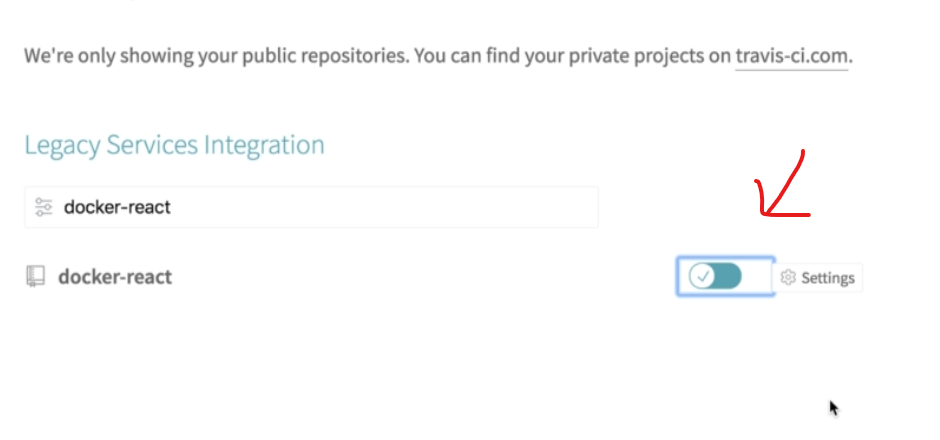
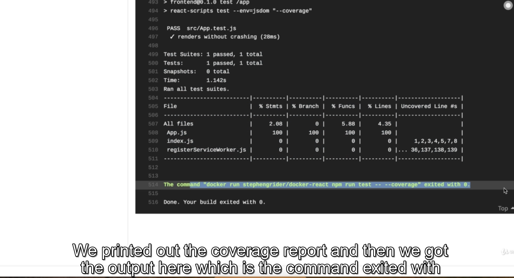
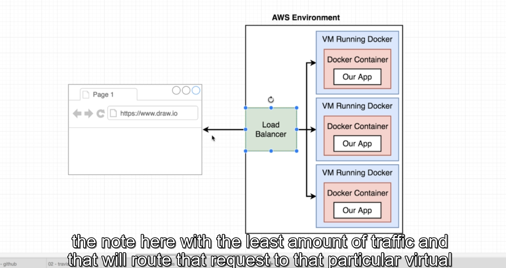
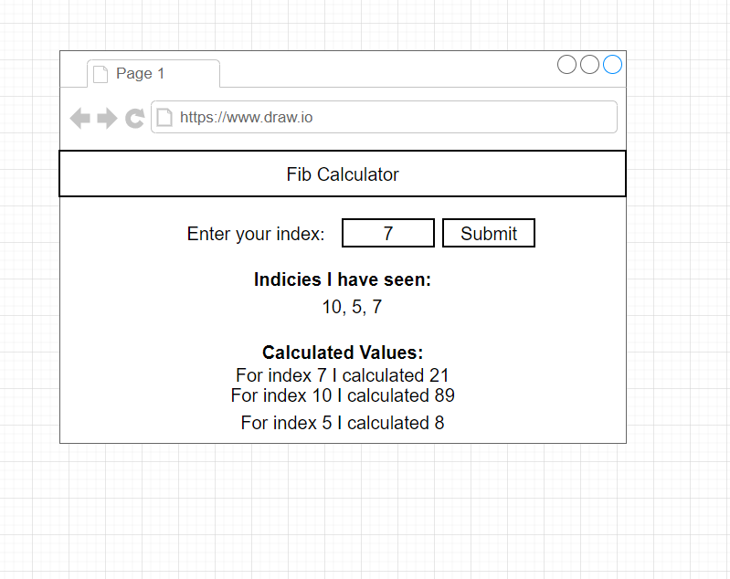
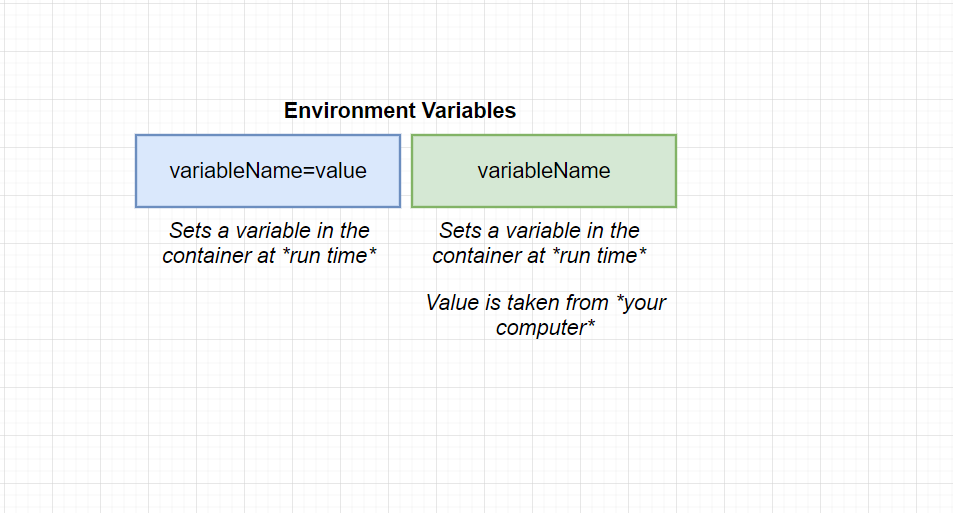
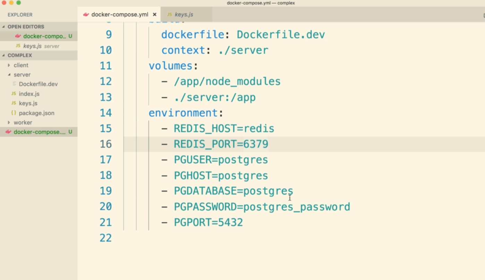
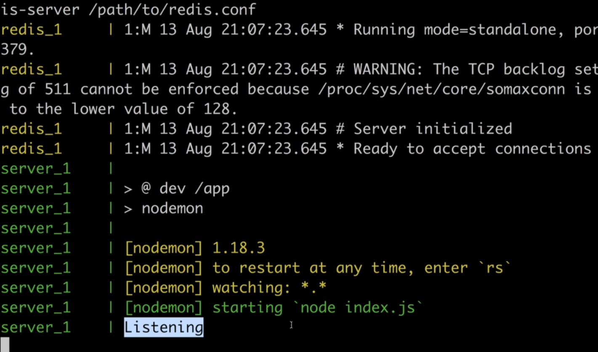

# Docker and Kubernetes: The Complete Guide

## 1. Dive Into Docker!

https://www.udemy.com/course/docker-and-kubernetes-the-complete-guide/

### 1. Why Use Docker

https://github.com/StephenGrider/DockerCasts


Docker makes it really easy to install and run software without worrying about setup or dependencies

https://github.com/Duy-Phuong/docker-docs/tree/master/Source/Udemy%20-%20Docker%20and%20Kubernetes%20The%20Complete%20Guide/git%20repo/DockerCasts/diagrams


### 2. What is Docker
### 3. Docker for MacWindows
### 4. Installing Docker on MacOS
### 5. Installing Docker for Windows Home users.html

If you are a Windows Home user, you will not be able install the Docker for Windows Desktop edition, as it requires Hyper-V virtualization. This is supported only by Windows Professional and Enterprise editions.

**Windows Home users will need to install Docker Toolbox** which uses VirtualBox instead.

Installer link is available here:

https://docs.docker.com/toolbox/overview/#ready-to-get-started

You may also need to enable virtualization in your computer's BIOS settings. This will be different for each manufacturer, please refer to their documentation on which keys to use to access these settings on reboot.

***Note\***

A major difference between the course lecture using Docker Desktop vs. Docker Toolbox is that you will not be able to use localhost anymore.

Instead, you will need to access your machine with the IP address **192.168.99.100**

### 6. Installing Docker for Windows - Professional and Enterprise Editions
### 7. More Windows Setup - Professional and Enterprise Editions
### 8. One Last Piece of Windows Setup - Professional and Enterprise Editions
### 9. Installing Docker on Linux.html

If you wish, Docker can also be installed on many different types of Linux distributions. This note covers how to install with Ubuntu, but the [Docker docs](https://docs.docker.com/install/) have instructions for CentOS, Debian and Fedora as well.


**Installation**

**Note\*: These steps were successfully completed with Ubuntu Desktop 18 LTS*

The docs for Ubuntu installation suggest setting up a Docker repository to install and update from.

This is where you should start:

https://docs.docker.com/install/linux/docker-ce/ubuntu/#set-up-the-repository

After completing the installation steps, test out Docker:

```
sudo docker run hello-world
```

This should download and run the test container printing *"hello world"* to your console.


**Installing Docker Compose**

Unlike the Mac and Windows Docker Desktop versions, we must manually install Docker Compose. See the instructions for the installation steps (Click on the tab for Linux)

https://docs.docker.com/compose/install/#install-compose

After completing, test your installation:

```
docker-compose -v
```

This should print the version and build numbers to your console.


**Run without Sudo**

Follow these instructions to run Docker commands without sudo:

https://docs.docker.com/install/linux/linux-postinstall/#manage-docker-as-a-non-root-user

The docker group will likely already be created, but you still need to add your user to this group.


**Start on Boot**

Follow these instructions so that Docker and its services start automatically on boot:

https://docs.docker.com/install/linux/linux-postinstall/#configure-docker-to-start-on-boot


*You may need to restart your system before starting the course material.*

### 10. Using the Docker Client


That starts up that docker client or the Dockers CLI.

Again the docker cli is in charge of taking commands from you kind of doing a little bit of processing

on them and then communicating the commands over to something called the Dockers server and it's that

Docker server that is really in charge of the heavy lifting.

When we ran the command docker run Hello world.

That meant that we wanted to start up a new container using the image with the name of hello world the

hello world image has a tiny little program inside of it whose sole purpose sole job is to print out

the message that you see right here.

The first thing that the Dockers server did was check to see if it already had a local copy like a copy

on your personal machine of the hello world image or hello world file.

So the docker server looked into something called the image cache.

Now because you and I just installed docker on our personal computers that image cache is currently

empty.

We have no images that have already been downloaded before.

So because the image cache was empty the Dockers server decided to reach out to a free service called

docker hub the Docker hub is a repository of free public images that you can freely download and run

on your personal computer so server or reach out to docker hub and said hey I'm looking for an image

called Hello world.

### 11. But Really...What's a Container


e.g: Chrome need python v2 but node js need python v3???

=> name spacing or control groups technical solve problems


=> name spacing: direct it to specific area on the hardware

These are all things that we can use **named spacing** for to essentially limit the resources we're kind
of redirect requests for resource from a particular process very closely related to this idea of some
name spacing is another feature called **control groups** a control group can be used to limit the amount
of resources that a particular process can use.
So name spacing is for saying hey this area of the harddrive is for this process a control group can
be used to limit the amount of memory that a process can use the amount of CPU the amount of hard drive
input input or the input output and the amount of network bandwidth as we

So these two features put together it can be used to really kind of isolate a single process and limit
the amount of resources it can talk to and the amount of bandwidth essentially that it can make use
of.

> 2 cách trên chỉ apply for linux, not macs and windows

### 12. How's Docker Running on Your Computer


## 2. Manipulating Containers with the Docker Client

### 1. Docker Run in Detail

Folder 2


### 2. Overriding Default Commands


>  command: is the first command executed in the image


```shell
Admin@LAPTOP-QO8E8EAL MINGW64 ~
$ docker run busybox echo hi
Unable to find image 'busybox:latest' locally
latest: Pulling from library/busybox
ea97eb0eb3ec: Pulling fs layer
ea97eb0eb3ec: Verifying Checksum
ea97eb0eb3ec: Download complete
ea97eb0eb3ec: Pull complete
Digest: sha256:bde48e1751173b709090c2539fdf12d6ba64e88ec7a4301591227ce925f3c678
Status: Downloaded newer image for busybox:latest
hi

Admin@LAPTOP-QO8E8EAL MINGW64 ~
$ docker run busybox ls
bin
dev
etc
home
proc
root
sys
tmp
usr
var

```


> ls and echo: is command inside busy box not hello-world

### 3. Listing Running Containers


Then we run `docker ps` => see container; if we stop, we cannot see any container here

```shell
# list all container
docker ps --all
```

https://docs.docker.com/compose/reference/ps/


```shell
Admin@LAPTOP-QO8E8EAL MINGW64 /d/git-docs/docker/Source/HANDS ON DOCKER for JAVA Developers (master)
$ docker ps -a
CONTAINER ID   IMAGE         COMMAND     CREATED          STATUS                      PORTS     NAMES
419d39c28a05   hello-world   "/hello"    2 minutes ago    Created                               sharp_noether
a05f6883e86b   busybox       "ls"        16 minutes ago   Exited (0) 16 minutes ago             fervent_lewin
15244a63f5c2   busybox       "echo hi"   16 minutes ago   Exited (0) 16 minutes ago             pensive_davinci

Admin@LAPTOP-QO8E8EAL MINGW64 /d/git-docs/docker/Source/HANDS ON DOCKER for JAVA Developers (master)
$ docker start -a 419d39c28a05

Hello from Docker!
This message shows that your installation appears to be working correctly.

To generate this message, Docker took the following steps:
 1. The Docker client contacted the Docker daemon.
 2. The Docker daemon pulled the "hello-world" image from the Docker Hub.
    (amd64)
 3. The Docker daemon created a new container from that image which runs the
    executable that produces the output you are currently reading.
 4. The Docker daemon streamed that output to the Docker client, which sent it
    to your terminal.

To try something more ambitious, you can run an Ubuntu container with:
 $ docker run -it ubuntu bash

Share images, automate workflows, and more with a free Docker ID:
 https://hub.docker.com/

For more examples and ideas, visit:
 https://docs.docker.com/get-started/

Admin@LAPTOP-QO8E8EAL MINGW64 /d/git-docs/docker/Source/HANDS ON DOCKER for JAVA Developers (master)
$ docker ps
CONTAINER ID   IMAGE     COMMAND   CREATED   STATUS    PORTS     NAMES

Admin@LAPTOP-QO8E8EAL MINGW64 /d/git-docs/docker/Source/HANDS ON DOCKER for JAVA Developers (master)
$ docker start -a 15244a63f5c2
hi

```


The second time run without `-a` flag, if we have `-a` docker will observe output from image and print it in my terminal


### 5. Restarting Stopped Containers


### 6. Removing Stopped Containers


```shell
Admin@LAPTOP-QO8E8EAL MINGW64 /d/git-docs/docker/Source/HANDS ON DOCKER for JAVA Developers (master)
$ docker ps -a
CONTAINER ID   IMAGE         COMMAND     CREATED          STATUS                      PORTS     NAMES
419d39c28a05   hello-world   "/hello"    2 minutes ago    Created                               sharp_noether
a05f6883e86b   busybox       "ls"        16 minutes ago   Exited (0) 16 minutes ago             fervent_lewin
15244a63f5c2   busybox       "echo hi"   16 minutes ago   Exited (0) 16 minutes ago             pensive_davinci


Admin@LAPTOP-QO8E8EAL MINGW64 /d/git-docs/docker/Source/HANDS ON DOCKER for JAVA Developers (master)
$ docker system prune
WARNING! This will remove:
  - all stopped containers
  - all networks not used by at least one container
  - all dangling images
  - all dangling build cache

Are you sure you want to continue? [y/N] y
Deleted Containers:
419d39c28a054eccf01669a1093e55cb145eb388d8583e22e615288a44b3ccb8
c2be1203bd4293081f04ce4c4d29b848a642e4d47d8b3ad6bbc0d3500215222c
15244a63f5c2c60066aec71ef857bb3ee02152fa8da1604262c1fdd21ae739ae

```


### 7. Retrieving Log Outputs


### 8. Stopping Containers


=> give the container a little time to shut down, wait about 10s


=> shut down immediately


### 9. Multi-Command Containers

Redis is in-memory app

After we install redis, run `redis-cli`, `redis-server`

```shell
docker run redis
# Then run redis-cli outside the container => err
```


=> Must install inside container

### 10. Executing Commands in Running Containers


### 11. The Purpose of the IT Flag


### 12. Getting a Command Prompt in a Container


=> we can access inside the context of the container

Run `redis-cli` and `d` or `ctrl D or exit	` as well

sh is a name of the program that run inside the container(command processor or shell)


### 13. Starting with a Shell


start a shell immediately after the first start up

### 14. Container Isolation

## 3. Building Custom Images Through Docker Server

### 1. Creating Docker Images


```shell
mkdir redis-image
cd redis-image
docker build .
# conatainer-id get from the last line of `docker build .`
docker run conatainer-id
```

DOCKERFILE

```dockerfile
# Use an existing docker image as a base
FROM alpine

# Download and install a dependency
RUN apk add --update redis

# Tell the image what to do when it starts
# as a container
CMD ["redis-server"]
```


### 2. Building a Dockerfile

### 3. Dockerfile Teardown


### 4. What's a Base Image

### 5. The Build Process in Detail

### 6. A Brief Recap

### 7. Rebuilds with Cache


If we had build it, it will be stored in the cache


### 8. Tagging an Image


### 9. Manual Image Generation with Docker Commit


Now we open the second terminal on windows


Create new image

> Don't encourage


## 4. Making Real Projects with Docker

### 1. Project Outline


### 2. Node Server Setup


### 3. Server Code.html

This lecture is for people who didn't want to write out the code in the last video. **If you already created the index.js file and package.json file, skip this section!**


Here's what you'll need to do:

1) Create a new file called `package.json` and copy paste the following into it:

```js
{
  "dependencies": {
    "express": "*"
  },
  "scripts": {
    "start": "node index.js"
  }
}
```

2) Create a new file called `index.js` and copy paste the following into it:

```js
const express = require('express');

const app = express();

app.get('/', (req, res) => {
  res.send('How are you doing');
});

app.listen(8080, () => {
  console.log('Listening on port 8080');
});
```

### 4. A Few Planned Errors

https://hub.docker.com/_/node

Dockerfile

```dockerfile
# Specify a base image
FROM node:alpine

WORKDIR /usr/app

# Install some depenendencies
COPY ./package.json ./
RUN npm install
COPY ./ ./

# Default command
CMD ["npm", "start"]
```


### 5. Base Image Issues

### 6. A Few Missing Files

### 7. Copying Build Files

### 8. Container Port Mapping


### 9. Specifying a Working Directory


### 10. Unnecessary Rebuilds

### 11. Minimizing Cache Busting and Rebuilds

```dockerfile
# Install some depenendencies
COPY ./package.json ./
RUN npm install
COPY ./ ./
```

When we run again to see change in file index(adjust constantly), we don't have to rebuild by the way that we copy `package.json` to current working directory

Adjust content in `index.js` file => run build command =>Adjust content in `index.js` file => run build command => it use cache and run faster

```js
app.get('/', (req, res) => {
  res.send('How are you doing'); // change content in this line to see the effect on the website
});
```


## 5. Docker Compose with Multiple Local Containers

### 1. App Overview


=> There is no need to create multiple instance with redis, scale up and the result like below:


### 2. App Server Code

D:\git-docs\docker\Source\Udemy - Docker and Kubernetes The Complete Guide\git repo\DockerCasts\complex\server

package.json

```json
{
  "dependencies": {
    "express": "*",
    "redis": "2.8.0"
  },
  "scripts": {
    "start": "node index.js"
  }
}
```

index.js

```js
const express = require('express');
const redis = require('redis');

const app = express();
const client = redis.createClient();
client.set('visits', 0);

app.get('/', (req, res) => {
  client.get('visits', (err, visits) => {
    res.send('Number of visits is ' + visits);
    client.set('visits', parseInt(visits) + 1);
  });
});

app.listen(8081, () => {
  console.log('Listening on port 8081');
});

```


### 3. Completed Node Code.html

D:\git-docs\docker\Source\Udemy - Docker and Kubernetes The Complete Guide\5. Docker Compose with Multiple Local Containers

### 4. Assembling a Dockerfile

Dockerfile

```dockerfile
FROM node:alpine
WORKDIR "/app"
COPY ./package.json ./
RUN npm install
COPY . .
CMD ["npm", "start"]
```

Run

```shell
docker build .
# get container id and user
# or 

docker build -t test:latest . 
docker run test
```

You can see some error


app attempt to to start but there's no register server running for it to connect


Run to pull down redis => start on local machine

Open the second terminal run 

```shell
docker run test
```

Then we also see an error again


Even though you run a redis server inside a separate container

What's the problem?


### 5. Introducing Docker Compose


### 6. Docker Compose Files


### 7. Networking with Docker Compose


`docker build .`: find and build form this image

```js
// add
// const client = redis.createClient();
const client = redis.createClient({
  host: 'redis-server',     // get host name from docker-compose file
  port: 6379 // default port in redis
});
```

You ony need to run this command: `docker-compose up`

### A Docker/docker-compose setup with Redis and Node/Express

https://codewithhugo.com/setting-up-express-and-redis-with-docker-compose/

Docker-compose

```ini
version: '3'
services:
  redis-server:
    image: 'redis'
    expose: 
      - 6379
  node_app:
    build: .
    ports: 
      - "4001:8081"

```

```shell
Admin@LAPTOP-QO8E8EAL MINGW64 /d/git-docs/docker/Source/Udemy - Docker and Kubernetes The Complete Guide/5. Docker Compose with Multiple Local Containers/3.1 visits.zip/visits (master)
$ docker-compose up                                                                                                     Creating network "visits_default" with the default driver
Building node_app
Step 1/6 : FROM node:alpine
alpine: Pulling from library/node
0a6724ff3fcd: Pull complete                                                                                             8817a809f361: Pull complete                                                                                             7ded8c6c28da: Pull complete                                                                                             9639362e749c: Pull complete                                                                                             Digest: sha256:deac0ca3214e4fde93179b5444ec20d46c06fba58cc2c08dd10d98fbd60cb6d5
Status: Downloaded newer image for node:alpine
 ---> 46437a676663
Step 2/6 : WORKDIR "/app"
 ---> Running in a7263a6d9097
Removing intermediate container a7263a6d9097
 ---> c0afa729644b
Step 3/6 : COPY ./package.json ./
 ---> e8cfb29fa58a
Step 4/6 : RUN npm install
 ---> Running in 9ed52155d9be

added 54 packages, and audited 54 packages in 2s

found 0 vulnerabilities
npm notice
npm notice New minor version of npm available! 7.0.15 -> 7.3.0
npm notice Changelog: <https://github.com/npm/cli/releases/tag/v7.3.0>
npm notice Run `npm install -g npm@7.3.0` to update!
npm notice
Removing intermediate container 9ed52155d9be
 ---> 6d5ae3b8be7f
Step 5/6 : COPY . .
 ---> 6e3844629f8b
Step 6/6 : CMD ["npm", "start"]
 ---> Running in 6c979adc5102
Removing intermediate container 6c979adc5102
 ---> 533de53e64d4

Successfully built 533de53e64d4
Successfully tagged visits_node_app:latest
WARNING: Image for service node_app was built because it did not already exist. To rebuild this image you must use `docker-compose build` or `docker-compose up --build`.
Creating visits_node_app_1     ... done                                                                                 Creating visits_redis_server_1 ... done                                                                                 Attaching to visits_node_app_1, visits_redis_server_1
redis_server_1  | 1:C 23 Dec 2020 18:14:12.681 # oO0OoO0OoO0Oo Redis is starting oO0OoO0OoO0Oo
redis_server_1  | 1:C 23 Dec 2020 18:14:12.681 # Redis version=6.0.9, bits=64, commit=00000000, modified=0, pid=1, just started
redis_server_1  | 1:C 23 Dec 2020 18:14:12.681 # Warning: no config file specified, using the default config. In order to specify a config file use redis-server /path/to/redis.conf
redis_server_1  | 1:M 23 Dec 2020 18:14:12.684 * Running mode=standalone, port=6379.
redis_server_1  | 1:M 23 Dec 2020 18:14:12.684 # WARNING: The TCP backlog setting of 511 cannot be enforced because /proc/sys/net/core/somaxconn is set to the lower value of 128.
redis_server_1  | 1:M 23 Dec 2020 18:14:12.684 # Server initialized
redis_server_1  | 1:M 23 Dec 2020 18:14:12.684 # WARNING overcommit_memory is set to 0! Background save may fail under low memory condition. To fix this issue add 'vm.overcommit_memory = 1' to /etc/sysctl.conf and then reboot or run the command 'sysctl vm.overcommit_memory=1' for this to take effect.
redis_server_1  | 1:M 23 Dec 2020 18:14:12.684 # WARNING you have Transparent Huge Pages (THP) support enabled in your kernel. This will create latency and memory usage issues with Redis. To fix this issue run the command 'echo madvise > /sys/kernel/mm/transparent_hugepage/enabled' as root, and add it to your /etc/rc.local in order to retain the setting after a reboot. Redis must be restarted after THP is disabled (set to 'madvise' or 'never').
redis_server_1  | 1:M 23 Dec 2020 18:14:12.685 * Ready to accept connections
node_app_1      |
node_app_1      | > start
node_app_1      | > node index.js
node_app_1      |
node_app_1      | Listening on port 8081
node_app_1      | node:events:353
node_app_1      |       throw er; // Unhandled 'error' event
node_app_1      |       ^
node_app_1      |
node_app_1      | Error: getaddrinfo ENOTFOUND redis-server
node_app_1      |     at GetAddrInfoReqWrap.onlookup [as oncomplete] (node:dns:67:26)
node_app_1      | Emitted 'error' event on RedisClient instance at:
node_app_1      |     at RedisClient.on_error (/app/node_modules/redis/index.js:406:14)
node_app_1      |     at Socket.<anonymous> (/app/node_modules/redis/index.js:279:14)
node_app_1      |     at Socket.emit (node:events:376:20)
node_app_1      |     at emitErrorNT (node:internal/streams/destroy:188:8)
node_app_1      |     at emitErrorCloseNT (node:internal/streams/destroy:153:3)
node_app_1      |     at processTicksAndRejections (node:internal/process/task_queues:80:21) {
node_app_1      |   errno: -3008,
node_app_1      |   code: 'ENOTFOUND',
node_app_1      |   syscall: 'getaddrinfo',
node_app_1      |   hostname: 'redis-server'
node_app_1      | }
node_app_1      | npm ERR! code 1
node_app_1      | npm ERR! path /app
node_app_1      | npm ERR! command failed
node_app_1      | npm ERR! command sh -c node index.js
node_app_1      |
node_app_1      | npm ERR! A complete log of this run can be found in:
node_app_1      | npm ERR!     /root/.npm/_logs/2020-12-23T18_14_14_021Z-debug.log
visits_node_app_1 exited with code 1
```

=> Create **visits_default** network

Now I want to take a look at the very first line right here.
The very first line says creating network visits underscore default.
It's like I said before when you just create a new set of containers or services with Docker compose
**it's going to automatically make a network for you that's going to join those different containers together.**
After that we can see that it is creating an image for our node application.

> If we have an error when connecting => change docker file => run `docker-compose up --build` to fix

```shell
Admin@LAPTOP-QO8E8EAL MINGW64 /d/git-docs/docker/Source/Udemy - Docker and Kubernetes The Complete Guide/git repo/DockerCasts/visits-5 (master)
$ docker-compose up --build
WARNING: Found orphan containers (visits-5_redis_server_1) for this project. If you removed or renamed this service in your compose file, you can run this command with the --remove-orphans flag to clean it 
up.
Building node_app
Step 1/6 : FROM node:alpine
 ---> 46437a676663
Step 2/6 : WORKDIR "/app"
 ---> Using cache
 ---> c0afa729644b
Step 3/6 : COPY ./package.json ./
 ---> Using cache
 ---> e8cfb29fa58a
Step 4/6 : RUN npm install
 ---> Using cache
 ---> 6d5ae3b8be7f
Step 5/6 : COPY . .
 ---> 659a8bb21bce
Step 6/6 : CMD ["npm", "start"]
 ---> Running in 20671cdded28
Removing intermediate container 20671cdded28
 ---> e5eccdb95278

Successfully built e5eccdb95278
Successfully tagged visits-5_node_app:latest
Starting visits-5_redis-server_1 ... done
Recreating visits-5_node_app_1   ... done
Attaching to visits-5_redis-server_1, visits-5_node_app_1
redis-server_1  | 1:C 23 Dec 2020 18:33:48.327 # oO0OoO0OoO0Oo Redis is starting oO0OoO0OoO0Oo
redis-server_1  | 1:C 23 Dec 2020 18:33:48.327 # Redis version=6.0.9, bits=64, commit=00000000, modified=0, pid=1, just started
redis-server_1  | 1:C 23 Dec 2020 18:33:48.327 # Warning: no config file specified, using the default config. In order to specify a config file use redis-server /path/to/redis.conf
redis-server_1  | 1:M 23 Dec 2020 18:33:48.328 * Running mode=standalone, port=6379.
redis-server_1  | 1:M 23 Dec 2020 18:33:48.328 # WARNING: The TCP backlog setting of 511 cannot be enforced because /proc/sys/net/core/somaxconn is set to the lower value of 128.
redis-server_1  | 1:M 23 Dec 2020 18:33:48.328 # Server initialized
redis-server_1  | 1:M 23 Dec 2020 18:33:48.328 # WARNING overcommit_memory is set to 0! Background save may fail under low memory condition. To fix this issue add 'vm.overcommit_memory = 1' to /etc/sysctl.conf and then reboot or run the command 'sysctl vm.overcommit_memory=1' for this to take effect.
redis-server_1  | 1:M 23 Dec 2020 18:33:48.329 # WARNING you have Transparent Huge Pages (THP) support enabled in your kernel. This will create latency and memory usage issues with Redis. To fix this issue 
run the command 'echo madvise > /sys/kernel/mm/transparent_hugepage/enabled' as root, and add it to your /etc/rc.local in order to retain the setting after a reboot. Redis must be restarted after THP is disabled (set to 'madvise' or 'never').
redis-server_1  | 1:M 23 Dec 2020 18:33:48.329 * Ready to accept connections
node_app_1      | 
node_app_1      | > start
node_app_1      | > node index.js
node_app_1      |
node_app_1      | Listening on port 8081
Gracefully stopping... (press Ctrl+C again to force)
Stopping visits-5_node_app_1     ... 
Stopping visits-5_redis-server_1 ... 
```


### 8. Docker Compose Commands


### 9. Stopping Docker Compose Containers

Create an image run in the background: redis


### 10. Container Maintenance with Compose

Add line 13


Crash in node app


### 11. Automatic Container Restarts

Adjust in docker-compose file


Add line 6


Another case: Replace on-failure on line 6

run `docker-compose up`


You need to change status != 0 => see restart


In this case, I use 100 number to replace 0 by 100

If you don't see node app is restarted => Run `docker-compose up --build` to rebuild 


### 12. Container Status with Docker Compose


## 6. Creating a Production-Grade Workflow

### 1. Development Workflow

Process of dev


### 2. Flow specifics


Travis CI will deploy your application to AWS


### 3. Docker's Purpose


=> you have to install node js


### 4. Project Generation


### 5. More on Project Generation

```shell
npm install -g create-react-app
create-react-app frontend

```

command with react app


```shell
npm run build
npm run test

```


create one file for production in `build/` folder


open application in the browser


### 6. Necessary Commands

### 7. Creating the Dev Dockerfile

Create 2 Dockerfile


Build


> You have to add `-f` flag to specify the name of the docker file


You can see some warning => ok


### 8. Duplicating Dependencies

You will remove the node modules in the working directory since we have install it in the docker file => run again


### 9. Starting the Container

run `docker build -f Dockerfile.dev .`


Navigate to localhost:3000 => err

So we must mount the port from the container to your machine => run command again


### 10. Quick Note for Windows Users.html

If you are running on **Windows, please read this:** Create-React-App has some issues detecting when files get changed on Windows based machines. To fix this, please do the following:

1. In the root project directory, create a file called `.env`
2. Add the following text to the file and save it: `CHOKIDAR_USEPOLLING=true`
3. That's all!

For more on why this is required, you can check out: https://facebook.github.io/create-react-app/docs/troubleshooting#npm-start-doesn-t-detect-changes

### 11. Docker Volumes


```shell
docker build -f Dockerfile.dev .

```


You can see some errors


### 12. Bookmarking Volumes

When we set up a mapping current dir to `/app` folder => we don't have `/node_modules` folder => override since it is empty

 

=> automatically change if we change code in the app


### 13. Shorthand with Docker Compose

docker-compose.yml

```ini
version: '3'
services:
  web:
    build:
      context: .
      dockerfile: Dockerfile.dev
    ports: 
      - "3000:3000"
    volumes:
      - /app/node_modules
      - .:/app

```


### 14. Overriding Dockerfile Selection


default: `build: .` but now we add `dockerfile: Dockerfile.dev` to docker-compose file to specify the file when we run `docker-compose up`


### 15. Do We Need Copy

Dockerfile.dev

```ini
FROM node:alpine

WORKDIR '/app'

COPY package.json .
RUN npm install

COPY . .

CMD ["npm", "run", "start"]
```

`COPY . .` you can keep it since in the future you can don't want to use the docker-compose anymore


### 16. Executing Tests

```shell
docker build -f Dockerfile.dev .
# copy image id in the last line

```


> Now once you try hitting enter right now if you do so you'll notice that **the tests appear to not run**.
>
> When we run docker run by default we get a connection to standard out inside the container.
>
> But for us to actually trigger where we get any input into the container itself we have to hook up to
>
> standard in as well.
>
> We can do so by adding on the `-it` options to see docker run.

Then run


=> full screen


### 17. Live Updating Tests

Change in App.test.js

```js
import React from 'react';
import ReactDOM from 'react-dom';
import App from './App';

it('renders without crashing', () => {
  const div = document.createElement('div');
  ReactDOM.render(<App />, div);
  ReactDOM.unmountComponentAtNode(div);
});

// add new
it('renders without crashing', () => {
  const div = document.createElement('div');
  ReactDOM.render(<App />, div);
  ReactDOM.unmountComponentAtNode(div);
});

```

=> the test will not be updated

**Solution**: Using docker compose with volume

> Docker-compose currently only have one service is web

```ini
version: '3'
services:
  web:
    build:
      context: .
      dockerfile: Dockerfile.dev
    ports: 
      - "3000:3000"
    volumes:
      - /app/node_modules
      - .:/app
```


Run


Reuse


If we remove the last one to test it will be updated


### 18. Docker Compose for Running Tests

```ini
version: '3'
services:
  web:
    build:
      context: .
      dockerfile: Dockerfile.dev
    ports: 
      - "3000:3000"
    volumes:
      - /app/node_modules
      - .:/app
  tests:
    build:
      context: .
      dockerfile: Dockerfile.dev
    volumes:
      - /app/node_modules
      - .:/app
    command: ["npm", "run", "test"]

```

=> add new service: test

Update content for docker compose file


If we remove or add the last one, the test it will be updated


### 19. Shortcomings on Testing


It's very hard to set up input from command in the terminal to docker

Now we try to attach to stdin of container:


Input q, t, ... => not work 


I want to open up a second or now a third terminal window inside of here.
We're going to start up a shell instance inside that run a container and we're going to explore some
of the different running processes.
So I'm going to again do `docker ps` again.
So remember what this does this is going to run a new command inside the container with this ID with
`-it` right here.
We are starting up a connection to standard in on this new command that we are going to run.
And then `sh` over here on the very end is going to start up essentially a new shell or a kind of a
command prompt inside the terminal shell is very similar to bash or Z shell if you use that.
It's essentially just allowing us to enter some commands directly into the container.
So I get to run that you see that we get our command prompt right here and then we're going to run P.S.
which is going to print out all the running processes that we have going on inside the container.
So this is the reason why `docker attach` did not quite work the way we expected.


Notice how we have a PID right here.
`1` for the command `npm`. => line 1
We've then got a separate process running for `react-script starts` and yet another id for some other
scripts `start.js` thing right here.
All right.
So why is the text that we're entering into the attached window over here not showing up.
It all comes down to the different processes that have been created inside the container.
You see when we run `npm run test` we're not actually running directly `npm run test`.
In reality what is running is the process NPM and then NPM looks at the additional arguments we are
providing specifically `run test` and it uses those additional arguments to decide what to do.
So it's going to eventually start up a second process that is actually running our tests and that is
one of these two right here.
I'll be honest I don't actually know which one it is.
It's essentially just one of the two.
And so we might imagine that hey let's just say it's this one right here.
That's a process that is running our test suite so we can kind of imagine that there is a second process
in here called Start.
And this is the process that is actually executing our test suite and receiving commands over standard
in to understand when to filter down the test suite or rerun them or whatever it might be.
The problem is that when we when we run dock or attach we always attach to standard in the primary process
of the container or the process with the process id of one.
And so that's always going to be the direct NPM command.
But it's not the NPM command that is in charge of receiving those key presses and interpreting all those
kind of different options we have of the P T and q an end to right here.
It's the secondary process that was started by NPM.

> And so ideally to be able to interact with that test suite we would want to attach to that other command
> or that other running process.
> Then of course the with docker attached that is just not an option any time we'd run docker or attached. 

=> 2 way: docker compose or run exec


### 20. Need for Nginx


### 21. Multi-Step Docker Builds


D:\git-docs\docker\Source\Udemy-Docker ....\git repo\DockerCasts\frontend\Dockerfile


Dockerfile

```ini
FROM node:alpine as builder
WORKDIR '/app'
COPY package*.json ./
RUN npm install
COPY . .
RUN npm run build

FROM nginx
EXPOSE 80
# See in https://hub.docker.com/_/nginx
COPY --from=builder /app/build /usr/share/nginx/html
```

https://hub.docker.com/_/nginx

> Check copy folder in above link
>
> So this is saying I want to copy over something from that other phase that we just we're working on
> in this case we want to copy something over from the builder phase.
>
> Copy app/build to nginx folder

### 22. Implementing Multi-Step Builds

### 23. Running Nginx

Run


## 7. Continuous Integration and Deployment with AWS

### 1. Services Overview


### 2. Github Setup


### 3. Travis CI Setup


Create an account on travis-ci, turn on dashboard on the setting

https://travis-ci.org/


Sign in and authorize travis ci

Create app name `docker`

click on logo/ Profile


Filter and find your repo => enable button setting for this repo




### 4. Travis YML File Configuration

Create a .yml file to teach travis ci how to do


D:\git-docs\docker\Source\Udemy - Docker and Kubernetes The Complete Guide\git repo\DockerCasts\frontend

.travis.yml

```ini
sudo: required
services:
  - docker

before_install:
  - docker build -t stephengrider/docker-react -f Dockerfile.dev .

# show the metrics
script:
  - docker run stephengrider/docker-react npm run test -- --coverage


```


### 5. A Touch More Travis Setup

RUN `docker run <container-id> npm run test -- --coverage`

để xem result được displayed


### 6. Automatic Build Creation


  




### 7. AWS Elastic Beanstalk


> Easiest way to get started with production docker instance, run single container
>
> Now to be clear elastic beanstalk is most appropriate when you're running exactly one container at a
>
> time.
>
> We can start up multiple copies of the same container but at the end of the day.
>
> Easiest way to run one single container.

Click create new app


Only change platform to docker and click **create environment**

  


### 8. More on Elastic Beanstalk


Open this link to see


The benefit to elastic beanstalk is that it monitors the amount of traffic that's come in to our virtual

machine right here.

And as soon as that traffic reaches a certain threshold elastic beanstalk is going to automatically

add in additional virtual machines to handle that traffic.

So as soon as they request comes in it's going to go to the load balancer load balancers going to find

the note here with the least amount of traffic and that will route that request to that particular virtual

machine.

Our application running inside of the dock or container will then respond to that request and the user

will eventually get the file that they are looking for.

So that's pretty much it.

The benefit to plastic beanstalk is that it's going to automatically scale everything up for us.

All right so now we've got a better idea of how elastic things stock is doing things for us.





### 9. Travis Config for Deployment

.yml

```ini
sudo: required
services:
  - docker

before_install:
  - docker build -t stephengrider/docker-react -f Dockerfile.dev .

script:
  - docker run stephengrider/docker-react npm run test -- --coverage

deploy:
  provider: elasticbeanstalk
  region: "us-west-2"
  app: "docker"
  env: "Docker-env"
  bucket_name: "elasticbeanstalk-us-west-2-306476627547"
  bucket_path: "docker"
  on:
    branch: master
  access_key_id: $AWS_ACCESS_KEY
  secret_access_key:
    secure: "$AWS_SECRET_KEY"


```


Copy url, Docker-env is env


Go back service


Looking for us-west-2


bucket path by default is equal to the app name


### 10. Automated Deployments


Search IAM in the service(use to manage API keys)


AIM is the service that is used to manage API keys


Go to tab User => click add user


click next


Search beanstack


Then we click create user


> Click on show chỉ show 1 lần


Scroll down


Save key to travis ci


Check result


### 11. Exposing Ports Through the Dockerfile


See spinner

>NOTE
>
>So the reason that I'm showing you this kind of spinner right here before the deploy actually finishes
>
>up is that when this finishes there's actually going to be a little bit of an issue.
>
>We're going to see that after deploy completes successfully if we tried navigating to URL in the title => page it's
>
>just not going to load up.

If you recall every time that we've ran a Web server inside of a docker container we've had to do something

like `docker run -p 3000:3000 sfdfd`

And then we did that port mapping and then specified the container or whatever it might have been.

So the port mapping right there is done because by default no can port inside of the container gets

exposed to the outside world.

=> We have to very directly set up that port mapping ourselves.


add line 9

And actually in most environments the expose instruction is really supposed to be communication to you

and I as developers this is really something for you and I to read inside of a docker file and understand

oh this container probably needs to get a port mapped to port 80.

> Now AWS elastic beanstalk is just a little bit different elastic beanstalk when it starts up your docker
>
> container.
>
> It's going to look at this Dockerfile and it's going to look for the Expose instruction and then whatever
>
> port you list in there is what elastic beanstalk is going to map directly **automatically**.


Result something like that


### 12. Build Still Failing.html

If you still see a failed deployment, try the following two steps:

**Fix One:**

The `npm install` command frequently times out on the t2.micro instance that we are using. An easy fix is to bump up the instance type that Elastic Beanstalk is using to a t2.small.

Note that a t2.small is outside of the free tier, so you will pay a tiny bit of money (likely less than one dollar if you leave it running for a few hours) for this instance. Don't forget to close it down! Directions for this are a few videos ahead in the lecture titled 'Environment Cleanup'.


**Fix Two:**

Try editing the 'COPY' line of your Dockerfile like so:

```
COPY package*.json ./
```

Sometimes AWS has a tough time with the '.' folder designation and prefers the long form `./`

### 13. Workflow With Github

Click on the URL and see app work


[GitHub - StephenGrider/docker-react](https://github.com/StephenGrider/docker-react)

create feature branch and pull request


### 14. Redeploy on Pull Request Merge


Merge PR if all check is ok


### 15. Deployment Wrapup

### 16. Environment Cleanup.html

Remember, we need to delete the resources we created or you might end up paying real money for them. To clean up the Elastic Beanstalk instance we created, do the following:

***1) Go to the Elastic Beanstalk dashboard, where you should see a page that looks like this:\***


***2) On the top right hand side click the 'Actions' button\***


3) ***Click on 'Delete Application' then confirm the delete\***


>  **Note**: it might take a few minutes for the dashboard to update and show that your app is being deleted. Be a little patient!

## 8. Building a Multi-Container Application

### 1. Single Container Deployment Issues


Problems


### 2. Application Overview


Fibonacy sequence



Mock

### 3. A Quick Note.html

In the next few videos we're going to write a lot of Javascript code. You might not be interested in writing Javascript - ***if you don't want to put the app together from scratch then skip to Section #9\***. Over there you'll find the completed code ready to download, so you can focus just on the Docker stuff and not worry about any Javascript!


### 4. Application Architecture


### 5. Worker Process Setup


### 6. Express API Setup

D:\git-docs\docker\Source\Udemy - Docker and Kubernetes The Complete Guide\git repo\DockerCasts\complex


package.json

```json
{
  "dependencies": {
    "nodemon": "1.18.3",
    "redis": "2.8.0"
  },
  "scripts": {
    "start": "node index.js",
    "dev": "nodemon"
  }
}
```

worker/ index.js

```js
const keys = require('./keys');
const redis = require('redis');

const redisClient = redis.createClient({
  host: keys.redisHost,
  port: keys.redisPort,
  retry_strategy: () => 1000
});
const sub = redisClient.duplicate();

function fib(index) {
  if (index < 2) return 1;
  return fib(index - 1) + fib(index - 2);
}

sub.on('message', (channel, message) => {
  redisClient.hset('values', message, fib(parseInt(message)));
});
sub.subscribe('insert');

// listen and calculate => insert into a hash of values

```

worker/keys.js

```js
module.exports = {
  redisHost: process.env.REDIS_HOST,
  redisPort: process.env.REDIS_PORT
};

```


=> mean ok


### 7. Connecting to Postgres

server/keys.js

```js
module.exports = {
  redisHost: process.env.REDIS_HOST,
  redisPort: process.env.REDIS_PORT,
  pgUser: process.env.PGUSER,
  pgHost: process.env.PGHOST,
  pgDatabase: process.env.PGDATABASE,
  pgPassword: process.env.PGPASSWORD,
  pgPort: process.env.PGPORT
};

```

index.js

```js
const keys = require('./keys');

// Express App Setup
const express = require('express');
const bodyParser = require('body-parser');
const cors = require('cors');

const app = express();
app.use(cors());
app.use(bodyParser.json());

// Postgres Client Setup
const { Pool } = require('pg');
const pgClient = new Pool({
  user: keys.pgUser,
  host: keys.pgHost,
  database: keys.pgDatabase,
  password: keys.pgPassword,
  port: keys.pgPort
});
pgClient.on('error', () => console.log('Lost PG connection'));

pgClient
  .query('CREATE TABLE IF NOT EXISTS values (number INT)')
  .catch(err => console.log(err));

// Redis Client Setup
const redis = require('redis');
const redisClient = redis.createClient({
  host: keys.redisHost,
  port: keys.redisPort,
  retry_strategy: () => 1000
});
const redisPublisher = redisClient.duplicate(); // => pub or sub

// Express route handlers

app.get('/', (req, res) => {
  res.send('Hi');
});

app.get('/values/all', async (req, res) => {
  // const values = await pgClient.query('SELECT * from values');
  // res.send(values.rows);
  res.send([1, 2, 3]);
});

app.get('/values/current', async (req, res) => {
  redisClient.hgetall('values', (err, values) => {
    res.send(values);
  });
});

app.post('/values', async (req, res) => {
  const index = req.body.index;

  if (parseInt(index) > 40) {
    return res.status(422).send('Index too high');
  }

  redisClient.hset('values', index, 'Nothing yet!');
  redisPublisher.publish('insert', index);
  pgClient.query('INSERT INTO values(number) VALUES($1)', [index]);

  res.send({ working: true });
});

app.listen(5000, err => {
  console.log('Listening');
});

```


### 8. More Express API Setup

### 9. Generating the React App

Fib.js

```js
import React, { Component } from 'react';
import axios from 'axios';

class Fib extends Component {
  state = {
    seenIndexes: [],
    values: {},
    index: ''
  };

  componentDidMount() {
    this.fetchValues();
    this.fetchIndexes();
  }

  async fetchValues() {
    const values = await axios.get('/api/values/current');
    this.setState({ values: values.data });
  }

  async fetchIndexes() {
    const seenIndexes = await axios.get('/api/values/all');
    this.setState({
      seenIndexes: seenIndexes.data
    });
  }

  handleSubmit = async event => {
    event.preventDefault();

    await axios.post('/api/values', {
      index: this.state.index
    });
    this.setState({ index: '' });
  };

  renderSeenIndexes() {
    return this.state.seenIndexes.map(({ number }) => number).join(', ');
  }

  renderValues() {
    const entries = [];

    for (let key in this.state.values) {
      entries.push(
        <div key={key}>
          For index {key} I calculated {this.state.values[key]}
        </div>
      );
    }

    return entries;
  }

  render() {
    return (
      <div>
        <form onSubmit={this.handleSubmit}>
          <label>Enter your index:</label>
          <input
            value={this.state.index}
            onChange={event => this.setState({ index: event.target.value })}
          />
          <button>Submit</button>
        </form>

        <h3>Indexes I have seen:</h3>
        {this.renderSeenIndexes()}

        <h3>Calculated Values:</h3>
        {this.renderValues()}
      </div>
    );
  }
}

export default Fib;

```


### 10. Fetching Data in the React App

### 11. Rendering Logic in the App

### 12. Exporting the Fib Class

### 13. Routing in the React App

App.js

```js
import React, { Component } from 'react';
import logo from './logo.svg';
import './App.css';
import { BrowserRouter as Router, Route, Link } from 'react-router-dom';
import OtherPage from './OtherPage';
import Fib from './Fib';

class App extends Component {
  render() {
    return (
      <Router>
        <div className="App">
          <header className="App-header">
            
            <h1 className="App-title">Fib Calculator UPDATED!</h1>
            <Link to="/">Home</Link>
            <Link to="/otherpage">Other Page</Link>
          </header>
          <div>
            <Route exact path="/" component={Fib} />
            <Route path="/otherpage" component={OtherPage} />
          </div>
        </div>
      </Router>
    );
  }
}

export default App;

```


## 9. Dockerizing Multiple Services

### 1. Checkpoint Files.html

***If you skipped over putting the app together from scratch\***, download the attached Checkpoint.zip file. You'll need it in the next section to get all caught up.

C:\Users\Admin\Downloads\[FreeCourseSite.com] Udemy - Docker and Kubernetes The Complete Guide\9. Dockerizing Multiple Services


### 2. Checkpoint Catchup


### 3. Dockerizing a React App - Again!


complex-elastic-beanstalk

client/Dockerfile.dev

```ini
FROM node:alpine
WORKDIR '/app'
COPY ./package.json ./
RUN npm install
COPY . .
CMD ["npm", "run", "start"]
```

Run 


If we have some warning, it is ok


Run container 

### 4. Dockerizing Generic Node Apps

server/Dockerfile.dev

```ini
FROM node:alpine
WORKDIR "/app"
COPY ./package.json ./
RUN npm install
COPY . .
CMD ["npm", "run", "dev"]
```

package.json

```json
{
  "dependencies": {
    "express": "4.16.3",
    "pg": "7.4.3",
    "redis": "2.8.0",
    "cors": "2.8.4",
    "nodemon": "1.18.3",
    "body-parser": "*"
  },
  "scripts": {
    "dev": "nodemon",
    "start": "node index.js"
  }
}

```

nodemon make app auto restart if we have any change

worker/Dockerfile.dev

```ini
FROM node:alpine
WORKDIR "/app"
COPY ./package.json ./
RUN npm install
COPY . .
CMD ["npm", "run", "dev"]
```


Copy image id after build and run


=> result like that is ok then CTRL C

Do similarly with worker


### 5. Adding Postgres as a Service


Run command


https://hub.docker.com/_/postgres


You will see


=> mean ok


**Summary**

# How to use this image

## start a postgres instance

```
$ docker run --name some-postgres -e POSTGRES_PASSWORD=mysecretpassword -d postgres
```

The default `postgres` user and database are created in the entrypoint with `initdb`.

> The postgres database is a default database meant for use by users, utilities and third party applications.
>
> [postgresql.org/docs](http://www.postgresql.org/docs/9.5/interactive/app-initdb.html)

## ... or via `psql`

```
$ docker run -it --rm --network some-network postgres psql -h some-postgres -U postgres
psql (9.5.0)
Type "help" for help.

postgres=# SELECT 1;
 ?column? 
----------
        1
(1 row)
```

## ... via [`docker stack deploy`](https://docs.docker.com/engine/reference/commandline/stack_deploy/) or [`docker-compose`](https://github.com/docker/compose)

Example `stack.yml` for `postgres`:

```
# Use postgres/example user/password credentials
version: '3.1'

services:

  db:
    image: postgres
    restart: always
    environment:
      POSTGRES_PASSWORD: example

  adminer:
    image: adminer
    restart: always
    ports:
      - 8080:8080
```


### 6. Docker-compose Config


### 7. Environment Variables with Docker Compose



When we set up env in docker-compose file => apply at runtime

https://hub.docker.com/_/redis


port 6379 default 

Add new env




```ini
version: '3'
services:
  postgres:
    image: 'postgres:latest'
  redis:
    image: 'redis:latest'
  api:
    build:
      dockerfile: Dockerfile.dev
      context: ./server
    volumes:
      - /app/node_modules
      - ./server:/app
    environment:
      - REDIS_HOST=redis
      - REDIS_PORT=6379
      - PGUSER=postgres
      - PGHOST=postgres
      - PGDATABASE=postgres
      - PGPASSWORD=postgres_password
      - PGPORT=5432
```


Rebuild it again



=> ok


### 8. The Worker and Client Services


=> missing setting port mapping ?? => nginx


### 9. Nginx Path Routing


### 10. Routing with Nginx


To tell nginx location of the upstream => use directive `server`

After sever directive we declare service name in the docker-compose file

e.g: server api:5000;


### 11. Building a Custom Nginx Image

Go to docker hub check nginx

nginx/Dockerfile

```ini
FROM nginx
COPY ./default.conf /etc/nginx/conf.d/default.conf
```


Add some values


### 12. Starting Up Docker Compose

Force to rebuild everythings


=> every maybe crash => but it is ok we'll fix it

### 13. Troubleshooting.html

Hi! Its entirely possible that you might run into a bug or two when you start up this set of containers with docker-compose.

Are you able to enter a number into the react app, but it appears to never be calculated, as seen in this screenshot?


If that's the case, then you can try adding in environment variables to the 'worker' entry in the docker-compose file, like so:

```
worker:
  environment:
    - REDIS_HOST=redis
    - REDIS_PORT=6379
```

Then restart docker-compose.

The next section also has a couple of other possible troubleshooting tips.


### 14. Troubleshooting Startup Bugs

Run again `docker-compose up` in the `complex` folder


Test


F12

Essentially we're seeing this error message because any time our react application boots up in development

mode it wants to keep a active connection to the development server and be notified of any time that some file changes now.

You know normally we wouldn't really worry about that too much but as it stands by not setting up this

Web socket connection we're actually going to very significantly impact the performance of our application

which we can see by entering in a value to this input right here.


### 15. Opening Websocket Connections

Add line 16->21


Ctrl c => `docker-compose up --build`


Run `docker-compose up` again


## 10. A Continuous Integration Workflow for Multiple Images
### 1. Production Multi-Container Deployments


### 2. Production Dockerfiles
### 3. Multiple Nginx Instances
### 4. Altering Nginx's Listen Port
### 5. A Quick Fix.html
### 6. Cleaning Up Tests
### 7. Github and Travis CI Setup
### 8. Travis Configuration Setup
### 9. Pushing Images to Docker Hub

### 10. Successful Image Building


## 11. Multi-Container Deployments to AWS
### 1. Multi-Container Definition Files
### 10. ElastiCache Redis Creation
### 11. Creating a Custom Security Group
### 12. Applying Security Groups to Resources
### 13. Setting Environment Variables
### 14. IAM Keys for Deployment
### 15. Travis Deploy Script
### 16. Container Memory Allocations
### 17. Verifying Deployment
### 18. A Quick App Change
### 19. Making Changes
### 2. Finding Docs on Container Definitions
### 20. Cleaning Up AWS Resources
### 3. Adding Container Definitions to DockerRun
### 4. More Container Definitions
### 5. Forming Container Links
### 6. Creating the EB Environment
### 7. Managed Data Service Providers
### 8. Overview of AWS VPC's and Security Groups
### 9. RDS Database Creation
## 12. Onwards to Kubernetes!
### 1. The Why's and What's of Kubernetes


We have 4 container running at the same time


scale up => multiple users access worker at the same time


What is behind the sence?


### 2. Kubernetes in Development and Production


Multiple container type


kubectl: is used for local and production


### 3. Setup on MacOS
### 4. Setup on Linux.html
### 5. Mapping Existing Knowledge
### 6. Adding Configuration Files
### 7. Object Types and API Versions
### 8. Running Containers in Pods
### 9. Service Config Files in Depth


### 10. Connecting to Running Containers

### 11. The Entire Deployment Flow

### 12. Imperative vs Declarative Deployments

## 13. Maintaining Sets of Containers with Deployments
### 1. Updating Existing Objects
### 10. Updating Deployment Images
### 11. Rebuilding the Client Image
### 12. Triggering Deployment Updates
### 13. Imperatively Updating a Deployment's Image
### 14. Multiple Docker Installations
### 15. Reconfiguring Docker CLI
### 16. Why Mess with Docker in the Node
### 2. Declarative Updates in Action
### 3. Limitations in Config Updates
### 4. Running Containers with Deployments
### 5. Deployment Configuration Files
### 6. Walking Through the Deployment Config
### 7. Applying a Deployment
### 8. Why Use Services
### 9. Scaling and Changing Deployments
## 14. A Multi-Container App with Kubernetes
### 1. The Path to Production
### 10. Combining Config Into Single Files
### 11. The Worker Deployment
### 12. Reapplying a Batch of Config Files
### 13. Creating and Applying Redis Config
### 14. Last Set of Boring Config!
### 15. The Need for Volumes with Databases
### 16. Kubernetes Volumes
### 17. Volumes vs Persistent Volumes
### 18. Persistent Volumes vs Persistent Volume Claims
### 19. Claim Config Files
### 2. Checkpoint Files.html
### 20. Persistent Volume Access Modes
### 21. Where Does Kubernetes Allocate Persistent Volumes
### 22. Designating a PVC in a Pod Template
### 23. Applying a PVC
### 24. Defining Environment Variables
### 25. Adding Environment Variables to Config
### 26. Creating an Encoded Secret
### 27. Passing Secrets as Environment Variables
### 28. Environment Variables as Strings
### 3. A Quick Checkpoint
### 4. Recreating the Deployment
### 5. NodePort vs ClusterIP Services
### 6. The ClusterIP Config
### 7. Applying Multiple Files with Kubectl
### 8. Express API Deployment Config
### 9. Cluster IP for the Express API
## 15. Handling Traffic with Ingress Controllers
### 1. Load Balancer Services
### 10. Testing Ingress Locally
### 11. The Minikube Dashboard
### 2. A Quick Note on Ingresses
### 3. One Other Quick Note!
### 4. Behind the Scenes of Ingress
### 5. More Behind the Scenes of Ingress
### 6. Optional Reading on Ingress Nginx.html
### 7. Setting up Ingress Locally
### 8. Creating the Ingress Configuration
### 9. Fix for ingress-service.yaml Configuration.html
## 16. Kubernetes Production Deployment
### 1. The Deployment Process
### 10. Don't Forget to Cleanup!.html
### 11. Kubernetes Dashboard on Google Cloud
### 12. Travis Deployment Overview
### 13. Installing the Google Cloud SDK
### 14. Generating a Service Account
### 15. Running Travis CLI in a Container
### 16. Encrypting a Service Account File
### 17. More Google Cloud CLI Config
### 18. Running Tests with Travis
### 19. Custom Deployment Providers
### 2. Google Cloud vs AWS for Kubernetes
### 20. Unique Deployment Images
### 21. Unique Tags for Built Images
### 22. Updating the Deployment Script
### 23. Configuring the GCloud CLI on Cloud Console
### 24. Creating a Secret on Google Cloud
### 25. Helm Setup
### 26. Kubernetes Security with RBAC
### 27. Assigning Tiller a Service Account
### 28. Ingress-Nginx with Helm
### 29. The Result of Ingress-Nginx
### 3. Creating a Git Repo
### 30. Finally - Deployment!
### 31. Did I Really Type That
### 32. Verifying Deployment
### 33. A Workflow for Changing in Prod
### 34. Merging a PR for Deployment
### 35. That's It!  What's Next
### 4. Linking the Github Repo to Travis
### 5. Free Google Cloud Credits.html
### 6. Creating a Google Cloud Project
### 7. Linking a Billing Account
### 8. Kubernetes Engine Init
### 9. Creating a Cluster with Google Cloud
## 17. HTTPS Setup with Kubernetes
### 1. HTTPS Setup Overview
### 10. Ingress Config for HTTPS
### 11. It Worked!
### 12. Google Cloud Cleanup.html
### 13. Local Environment Cleanup.html
### 2. Domain Purchase
### 3. Domain Name Setup
### 4. Cert Manager Install
### 5. How to Wire Up Cert Manager
### 6. Issuer Config File
### 7. Certificate Config File
### 8. Deploying Changes
### 9. Verifying the Certificate
## 18. Local Development with Skaffold
### 1. Awkward Local Development
### 2. Installing Skaffold
### 3. The Skaffold Config File
### 4. Live Sync Changes
### 5. Automatic Shutdown
### 6. Testing Live Sync with the API Server


======== list file ========

Process finished with exit code 0