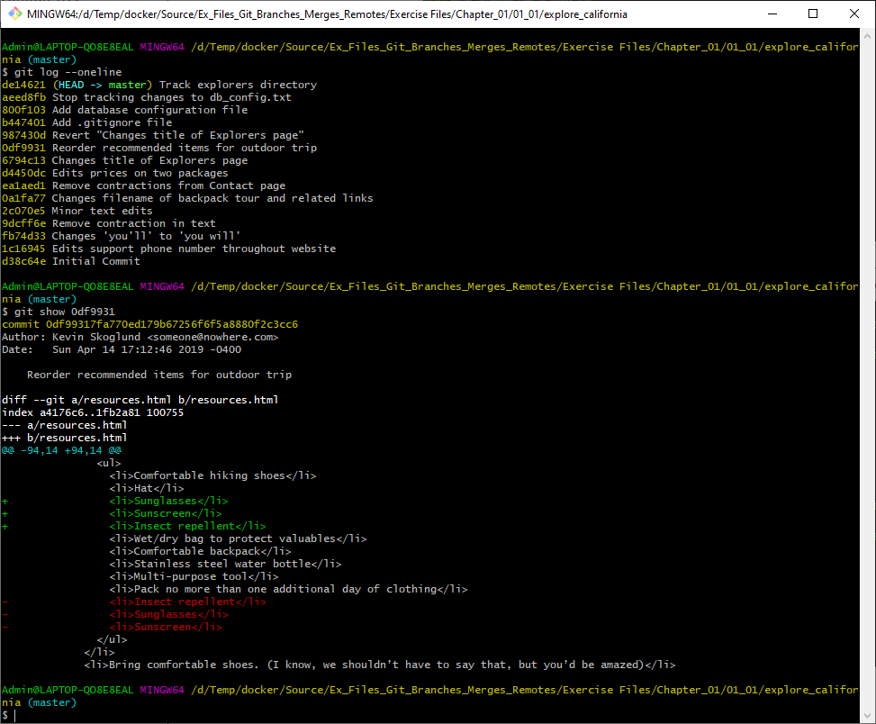

https://www.lynda.com/Git-tutorials/Git-Branches-Merges-Remotes/

[https://www.lynda.com/Git-tutorials/Git-Branches-Merges-Remotes/5030980-2.html?srchtrk=index%3a13%0alinktypeid%3a2%0aq%3agit%0apage%3a2%0as%3arelevance%0asa%3atrue%0aproducttypeid%3a2](https://www.lynda.com/Git-tutorials/Git-Branches-Merges-Remotes/5030980-2.html?srchtrk=index%3a13 linktypeid%3a2 q%3agit page%3a2 s%3arelevance sa%3atrue producttypeid%3a2)  


# Vim and nano

https://www.cyberciti.biz/faq/linux-unix-vim-save-and-quit-command/

## Vim Save And Quit The Editor Command

The procedure to save a file in vim / vi and quit the editor is as follows:

1. Open the terminal application in Linux or Unix
2. Next, open a file in vim / vi, type: **vim filename**
3. To save a file in Vim / vi, press **Esc** key, type **:w** and hit **Enter** key
4. One can save a file and quit vim / Vi by pressing **Esc** key, type **:x** and hit **Enter** key

Let us see all commands and examples in details.

## How to open a file in Vim / Vi

You can start vi/vim by typing the following command:
```shell
vim file
vi file
vim [options] filename
vim helloworld.sh
```

## How to save and quit the vi or vim text editor

To save and quit the vi or vim editor with saving any changes you have made:

1. If you are currently in insert or append mode, press Esc key.

2. Press : (colon). The cursor should reappear at the lower left corner of the screen beside a colon prompt.

3. Enter the following command (type `:x`  

   and press Enter key):

   ```
   :x
   ```
   OR

   ```
   :x!
   ```
   OR

   ```
   :wq!
   ```

4. Press ENTER key

5. This will quit the editor, and all changes you have made to the document will be **saved** to the file.

Use x to save a file and exit:

[ ](https://www.cyberciti.biz/media/new/images/faq/2013/04/save-and-quit.vim.png)

## How to exit VIM text editor

The procedure is as follows to quit vim/vi text editor:

1. First, you need to switch to command mode. This can be done by hitting the **Esc** key. Next, you can type the following commands:
2. **:q** to quit.
3. **:q!** to quit without saving data/file.
4. **:x** save and quit.
5. **:qa** to quit all open files.
6. Please note that whenever you type **:**, a vim or vi **:** will appear at the bottom of the screen. You need to type the rest of the command at the bottom of the screen.


Let us see some examples and method to exit from vim session.

### How to exit vim editor in terminal (method #1)

1. Press the Esc key
2. Type **:**
3. Next, type **q**
4. Hit the **Enter** key

### vim: How do I quit from Vi (method #2)?

1. You can press the Esc key.
2. Type **SHIFT Z Z** to save and exit.
   OR
   Type **SHIFT Z Q** to exit without saving.

## How to trash all changes in vi/vim

If you do not want to save any changes, first press Esc key. To exit Vim without saving changes press :q! followed by ENTER key.

# 1. Navigate the commit tree

## Reference commit

  

  

  

```shell
# HEAD POINTER
$ git show HEAD

$ git log 
$ git log --oneline
$ git log --pretty=format:"%h - %an, %ar : %s"

$ git config --global user.name "Tuyen B"
$ git config --global user.email tuyenbl@example.com

# show detail
$ git show ae72423
```

  

  

show detail change : `git show <id-commit>`

  

## Ancestry

  

Get the commit before HEAD

```shell
$ git log --oneline

$ git show HEAD^
$ git show HEAD^^
```


  

  

~ :  get children before this commit

  

## Tree listings

```shell
$ git help ls-tree 
$ git ls-tree <tree ish>

# commit trước đó chưa có folder explorer
$ git ls-tree HEAD^
```

  

tree là thư mục, blob(binary large object) là file

  

nếu có tên thư mục sẽ list all file in this directory

## Filter the commit log

```shell
$ git log --since=2019-20-01
$ git log --util=2019-20-01
$ git log --author="phuong"

# Search content
$ git log --grep="initial"
```


  

  

## Format the log

```shell
# thống kê thêm xóa từng file
$ git log --stat
$ git log --format=short
$ git log --all --oneline --decorator --graph
```

  

  

  

# Branch

## Create branch

https://www.atlassian.com/git/tutorials/using-branches

## Creating Branches

It's important to understand that branches are just pointers to commits. When you create a branch, all Git needs to do is create a new pointer, it doesn’t change the repository in any other way. If you start with a repository that looks like this:


Then, you create a branch using the following command:

```
git branch crazy-experiment
```

The repository history remains unchanged. All you get is a new pointer to the current commit:


Note that this only *creates* the new branch. To start adding commits to it, you need to select it with `git checkout`, and then use the standard `git add` and `git commit` commands

## Common Options

```
git branch
```

List all of the branches in your repository. This is synonymous with `git branch --list.`

```
git branch <branch>
```

Create a new branch called `<branch>`. This does *not* check out the new branch.

```
git branch -d <branch>
```

Delete the specified branch. This is a “safe” operation in that Git prevents you from deleting the branch if it has unmerged changes.

```
git branch -D <branch>
```

Force delete the specified branch, even if it has unmerged changes. This is the command to use if you want to permanently throw away all of the commits associated with a particular line of development.

```
git branch -m <branch>
```

Rename the current branch to `<branch>`.

```
git branch -a
```

List all remote branches. 

## Switch branch

```shell
$ git checkout <branch_name>

```

Create and switch branch

```shell
$ git checkout -b <new>
```

## Switch branch with uncommited changes

```shell
# phải commit trước khi switch, không cần add chỉ cần commit change branch file lists will automatically update
$ git commit -am "msg"
$ git checkout master

```

  

  

## Usage: Existing branches

Assuming the repo you're working in contains pre-existing branches, you can switch between these branches using `git checkout`. To find out what branches are available and what the current branch name is, execute `git branch`.

```
$> git branch
master
another_branch
feature_inprogress_branch
$> git checkout feature_inprogress_branch
```

The above example demonstrates how to view a list of available branches by executing the `git branch` command, and switch to a specified branch, in this case, the `feature_inprogress_branch`.

## New Branches

`Git checkout` works hand-in-hand with `git branch`. The `git branch` command can be used to create a new branch. When you want to start a new feature, you create a new branch off `master` using `git branch new_branch`. Once created you can then use `git checkout new_branch` to switch to that branch. Additionally, The `git checkout` command accepts a `-b` argument that acts as a convenience method which will create the new branch and immediately switch to it. You can work on multiple features in a single repository by switching between them with `git checkout`.

```
git checkout -b <new-branch>
```

The above example simultaneously creates and checks out `<new-branch>`. The `-b` option is a convenience flag that tells Git to run `git branch <new-branch>` before running `git checkout <new-branch>`.

```
git checkout -b <new-branch> <existing-branch>
```

By default `git checkout -b` will base the `new-branch` off the current `HEAD`. An optional additional branch parameter can be passed to `git checkout`. In the above example, `<existing-branch>` is passed which then bases `new-branch` off of `existing-branch` instead of the current `HEAD`.

## Switching Branches

Switching branches is a straightforward operation. Executing the following will point `HEAD` to the tip of `<branchname>.`

```
git checkout <branchname>
```

Git tracks a history of checkout operations in the reflog. You can execute `git reflog` to view the history.

## Git Checkout a Remote Branch

When collaborating with a team it is common to utilize remote repositories. These repositories may be hosted and shared or they may be another colleague's local copy. Each remote repository will contain its own set of branches. In order to checkout a remote branch you have to first fetch the contents of the branch.

```
git fetch --all
```

In modern versions of Git, you can then checkout the remote branch like a local branch.

```
git checkout <remotebranch>
```

Older versions of Git require the creation of a new branch based on the `remote`.

```
git checkout <remotebranch> origin/<remotebranch>
```

Additionally you can checkout a new local branch and reset it to the remote branches last commit.

```
git checkout -b <branchname>
git reset --hard origin/<branchname>
```

## Compare branches

```shell
$ git diff master..new-branch
$ git diff --color-words master..new_branch

# list các branch được merge or chưa merge
$ git branch --merge
$ git branch --no-merge

```

## Rename branches

```shell
$ git help branch

$ git -m <new-branch-name>
$ git branch --no-merge

```

## Deleting Branches

Once you’ve finished working on a branch and have merged it into the main code base, you’re free to delete the branch without losing any history:

```
git branch -d crazy-experiment
```

However, if the branch hasn’t been merged, the above command will output an error message:

```
error: The branch 'crazy-experiment' is not fully merged.
If you are sure you want to delete it, run 'git branch -D crazy-experiment'.
```

This protects you from losing access to that entire line of development. If you really want to delete the branch (e.g., it’s a failed experiment), you can use the capital `-D` flag:

```
git branch -D crazy-experiment
```

This deletes the branch regardless of its status and without warnings, so use it judiciously.

The previous commands will delete a local copy of a branch. The branch may still exist in remote repos. To delete a remote branch execute the following.

```
git push origin --delete crazy-experiment
```

Or

```
git push origin :crazy-experiment
```

This will push a delete signal to the remote origin repository that triggers a delete of the remote `crazy-experiment` branch.

## Config command prompt

use nano

xem lại

# Reset branches

## Reset type

  

  

  

mixes reset là default

  

## Soft reset

  

```shell
$ git branch
$ git checkout -b new-branch
$ git help checkout

$ git reset --soft HEAD^
$ git log --oneline -3

```

commit A/ commit B

 

Nếu reset soft về id của HEAD ban đầu thì commit vẫn còn như cũ

back về lúc chưa commit A và B  

  

## Mixed reset

  

Commit some edit

  

di chuyển back sau đó về HEAD như cũ

  

  

## Hard reset

  

  

  

có thể move up or down version

shorten title

# Merge branches

## Merge code

switch to master to merge

```shell
# check master diff current branch
$ git diff master..new-branch

```


  


## Fast forward and true merge

  

move HEAD to ba8ce

True merge

  

vd

  

the same id d4f3e89

  

Type is Fast forward

Now we change ST in master and commit it "change title of contact page"

  

  

  

## Merge conflict

  

Nếu sửa cùng 1 file 

  

```shell
git merge --abort
```


  

run again

Sau đó sửa manual check and change code sau khi sửa master and nhánh cần merge

  

Cách tương tự

  

merge and push

  

  

  

stategy

  

# Stash change

[https://kipalog.com/posts/Su-dung-git-stash-hieu-qua#:~:text=Git%20stash%20%C4%91%C6%B0%E1%BB%A3c%20s%E1%BB%AD%20d%E1%BB%A5ng,d%E1%BB%9F%20%E1%BB%9F%20branch%20hi%E1%BB%87n%20t%E1%BA%A1i.&text=Khi%20n%C3%A0y%20branch%20%C4%91%C3%A3%20tr%E1%BB%9F,chuy%E1%BB%83n%20sang%20branch%20tu%E1%BB%B3%20th%C3%ADch.](https://kipalog.com/posts/Su-dung-git-stash-hieu-qua#:~:text=Git stash được sử dụng,dở ở branch hiện tại.&text=Khi này branch đã trở,chuyển sang branch tuỳ thích.)

## Lưu lại thay đổi

`Git stash` được sử dụng khi muốn lưu lại các thay đổi **chưa commit**, thường rất hữu dụng khi bạn muốn đổi sang 1 branch khác mà lại đang làm dở ở branch hiện tại.

Muốn lưu toàn bộ nội dung công việc đang làm dở, bạn có thể sử dụng `git stash` như sau

```
$ git stash save # or just "git stash"
```

Khi này branch đã trở nên "sạch sẽ" và `git status` sẽ cho thấy bạn có thể chuyển sang branch tuỳ thích. Bạn có thể `git stash` **bao nhiêu lần tuỳ thích** và mỗi lần đó git sẽ lưu toàn bộ lần thay đổi đó như 1 phần tử trong 1 stack.


## Lấy lại thay đổi

Sau khi đã git stash 1 hoặc vài lần, bạn có thể xem lại danh sách các lần lưu thay đổi bằng câu lệnh

```shell
$ git stash list
stash@{0}: WIP on <branch-name>: <lastest commit>
stash@{1}: WIP on <branch-name>: <lastest commit>
stash@{2}: WIP on <branch-name>: <lastest commit>
```

Nếu muốn xem cả nội dung của từng thay đổi thì thêm option `-p`

```
$ git stash list -p
```

hoặc xem nội dung cụ thể hơn nữa của lần thay đổi thứ 1:

```
$ git stash show stash@{1}
```

Khi muốn apply lại thay đổi từ stash lần 1 bạn có thể

```
$ git stash apply stash@{1}
```


## Xoá các thay đổi không cần thiết và return

Đôi khi bạn muốn lấy lại thay đổi và xoá nội dung thay đổi lưu trong stack đi, khi đó bạn có thể

```shell
# apply giống như pop ngoại trừ k xóa 
$ git stash apply stash@{1} 

$ git stash drop stash@{1}
```

hoặc đơn giản hơn là

```
$ git stash pop stash@{1}
```

Thậm chí nếu muốn xoá *toàn bộ stack* thì có thể dùng `clear`

```
$ git stash clear
```

  

  

  


# Set up remote repo

## Add a repo

  

  

  

  

## Clone a remote repo

```shell
$ git clone abc.git
```

## Tracking remote branches


# Push change to a remote branch

## Push change to a remote repo

   

compare remote branch and local branch

  

After tracking remote branch you call call `git push` no need origin master again

  

```shell
# sync origin/master with master branch
git fetch
```

  

get info of new branch in  origin/master in local

## Merge fetched change

  

Fast-forward

  

true

  

cách 1 fast 


non fast

  

=> git pull

## checkout remote branch

## Delete remote branch


