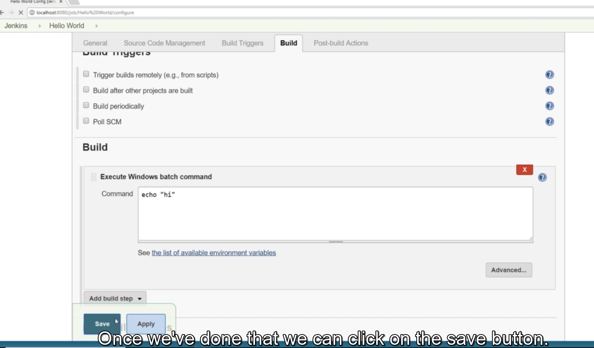

C:\Users\Admin\AppData\Local\Programs\Python\Python38-32\python.exe E:/programing/language/python/python-docs/readfile.py
======== name dir ========

[TOC]

## 1. Introduction
### 1. Welcome Course Objectives and Overview

https://www.udemy.com/course/jenkins-continuous-integration-bootcamp/

### 2. Course Focus and Approach
### 3. Build Maturity

  

  

Many people actually use the term continuous inspection and continuous integration interchangeably.
However, to me, in order really achieve true continuous integration we need a branching strategy, and an approach for integration of the
changes into the main development branch, and a release policy for production.

**Continuous integration** includes everything from continuous inspection but adds a structure branching strategy and a release management policy. 

The automated building and running of unit tests and code quality tools is just continuous inspection.

**Jenkins** can serve as a central part of a robust continuous integration pipeline

### 4. What is Jenkins

As with any software Jenkins has to run on a host system.

This system determines which installer is used for Jenkins and the tools available for the use.
Jenkins runs on top of a Java web application container or application server. By default this is Jetty, but Jenkin's can be deployed
to any web application server with the right set up.

Since Jenkins runs on a Java web application server, a java runtime is required.
You should run Jetty and Jenkins on a Java development kit or JDK instead of just the Java runtime engine, so Jenkins can access the JDK tools when needed.
On most operating systems there is a small program called a **service** 
that is responsible for starting stopping and monitoring Jetty and the Jenkins application
Within **Jenkins views** provide a nice way to group projects or folders together.

  

### 5. About the Instructor

## 2. Full Installation
### 1. Overview

### 2. Windows Installation

  

  

  

  

To validate maven: `mvn -v`

  

  

### 3. Mac Installation

### 4. Linux Installation

## 3. The Basics
### 1. The Basics Overview

  

### 2. The First Job

  

  

Click on create new job

  

Add build step

  

**If you are on Mac or Linux choose execute shell instead.**

  

mở cmd lên gõ echo "hi" để test

click build now

  

Nếu xuất hiện chấm xanh phía dưới là success

  

We click on the ball

  

Ấn vào view as plain text để xem full

### 3. Jenkins Dashboard

Click back to dashboard

  

Chọn vào Hello world link để xem last build success là 2

Click on legend

  

  

RSS stands for Really Simple Syndication  and is a format that describes information in a digestible, news feed like, data stream for consumption and display by newsreaders.

### 4. Failing Jobs

Click on configure

  

Back to dashboard

 

  

Click build now

  

  

Red ball

  

  

Back to dashboard

Khi ấn nút build lại bên trái thì nhiều lần và f5 page => weather rain  

  

  

COnfig project có thể chọn disable

### 5. Copy and Rename Jobs
### 6. Update Plugins
### 7. Delete a Job
### 8. Manage Jenkins
### 9. Jenkins Configuration
## 4. Maven Projects
### 1. Maven Projects Overview

### 2. Confirm Maven Project Outside Jenkins
### 2.1 httpsgithub.comjenkins-training.html
### 3. Maven Freestyle
### 4. Jenkins Workspace
### 5. Maven Jobs
### 6. Maven Build Modules
### 7. Failed Maven Projects
### 8. Scheduling Jenkins Jobs
### 9. Source Control Polling in Jenkins
### 10. Jenkins Tabs
### 11. Jenkins Home Directory
### 12. Upgrading Jenkins
## 5. Tests and Quality Analysis Continuous Inspection
### 1. Continuous Inspection Overview
### 2. Project Source Review (Unit Tests and updates for quality analysis)
### 3. Quality Analysis Plugins and Configuration
### 4. Build and Review
### 5. Unit Testing in Jenkins
### 6. Reviewing Quality Analysis
### 7. Enforcing Minimum Quality Scores
### 8. Improving Quality Scores
## 6. Publishing Build Artifacts to an Artifact Repository
### 1. Publishing Overview
### 2. Maven Repository Plugin and Configuration
### 3. Build and Review Artifact Publishing
## 7. Build Artifact Deployment with Jenkins
### 1. Deployment Overview
### 2. Tomcat Installation
### 2.1 httptomcat.apache.org.html
### 3. Deployment Plugin
### 4. Deployment
## 8. Security in Jenkins
### 1. Security Overview
### 2. Manually Disable Security
### 3. Enable Security and Login
### 4. Adding Users in Matrix-Based Security
### 5. Users Role
### 6. Project Role
## 9. AWS Lightsail for Jenkins Production
### 1. Jenkins Production Using Lightsail Overview

### 2. AWS Signup
### 2.1 httpsaws.amazon.com.html
### 3. Course Repository
### 3.1 httpsgithub.comjenkins-training.html
### 4. Jenkins Instance
### 5. Static IP Address and DNS
### 6. Instance Access
### 7. Jenkins Setup
### 8. Restart within Lightsail
### 9. Instance Snapshots
### 10. Instance Flip
### 11. Clean Up
### 12. Update HostKey
### 13. Web Secured, Part 1
### 14. Web Secured, Part 2
### 15. Update Jenkins
### 16. Beyond Lightsail
## 10. Course Errata and Updates
### 1. Jenkins Incompatibility with Java 9, 10 and 11.html
### 2. Known Issue Maven Projects Fail with POM Parse Error.html
### 3. Maven Repository Server plugin causes Build Failure.html
### 4. Resolve Problem with MacOS Upgrade Breaking Git (new!)
## 11. Conclusion
### 1. Final Thoughts
## 12. Bonus Full Install on Windows
### 1. 32 vs 64-bit Windows

### 2. Google Chrome on Windows
### 2.1 httpswww.google.comchrome.html
### 3. Git for Windows
### 3.1 httpsgit-scm.com.html
### 4. Git Configuration
### 5. Atom Installation on Windows
### 5.1 Atom Text Editor Website..html
### 6. Atom Configuration
### 7. Java Installation on Windows
### 7.1 Java Download.html
### 8. Java Configuration
### 9. Maven Installation on Windows
### 9.1 Apache Maven 3.3.9 Binary Archive (Zip).html
### 10. Jenkins Installation on Windows
### 10.1 Jenkins 1.651.3 LTS.html
### 11. Jenkins Getting Started
### 12. Starting and Stopping Jenkins via Windows Services
### 13. Installation Notes for Windows 10 (Updated).html
### 13.1 Installation.pdf.pdf
## 13. Bonus Special Offers
### 1. Bonus Exclusive Student Discounts.html