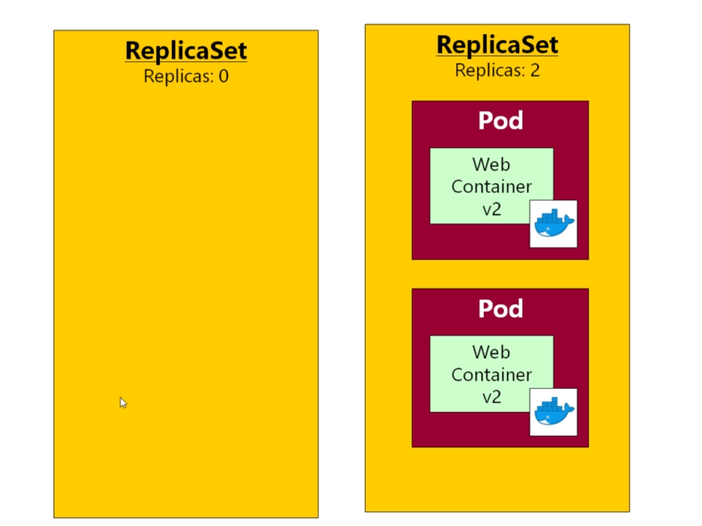
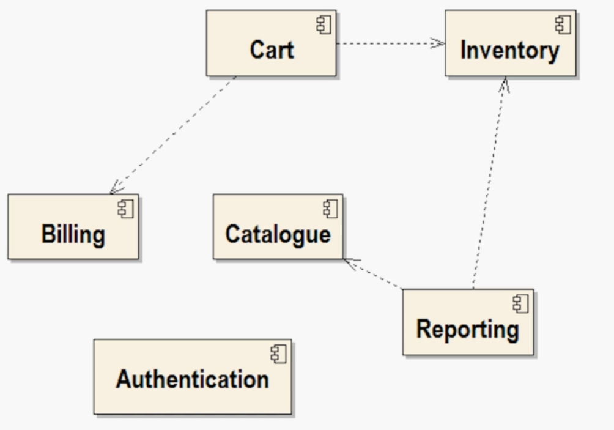
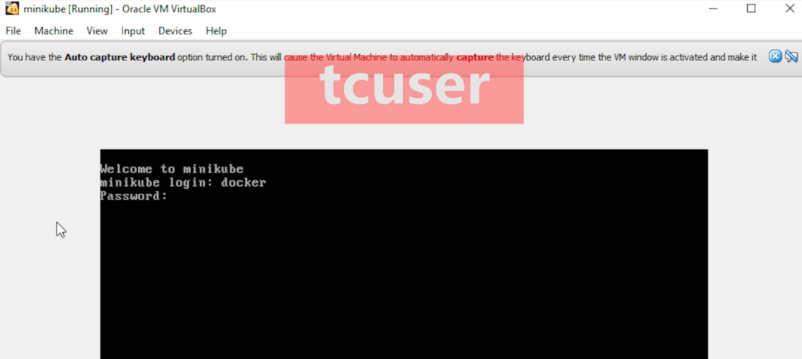
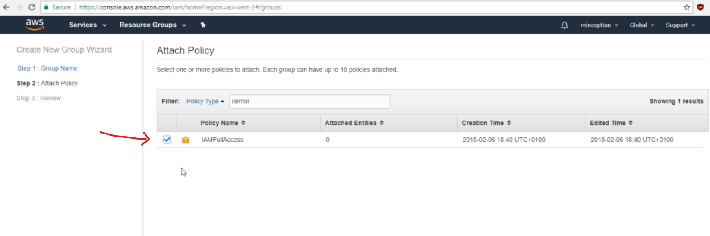
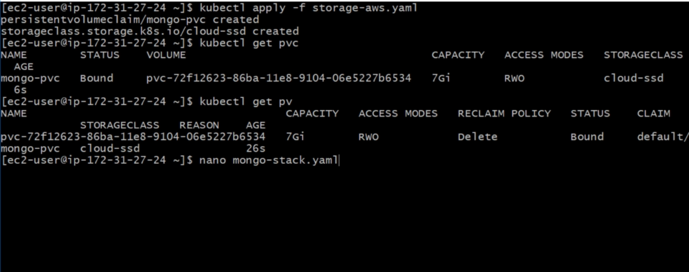
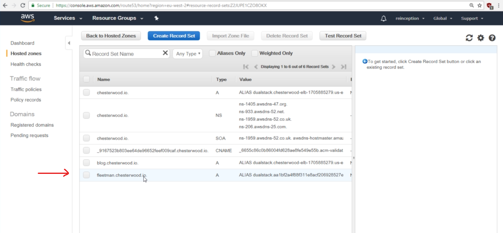
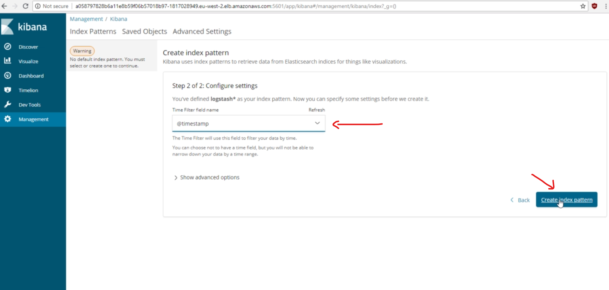
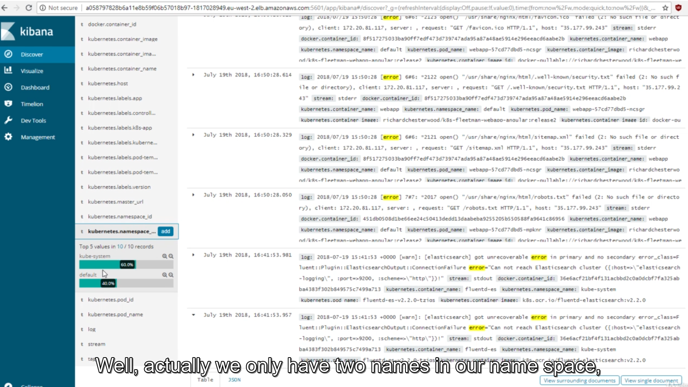
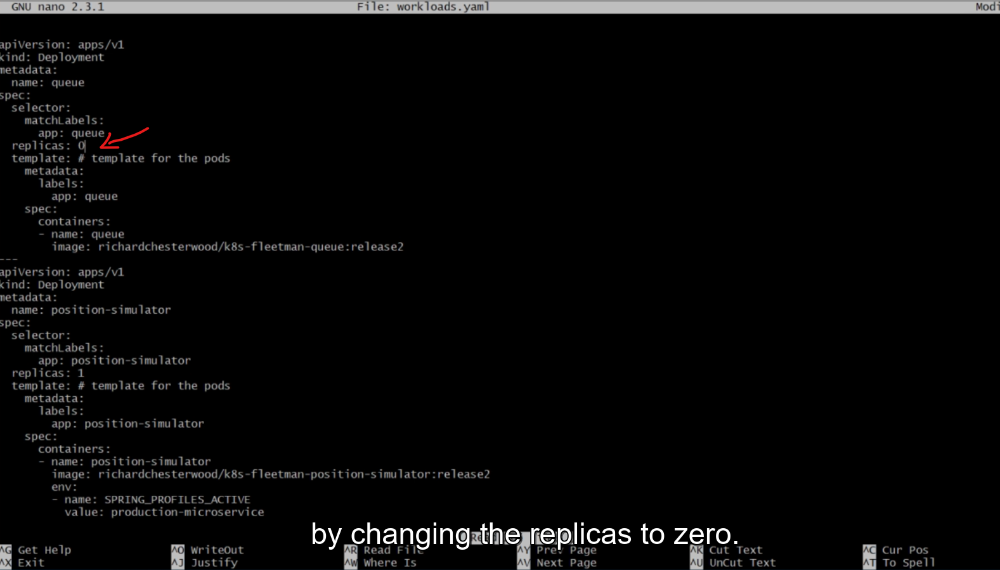

## 1. Introduction

https://chesterwood.io/

https://blog.chesterwood.io/page/2

### 1. Introduction to Kubernetes Microservices course

https://github.com/DickChesterwood/k8s-fleetman

### 1.2 K8S Command Reference.pdf.pdf

Here's a run down of all (ok, most of) of the commands used in the

Kubernetes Microservices course

**Minikube**

minikube start

starts minikube. If this hangs (wait 15 minutes), then see the video in section 3

that addresses common problems

minikube stop

(Section 3): stops the minikube virtual machine. This may be necessary to do if

you have an error when starting

minikube delete

(Section 3): do this to completely wipe away the minikube image. Useful if

minikube is refusing to start and all else fails. Also you can delete all files in

<home>/.minikube and <home>/.kube

minikube env

(Section 4): find out the required environment variables to connect to

the docker daemon running in minikube.

minikube ip

(Section 4 or 5): find out the ip address of minikube. Needed for

browser access.

**Kubectl**

kubectl get all

(Section 5): list all objects that you’ve created. Pods at first, later,

ReplicaSets, Deployments and Services

kubectl apply –f <yaml file>

(Section 5): either creates or updates resources depending on the

contents of the yaml file

kubectl apply –f .

(Section 7): apply all yaml files found in the current directory

kubectl describe pod <name of pod>

(Section 5): gives full information about the specified pod

kubectl exec –it <pod name> <command>

(Section 5): execute the specified command in the pod’s container.

Doesn’t work well in Cygwin.

kubectl get (pod | po | service | svc | rs | replicaset | deployment |

deploy)

(Section 6): get all pods or services. Later in the course, replicasets and

deployments.

kubectl get po --show-labels

(Section 6): get all pods and their labels

kubectl get po --show-labels -l {name}={value}

(Section 6): get all pods matching the specified name:value pair

kubectl delete po <pod name>

(Section 8): delete the named pod. Can also delete svc, rs, deploy

kubectl delete po --all

(Section 8): delete all pods (also svc, rs, deploy)

**Deployment Management**

kubectl rollout status deploy <name of deployment>

(Section 9): get the status of the named deployment

kubectl rollout history deploy <name of deployment>

(Section 9): get the previous versions of the deployment

kubectl rollout undo deploy <name of deployment>

(Section 9): go back one version in the deployment. Also optionally --

to-revision=<revision number>

We recommend this is used only in stressful emergency situations! Your

YAML will now be out of date with the live deployment!

## 2. Welcome to Kubernetes
### 1. Introducing Kubernetes

https://en.wikipedia.org/wiki/Orchestration_(computing)

In [system administration](https://en.wikipedia.org/wiki/System_administration), **orchestration** is the automated [configuration](https://en.wikipedia.org/wiki/Configuration_management), coordination, and management of computer systems and [software](https://en.wikipedia.org/wiki/Software_deployment).[[1\]](https://en.wikipedia.org/wiki/Orchestration_(computing)#cite_note-Erl-1)


In this video, I just want to say a few words for anybody who has already worked with Docker Swarm.
If that's the case, you're probably aware that Docker Swarm features it's own
built in orchestration system.
You don't have to to anything special to install Swarm and it just comes integrated with Docker Engine.
So it's a very common question as to well,
why would I want to use Kubernetes instead of Docker Swarm?
And well, the answer is really, of course it is entirely up to you, if you're an architect of a project for example, then you can choose between Kubernetes and Docker Swarm.
Now guess the number one advantage of Swarm is it's built in, and I have to admit
that Docker Swarm, I've found, is quite a bit simpler to work with than Kubernetes.
I've previously written a course on Docker, where I've covered Docker Swarm
in about two or three chapters, and we got to quite the production standard
with Swarm in that time.
Whereas with Kubernetes we've got a much bigger course, the learning curve in Kubernetes

### 2. Hands-on Project


## 3. Installing Minikube for local Kubernetes Development
### 1. Setting up Virtualization

http://goo.gl/nLKmA1

https://minikube.sigs.k8s.io/docs/start/


### 2. (Windows 10 Professional Only) Setting up Hyper-V


**if you have Hyper-V enabled then VirtualBox will crash and will crash horribly.**

**You can't use the two things at the same time.**
I would advise you, if you are using Windows 10 Professional
then you may as well enable this option, I think you have to do a reboot after enabling it,but once you've enabled it, be careful not to use Oracle VirtualBox otherwise you will have some horrible blue screens of death.

https://goo.gl/4yEFbF

https://docs.microsoft.com/en-us/archive/blogs/wasimbloch/setting-up-kubernetes-on-windows10-laptop-with-minikube

**Pre-requisites for Development Machine Environment:**
• VT-x/AMD-v virtualization must be enabled in BIOS (requires machine restart)
• Enable Hyper-V – go to Windows features On or Off, you will see dialog box with a list of Windows features as shown below. Navigate to the Hyper-V section and enable it (requires machine restart).


**Minikube Installation:**
I prefer to use Hyper-V over VirtualBox to setup Kubernetes on my Windows machine because of its native windows support. In this blog, I am installing docker and then Kubernetes but you can install Kubernetes without Docker. 

**(Optional)** The first step is to download Beta Channel Docker for Windows from [here](https://docs.docker.com/docker-for-windows/). Run Setup default configuration to Install Docker on your machine. Refer [here](https://docs.microsoft.com/en-us/virtualization/windowscontainers/quick-start/quick-start-windows-10) if you need details about how to setup Docker on Windows 10 machine. Once you have successfully installed Docker, confirm deployment by typing “docker info” command in Command window as shown below.

Now, we will setup a new external network switch which will be used by our Hyper-V to setup the Kubernetes on local machine as described below.
o Make sure you have Ethernet connectivity while you are setting this.
o Open the Hyper-V manager.
o Select the Virtual Switch Manager on the left-side Actions panel.

o Set up a new external network switch to use instead of Docker NAT network switch (for Moby), which is set up by default when you install Docker for Windows.
o For this example, we created a virtual switch called “My Virtual Switch”.


I would prefer to create one default Docker machine by using command `docker-machine create --driver hyperv default` 

The next step is to download the latest Minikube binary from [here](https://github.com/kubernetes/minikube/releases) and place that in the root folder of C drive. You may think why do you want to place binary in OS drive. This is because there is a bug in the Minikube which does not allow to install the local cluster if it is place anywhere other than C drive or in OS drive. Refer [here](https://github.com/kubernetes/minikube/issues/459) for more details about bug. The file name is minikube-windows-amd64.exe. Rename this exe as “minikube” (just for simplicity).
Download the Kubectl command line utility from [here](http://storage.googleapis.com/kubernetes-release/release/v1.4.0/bin/windows/amd64/kubectl.exe) and copy this alongside the kubectl.exe file from the previous section. We are all set now to launch a local Kubernetes one node cluster. Launch the PowerShell in Administrator mode and navigate to the drive where you have copied kubectl.exe and minikube.exe.
Let’s do standard testing to validate Minikube deployment by finding the version of Minikube and supported Kubernetes version as shown below. Go to **%HOMEPATH%\.minikube** folder and you will notice several folders are created. Have a look!

`PS C:\> .\minikube.exe version`
minikube version: v0.14.0

`PS C:\> .\minikube get-k8s-versions`
The following Kubernetes versions are available:
\- v1.6.0-alpha.0
\- v1.5.2
\- v1.5.1
\- v1.4.5
\- v1.4.3
\- v1.4.2
\- v1.4.1
\- v1.4.0
\- v1.3.7
\- v1.3.6
\- v1.3.5
\- v1.3.4
\- v1.3.3
\- v1.3.0

There are multiple commands that Minikube supports. You can use ‘--help’ option to see the list of commands.

**Start Kubernetes Cluster locally**
We are now ready to launch our Kubernetes cluster locally and we use start command for it. Before we start the cluster, we will check available flags/options via the help options and will use few of them. We want to use **Kubernetes version v1.5.2** and **VM driver is hyperv**. If you would like to add more memory to local Kubernetes cluster, I would recommend using **memory flag**. Make sure you define **hyperv-virtual-switch flag** which should point to the external network switch you have created previously. We are also going to use couple of global flags like **--v=7** and **--alsologtostderr** to see what is going on under the hood.

`PS C:\> .\minikube.exe start --help` Usage: minikube start [flags] Flags: --container-runtime string The container runtime to be used --cpus int Number of CPUs allocated to the minikube VM (default 2) --disk-size string Disk size allocated to the minikube VM (format: [], where unit = b, k, m or g) (default "20g") --docker-env stringArray Environment variables to pass to the Docker daemon. (format: key=value) --extra-config ExtraOption A set of key=value pairs that describe configuration that may be passed to different components. The key should be '.' separated, and the first part before the dot is the component to apply the configuration to. Valid components are: kubelet, apiserver, controller-manager, etcd, proxy, scheduler. --host-only-cidr string The CIDR to be used for the minikube VM (only supported with Virtualbox driver) (default "192.168.99.1/24") --hyperv-virtual-switch string The hyperv virtual switch name. Defaults to first found. (only supported with HyperV driver) --insecure-registry stringSlice Insecure Docker registries to pass to the Docker daemon --iso-url string Location of the minikube iso (default "https://storage.googleapis.com/minikube/minikube-0.7.iso") --kubernetes-version string The kubernetes version that the minikube VM will use (ex: v1.2.3) OR a URI which contains a localkube binary (ex: https://storage.googleapis.com/minikube/k8sReleases/v1.3.0/localkube-linux-amd64) (default "v1.5.1") --kvm-network string The KVM network name. (only supported with KVM driver) (default "default") --memory int Amount of RAM allocated to the minikube VM (default 2048) --network-plugin string The name of the network plugin --registry-mirror stringSlice Registry mirrors to pass to the Docker daemon --vm-driver string VM driver is one of: [virtualbox hyperv] (default "virtualbox")Global Flags:
**--alsologtostderr log to standard error as well as files**
--log_backtrace_at traceLocation when logging hits line file:N, emit a stack trace (default :0)
--log_dir string If non-empty, write log files in this directory (default "")
--logtostderr log to standard error instead of files
--show-libmachine-logs Whether or not to show logs from libmachine.
--stderrthreshold severity logs at or above this threshold go to stderr (default 2)
--test.bench string regular expression per path component to select benchmarks to run
--test.benchmem print memory allocations for benchmarks
--test.benchtime duration approximate run time for each benchmark (default 1s)
--test.blockprofile string write a goroutine blocking profile to the named file after execution
--test.blockprofilerate int if >= 0, calls runtime.SetBlockProfileRate() (default 1)
--test.count n run tests and benchmarks n times (default 1)
--test.coverprofile string write a coverage profile to the named file after execution
--test.cpu string comma-separated list of number of CPUs to use for each test
--test.cpuprofile string write a cpu profile to the named file during execution
--test.memprofile string write a memory profile to the named file after execution
--test.memprofilerate int if >=0, sets runtime.MemProfileRate
--test.outputdir string directory in which to write profiles
--test.parallel int maximum test parallelism (default 4)
--test.run string regular expression to select tests and examples to run
--test.short run smaller test suite to save time
--test.timeout duration if positive, sets an aggregate time limit for all tests (default 0s)
--test.trace string write an execution trace to the named file after execution
--test.v verbose: print additional output
**-v, --v Level log level for V logs**
--vmodule moduleSpec comma-separated list of pattern=N settings for file-filtered logging

Here is the command which we will execute to start the local Kuberenetes cluster.
`.\minikube.exe start --kubernetes-version="v1.5.2" --vm-driver="hyperv" --memory=1024 --hyperv-virtual-switch="My Virtual Switch" --v=7 --alsologtostderr`
On success, you will get the messaging stating **“Kubectl is now configured to use the cluster.”** 

Let us understand what it is doing behind the scene.
o It generates the certificates and provision local Docker host which creates VM inside the Hyper-V.
o The host is provisioned with the boot2docker.iso and setup it up.
o At the end, it configures the Kubectl to use the local Kubernetes cluster.

You can check the status of the local cluster using status command.

`PS C:\> .\minikube.exe status`
minikubeVM: Running
localkube: Running

Use the kubectl CLI to get the cluster information. In case you see the error like **“.\kubectl : error: couldn't read version from server:”** , then you need to probably set the context again. The command for that is **.\kubectl config set-context minikube**

**PS C:\> .\kubectl cluster-info** Kubernetes master is running at [https://192.168.1.101:8443](https://192.168.1.101:8443/) KubeDNS is running at https://192.168.1.101:8443/api/v1/proxy/namespaces/kube-sy stem/services/kube-dns kubernetes-dashboard is running at https://192.168.1.101:8443/api/v1/proxy/names paces/kube-system/services/kubernetes-dashboard


**Conclusion**
Minikube is a work in progress at this moment and it does not support all the features of Kubernetes. Refer [here](https://github.com/kubernetes/minikube) to know what is supported today. Hope this blog post gets you started with Kubernetes on your Windows development machine by using minikube. Please let me know your experience.

If you are interested in Kubernetes in Azure, please see Azure Container Service: [/en-us/azure/container-service/container-service-kubernetes-walkthrough](https://docs.microsoft.com/en-us/azure/container-service/container-service-kubernetes-walkthrough)

**In next post, we’ll look at how to deploy container application in Kubernetes development machine**.

### 3. Installing kubectl and minikube

https://kubernetes.io/docs/tasks/tools/install-kubectl/


Create new folder


Test by run `kubectl`

```java
Admin@LAPTOP-QO8E8EAL MINGW64 /d/git-docs/docker (master)
$ kubectl
kubectl controls the Kubernetes cluster manager.

 Find more information at: https://kubernetes.io/docs/reference/kubectl/overview/

Basic Commands (Beginner):
  create        Create a resource from a file or from stdin.
  expose        Take a replication controller, service, deployment or pod and expose it as a new Kubernetes Service
  run           Run a particular image on the cluster
  set           Set specific features on objects

Basic Commands (Intermediate):
  explain       Documentation of resources
  get           Display one or many resources
  edit          Edit a resource on the server
  delete        Delete resources by filenames, stdin, resources and names, or by resources and label selector

Deploy Commands:
  rollout       Manage the rollout of a resource
  scale         Set a new size for a Deployment, ReplicaSet or Replication Controller
  autoscale     Auto-scale a Deployment, ReplicaSet, or ReplicationController

Cluster Management Commands:
  certificate   Modify certificate resources.
  cluster-info  Display cluster info
  top           Display Resource (CPU/Memory/Storage) usage.
  cordon        Mark node as unschedulable
  uncordon      Mark node as schedulable
  drain         Drain node in preparation for maintenance
  taint         Update the taints on one or more nodes
```

https://www.cygwin.com/

**Cygwin là một môi trường giả lập hệ điều hành Linux chạy trên Windows, giúp người sử dụng Windows có thể làm việc y như trên Linux mà không cần phải cài đặt hệ điều hành này vào máy tính**

Go to 

https://github.com/kubernetes/minikube/releases

Windows download minikube-windows-amd64.exe

Rename to minikube.exe

> No need to download minikube-installer.exe because it can be complicated


Run `minikube`

In the win 10 pro you have to run


Run `kubectl version`


Now you can see client and server version => ok

### 4. Troubleshooting Minikube

https://github.com/kubernetes/minikube/issues/2765

NOTE

- If we use normal terminal, you can go to `C:\Users\Admin`and delete folder `.kube`and `minikube`

- With cygwin yo navigate to `C:\cygwin64\home\Admin`and delete

  


## 4. (optional) Docker Quickstart
### 1. Docker Overview


I'm just using a caption here
from my previous Docker course.

If you're on Windows 10 Professional, then you will download Docker for windows,
Docker Community Edition for Windows, using the link here, but if you're on a previous version, and I am,
I'm on Windows 10 Home Edition, then you need to follow the link to Docker Toolbox.
For Macintosh, it's a similar story.

If you're on Mac on Yosemite 10.10.3 or above,
then you will get the Docker for Mac,
which uses a native virtual machine environment.
If you're on an older version,
then you're going to be getting Docker Toolbox.

### 2. Docker Containers vs Images

Now, once you have gone through the installation process,
the difference now should be, when you type the docker command--
I'm going to do a video edit here because it's taking a long time for me.
It's clearly hanging.
I did eventually get a response, but it did take a very long time to respond.


The reason for that long pause is, Docker was trying to connect to the Docker server.
The idea is that, on your local computer, you have a daemon process running in the background
that is doing all of the Docker work, and you need to have that running
in order to do any work with Docker.
Let me show you one of the most common Docker commands, which is docker image ls.
That's saying, "Give me a list of all of the images "that I have downloaded to this computer."
I think you'll find, if you run that command, there will be a long pause, it's trying to connect
to your Docker server.
Yeah, it was well over a minute for me before I got this error during connect.
Can you see that it's clearly trying to connect to some kind of IP address somewhere?
I think it's worth explaining what's going on here on a caption.
What's happening here is that the Docker command line,
this is where you were entering that docker command,
is trying to connect to Docker itself, which, typically, you run as a separate daemon process.
If you're not running on Linux, and I assume most of you probably aren't running on Linux,
there's a problem here because, just as with Kubernetes, this Docker daemon
needs to run on Linux because it's using various features
of the Linux operating system to support containers.
A little digression is that Microsoft are currently
working really hard to build their own support
for Docker containers built into Windows, but at the time of recording,
that's a kind of experimental feature that isn't in common use.


What will happen is, and this is a very similar story
to what's been happening in Kubernetes,
assuming you're not running on Linux, the setup is going to be,
the Docker command line is actually going to look for a virtual machine, which, by default,
is that Oracle VirtualBox that you saw earlier.
It's going to look for a Docker daemon running in this virtual machine.
What you can do with a Docker tooling that you've just installed
is start up this virtual machine, and start up a new Docker daemon.


That's absolutely fine, but because you're on a Kubernetes course,
I have a plan.
Of course, in the previous section, you went through all of that pain
of installing Minikube, which is, as you know, a cut-down version of Kubernetes.
What I haven't told you is that, inside Minikube is an installation of Docker.
It has a Docker daemon running just fine.
What we can do, and this is just a little bit of a trick that I often use,
if we're already running Minikube, then we might as well tell the Docker command line
to use Minikube's version of Docker to do our work.
It's a neat little trick.
Let's switch across to the terminal, and I'll show you how it works.
I hope you managed to instal Minikube in the previous section.
I don't know if it's running for you at the moment.
If you're not currently running Minikube, then let's get it started with minikube start.
If you're running on Windows 10 Professional, then you will need those extra command line arguments.
Jet back to the previous section for details on that.
As always, this takes quite a long time to start, so let's do a video edit here.
Great, we should have Minikube up and running now.
Now, remember, there is a Docker environment inside that Minikube.
Now, at present, just to remind you, if we do a docker image ls, you're probably still going to see an error.
That's because we need to configure Docker
to tell it that we are talking to the Minikube environment rather than the traditional Docker
that we run in its own virtual machine.


```java
Admin@LAPTOP-QO8E8EAL ~
$ minikube docker-env
* The control plane node must be running for this command
  - To start a cluster, run: "minikube start"

Admin@LAPTOP-QO8E8EAL ~
$ minikube start
* minikube v1.17.1 on Microsoft Windows 10 Pro 10.0.18363 Build 18363
* Using the docker driver based on existing profile
* Starting control plane node minikube in cluster minikube
* Restarting existing docker container for "minikube" ...
* Preparing Kubernetes v1.20.2 on Docker 20.10.2 ...
* Verifying Kubernetes components...
* Enabled addons: storage-provisioner, default-storageclass
* Done! kubectl is now configured to use "minikube" cluster and "default" namespace by default

Admin@LAPTOP-QO8E8EAL ~
$ docker image ls
REPOSITORY                           TAG                                                     IMAGE ID       CREATED         SIZE
gcr.io/k8s-minikube/kicbase          v0.0.17                                                 a9b1f16d8ece   2 weeks ago     985MB
docker/desktop-kubernetes            kubernetes-v1.19.3-cni-v0.8.5-critools-v1.17.0-debian   bb2106081d17   2 months ago    285MB
httpd                                latest                                                  0a30f4c29d25   2 months ago    138MB
k8s.gcr.io/kube-proxy                v1.19.3                                                 cdef7632a242   3 months ago    118MB
k8s.gcr.io/kube-scheduler            v1.19.3                                                 aaefbfa906bd   3 months ago    45.7MB
k8s.gcr.io/kube-apiserver            v1.19.3                                                 a301be0cd44b   3 months ago    119MB
k8s.gcr.io/kube-controller-manager   v1.19.3                                                 9b60aca1d818   3 months ago    111MB
ubuntu                               14.04                                                   df043b4f0cf1   4 months ago    197MB
k8s.gcr.io/etcd                      3.4.13-0                                                0369cf4303ff   5 months ago    253MB
k8s.gcr.io/coredns                   1.7.0                                                   bfe3a36ebd25   7 months ago    45.2MB
docker/desktop-storage-provisioner   v1.1                                                    e704287ce753   10 months ago   41.8MB
docker/desktop-vpnkit-controller     v1.0                                                    79da37e5a3aa   11 months ago   36.6MB
k8s.gcr.io/pause                     3.2         

Admin@LAPTOP-QO8E8EAL ~
$ minikube docker-env
export DOCKER_TLS_VERIFY="1"
export DOCKER_HOST="tcp://127.0.0.1:49155"
export DOCKER_CERT_PATH="C:\cygwin64\home\Admin\.minikube\certs"
export MINIKUBE_ACTIVE_DOCKERD="minikube"

# To point your shell to minikube's docker-daemon, run:
# eval $(minikube -p minikube docker-env)


```

Now, what we can do here is, we can use the command minikube followed by docker-env,
and that's going to tell you what environment variables you need to set up
in order for your Docker command line to talk to the Docker inside Minikube.
If you're on Mac, if you're on Linux, or if you're on Windows using Cygwin, then you could copy and paste these export commands, or even better, you can just copy this eval here.
All that's going to do is, it's going to run that minikube docker-env,
and take this output, and then execute the output.
It's going to run these four exports. Let's try that.
I'll copy and paste.

```java
eval $(minikube -p minikube docker-env)
```


All that has done is, if I do a echo $DOCKER_HOST, for example, you can see that the value here
is matching the value here.
Just in case you're working in the standard Windows command prompt,
which, to be honest, I don't recommend, you would be better on something like Cygwin,
but if you have decided to use the standard Windows command shell,
you might be worried that all of that Unix-y stuff that we've just seen won't work for you.
Well, I've just switched my command prompt for a demonstration.
I must admit, I've never tried this.
I was surprised to see the results.
You can see that they've actually thought of that, and if you are running on the command prompt,
then it will issue standard DOS command prompts, I suppose they are.
These will be set commands.


You can see, there's a final REM statement here, which suggests that we can just copy this here,
and if we run that, we'll get exactly the same results as we just did over in Cygwin.
Just to remind you, don't mix and match.
Don't use Windows command shell sometimes, and Cygwin some other times.
Choose one or the other.
Otherwise, things get in a terrible mess.
I just wanted to do that to show you that, if you are on the Windows command prompt,
you're not left out.


We've now set up these environment variables, and the big thing now is,
you should be able to type the command docker image ls, and what we're seeing here is a list
of all of the Docker images that are contained inside the Minikube virtual machine.
Now, these images are nothing to do with us.
We never downloaded them.
In fact, they're the Docker images
that Minikube requires to set up a Kubernetes environment.
We will be looking at some of these images a bit later on in the course, but for now, just think of them
as internal images that Minikube needs.
That's a little trick you can do.
We're effectively reusing the Docker process inside Minikube.
Now, the beauty of reusing the Docker process
that's inside Minikube rather than starting up
the Docker daemon again is just that it's more efficient on your computer's resources.
I often work on a laptop, which isn't very powerful.
There isn't a lot of RAM in there, and if I'm running Minikube
and I'm running Docker Toolbox at the same time, then that's two virtual machines
that my laptop has to manage, and it really does start to struggle.
This is a nice trick that I use quite often.

### 3. Running Containers from DockerHub
## 5. Kubernetes Pods
### 1. Pods Overview

*Pods* are the smallest deployable units of computing that you can create and manage in Kubernetes.

A *Pod* (as in a pod of whales or pea pod) is a group of one or more [containers](https://kubernetes.io/docs/concepts/containers/), with shared storage and network resources, and a specification for how to run the containers. A Pod's contents are always co-located and co-scheduled, and run in a shared context. A Pod models an application-specific "logical host": it contains one or more application containers which are relatively tightly coupled. In non-cloud contexts, applications executed on the same physical or virtual machine are analogous to cloud applications executed on the same logical host.

https://kubernetes.io/docs/concepts/workloads/pods/

And to put this simply, for every container that we are planning to deploy,
we're going to create a Pod in Kubernetes, and you can think of each of these Pods
as just being a wrapper for a container so every one of these Microservices,
is going to become a Pod in it's own right.
For most situations you're going to find
that a Pod and a container are in a one to one relationship.
So you might be wondering why have Kubernetes gone to the bother,
of creating some extra jargon here. 
Well there's two things to say about that, it is perfectly possible to have more than
one container inside a Pod, as I'm trying to illustrate here.


what Kubernetes is going to do with these Pods,
is it's going to manage those Pods,
and by that I mean it's going to do things like
making sure they're running all the time,
Kubernetes will make sure that a Pod
isn't using too much disc, or CPU, and so on
isn't using too much disc, or CPU, and so on
so a Pod in Kubernetes is just
the most basic unit of deployment.

#### How Pods manage multiple containers

Pods are designed to support multiple cooperating processes (as containers) that form a cohesive unit of service. The containers in a Pod are automatically co-located and co-scheduled on the same physical or virtual machine in the cluster. The containers can share resources and dependencies, communicate with one another, and coordinate when and how they are terminated.

### 2. Writing a Pod

https://hub.docker.com/u/richardchesterwood

https://hub.docker.com/r/richardchesterwood/k8s-fleetman-webapp-angular

https://github.com/DickChesterwood/k8s-fleetman

Refer:

[Pod | Kubernetes](https://kubernetes.io/docs/reference/kubernetes-api/workloads-resources/pod-v1/)


Hello world


D:\git-docs\docker\Source\Udemy - Kubernetes Hands-On - Deploy Microservices to the AWS Cloud\1. Introduction\Chapter 5 Pods\first-pod.yaml

```ini
apiVersion: v1
kind: Pod
metadata:
  name: webapp
spec:
  containers:
  - name: webapp
    image: richardchesterwood/k8s-fleetman-webapp-angular:release0
```


### 3. Running a Pod

Now this command is going to show us everything
that we have defined in our Kubernetes cluster.
It's going to show us all about pods, and everything else
that we create throughout the rest of the course.

```shell
Admin@LAPTOP-QO8E8EAL /cygdrive/d
$ cd devops-practices/k8s/

Admin@LAPTOP-QO8E8EAL /cygdrive/d/devops-practices/k8s
$ ls
'1.1 Course files v3.zip.zip'  'Chapter 11 Microservices'  'Chapter 13 AWS'  'Chapter 16 Helm and Monitoring'  'Chapter 5 Pods'      'Chapter 7 Exercise'     'Chapter 9 Deployments'
'Chapter 10 Networking'        'Chapter 12 Persistence'    'Chapter 15 ELK'  'Chapter 17 Alerts'               'Chapter 6 Services'  'Chapter 8 ReplicaSets'

Admin@LAPTOP-QO8E8EAL /cygdrive/d/devops-practices/k8s
$ cd Chapter\ 5\ Pods/

Admin@LAPTOP-QO8E8EAL /cygdrive/d/devops-practices/k8s/Chapter 5 Pods
$ ls
first-pod.yaml

Admin@LAPTOP-QO8E8EAL /cygdrive/d/devops-practices/k8s/Chapter 5 Pods
$ minikube status
minikube
type: Control Plane
host: Running
kubelet: Running
apiserver: Running
kubeconfig: Configured
timeToStop: Nonexistent


Admin@LAPTOP-QO8E8EAL /cygdrive/d/devops-practices/k8s/Chapter 5 Pods
$ kubectl get all
NAME                 TYPE        CLUSTER-IP   EXTERNAL-IP   PORT(S)   AGE
service/kubernetes   ClusterIP   10.96.0.1    <none>        443/TCP   2d19h

```

We use `minikube status` to check status for minikube


Now we haven't created anything yet but you'll notice
there is one entry in this list, and it's called the `service/kubernetes`.
What we're seeing here actually is a rest service that is exposed by our Kubernetes cluster.
And what's happening every time we enter one of these kubectl commands, is kubectl is automatically posting commands to this rest api end point.
So, do you need to know that?
No, not really.
Kubectl will do the job for us but I just wanted you to know
why we're seeing something appearing in that list already.
We need to tell Kubernetes that we want it to deploy a pod to the cluster. And we do that with the command `kubectl apply`, followed by -f. for final name, and then the name of the file that you just created.

```shell
Admin@LAPTOP-QO8E8EAL /cygdrive/d/devops-practices/k8s/Chapter 5 Pods
$ kubectl get all
NAME                 TYPE        CLUSTER-IP   EXTERNAL-IP   PORT(S)   AGE
service/kubernetes   ClusterIP   10.96.0.1    <none>        443/TCP   2d19h

Admin@LAPTOP-QO8E8EAL /cygdrive/d/devops-practices/k8s/Chapter 5 Pods
$ kubectl apply -f first-pod.yaml
pod/webapp created

Admin@LAPTOP-QO8E8EAL /cygdrive/d/devops-practices/k8s/Chapter 5 Pods
$ kubectl get all
NAME         READY   STATUS              RESTARTS   AGE
pod/webapp   0/1     ContainerCreating   0          16s

NAME                 TYPE        CLUSTER-IP   EXTERNAL-IP   PORT(S)   AGE
service/kubernetes   ClusterIP   10.96.0.1    <none>        443/TCP   2d20h

```

Now we know it's a web application pod so we'll probably guess that it's exposing ports 80.
While I would love to do that, it turns out that pods are not visible outside the Kubernetes cluster.
Let's have a demo of that.
Firstly, in order to visit our Kubernetes cluster in a web browser, we need to know the IP address
of the minikube cluster itself.

```shell
Admin@LAPTOP-QO8E8EAL /cygdrive/d/devops-practices/k8s/Chapter 5 Pods
$ minikube ip
192.168.49.2

```

Check status


In fact, we can tell, we'd be able to tell that by looking inside the Docker file that was used
to create this container.
So we know that's running on port 80, and we know from the demo we've just attempted to connect from a browser, to the cluster, on that port.

> there's a big wall between the browser and the Kubernetes cluster.
> And it's just simply the case, that we're missing a concept.
> Pods are not intended to be visible from outside of the cluster.


Run

```shell
Admin@LAPTOP-QO8E8EAL /cygdrive/d/devops-practices/k8s/Chapter 5 Pods
$ minikube ip
192.168.49.2

Admin@LAPTOP-QO8E8EAL /cygdrive/d/devops-practices/k8s/Chapter 5 Pods
$ kubectl describe pod webapp
Name:         webapp
Namespace:    default
Priority:     0
Node:         minikube/192.168.49.2
Start Time:   Mon, 08 Feb 2021 21:27:01 +0700
Labels:       <none>
Annotations:  <none>
Status:       Running
IP:           172.17.0.3
IPs:
  IP:  172.17.0.3
Containers:
  webapp:
    Container ID:   docker://21838957015bee2d0aa588e23981f402a49b44e763cd14a316a5965e7a80e1bb
    Image:          richardchesterwood/k8s-fleetman-webapp-angular:release0
    Image ID:       docker-pullable://richardchesterwood/k8s-fleetman-webapp-angular@sha256:9b98fec20772bd1d7d4c9085048f28af35b31ad3a7b7d3ba395fb512c5c359e6
    Port:           <none>
    Host Port:      <none>
    State:          Running
      Started:      Mon, 08 Feb 2021 21:27:58 +0700
    Ready:          True
    Restart Count:  0
    Environment:    <none>
    Mounts:
      /var/run/secrets/kubernetes.io/serviceaccount from default-token-j9srd (ro)
Conditions:
  Type              Status
  Initialized       True
  Ready             True
  ContainersReady   True
  PodScheduled      True
Volumes:
  default-token-j9srd:
    Type:        Secret (a volume populated by a Secret)
    SecretName:  default-token-j9srd
    Optional:    false
QoS Class:       BestEffort
Node-Selectors:  <none>
Tolerations:     node.kubernetes.io/not-ready:NoExecute op=Exists for 300s
                 node.kubernetes.io/unreachable:NoExecute op=Exists for 300s
Events:
  Type    Reason     Age   From               Message
  ----    ------     ----  ----               -------
  Normal  Scheduled  10m   default-scheduler  Successfully assigned default/webapp to minikube
  Normal  Pulling    10m   kubelet            Pulling image "richardchesterwood/k8s-fleetman-webapp-angular:release0"
  Normal  Pulled     9m9s  kubelet            Successfully pulled image "richardchesterwood/k8s-fleetman-webapp-angular:release0" in 56.2370259s
  Normal  Created    9m9s  kubelet            Created container webapp
  Normal  Started    9m9s  kubelet            Started container webapp

```

And that's telling us exactly what happened when they container was starting up, or I should say really,
when the pod was starting up.


Well I'm really running out of things to show you with pods.
Pods are so basic that there's really very little that you
can do with them directly.
As we've seen, we can't visit that pod via a browser.
But I supposed there is on last thing we can do with a pod,
and that is, we can just as you can in Docker,
we can connect to the pod,
and we can execute a command against the pod.
Now, this is something you'll need to do
quite frequently when you're first setting up a cluster
and you may be debugging a pod,
and just trying to get it stable.

```shell
Admin@LAPTOP-QO8E8EAL /cygdrive/d/devops-practices/k8s/Chapter 5 Pods
$ kubectl exec webapp ls
kubectl exec [POD] [COMMAND] is DEPRECATED and will be removed in a future version. Use kubectl exec [POD] -- [COMMAND] instead.
bin
dev
etc
home
lib
media
mnt
proc
root
run
sbin
srv
sys
tmp
usr
var

Admin@LAPTOP-QO8E8EAL /cygdrive/d/devops-practices/k8s/Chapter 5 Pods
$ kubectl exec webapp -- ls
bin
dev
etc
home
lib
media
mnt
proc
root
run
sbin
srv
sys
tmp
usr
var

```

Run `kubectl exec <pod name> -- <command>`

```shell
Admin@LAPTOP-QO8E8EAL /cygdrive/d/devops-practices/k8s/Chapter 5 Pods
$ kubectl -it exec webapp sh
kubectl exec [POD] [COMMAND] is DEPRECATED and will be removed in a future version. Use kubectl exec [POD] -- [COMMAND] instead.
/ # exit

Admin@LAPTOP-QO8E8EAL /cygdrive/d/devops-practices/k8s/Chapter 5 Pods
$ kubectl -it exec webapp -- sh
/ # ls
bin    dev    etc    home   lib    media  mnt    proc   root   run    sbin   srv    sys    tmp    usr    var
/ # wget http://localhost:80
Connecting to localhost:80 (127.0.0.1:80)
index.html           100% |*********************************************************************************************************************************************|   585   0:00:00 ETA
/ # cat index.html
<!doctype html>
<html lang="en">
<head>
  <meta charset="utf-8">
  <title>Fleet Management</title>
  <base href="/">

  <meta name="viewport" content="width=device-width, initial-scale=1">
  <link rel="icon" type="image/x-icon" href="favicon.png">
</head>
<body>
  <app-root></app-root>
<script type="text/javascript" src="runtime.js"></script><script type="text/javascript" src="polyfills.js"></script><script type="text/javascript" src="styles.js"></script><script type="text
/javascript" src="vendor.js"></script><script type="text/javascript" src="main.js"></script></body>
</html>
/ # exit

Admin@LAPTOP-QO8E8EAL /cygdrive/d/devops-practices/k8s/Chapter 5 Pods

```

=> prove it works


## 6. Services in Kubernetes
### 1. Services

that's because Pods are not visible outside the cluster and it's by design because you're going to discover when we go a little further on the course that Pods are designed to be very throw away things.
Pods have short lifetimes. Pods regularly die.
Pods are regularly recreated and as the old saying goes,
as I mentioned in the introduction section, we treat Pods like cattle.
We don't treat them like pets.
So because Pods have this, as they say, ephemeral lifecycle, and that just means **short-lived**,
Kubernetes has a further concept called a service and the idea is that a service is a **long-running** object in Kubernetes.
A **service** will have an IP address and a service will have a stable, fixed port.
And what we can do is we can attach services to Pods.
I'll show you how that works in a very short while.


> With a service we can connect to the Kubernetes Cluster
> and the service will find a suitable Pod to service that request.


**Pod Label**
What we can do with a Pod is we can set up a series of key value pairs.
You can have one or more of these key value pairs so for example we might give a Pod a label
whose name is app and the value is webapp.
Now this can be anything you like.
I've only used this because all of the reference documentation uses, as its first example really,
the key value pair of app followed by some value.

[Service | Kubernetes](https://kubernetes.io/docs/reference/kubernetes-api/services-resources/service-v1/)


### 2. NodePort and ClusterIP

D:\git-docs\docker\Source\Udemy - Kubernetes Hands-On - Deploy Microservices to the AWS Cloud\1. Introduction\Chapter 6 Services\first-pod.yaml

```ini
apiVersion: v1
kind: Pod
metadata:
  name: webapp
  labels:
    app: webapp
    release: "0"
spec:
  containers:
  - name: webapp
    image: richardchesterwood/k8s-fleetman-webapp-angular:release0

---
apiVersion: v1
kind: Pod
metadata:
  name: webapp-release-0-5
  labels:
    app: webapp
    release: "0-5"
spec:
  containers:
  - name: webapp
    image: richardchesterwood/k8s-fleetman-webapp-angular:release0-5

```

D:\git-docs\docker\Source\Udemy - Kubernetes Hands-On - Deploy Microservices to the AWS Cloud\1. Introduction\Chapter 6 Services\webapp-service.yaml

```ini
apiVersion: v1
kind: Service
metadata:
  name: fleetman-webapp

spec:
  # This defines which pods are going to be represented by this Service
  # The service becomes a network endpoint for either other services
  # or maybe external users to connect to (eg browser)
  selector:
    app: webapp
    release: "0-5"

  ports:
    - name: http
      port: 80
      nodePort: 30080

  type: NodePort

```

https://kubernetes.io/docs/reference/kubernetes-api/services-resources/service-v1/

**type** (string) 

type determines how the Service is exposed. Defaults to ClusterIP. Valid options are ExternalName, ClusterIP, NodePort, and LoadBalancer. "ClusterIP" allocates a cluster-internal IP address for load-balancing to endpoints. Endpoints are determined by the selector or if that is not specified, by manual construction of an Endpoints object or EndpointSlice objects. If clusterIP is "None", no virtual IP is allocated and the endpoints are published as a set of endpoints rather than a virtual IP. "NodePort" builds on ClusterIP and allocates a port on every node which routes to the same endpoints as the clusterIP. "LoadBalancer" builds on NodePort and creates an external load-balancer (if supported in the current cloud) which routes to the same endpoints as the clusterIP. "ExternalName" aliases this service to the specified externalName. Several other fields do not apply to ExternalName services. More info: https://kubernetes.io/docs/concepts/services-networking/service/#publishing-services-service-types

---

The first option is **ClusterIP**. 
If you make your service be of type ClusterIP then you're telling Kubernetes that this
service will only be accessible from inside the Cluster.
**It will not be accessible to external things such as web browsers**, so you're going to use ClusterIP
if this service is just going to be an internal service such as our micro services that we're building.
Many of the micro services that we're building, we will not want to expose to external traffic.
We just want other micro services inside the Cluster to talk to it.
In that case, ClusterIP would be the right choice,
It makes it a kind of private service.
That's just my terminology but that's the way I think of it.
It will give this service an IP address and that IP address will be stable because
services are long lived entities in Kubernetes.
Remember, pods come and go.
Pods will constantly die, pods are going to be restarted.
And that's the point of having this service, to act as a fronts to the pods
so we can have stable IP addresses.
Actually **ClusterIP is probably going to be what we use for most of our services**
**when we start introducing the micro services, but of course, that's not the right choice for the web app.**
We want the web app, of course, to be exposed to the outside world.
So for that reason, the type we're going to need is the final choice available and that type is called a **NodePort**. That this is where we are going to expose a port through the node, the node in our case is the entire Kubernetes Cluster, of course, when we go further with this we are going to have multiple nodes in a Cluster but this means we're going to expose a port through the node.


> Port > 30000

```shell
Admin@LAPTOP-QO8E8EAL /cygdrive/d/devops-practices/k8s/Chapter 6 Services
$ kubectl get all
NAME         READY   STATUS    RESTARTS   AGE
pod/webapp   1/1     Running   0          67m

NAME                 TYPE        CLUSTER-IP   EXTERNAL-IP   PORT(S)   AGE
service/kubernetes   ClusterIP   10.96.0.1    <none>        443/TCP   2d21h

Admin@LAPTOP-QO8E8EAL /cygdrive/d/devops-practices/k8s/Chapter 6 Services
$ kubectl apply -f webapp-service.yaml
service/fleetman-webapp created

Admin@LAPTOP-QO8E8EAL /cygdrive/d/devops-practices/k8s/Chapter 6 Services
$ kubectl get all
NAME         READY   STATUS    RESTARTS   AGE
pod/webapp   1/1     Running   0          68m

NAME                      TYPE        CLUSTER-IP       EXTERNAL-IP   PORT(S)        AGE
service/fleetman-webapp   NodePort    10.109.124.196   <none>        80:30080/TCP   2s
service/kubernetes        ClusterIP   10.96.0.1        <none>        443/TCP        2d21h

Admin@LAPTOP-QO8E8EAL /cygdrive/d/devops-practices/k8s/Chapter 6 Services
$ ls
first-pod.yaml  webapp-service.yaml

Admin@LAPTOP-QO8E8EAL /cygdrive/d/devops-practices/k8s/Chapter 6 Services
$ minikube ip
192.168.49.2

Admin@LAPTOP-QO8E8EAL /cygdrive/d/devops-practices/k8s/Chapter 6 Services

```


Go to http://192.168.49.2:30080/ => not works


### 3. Pod Selection with Labels

Add label in first-pod.yaml

```ini
metadata:
  name: webapp
  labels:
    app: webapp # we can use any name instead of app and it should be the same with service selector
    release: "0"
```

```shell
Admin@LAPTOP-QO8E8EAL /cygdrive/d/devops-practices/k8s/Chapter 6 Services
$ kubectl get all
NAME         READY   STATUS    RESTARTS   AGE
pod/webapp   1/1     Running   0          67m

NAME                 TYPE        CLUSTER-IP   EXTERNAL-IP   PORT(S)   AGE
service/kubernetes   ClusterIP   10.96.0.1    <none>        443/TCP   2d21h

Admin@LAPTOP-QO8E8EAL /cygdrive/d/devops-practices/k8s/Chapter 6 Services
$ kubectl apply -f webapp-service.yaml
service/fleetman-webapp created

Admin@LAPTOP-QO8E8EAL /cygdrive/d/devops-practices/k8s/Chapter 6 Services
$ kubectl get all
NAME         READY   STATUS    RESTARTS   AGE
pod/webapp   1/1     Running   0          68m

NAME                      TYPE        CLUSTER-IP       EXTERNAL-IP   PORT(S)        AGE
service/fleetman-webapp   NodePort    10.109.124.196   <none>        80:30080/TCP   2s
service/kubernetes        ClusterIP   10.96.0.1        <none>        443/TCP        2d21h

Admin@LAPTOP-QO8E8EAL /cygdrive/d/devops-practices/k8s/Chapter 6 Services
$ ls
first-pod.yaml  webapp-service.yaml

Admin@LAPTOP-QO8E8EAL /cygdrive/d/devops-practices/k8s/Chapter 6 Services
$ minikube ip
192.168.49.2

Admin@LAPTOP-QO8E8EAL /cygdrive/d/devops-practices/k8s/Chapter 6 Services
$ kubectl apply -f first-pod.yaml
pod/webapp configured
pod/webapp-release-0-5 created


Admin@LAPTOP-QO8E8EAL /cygdrive/d/devops-practices/k8s/Chapter 6 Services
$ kubectl get all
NAME                     READY   STATUS    RESTARTS   AGE
pod/webapp               1/1     Running   0          76m
pod/webapp-release-0-5   1/1     Running   0          66s

NAME                      TYPE        CLUSTER-IP       EXTERNAL-IP   PORT(S)        AGE
service/fleetman-webapp   NodePort    10.109.124.196   <none>        80:30080/TCP   7m45s
service/kubernetes        ClusterIP   10.96.0.1        <none>        443/TCP        2d21h

```


```shell
Admin@LAPTOP-QO8E8EAL /cygdrive/d/devops-practices/k8s/Chapter 6 Services
$ minikube ip
192.168.49.2

Admin@LAPTOP-QO8E8EAL /cygdrive/d/devops-practices/k8s/Chapter 6 Services
$ kubectl apply -f first-pod.yaml
pod/webapp unchanged
pod/webapp-release-0-5 unchanged

Admin@LAPTOP-QO8E8EAL /cygdrive/d/devops-practices/k8s/Chapter 6 Services
$ kubectl apply -f webapp-service.yaml
service/fleetman-webapp unchanged

Admin@LAPTOP-QO8E8EAL /cygdrive/d/devops-practices/k8s/Chapter 6 Services
$ kubectl get all
NAME                     READY   STATUS    RESTARTS   AGE
pod/webapp               1/1     Running   0          80m
pod/webapp-release-0-5   1/1     Running   0          5m19s

NAME                      TYPE        CLUSTER-IP       EXTERNAL-IP   PORT(S)        AGE
service/fleetman-webapp   NodePort    10.109.124.196   <none>        80:30080/TCP   11m
service/kubernetes        ClusterIP   10.96.0.1        <none>        443/TCP        2d21h

Admin@LAPTOP-QO8E8EAL /cygdrive/d/devops-practices/k8s/Chapter 6 Services
$ curl http://192.168.49.2:30080
curl: (7) Failed to connect to 192.168.49.2 port 30080: Timed out

Admin@LAPTOP-QO8E8EAL /cygdrive/d/devops-practices/k8s/Chapter 6 Services
$ kubectl describe svc fleetman-webapp
Name:                     fleetman-webapp
Namespace:                default
Labels:                   <none>
Annotations:              <none>
Selector:                 app=webapp,release=0-5
Type:                     NodePort
IP:                       10.109.124.196
Port:                     http  80/TCP
TargetPort:               80/TCP
NodePort:                 http  30080/TCP
Endpoints:                172.17.0.4:80
Session Affinity:         None
External Traffic Policy:  Cluster
Events:                   <none>

Admin@LAPTOP-QO8E8EAL /cygdrive/d/devops-practices/k8s/Chapter 6 Services

```

Show pods

```shell
Admin@LAPTOP-QO8E8EAL /cygdrive/d/devops-practices/k8s/Chapter 6 Services
$ kubectl get pods
NAME                 READY   STATUS    RESTARTS   AGE
webapp               1/1     Running   0          88m
webapp-release-0-5   1/1     Running   0          12m

Admin@LAPTOP-QO8E8EAL /cygdrive/d/devops-practices/k8s/Chapter 6 Services
$ kubectl get po
NAME                 READY   STATUS    RESTARTS   AGE
webapp               1/1     Running   0          88m
webapp-release-0-5   1/1     Running   0          13m

Admin@LAPTOP-QO8E8EAL /cygdrive/d/devops-practices/k8s/Chapter 6 Services
$ kubectl get po --show-labels
NAME                 READY   STATUS    RESTARTS   AGE   LABELS
webapp               1/1     Running   0          88m   app=webapp,release=0
webapp-release-0-5   1/1     Running   0          13m   app=webapp,release=0-5

# Filter by release
Admin@LAPTOP-QO8E8EAL /cygdrive/d/devops-practices/k8s/Chapter 6 Services
$ kubectl get po --show-labels -l release=0
NAME     READY   STATUS    RESTARTS   AGE   LABELS
webapp   1/1     Running   0          90m   app=webapp,release=0

```

https://minikube.sigs.k8s.io/docs/handbook/accessing/

I**ncreasing the NodePort range**
By default, minikube only exposes ports 30000-32767. If this does not work for you, you can adjust the range by using:


```shell
Admin@LAPTOP-QO8E8EAL /cygdrive/d/devops-practices/k8s/Chapter 6 Services
$ kubectl get all
NAME                     READY   STATUS    RESTARTS   AGE
pod/webapp               1/1     Running   0          100m
pod/webapp-release-0-5   1/1     Running   0          25m

NAME                      TYPE        CLUSTER-IP       EXTERNAL-IP   PORT(S)        AGE
service/fleetman-webapp   NodePort    10.109.124.196   <none>        80:30180/TCP   31m
service/kubernetes        ClusterIP   10.96.0.1        <none>        443/TCP        2d21h

Admin@LAPTOP-QO8E8EAL /cygdrive/d/devops-practices/k8s/Chapter 6 Services
$ minikube ip
192.168.49.2

Admin@LAPTOP-QO8E8EAL /cygdrive/d/devops-practices/k8s/Chapter 6 Services
$ minikube service fleetman-webapp
|-----------|-----------------|-------------|---------------------------|
| NAMESPACE |      NAME       | TARGET PORT |            URL            |
|-----------|-----------------|-------------|---------------------------|
| default   | fleetman-webapp | http/80     | http://192.168.49.2:30180 |
|-----------|-----------------|-------------|---------------------------|
* Starting tunnel for service fleetman-webapp.
|-----------|-----------------|-------------|------------------------|
| NAMESPACE |      NAME       | TARGET PORT |          URL           |
|-----------|-----------------|-------------|------------------------|
| default   | fleetman-webapp |             | http://127.0.0.1:63961 |
|-----------|-----------------|-------------|------------------------|
* Opening service default/fleetman-webapp in default browser...
! Because you are using a Docker driver on windows, the terminal needs to be open to run it.

```


Minikube doesn't support LoadBalancer services, so the service will never get an external IP.

But you can access the service anyway with its external port.

You can get the IP and PORT by running:

```yaml
minikube service <service_name>
```

https://stackoverflow.com/questions/39850819/kubernetes-minikube-external-ip-does-not-work


https://kubernetes.io/docs/tutorials/hello-minikube/#create-a-service


---


https://stackoverflow.com/questions/63600378/cant-access-minikube-service-using-nodeport-from-host-on-mac

You are mostly facing [this issue](https://github.com/kubernetes/minikube/issues/7344) when you use `minikube ip` which returns `127.0.0.1`. It should work if you use internal ip from `kubectl get node -o wide` instead of `127.0.0.1`.

A much easier approach from the official reference [docs](https://kubernetes.io/docs/tutorials/hello-minikube/) is you can get the url using `minikube service web-test --url` and use it in browser or if you use `minikube service web-test` it will open the url in browser directly

```shell
Admin@LAPTOP-QO8E8EAL /cygdrive/d/devops-practices/k8s/Chapter 6 Services
$ minikube service fleetman-webapp --url
* Starting tunnel for service fleetman-webapp.
|-----------|-----------------|-------------|------------------------|
| NAMESPACE |      NAME       | TARGET PORT |          URL           |
|-----------|-----------------|-------------|------------------------|
| default   | fleetman-webapp |             | http://127.0.0.1:57237 |
|-----------|-----------------|-------------|------------------------|
http://127.0.0.1:57237
! Because you are using a Docker driver on windows, the terminal needs to be open to run it.

```


## 7. Exercise Deploy ActiveMQ as a Pod and Service to Kubernetes
### 1. Exercise Deploy ActiveMQ as a Pod and Service


D:\git-docs\docker\Source\Udemy - Kubernetes Hands-On - Deploy Microservices to the AWS Cloud\1. Introduction\Chapter 7 Exercise\pods.yaml

```ini
---
# add

apiVersion: v1
kind: Pod
metadata:
  name: queue
  labels:
    app: queue
spec:
  containers:
  - name: queue
    image: richardchesterwood/k8s-fleetman-queue:release1
```


D:\git-docs\docker\Source\Udemy - Kubernetes Hands-On - Deploy Microservices to the AWS Cloud\1. Introduction\Chapter 7 Exercise\services.yaml

```ini
---
apiVersion: v1
kind: Service
metadata:
  name: fleetman-queue

spec:
  # This defines which pods are going to be represented by this Service
  # The service becomes a network endpoint for either other services
  # or maybe external users to connect to (eg browser)
  selector:
    app: queue

  ports:
    - name: http
      port: 8161
      nodePort: 30010

  type: NodePort
```

Run `kubectl apply -f .` to apply all

```shell
Admin@LAPTOP-QO8E8EAL /cygdrive/d/devops-practices/k8s/Chapter 7 Exercise
$ kubectl apply -f .
pod/webapp-release-0-5 unchanged
pod/webapp-release-0 created
pod/queue created
service/fleetman-webapp unchanged
service/fleetman-queue created

Admin@LAPTOP-QO8E8EAL /cygdrive/d/devops-practices/k8s/Chapter 7 Exercise
$ kubectl get all
NAME                     READY   STATUS              RESTARTS   AGE
pod/queue                0/1     ContainerCreating   0          5s
pod/webapp               1/1     Running             0          15m
pod/webapp-release-0     1/1     Running             0          5s
pod/webapp-release-0-5   1/1     Running             0          15m

NAME                      TYPE        CLUSTER-IP     EXTERNAL-IP   PORT(S)          AGE
service/fleetman-queue    NodePort    10.100.41.19   <none>        8161:30010/TCP   5s
service/fleetman-webapp   NodePort    10.96.67.149   <none>        80:30080/TCP     15m
service/kubernetes        ClusterIP   10.96.0.1      <none>        443/TCP          16m

Admin@LAPTOP-QO8E8EAL /cygdrive/d/devops-practices/k8s/Chapter 7 Exercise
$ kubectl describe pod queue
Name:         queue
Namespace:    default
Priority:     0
Node:         minikube/192.168.49.2
Start Time:   Mon, 08 Feb 2021 23:50:10 +0700
Labels:       app=queue
Annotations:  <none>
Status:       Running
IP:           172.17.0.6
IPs:
  IP:  172.17.0.6
Containers:
  queue:
    Container ID:   docker://d82ab5b505b036ae72bfb6dbc198048e5b710967ef991b52fa124f5d0c9080f8
    Image:          richardchesterwood/k8s-fleetman-queue:release1
    Image ID:       docker-pullable://richardchesterwood/k8s-fleetman-queue@sha256:bc2cb90a09aecdd8bce5d5f3a8dac17281ec7883077ddcfb8b7acfe2ab3b6afa
    Port:           <none>
    Host Port:      <none>
    State:          Running
      Started:      Mon, 08 Feb 2021 23:51:00 +0700
    Ready:          True
    Restart Count:  0
    Environment:    <none>
    Mounts:
      /var/run/secrets/kubernetes.io/serviceaccount from default-token-mxg8z (ro)
Conditions:
  Type              Status
  Initialized       True
  Ready             True
  ContainersReady   True
  PodScheduled      True
Volumes:
  default-token-mxg8z:
    Type:        Secret (a volume populated by a Secret)
    SecretName:  default-token-mxg8z
    Optional:    false
QoS Class:       BestEffort
Node-Selectors:  <none>
Tolerations:     node.kubernetes.io/not-ready:NoExecute op=Exists for 300s
                 node.kubernetes.io/unreachable:NoExecute op=Exists for 300s
Events:
  Type    Reason     Age    From               Message
  ----    ------     ----   ----               -------
  Normal  Scheduled  3m37s  default-scheduler  Successfully assigned default/queue to minikube
  Normal  Pulling    3m36s  kubelet            Pulling image "richardchesterwood/k8s-fleetman-queue:release1"
  Normal  Pulled     2m49s  kubelet            Successfully pulled image "richardchesterwood/k8s-fleetman-queue:release1" in 47.1026686s
  Normal  Created    2m47s  kubelet            Created container queue
  Normal  Started    2m47s  kubelet            Started container queue


Admin@LAPTOP-QO8E8EAL /cygdrive/d/devops-practices/k8s/Chapter 7 Exercise
$ minikube ip
192.168.49.2

Admin@LAPTOP-QO8E8EAL /cygdrive/d/devops-practices/k8s/Chapter 7 Exercise
$ minikube service fleetman-queue
|-----------|----------------|-------------|---------------------------|
| NAMESPACE |      NAME      | TARGET PORT |            URL            |
|-----------|----------------|-------------|---------------------------|
| default   | fleetman-queue | http/8161   | http://192.168.49.2:30010 |
|-----------|----------------|-------------|---------------------------|
* Starting tunnel for service fleetman-queue.
|-----------|----------------|-------------|------------------------|
| NAMESPACE |      NAME      | TARGET PORT |          URL           |
|-----------|----------------|-------------|------------------------|
| default   | fleetman-queue |             | http://127.0.0.1:58199 |
|-----------|----------------|-------------|------------------------|
* Opening service default/fleetman-queue in default browser...
! Because you are using a Docker driver on windows, the terminal needs to be open to run it.

```


### 1.2 K8S-Command-Reference.pdf.pdf
## 8. Kubernetes ReplicaSets
### 1. ReplicaSets

Now, pods are very basic and disposable objects in Kubernetes.
In a full running system, it's more than possible that pods are going to die.
Lots of reasons for that.
If a node were to fail, then of course all of the pods running on that node are going to die.
If a pod consumes too many resources, such as CPU, then Kubernetes will kill the pod.
We will talk about that in a dedicated section, but for now, as long as you're aware that
that's a possibility.
So for whatever reason, pods can be short-lived.

```shell
Admin@LAPTOP-QO8E8EAL /cygdrive/d/devops-practices/k8s/Chapter 7 Exercise
$ minikube status
minikube
type: Control Plane
host: Running
kubelet: Running
apiserver: Running
kubeconfig: Configured
timeToStop: Nonexistent


Admin@LAPTOP-QO8E8EAL /cygdrive/d/devops-practices/k8s/Chapter 7 Exercise
$ kubectl describe svc fleetman-webapp
Name:                     fleetman-webapp
Namespace:                default
Labels:                   <none>
Annotations:              <none>
Selector:                 app=webapp,release=0-5
Type:                     NodePort
IP:                       10.96.67.149
Port:                     http  80/TCP
TargetPort:               80/TCP
NodePort:                 http  30080/TCP
Endpoints:                172.17.0.4:80
Session Affinity:         None
External Traffic Policy:  Cluster
Events:                   <none>

Admin@LAPTOP-QO8E8EAL /cygdrive/d/devops-practices/k8s/Chapter 7 Exercise
$ kubectl get all
NAME                     READY   STATUS    RESTARTS   AGE
pod/queue                1/1     Running   0          9h
pod/webapp               1/1     Running   0          10h
pod/webapp-release-0     1/1     Running   0          9h
pod/webapp-release-0-5   1/1     Running   0          10h

NAME                      TYPE        CLUSTER-IP     EXTERNAL-IP   PORT(S)          AGE
service/fleetman-queue    NodePort    10.100.41.19   <none>        8161:30010/TCP   9h
service/fleetman-webapp   NodePort    10.96.67.149   <none>        80:30080/TCP     10h
service/kubernetes        ClusterIP   10.96.0.1      <none>        443/TCP          10h

Admin@LAPTOP-QO8E8EAL /cygdrive/d/devops-practices/k8s/Chapter 7 Exercise
$ kubectl delete po webapp-release-0-5
pod "webapp-release-0-5" deleted

Admin@LAPTOP-QO8E8EAL /cygdrive/d/devops-practices/k8s/Chapter 7 Exercise
$ kubectl get all
NAME                   READY   STATUS    RESTARTS   AGE
pod/queue              1/1     Running   0          10h
pod/webapp             1/1     Running   0          10h
pod/webapp-release-0   1/1     Running   0          10h

NAME                      TYPE        CLUSTER-IP     EXTERNAL-IP   PORT(S)          AGE
service/fleetman-queue    NodePort    10.100.41.19   <none>        8161:30010/TCP   10h
service/fleetman-webapp   NodePort    10.96.67.149   <none>        80:30080/TCP     10h
service/kubernetes        ClusterIP   10.96.0.1      <none>        443/TCP          10h

Admin@LAPTOP-QO8E8EAL /cygdrive/d/devops-practices/k8s/Chapter 7 Exercise

```

Now we will delete a pod 

What we do with a ReplicaSet is we just provide, really, an additional piece of configuration to Kubernetes.
We specify how many instances of this pod do we want Kubernetes to make sure are running
at any one time?
So we could start simple, and we could simply specify that we want one replica of this pod to be running at any one time.
And all that will mean is, if this pod were to die for any reason, any reason at all, then Kubernetes will spring up another one.
And I would suggest, therefore, you're going to be doing this in general for all of your pods.
So if you're deploying a general microservice pod, once again, you would be wrapping it inside a ReplicaSet.
Now, we'll keep the replicas at one for now, but you can probably guess that we can use
any number we want in there, more on that later.
But first we need to learn how to define a replica set.
So how do we define a replica set, then?


https://kubernetes.io/docs/reference/kubernetes-api/workloads-resources/replica-set-v1/

Notice `group` is app/v1


### 2. Writing a ReplicaSet

D:\git-docs\docker\Source\Udemy - Kubernetes Hands-On - Deploy Microservices to the AWS Cloud\1. Introduction\Chapter 8 ReplicaSets\pods.yaml

```ini

apiVersion: apps/v1
kind: ReplicaSet
metadata:
  name: webapp
spec:
  selector:
    matchLabels:
      app: webapp
  replicas: 2
  template: # template for the pods
    metadata:
      labels:
        app: webapp
    spec:
      containers:
      - name: webapp
        image: richardchesterwood/k8s-fleetman-webapp-angular:release0-5

---
apiVersion: v1
kind: Pod
metadata:
  name: queue
  labels:
    app: queue
spec:
  containers:
  - name: queue
    image: richardchesterwood/k8s-fleetman-queue:release1

```

D:\git-docs\docker\Source\Udemy - Kubernetes Hands-On - Deploy Microservices to the AWS Cloud\1. Introduction\Chapter 8 ReplicaSets\services.yaml

```ini
apiVersion: v1
kind: Service
metadata:
  name: fleetman-webapp

spec:
  # This defines which pods are going to be represented by this Service
  # The service becomes a network endpoint for either other services
  # or maybe external users to connect to (eg browser)
  selector:
    app: webapp
    # remove release: "0-5"

  ports:
    - name: http
      port: 80
      nodePort: 30080

  type: NodePort
---
apiVersion: v1
kind: Service
metadata:
  name: fleetman-queue

spec:
  # This defines which pods are going to be represented by this Service
  # The service becomes a network endpoint for either other services
  # or maybe external users to connect to (eg browser)
  selector:
    app: queue

  ports:
    - name: http
      port: 8161
      nodePort: 30010

  type: NodePort

```


### 3. Applying a ReplicaSet to Kubernetes

Delete all pods

```shell
Admin@LAPTOP-QO8E8EAL /cygdrive/d/devops-practices/k8s/Chapter 7 Exercise
$ kubectl get all
NAME                   READY   STATUS    RESTARTS   AGE
pod/queue              1/1     Running   0          10h
pod/webapp             1/1     Running   0          10h
pod/webapp-release-0   1/1     Running   0          10h

NAME                      TYPE        CLUSTER-IP     EXTERNAL-IP   PORT(S)          AGE
service/fleetman-queue    NodePort    10.100.41.19   <none>        8161:30010/TCP   10h
service/fleetman-webapp   NodePort    10.96.67.149   <none>        80:30080/TCP     10h
service/kubernetes        ClusterIP   10.96.0.1      <none>        443/TCP          10h

Admin@LAPTOP-QO8E8EAL /cygdrive/d/devops-practices/k8s/Chapter 7 Exercise
$ kubectl delete po --all
pod "queue" deleted
pod "webapp" deleted
pod "webapp-release-0" deleted

Admin@LAPTOP-QO8E8EAL /cygdrive/d/devops-practices/k8s/Chapter 7 Exercise
$ kubectl get all
NAME                      TYPE        CLUSTER-IP     EXTERNAL-IP   PORT(S)          AGE
service/fleetman-queue    NodePort    10.100.41.19   <none>        8161:30010/TCP   15h
service/fleetman-webapp   NodePort    10.96.67.149   <none>        80:30080/TCP     15h
service/kubernetes        ClusterIP   10.96.0.1      <none>        443/TCP          15h

```

> If some pods are still existing, you must run this command again.

```shell
Admin@LAPTOP-QO8E8EAL /cygdrive/d/devops-practices/k8s/Chapter 7 Exercise
$ cd ../Chapter\ 8\ ReplicaSets/

Admin@LAPTOP-QO8E8EAL /cygdrive/d/devops-practices/k8s/Chapter 8 ReplicaSets
$ kubectl apply -f pods.yaml
replicaset.apps/webapp created
pod/queue created

Admin@LAPTOP-QO8E8EAL /cygdrive/d/devops-practices/k8s/Chapter 8 ReplicaSets
$ kubectl get all
NAME               READY   STATUS              RESTARTS   AGE
pod/queue          0/1     ContainerCreating   0          4s
pod/webapp-5f2vd   0/1     ContainerCreating   0          4s
pod/webapp-cgrz4   0/1     ContainerCreating   0          4s

NAME                      TYPE        CLUSTER-IP     EXTERNAL-IP   PORT(S)          AGE
service/fleetman-queue    NodePort    10.100.41.19   <none>        8161:30010/TCP   15h
service/fleetman-webapp   NodePort    10.96.67.149   <none>        80:30080/TCP     15h
service/kubernetes        ClusterIP   10.96.0.1      <none>        443/TCP          15h

NAME                     DESIRED   CURRENT   READY   AGE
replicaset.apps/webapp   2         2         0       4s

Admin@LAPTOP-QO8E8EAL /cygdrive/d/devops-practices/k8s/Chapter 8 ReplicaSets
$ kubectl describe replicaset webapp
Name:         webapp
Namespace:    default
Selector:     app=webapp
Labels:       <none>
Annotations:  <none>
Replicas:     2 current / 2 desired
Pods Status:  2 Running / 0 Waiting / 0 Succeeded / 0 Failed
Pod Template:
  Labels:  app=webapp
  Containers:
   webapp:
    Image:        richardchesterwood/k8s-fleetman-webapp-angular:release0-5
    Port:         <none>
    Host Port:    <none>
    Environment:  <none>
    Mounts:       <none>
  Volumes:        <none>
Events:
  Type    Reason            Age   From                   Message
  ----    ------            ----  ----                   -------
  Normal  SuccessfulCreate  32s   replicaset-controller  Created pod: webapp-5f2vd
  Normal  SuccessfulCreate  32s   replicaset-controller  Created pod: webapp-cgrz4

Admin@LAPTOP-QO8E8EAL /cygdrive/d/devops-practices/k8s/Chapter 8 ReplicaSets
$ kubectl describe rs webapp
Name:         webapp
Namespace:    default
Selector:     app=webapp
Labels:       <none>
Annotations:  <none>
Replicas:     2 current / 2 desired
Pods Status:  2 Running / 0 Waiting / 0 Succeeded / 0 Failed
Pod Template:
  Labels:  app=webapp
  Containers:
   webapp:
    Image:        richardchesterwood/k8s-fleetman-webapp-angular:release0-5
    Port:         <none>
    Host Port:    <none>
    Environment:  <none>
    Mounts:       <none>
  Volumes:        <none>
Events:
  Type    Reason            Age   From                   Message
  ----    ------            ----  ----                   -------
  Normal  SuccessfulCreate  59s   replicaset-controller  Created pod: webapp-5f2vd
  Normal  SuccessfulCreate  59s   replicaset-controller  Created pod: webapp-cgrz4

```

Remove release tag in the service file

```shell
Admin@LAPTOP-QO8E8EAL /cygdrive/d/devops-practices/k8s/Chapter 8 ReplicaSets
$ kubectl apply -f services.yaml
service/fleetman-webapp configured
service/fleetman-queue unchanged

Admin@LAPTOP-QO8E8EAL /cygdrive/d/devops-practices/k8s/Chapter 8 ReplicaSets
$ kubectl get all
NAME               READY   STATUS    RESTARTS   AGE
pod/queue          1/1     Running   0          16m
pod/webapp-5f2vd   1/1     Running   0          16m
pod/webapp-cgrz4   1/1     Running   0          16m

NAME                      TYPE        CLUSTER-IP     EXTERNAL-IP   PORT(S)          AGE
service/fleetman-queue    NodePort    10.100.41.19   <none>        8161:30010/TCP   15h
service/fleetman-webapp   NodePort    10.96.67.149   <none>        80:30080/TCP     16h
service/kubernetes        ClusterIP   10.96.0.1      <none>        443/TCP          16h

NAME                     DESIRED   CURRENT   READY   AGE
replicaset.apps/webapp   2         2         2       16m

Admin@LAPTOP-QO8E8EAL /cygdrive/d/devops-practices/k8s/Chapter 8 ReplicaSets
$ minikube ip
192.168.49.2

Admin@LAPTOP-QO8E8EAL /cygdrive/d/devops-practices/k8s/Chapter 8 ReplicaSets
$ minikube service fleetman-webapp
|-----------|-----------------|-------------|---------------------------|
| NAMESPACE |      NAME       | TARGET PORT |            URL            |
|-----------|-----------------|-------------|---------------------------|
| default   | fleetman-webapp | http/80     | http://192.168.49.2:30080 |
|-----------|-----------------|-------------|---------------------------|
* Starting tunnel for service fleetman-webapp.
|-----------|-----------------|-------------|------------------------|
| NAMESPACE |      NAME       | TARGET PORT |          URL           |
|-----------|-----------------|-------------|------------------------|
| default   | fleetman-webapp |             | http://127.0.0.1:54268 |
|-----------|-----------------|-------------|------------------------|
* Opening service default/fleetman-webapp in default browser...
! Because you are using a Docker driver on windows, the terminal needs to be open to run it.
```


Reload page to see the result

Try to test

```shell
Admin@LAPTOP-QO8E8EAL /cygdrive/d/devops-practices/k8s/Chapter 8 ReplicaSets
$ kubectl get all
NAME               READY   STATUS    RESTARTS   AGE
pod/queue          1/1     Running   0          16m
pod/webapp-5f2vd   1/1     Running   0          16m
pod/webapp-cgrz4   1/1     Running   0          16m

NAME                      TYPE        CLUSTER-IP     EXTERNAL-IP   PORT(S)          AGE
service/fleetman-queue    NodePort    10.100.41.19   <none>        8161:30010/TCP   15h
service/fleetman-webapp   NodePort    10.96.67.149   <none>        80:30080/TCP     16h
service/kubernetes        ClusterIP   10.96.0.1      <none>        443/TCP          16h

NAME                     DESIRED   CURRENT   READY   AGE
replicaset.apps/webapp   2         2         2       16m

Admin@LAPTOP-QO8E8EAL /cygdrive/d/devops-practices/k8s/Chapter 8 ReplicaSets
$ kubectl delete po webapp-cgrz4
pod "webapp-cgrz4" deleted

Admin@LAPTOP-QO8E8EAL /cygdrive/d/devops-practices/k8s/Chapter 8 ReplicaSets
$ kubectl get all
NAME               READY   STATUS    RESTARTS   AGE
pod/queue          1/1     Running   0          23m
pod/webapp-5f2vd   1/1     Running   0          23m
pod/webapp-np59l   1/1     Running   0          44s

NAME                      TYPE        CLUSTER-IP     EXTERNAL-IP   PORT(S)          AGE
service/fleetman-queue    NodePort    10.100.41.19   <none>        8161:30010/TCP   16h
service/fleetman-webapp   NodePort    10.96.67.149   <none>        80:30080/TCP     16h
service/kubernetes        ClusterIP   10.96.0.1      <none>        443/TCP          16h

NAME                     DESIRED   CURRENT   READY   AGE
replicaset.apps/webapp   2         2         2       23m

Admin@LAPTOP-QO8E8EAL /cygdrive/d/devops-practices/k8s/Chapter 8 ReplicaSets
$ kubectl describe rs webapp
Name:         webapp
Namespace:    default
Selector:     app=webapp
Labels:       <none>
Annotations:  <none>
Replicas:     2 current / 2 desired
Pods Status:  2 Running / 0 Waiting / 0 Succeeded / 0 Failed
Pod Template:
  Labels:  app=webapp
  Containers:
   webapp:
    Image:        richardchesterwood/k8s-fleetman-webapp-angular:release0-5
    Port:         <none>
    Host Port:    <none>
    Environment:  <none>
    Mounts:       <none>
  Volumes:        <none>
Events:
  Type    Reason            Age    From                   Message
  ----    ------            ----   ----                   -------
  Normal  SuccessfulCreate  24m    replicaset-controller  Created pod: webapp-5f2vd
  Normal  SuccessfulCreate  24m    replicaset-controller  Created pod: webapp-cgrz4
  Normal  SuccessfulCreate  2m11s  replicaset-controller  Created pod: webapp-np59l
```


Solution for downtime => 2 replicaset


## 9. Kubernetes Deployments
### 1. Deployments Overview


> With zero downtime


```shell
Admin@LAPTOP-QO8E8EAL /cygdrive/d/devops-practices/k8s/Chapter 8 ReplicaSets
$ kubectl get all
NAME               READY   STATUS    RESTARTS   AGE
pod/queue          1/1     Running   0          39m
pod/webapp-5f2vd   1/1     Running   0          39m
pod/webapp-np59l   1/1     Running   0          17m

NAME                      TYPE        CLUSTER-IP     EXTERNAL-IP   PORT(S)          AGE
service/fleetman-queue    NodePort    10.100.41.19   <none>        8161:30010/TCP   16h
service/fleetman-webapp   NodePort    10.96.67.149   <none>        80:30080/TCP     16h
service/kubernetes        ClusterIP   10.96.0.1      <none>        443/TCP          16h

NAME                     DESIRED   CURRENT   READY   AGE
replicaset.apps/webapp   2         2         2       39m

Admin@LAPTOP-QO8E8EAL /cygdrive/d/devops-practices/k8s/Chapter 8 ReplicaSets
$ kubectl delete rs webapp
replicaset.apps "webapp" deleted

Admin@LAPTOP-QO8E8EAL /cygdrive/d/devops-practices/k8s/Chapter 8 ReplicaSets
$ kubectl get all
NAME               READY   STATUS        RESTARTS   AGE
pod/queue          1/1     Running       0          39m
pod/webapp-5f2vd   0/1     Terminating   0          39m
pod/webapp-np59l   0/1     Terminating   0          17m

NAME                      TYPE        CLUSTER-IP     EXTERNAL-IP   PORT(S)          AGE
service/fleetman-queue    NodePort    10.100.41.19   <none>        8161:30010/TCP   16h
service/fleetman-webapp   NodePort    10.96.67.149   <none>        80:30080/TCP     16h
service/kubernetes        ClusterIP   10.96.0.1      <none>        443/TCP          16h

Admin@LAPTOP-QO8E8EAL /cygdrive/d/devops-practices/k8s/Chapter 8 ReplicaSets
$ kubectl get all
NAME               READY   STATUS        RESTARTS   AGE
pod/queue          1/1     Running       0          39m
pod/webapp-5f2vd   0/1     Terminating   0          39m
pod/webapp-np59l   0/1     Terminating   0          17m

NAME                      TYPE        CLUSTER-IP     EXTERNAL-IP   PORT(S)          AGE
service/fleetman-queue    NodePort    10.100.41.19   <none>        8161:30010/TCP   16h
service/fleetman-webapp   NodePort    10.96.67.149   <none>        80:30080/TCP     16h
service/kubernetes        ClusterIP   10.96.0.1      <none>        443/TCP          16h

Admin@LAPTOP-QO8E8EAL /cygdrive/d/devops-practices/k8s/Chapter 8 ReplicaSets
$ kubectl get all
NAME        READY   STATUS    RESTARTS   AGE
pod/queue   1/1     Running   0          39m

NAME                      TYPE        CLUSTER-IP     EXTERNAL-IP   PORT(S)          AGE
service/fleetman-queue    NodePort    10.100.41.19   <none>        8161:30010/TCP   16h
service/fleetman-webapp   NodePort    10.96.67.149   <none>        80:30080/TCP     16h
service/kubernetes        ClusterIP   10.96.0.1      <none>        443/TCP          16h
```

Change context

D:\git-docs\docker\Source\Udemy - Kubernetes Hands-On - Deploy Microservices to the AWS Cloud\1. Introduction\Chapter 9 Deployments\pods.yaml

```ini
apiVersion: apps/v1
kind: Deployment # change
metadata:
  name: webapp
spec:
  # minReadySeconds: 30
  selector:
    matchLabels:
      app: webapp
  replicas: 2
  template: # template for the pods
    metadata:
      labels:
        app: webapp
    spec:
      containers:
      - name: webapp
        image: richardchesterwood/k8s-fleetman-webapp-angular:release0 # change
```

RUN

```shell
Admin@LAPTOP-QO8E8EAL /cygdrive/d/devops-practices/k8s/Chapter 9 Deployments
$ kubectl apply -f pods.yaml
deployment.apps/webapp created
pod/queue unchanged

Admin@LAPTOP-QO8E8EAL /cygdrive/d/devops-practices/k8s/Chapter 9 Deployments
$ kubectl get all
NAME                          READY   STATUS    RESTARTS   AGE
pod/queue                     1/1     Running   0          43m
pod/webapp-77896f4bf8-bbzvb   1/1     Running   0          3s
pod/webapp-77896f4bf8-tc7lw   1/1     Running   0          3s

NAME                      TYPE        CLUSTER-IP     EXTERNAL-IP   PORT(S)          AGE
service/fleetman-queue    NodePort    10.100.41.19   <none>        8161:30010/TCP   16h
service/fleetman-webapp   NodePort    10.96.67.149   <none>        80:30080/TCP     16h
service/kubernetes        ClusterIP   10.96.0.1      <none>        443/TCP          16h

NAME                     READY   UP-TO-DATE   AVAILABLE   AGE
deployment.apps/webapp   2/2     2            2           3s

NAME                                DESIRED   CURRENT   READY   AGE
replicaset.apps/webapp-77896f4bf8   2         2         2       3s

```

Version 0




So we need to see then **how can we do a rolling deployment**
without needing to fiddle around with labels like we did before using this Kubernetes deployments?
And the answer is wonderfully simple.
As long as we're working with a different container image, when we make a change to the image
that is being used by a deployment and we re-deploy that deployment,
then Kubernetes will start a brand new replica set and the pods that that replica set are managing
will contain the updated image.
And once the pods in the new version of this replica set are responding to requests, then effectively,
the required number of replicas in the old replica set will be switched to zero.
And that will mean that **these old pods will be stopped**.


Now what I'm trying to illustrate here is that the old replica set is still there,
it's just that the number of replicas on it is now set to zero.
That's significant because it means that if we decide we need to roll back,
if something goes wrong with this deployment,
then we can resurrect the old version of the replica set by,
I'll show you how to do this, there's a special command for it (`kubectl rollout status deploy webapp`),
but we can effectively reset this number of replicas
back to two on the old replica set, that's if we want to go backwards.
So it's quite elegant and really quite simple.
So the important thing to recap then is this is all working on the container image,
the container image does need to change and we typically do that
by using different tags on the images.

https://kubernetes.io/docs/reference/kubernetes-api/workloads-resources/deployment-v1/

> **minReadySeconds** (int32)
>
> Minimum number of seconds for which a newly created pod should be ready without any of its container crashing, for it to be considered available. Defaults to 0 (pod will be considered available as soon as it is ready)

Add

```ini
spec:
  # add this one
  minReadySeconds: 30

   # ...

spec:
      containers:
      - name: webapp
        image: richardchesterwood/k8s-fleetman-webapp-angular:release0-5 # change
```

Run

```shell
Admin@LAPTOP-QO8E8EAL /cygdrive/d/devops-practices/k8s/Chapter 9 Deployments
$ kubectl rollout status deploy webapp
deployment "webapp" successfully rolled out

Admin@LAPTOP-QO8E8EAL /cygdrive/d/devops-practices/k8s/Chapter 9 Deployments
$ kubectl get all
NAME                          READY   STATUS    RESTARTS   AGE
pod/queue                     1/1     Running   0          77m
pod/webapp-6ccdfd88cb-fnqns   1/1     Running   0          7m48s
pod/webapp-6ccdfd88cb-s445l   1/1     Running   0          7m47s

NAME                      TYPE        CLUSTER-IP     EXTERNAL-IP   PORT(S)          AGE
service/fleetman-queue    NodePort    10.100.41.19   <none>        8161:30010/TCP   16h
service/fleetman-webapp   NodePort    10.96.67.149   <none>        80:30080/TCP     17h
service/kubernetes        ClusterIP   10.96.0.1      <none>        443/TCP          17h

NAME                     READY   UP-TO-DATE   AVAILABLE   AGE
deployment.apps/webapp   2/2     2            2           34m

NAME                                DESIRED   CURRENT   READY   AGE
replicaset.apps/webapp-6ccdfd88cb   2         2         2       7m48s
replicaset.apps/webapp-77896f4bf8   0         0         0       34m
```

Change and click CTRL f5 to see the change

```shell
Admin@LAPTOP-QO8E8EAL /cygdrive/d/devops-practices/k8s/Chapter 9 Deployments
$ kubectl apply -f pods.yaml
deployment.apps/webapp configured
pod/queue unchanged

Admin@LAPTOP-QO8E8EAL /cygdrive/d/devops-practices/k8s/Chapter 9 Deployments
$ kubectl get all
NAME                          READY   STATUS        RESTARTS   AGE
pod/queue                     1/1     Running       0          79m
pod/webapp-6ccdfd88cb-fnqns   0/1     Terminating   0          9m52s
pod/webapp-6ccdfd88cb-s445l   0/1     Terminating   0          9m51s
pod/webapp-77896f4bf8-8xsdw   1/1     Running       0          3s
pod/webapp-77896f4bf8-vmhcr   1/1     Running       0          4s

NAME                      TYPE        CLUSTER-IP     EXTERNAL-IP   PORT(S)          AGE
service/fleetman-queue    NodePort    10.100.41.19   <none>        8161:30010/TCP   16h
service/fleetman-webapp   NodePort    10.96.67.149   <none>        80:30080/TCP     17h
service/kubernetes        ClusterIP   10.96.0.1      <none>        443/TCP          17h

NAME                     READY   UP-TO-DATE   AVAILABLE   AGE
deployment.apps/webapp   2/2     2            2           36m

NAME                                DESIRED   CURRENT   READY   AGE
replicaset.apps/webapp-6ccdfd88cb   0         0         0       9m52s
replicaset.apps/webapp-77896f4bf8   2         2         2       36m

```

https://kubernetes.io/docs/concepts/workloads/controllers/deployment/

> To see the Deployment rollout status, run `kubectl rollout status deployment/nginx-deployment`.
>
> The output is similar to:
>
> ```
> Waiting for rollout to finish: 2 out of 3 new replicas have been updated...
> deployment "nginx-deployment" successfully rolled out
> ```


You can see the new version


### 2. Managing Rollouts


You can change file pods.yaml and run again to check status for deployment

In the meantime, you can visit the browser to see the old version since it go back in the history


You can this flag because it always go back one version


```shell
Admin@LAPTOP-QO8E8EAL /cygdrive/d/devops-practices/k8s/Chapter 9 Deployments
$ kubectl rollout history deploy webapp
deployment.apps/webapp
REVISION  CHANGE-CAUSE
2         <none>
3         <none>


Admin@LAPTOP-QO8E8EAL /cygdrive/d/devops-practices/k8s/Chapter 9 Deployments
$ kubectl rollout undo deploy webapp
deployment.apps/webapp rolled back

Admin@LAPTOP-QO8E8EAL /cygdrive/d/devops-practices/k8s/Chapter 9 Deployments
$ kubectl rollout history deploy webapp
deployment.apps/webapp
REVISION  CHANGE-CAUSE
3         <none>
4         <none>


Admin@LAPTOP-QO8E8EAL /cygdrive/d/devops-practices/k8s/Chapter 9 Deployments
$ minikube service fleetman-webapp
|-----------|-----------------|-------------|---------------------------|
| NAMESPACE |      NAME       | TARGET PORT |            URL            |
|-----------|-----------------|-------------|---------------------------|
| default   | fleetman-webapp | http/80     | http://192.168.49.2:30080 |
|-----------|-----------------|-------------|---------------------------|
* Starting tunnel for service fleetman-webapp.
|-----------|-----------------|-------------|------------------------|
| NAMESPACE |      NAME       | TARGET PORT |          URL           |
|-----------|-----------------|-------------|------------------------|
| default   | fleetman-webapp |             | http://127.0.0.1:51422 |
|-----------|-----------------|-------------|------------------------|
* Opening service default/fleetman-webapp in default browser...
! Because you are using a Docker driver on windows, the terminal needs to be open to run it.

```


> We recommend this is used only in stressful emergency situations! Your
>
> YAML will now be out of date with the live deployment!

Use wrong image

```ini
    spec:
      containers:
      - name: webapp
        image: richardchesterwood/k8s-fleetman-webapp-angular:releasekjadhskjdfs0-5
```

You can check status


webapp-64c.. is not ready and pod is not running

Run again


Status is PullBackOff

```shell
Admin@LAPTOP-QO8E8EAL /cygdrive/d/devops-practices/k8s/Chapter 9 Deployments
$ kubectl get all
NAME                          READY   STATUS    RESTARTS   AGE
pod/queue                     1/1     Running   0          103m
pod/webapp-77896f4bf8-kk7z2   1/1     Running   0          9m42s
pod/webapp-77896f4bf8-l5v4b   1/1     Running   0          9m43s

NAME                      TYPE        CLUSTER-IP     EXTERNAL-IP   PORT(S)          AGE
service/fleetman-queue    NodePort    10.100.41.19   <none>        8161:30010/TCP   17h
service/fleetman-webapp   NodePort    10.96.67.149   <none>        80:30080/TCP     17h
service/kubernetes        ClusterIP   10.96.0.1      <none>        443/TCP          17h

NAME                     READY   UP-TO-DATE   AVAILABLE   AGE
deployment.apps/webapp   2/2     2            2           60m

NAME                                DESIRED   CURRENT   READY   AGE
replicaset.apps/webapp-6ccdfd88cb   0         0         0       33m
replicaset.apps/webapp-77896f4bf8   2         2         2       60m

Admin@LAPTOP-QO8E8EAL /cygdrive/d/devops-practices/k8s/Chapter 9 Deployments
$ kubectl apply -f pods.yaml
deployment.apps/webapp configured
pod/queue unchanged

Admin@LAPTOP-QO8E8EAL /cygdrive/d/devops-practices/k8s/Chapter 9 Deployments
$ kubectl get all
NAME                          READY   STATUS              RESTARTS   AGE
pod/queue                     1/1     Running             0          104m
pod/webapp-588c8764bc-zvbnt   0/1     ContainerCreating   0          5s
pod/webapp-77896f4bf8-kk7z2   1/1     Running             0          9m54s
pod/webapp-77896f4bf8-l5v4b   1/1     Running             0          9m55s

NAME                      TYPE        CLUSTER-IP     EXTERNAL-IP   PORT(S)          AGE
service/fleetman-queue    NodePort    10.100.41.19   <none>        8161:30010/TCP   17h
service/fleetman-webapp   NodePort    10.96.67.149   <none>        80:30080/TCP     17h
service/kubernetes        ClusterIP   10.96.0.1      <none>        443/TCP          17h

NAME                     READY   UP-TO-DATE   AVAILABLE   AGE
deployment.apps/webapp   2/2     1            2           60m

NAME                                DESIRED   CURRENT   READY   AGE
replicaset.apps/webapp-588c8764bc   1         1         0       5s
replicaset.apps/webapp-6ccdfd88cb   0         0         0       33m
replicaset.apps/webapp-77896f4bf8   2         2         2       60m

Admin@LAPTOP-QO8E8EAL /cygdrive/d/devops-practices/k8s/Chapter 9 Deployments
$ kubectl get all
NAME                          READY   STATUS         RESTARTS   AGE
pod/queue                     1/1     Running        0          104m
pod/webapp-588c8764bc-zvbnt   0/1     ErrImagePull   0          11s
pod/webapp-77896f4bf8-kk7z2   1/1     Running        0          10m
pod/webapp-77896f4bf8-l5v4b   1/1     Running        0          10m

NAME                      TYPE        CLUSTER-IP     EXTERNAL-IP   PORT(S)          AGE
service/fleetman-queue    NodePort    10.100.41.19   <none>        8161:30010/TCP   17h
service/fleetman-webapp   NodePort    10.96.67.149   <none>        80:30080/TCP     17h
service/kubernetes        ClusterIP   10.96.0.1      <none>        443/TCP          17h

NAME                     READY   UP-TO-DATE   AVAILABLE   AGE
deployment.apps/webapp   2/2     1            2           60m

NAME                                DESIRED   CURRENT   READY   AGE
replicaset.apps/webapp-588c8764bc   1         1         0       11s
replicaset.apps/webapp-6ccdfd88cb   0         0         0       34m
replicaset.apps/webapp-77896f4bf8   2         2         2       60m

Admin@LAPTOP-QO8E8EAL /cygdrive/d/devops-practices/k8s/Chapter 9 Deployments
$ kubectl describe po webapp-588c8764bc-zvbnt
Name:         webapp-588c8764bc-zvbnt
Namespace:    default
Priority:     0
Node:         minikube/192.168.49.2
Start Time:   Tue, 09 Feb 2021 17:12:57 +0700
Labels:       app=webapp
              pod-template-hash=588c8764bc
Annotations:  <none>
Status:       Pending
IP:           172.17.0.3
IPs:
  IP:           172.17.0.3
Controlled By:  ReplicaSet/webapp-588c8764bc
Containers:
  webapp:
    Container ID:
    Image:          richardchesterwood/k8s-fleetman-webapp-angular:releassdfsdfsdfe0-5
    Image ID:
    Port:           <none>
    Host Port:      <none>
    State:          Waiting
      Reason:       ImagePullBackOff
    Ready:          False
    Restart Count:  0
    Environment:    <none>
    Mounts:
      /var/run/secrets/kubernetes.io/serviceaccount from default-token-mxg8z (ro)
Conditions:
  Type              Status
  Initialized       True
  Ready             False
  ContainersReady   False
  PodScheduled      True
Volumes:
  default-token-mxg8z:
    Type:        Secret (a volume populated by a Secret)
    SecretName:  default-token-mxg8z
    Optional:    false
QoS Class:       BestEffort
Node-Selectors:  <none>
Tolerations:     node.kubernetes.io/not-ready:NoExecute op=Exists for 300s
                 node.kubernetes.io/unreachable:NoExecute op=Exists for 300s
Events:
  Type     Reason     Age                 From               Message
  ----     ------     ----                ----               -------
  Normal   Scheduled  101s                default-scheduler  Successfully assigned default/webapp-588c8764bc-zvbnt to minikube
  Normal   Pulling    44s (x3 over 100s)  kubelet            Pulling image "richardchesterwood/k8s-fleetman-webapp-angular:releassdfsdfsdfe0-5"
  Warning  Failed     36s (x3 over 94s)   kubelet            Failed to pull image "richardchesterwood/k8s-fleetman-webapp-angular:releassdfsdfsdfe0-5": rpc error: code = Unknown desc = Error
 response from daemon: manifest for richardchesterwood/k8s-fleetman-webapp-angular:releassdfsdfsdfe0-5 not found: manifest unknown: manifest unknown
  Warning  Failed     36s (x3 over 94s)   kubelet            Error: ErrImagePull
  Normal   BackOff    9s (x4 over 94s)    kubelet            Back-off pulling image "richardchesterwood/k8s-fleetman-webapp-angular:releassdfsdfsdfe0-5"
  Warning  Failed     9s (x4 over 94s)    kubelet            Error: ImagePullBackOff

Admin@LAPTOP-QO8E8EAL /cygdrive/d/devops-practices/k8s/Chapter 9 Deployments

```

Then we will delete manually 

```shell
Admin@LAPTOP-QO8E8EAL /cygdrive/d/devops-practices/k8s/Chapter 9 Deployments
$ kubectl get all
NAME                          READY   STATUS    RESTARTS   AGE
pod/queue                     1/1     Running   0          113m
pod/webapp-77896f4bf8-kk7z2   1/1     Running   0          18m
pod/webapp-77896f4bf8-l5v4b   1/1     Running   0          18m

NAME                      TYPE        CLUSTER-IP     EXTERNAL-IP   PORT(S)          AGE
service/fleetman-queue    NodePort    10.100.41.19   <none>        8161:30010/TCP   17h
service/fleetman-webapp   NodePort    10.96.67.149   <none>        80:30080/TCP     17h
service/kubernetes        ClusterIP   10.96.0.1      <none>        443/TCP          17h

NAME                     READY   UP-TO-DATE   AVAILABLE   AGE
deployment.apps/webapp   2/2     2            2           69m

NAME                                DESIRED   CURRENT   READY   AGE
replicaset.apps/webapp-588c8764bc   0         0         0       9m5s
replicaset.apps/webapp-6ccdfd88cb   0         0         0       42m
replicaset.apps/webapp-77896f4bf8   2         2         2       69m

Admin@LAPTOP-QO8E8EAL /cygdrive/d/devops-practices/k8s/Chapter 9 Deployments
$ kubectl delete rs webapp-588c8764bc
replicaset.apps "webapp-588c8764bc" deleted

Admin@LAPTOP-QO8E8EAL /cygdrive/d/devops-practices/k8s/Chapter 9 Deployments
$ kubectl get all
NAME                          READY   STATUS    RESTARTS   AGE
pod/queue                     1/1     Running   0          113m
pod/webapp-77896f4bf8-kk7z2   1/1     Running   0          19m
pod/webapp-77896f4bf8-l5v4b   1/1     Running   0          19m

NAME                      TYPE        CLUSTER-IP     EXTERNAL-IP   PORT(S)          AGE
service/fleetman-queue    NodePort    10.100.41.19   <none>        8161:30010/TCP   17h
service/fleetman-webapp   NodePort    10.96.67.149   <none>        80:30080/TCP     17h
service/kubernetes        ClusterIP   10.96.0.1      <none>        443/TCP          17h

NAME                     READY   UP-TO-DATE   AVAILABLE   AGE
deployment.apps/webapp   2/2     2            2           70m

NAME                                DESIRED   CURRENT   READY   AGE
replicaset.apps/webapp-6ccdfd88cb   0         0         0       43m
replicaset.apps/webapp-77896f4bf8   2         2         2       70m

Admin@LAPTOP-QO8E8EAL /cygdrive/d/devops-practices/k8s/Chapter 9 Deployments

```


## 10. Networking and Service Discovery

### 1. Networking Overview in Kubernetes


if you decided to deploy these two containers into a single pod, then things are very easy.
In fact, the two containers can see each other using localhost, so if I were writing any code
in this Java application I could just do a lookup of the address, localhost, colon,
and I would use the MySQL port 3306.


Having the database and an application running in the same pod would make this pod
much more complicated to manage. If this pod fails, then we're going to have to find
out if it's failed because of the database container or if it's failed because of the application container,
and generally, it just makes things more complicated.
I don't recommend, until you have some very specialist requirements, I don't recommend having multiple containers in a pod.


Now, you will have noticed earlier on in the course that each of the services
is given it's own private IP address, an IP address that is only visible inside the Kubernetes cluster.
All we really need if we wanted to write some code in the application that wants to communicate
with the database is we just need to reference the IP address of the database service.
Of course, we're not going to know the IP address
of that service because these IP addresses are allocated dynamically by Kubernetes.
The next time that we run the Kubernetes cluster, there will probably be different IP addresses allocated to the services, and the solution is Kubernetes maintains its own private DNS service.
I don't know how familiar you are with DNS services, but the DNS service is basically a database
containing a set of key value pairs.


### 2. Namespaces - kube-system


**I need to explain how namespaces work in Kubernetes.**
A namespace is a way of partitioning your resources in Kubernetes into separate areas.
As an example, imagine you're working on a system which has thousands of resources.
Let's for now just think about thousands of pods
and thousands of services, but actually everything I'm about to say also applies
to resources such as deployments and replica sets and so on.
I've only put a few on this picture for illustration, and I've made all of these names up.
We're going to be working on a real microservice architecture soon.
But if you can imagine working on this Kubernetes system,
remembers there's thousands of these pods.
It's going to be very difficult to work on that system because there are just too many pods.
So, the idea of a namespace is we can go through our pods and our services, and we can allocate them to namespaces.
So, in this very simple example, I might notice as the architect that, well, this pod,
and it would have an associated service, is a web container.

> And what happens when you don't specify a namespace is the resource is put into the default namespace.
> And whenever you issue a command like kubectl get all, if you don't specify a namespace,
> you only see the resources in the default namespace.


```shell
Admin@LAPTOP-QO8E8EAL /cygdrive/d/devops-practices/k8s/Chapter 9 Deployments
$ kubectl get all
NAME                          READY   STATUS    RESTARTS   AGE
pod/queue                     1/1     Running   0          3h9m
pod/webapp-77896f4bf8-kk7z2   1/1     Running   0          95m
pod/webapp-77896f4bf8-l5v4b   1/1     Running   0          95m

NAME                      TYPE        CLUSTER-IP     EXTERNAL-IP   PORT(S)          AGE
service/fleetman-queue    NodePort    10.100.41.19   <none>        8161:30010/TCP   18h
service/fleetman-webapp   NodePort    10.96.67.149   <none>        80:30080/TCP     19h
service/kubernetes        ClusterIP   10.96.0.1      <none>        443/TCP          19h

NAME                     READY   UP-TO-DATE   AVAILABLE   AGE
deployment.apps/webapp   2/2     2            2           146m

NAME                                DESIRED   CURRENT   READY   AGE
replicaset.apps/webapp-6ccdfd88cb   0         0         0       119m
replicaset.apps/webapp-77896f4bf8   2         2         2       146m

Admin@LAPTOP-QO8E8EAL /cygdrive/d/devops-practices/k8s/Chapter 9 Deployments
$ kubectl get ns
NAME              STATUS   AGE
default           Active   19h
kube-node-lease   Active   19h
kube-public       Active   19h
kube-system       Active   19h

Admin@LAPTOP-QO8E8EAL /cygdrive/d/devops-practices/k8s/Chapter 9 Deployments

```


Now, if we want to see what's in those namespaces,
then we have to be specific. 

```shell
Admin@LAPTOP-QO8E8EAL /cygdrive/d/devops-practices/k8s/Chapter 9 Deployments
$ kubectl get po
NAME                      READY   STATUS    RESTARTS   AGE
queue                     1/1     Running   0          3h18m
webapp-77896f4bf8-kk7z2   1/1     Running   0          103m
webapp-77896f4bf8-l5v4b   1/1     Running   0          103m

Admin@LAPTOP-QO8E8EAL /cygdrive/d/devops-practices/k8s/Chapter 9 Deployments
$ kubectl get po -n kube-system
NAME                               READY   STATUS    RESTARTS   AGE
coredns-74ff55c5b-9cmnq            1/1     Running   0          19h
etcd-minikube                      1/1     Running   0          19h
kube-apiserver-minikube            1/1     Running   0          19h
kube-controller-manager-minikube   1/1     Running   0          19h
kube-proxy-pf7n7                   1/1     Running   0          19h
kube-scheduler-minikube            1/1     Running   0          19h
storage-provisioner                1/1     Running   1          19h

Admin@LAPTOP-QO8E8EAL /cygdrive/d/devops-practices/k8s/Chapter 9 Deployments

Admin@LAPTOP-QO8E8EAL /cygdrive/d/devops-practices/k8s/Chapter 9 Deployments
$ kubectl get all -n kube-system
NAME                                   READY   STATUS    RESTARTS   AGE
pod/coredns-74ff55c5b-9cmnq            1/1     Running   0          19h
pod/etcd-minikube                      1/1     Running   0          19h
pod/kube-apiserver-minikube            1/1     Running   0          19h
pod/kube-controller-manager-minikube   1/1     Running   0          19h
pod/kube-proxy-pf7n7                   1/1     Running   0          19h
pod/kube-scheduler-minikube            1/1     Running   0          19h
pod/storage-provisioner                1/1     Running   1          19h

NAME               TYPE        CLUSTER-IP   EXTERNAL-IP   PORT(S)                  AGE
service/kube-dns   ClusterIP   10.96.0.10   <none>        53/UDP,53/TCP,9153/TCP   19h

NAME                        DESIRED   CURRENT   READY   UP-TO-DATE   AVAILABLE   NODE SELECTOR            AGE
daemonset.apps/kube-proxy   1         1         1       1            1           kubernetes.io/os=linux   19h

NAME                      READY   UP-TO-DATE   AVAILABLE   AGE
deployment.apps/coredns   1/1     1            1           19h

NAME                                DESIRED   CURRENT   READY   AGE
replicaset.apps/coredns-74ff55c5b   1         1         1       19h


```

You can see `kube-dns`


```shell
Admin@LAPTOP-QO8E8EAL /cygdrive/d/devops-practices/k8s/Chapter 9 Deployments
$ kubectl get ns
NAME              STATUS   AGE
default           Active   20h
kube-node-lease   Active   20h
kube-public       Active   20h
kube-system       Active   20h

Admin@LAPTOP-QO8E8EAL /cygdrive/d/devops-practices/k8s/Chapter 9 Deployments
$ kubectl get all -n kube-public
No resources found in kube-public namespace.

Admin@LAPTOP-QO8E8EAL /cygdrive/d/devops-practices/k8s/Chapter 9 Deployments
$ kubectl describe svc kube-dns -n kube-system
Name:              kube-dns
Namespace:         kube-system
Labels:            k8s-app=kube-dns
                   kubernetes.io/cluster-service=true
                   kubernetes.io/name=KubeDNS
Annotations:       prometheus.io/port: 9153
                   prometheus.io/scrape: true
Selector:          k8s-app=kube-dns
Type:              ClusterIP
IP:                10.96.0.10
Port:              dns  53/UDP
TargetPort:        53/UDP
Endpoints:         172.17.0.2:53
Port:              dns-tcp  53/TCP
TargetPort:        53/TCP
Endpoints:         172.17.0.2:53
Port:              metrics  9153/TCP
TargetPort:        9153/TCP
Endpoints:         172.17.0.2:9153
Session Affinity:  None
Events:            <none>

```


https://stackoverflow.com/questions/45929548/whats-the-kube-public-namespace-for

 You might be thinking, as I did at first, that kube-public is possibly
where you put your pods and resources, and kube-system is used
for the internal infrastructure of Kubernetes.


### 3. Accessing MySQL from a Pod

D:\devops-practices\k8s\Chapter 10 Networking\networking-tests.yaml

```ini
apiVersion: v1
kind: Pod
metadata:
  name: mysql
  labels:
    app: mysql
spec:
  containers:
   - name: mysql
     image: mysql:5
     env:
      # Use secret in real life
      - name: MYSQL_ROOT_PASSWORD
        value: password
      - name: MYSQL_DATABASE
        value: fleetman
---
kind: Service
apiVersion: v1
metadata:
  name: database
spec:
  selector:
    app: mysql
  ports:
  - port: 3306
  type: ClusterIP

```

https://github.com/DickChesterwood/k8s-fleetman

https://github.com/DickChesterwood/k8s-fleetman/blob/master/k8s-fleetman-webapp-angular/Dockerfile

```shell
Admin@LAPTOP-QO8E8EAL /cygdrive/d/devops-practices/k8s/Chapter 10 Networking
$ ls
networking-tests.yaml  pods.yaml  services.yaml

Admin@LAPTOP-QO8E8EAL /cygdrive/d/devops-practices/k8s/Chapter 10 Networking
$ kubectl apply -f networking-tests.yaml
pod/mysql created
service/database created

Admin@LAPTOP-QO8E8EAL /cygdrive/d/devops-practices/k8s/Chapter 10 Networking
$ kubectl get all
NAME                          READY   STATUS              RESTARTS   AGE
pod/mysql                     0/1     ContainerCreating   0          8s
pod/queue                     1/1     Running             0          5h4m
pod/webapp-77896f4bf8-kk7z2   1/1     Running             0          3h29m
pod/webapp-77896f4bf8-l5v4b   1/1     Running             0          3h30m

NAME                      TYPE        CLUSTER-IP       EXTERNAL-IP   PORT(S)          AGE
service/database          ClusterIP   10.102.121.122   <none>        3306/TCP         8s
service/fleetman-queue    NodePort    10.100.41.19     <none>        8161:30010/TCP   20h
service/fleetman-webapp   NodePort    10.96.67.149     <none>        80:30080/TCP     20h
service/kubernetes        ClusterIP   10.96.0.1        <none>        443/TCP          20h

NAME                     READY   UP-TO-DATE   AVAILABLE   AGE
deployment.apps/webapp   2/2     2            2           4h20m

NAME                                DESIRED   CURRENT   READY   AGE
replicaset.apps/webapp-6ccdfd88cb   0         0         0       3h54m
replicaset.apps/webapp-77896f4bf8   2         2         2       4h20m

Admin@LAPTOP-QO8E8EAL /cygdrive/d/devops-practices/k8s/Chapter 10 Networking
$ kubectl exec -it webapp-77896f4bf8-kk7z2 sh
kubectl exec [POD] [COMMAND] is DEPRECATED and will be removed in a future version. Use kubectl exec [POD] -- [COMMAND] instead.
/ # exit

Admin@LAPTOP-QO8E8EAL /cygdrive/d/devops-practices/k8s/Chapter 10 Networking
$ kubectl exec -it webapp-77896f4bf8-kk7z2 -- sh
/ # ls
bin    dev    etc    home   lib    media  mnt    proc   root   run    sbin   srv    sys    tmp    usr    var

```


### 4. Cygwin extra - fixing the terminal with winpty

https://github.com/rprichard/winpty/releases


### 5. Service Discovery

```shell
Admin@LAPTOP-QO8E8EAL /cygdrive/d/devops-practices/k8s/Chapter 10 Networking
$ kubectl exec -it webapp-77896f4bf8-kk7z2 -- sh
/ # ls
bin    dev    etc    home   lib    media  mnt    proc   root   run    sbin   srv    sys    tmp    usr    var
/ # cat /etc/resolv.conf
nameserver 10.96.0.10
search default.svc.cluster.local svc.cluster.local cluster.local
options ndots:5
/ # nslookup google.com
nslookup: can't resolve '(null)': Name does not resolve

Name:      google.com
Address 1: 74.125.24.138
Address 2: 74.125.24.102
Address 3: 74.125.24.101
Address 4: 74.125.24.113
Address 5: 74.125.24.139
Address 6: 74.125.24.100
Address 7: 2404:6800:4003:c04::66
Address 8: 2404:6800:4003:c04::65
Address 9: 2404:6800:4003:c04::8b
Address 10: 2404:6800:4003:c04::71
/ # nslookup database
nslookup: can't resolve '(null)': Name does not resolve

Name:      database
Address 1: 10.102.121.122 database.default.svc.cluster.local
/ # exit

Admin@LAPTOP-QO8E8EAL /cygdrive/d/devops-practices/k8s/Chapter 10 Networking
$ kubectl get all
NAME                          READY   STATUS    RESTARTS   AGE
pod/mysql                     1/1     Running   0          43m
pod/queue                     1/1     Running   0          5h47m
pod/webapp-77896f4bf8-kk7z2   1/1     Running   0          4h13m
pod/webapp-77896f4bf8-l5v4b   1/1     Running   0          4h13m

NAME                      TYPE        CLUSTER-IP       EXTERNAL-IP   PORT(S)          AGE
service/database          ClusterIP   10.102.121.122   <none>        3306/TCP         43m
service/fleetman-queue    NodePort    10.100.41.19     <none>        8161:30010/TCP   21h
service/fleetman-webapp   NodePort    10.96.67.149     <none>        80:30080/TCP     21h
service/kubernetes        ClusterIP   10.96.0.1        <none>        443/TCP          21h

NAME                     READY   UP-TO-DATE   AVAILABLE   AGE
deployment.apps/webapp   2/2     2            2           5h4m

NAME                                DESIRED   CURRENT   READY   AGE
replicaset.apps/webapp-6ccdfd88cb   0         0         0       4h37m
replicaset.apps/webapp-77896f4bf8   2         2         2       5h4m

Admin@LAPTOP-QO8E8EAL /cygdrive/d/devops-practices/k8s/Chapter 10 Networking

```


```shell

Admin@LAPTOP-QO8E8EAL /cygdrive/d/devops-practices/k8s/Chapter 10 Networking
$ kubectl exec -it webapp-77896f4bf8-kk7z2 -- sh
/ # apk update
fetch http://dl-cdn.alpinelinux.org/alpine/v3.7/main/x86_64/APKINDEX.tar.gz
fetch http://dl-cdn.alpinelinux.org/alpine/v3.7/community/x86_64/APKINDEX.tar.gz
v3.7.3-184-gffd32bfd09 [http://dl-cdn.alpinelinux.org/alpine/v3.7/main]
v3.7.3-183-gcc9ad2b48d [http://dl-cdn.alpinelinux.org/alpine/v3.7/community]
OK: 9070 distinct packages available
/ # apk add mysql-client
(1/6) Installing mariadb-common (10.1.41-r0)
(2/6) Installing ncurses-terminfo-base (6.0_p20171125-r1)
(3/6) Installing ncurses-terminfo (6.0_p20171125-r1)
(4/6) Installing ncurses-libs (6.0_p20171125-r1)
(5/6) Installing mariadb-client (10.1.41-r0)
(6/6) Installing mysql-client (10.1.41-r0)
Executing busybox-1.27.2-r7.trigger
OK: 53 MiB in 34 packages
/ # mysql
ERROR 2002 (HY000): Can't connect to local MySQL server through socket '/run/mysqld/mysqld.sock' (2 "No such file or directory")

/ # mysql -h database -uroot -ppassword fleetman
Welcome to the MariaDB monitor.  Commands end with ; or \g.
Your MySQL connection id is 2
Server version: 5.7.33 MySQL Community Server (GPL)

Copyright (c) 2000, 2018, Oracle, MariaDB Corporation Ab and others.

Type 'help;' or '\h' for help. Type '\c' to clear the current input statement.

MySQL [fleetman]> create table testtable(test varchar(255));
Query OK, 0 rows affected (0.02 sec)

MySQL [fleetman]> show tables;
+--------------------+
| Tables_in_fleetman |
+--------------------+
| testtable          |
+--------------------+
1 row in set (0.01 sec)


```


### 6. Fully Qualified Domain Names (FQDN)


## 11. Microservice Architectures

### 1. WARNING - possible resource problems!.html

In this section, we're going to be deploying a lot more resources to your cluster.

I've realised since recording that on some systems, there won't be enough resources (RAM) in minikube to manage the full load. For some reason, I got away with it on the videos (although in a later section, when we use Mongo, I did have to expand the RAM).

**I recommend before starting this section that you set up minikube with plenty of RAM. To do this:**

1. Stop minikube with "minikube stop"
2. Delete your existing minikube with "minikube delete"
3. Remove any config files with "rm ~/.kube" and "rm ~/.minikube". Or, delete these folders using your file explorer. The folders are stored in your home directory, which under windows will be "c:\Users\<your username>"
4. Now restart minikube with "minikube start --memory 4096".

This will allocate 4Gb of RAM to minikube (I'm assuming you have enough host ram to support this) and should give a much more comfortable experience in the next few sections.

Do ask on the QA page if you have any problems here.

### 2. An Introduction to Microservices


Problems


So all fairly straight forward, what's the problem here?
Well, of course the monolith gets bloated.
Eventually, it gets too big to manage easily.
And it gets harder and harder to make changes
to one business area, without you accidentally
breaking another business area.
It gets harder to coordinate.
By the time the monolith gets this big,
we're going to have multiple teams
working on this application.
And those teams are going to start
cutting across each other.
So if I wanna make a change here,
then I've got to consult with colleagues from
the other teams to make sure that I'm not impacting on them.
And we'll so end up having to delay
any new releases of the application until such time as
we're able to coordinate a release of the entire monolith.



And I think that fits with the concept of the microservice perfectly.
I've probably used diagrams like this for 10 years or more, on courses and at work.
But the big idea in microservices is that this separation is going to be extreme.
Traditionally, I would've probably built these components
as separate Java packages, but ultimately,
I would've combined all of the code together
into one great big war file.
Packages are really weak.
They really don't give any serious level of separation, and certainly not at run time.
So these microservices are going to be developed in their own workspaces, and most importantly,
their ultimately going to deploy to their own, standalone hardware.
If we can afford it, we would have each service would be running on its own private,
physical instance of a server.

http://blog.idonethis.com/two-pizza-team/


each microservice should be highly cohesive and loosely coupled.
These are two of the most important principles in software development, and very relevant to microservices.
Let's look at each of the principles.

**Highly cohesive**
Well, I've already really covered that by saying that each microservice
should be handling one business requirement.
**Cohesive** means that a microservice should have a single set of responsibilities.


As a quick example, you might have a microservice who's job is to maintain mailing lists.
And when a customer signs up, this microservice is responsible for storing their details,
their mailing preferences and so on.
There might be some logic in there that says no, this customer is an invalid customer,
and they can't be signed up, because they previously opted out of the list.
Things like that.
And the service could also be responsible for broadcasting email newsletters.
Well, okay, it could, but really handling emails is a totally separate requirement.
It's a separate concern from the job of maintaining mailing lists.
So I deliberately misled you there, really, because the broadcasting of emails
would probably be a separate microservice.
We'll call this the newsletter service.


### 3. Introduction to Microservices Part 2


If the integration database for you or your projects
is a precious thing that you can't change, you don't want to get rid of it, then I don't really have
any work arounds for that.
Microservices are simply not for you.
And that's fine.
Microservices are definitely not a silver bullet that solves every problem that every project in the world
can adopt.
Well of course we're still going to need data stores whether that's traditional SQL relational databases
or no SQL big databases or maybe just system flat file storage, whatever.
The key thing is that each microservice will maintain its own data store.


Microservice architectures are very, as we say, emergence.
They tend to develop over time as your understanding of the system improves.
So you will find yourself designing, building,
and deploying a microservice, like the shipping one I did here, which ends up being incohesive, and you realise it's doing too much.
But it's only a few weeks later or whatever down the line that you, you have a eureka moment, and you realise that no that's too big, it's doing too much, it should be broken down.

https://martinfowler.com/bliki/BoundedContext.html

Domain Driven design ebook


### 4. Fleetman Microservices - setting the scene


The system that we're deploying on this course is a system for some kind of transport company
that needs to track its vehicles as they move around the country.
So it's something like delivery trucks moving around the country.
Each of the vehicles is equipped with a Global
Positioning System and periodically, maybe every 10 seconds or so, a vehicle will report
its current position back to our central server.
And we're going to have many of these vehicles out in the field constantly reporting their positions.

https://github.com/DickChesterwood/k8s-fleetman/tree/master/k8s-fleetman-position-simulator


> Java code read file to simulate position

So as that microservice generates simulated positions,
it sends those positions off to a queue.
And a queue is a very common aspect
of a microservice architecture.
It allows us to send data across the system
without coupling the microservice together.
For this system, I'm using a queue called **ActiveMq**.

https://github.com/DickChesterwood/k8s-fleetman/blob/master/k8s-fleetman-queue/Dockerfile


The next microservice in the system is the one called **position tracker**, and certainly for this system 
this is the most important of the microservices.
The job of this microservice is to read the positions from the queue and to do various calculations
on those positions.


https://microservices.io/patterns/apigateway.html


### 5. Deploying the Queue

RUN `kubectl delete -f .` to delete all

```shell
Admin@LAPTOP-QO8E8EAL /cygdrive/d/devops-practices/k8s/Chapter 11 Microservices
$ kubectl delete -f .
service "fleetman-webapp" deleted
service "fleetman-queue" deleted
....

```

and restart minikube `minikube start --memory 4096`


D:\git-docs\docker\Source\Udemy - Kubernetes Hands-On - Deploy Microservices to the AWS Cloud\1. Introduction\Chapter 11 Microservices\workloads.yaml

```yaml
apiVersion: v1
kind: Service
metadata:
  name: fleetman-queue

spec:
  # This defines which pods are going to be represented by this Service
  # The service becomes a network endpoint for either other services
  # or maybe external users to connect to (eg browser)
  selector:
    app: queue

  ports:
    - name: http
      port: 8161
      nodePort: 30010

    - name: endpoint
      port: 61616

  type: NodePort
```

D:\git-docs\docker\Source\Udemy - Kubernetes Hands-On - Deploy Microservices to the AWS Cloud\1. Introduction\Chapter 11 Microservices\services.yaml

```yaml
apiVersion: v1
kind: Service
metadata:
  name: fleetman-queue

spec:
  # This defines which pods are going to be represented by this Service
  # The service becomes a network endpoint for either other services
  # or maybe external users to connect to (eg browser)
  selector:
    app: queue

  ports:
    - name: http
      port: 8161
      nodePort: 30010
	# add
    - name: endpoint
      port: 61616

  type: NodePort
```

```shell
Admin@LAPTOP-QO8E8EAL /cygdrive/d/devops-practices/k8s/Chapter 10 Networking
$ cd ../Chapter\ 11\ Microservices/

Admin@LAPTOP-QO8E8EAL /cygdrive/d/devops-practices/k8s/Chapter 11 Microservices
$ kubectl get all
NAME                 TYPE        CLUSTER-IP   EXTERNAL-IP   PORT(S)   AGE
service/kubernetes   ClusterIP   10.96.0.1    <none>        443/TCP   9m47s

Admin@LAPTOP-QO8E8EAL /cygdrive/d/devops-practices/k8s/Chapter 11 Microservices
$ kubectl apply -f workloads.yaml
deployment.apps/queue created
deployment.apps/position-simulator created
deployment.apps/position-tracker created
deployment.apps/api-gateway created
deployment.apps/webapp created

Admin@LAPTOP-QO8E8EAL /cygdrive/d/devops-practices/k8s/Chapter 11 Microservices
$ kubectl get all
NAME                                      READY   STATUS              RESTARTS   AGE
pod/api-gateway-85944f447b-p92dl          0/1     ContainerCreating   0          2s
pod/position-simulator-54c465565f-9546b   0/1     ContainerCreating   0          3s
pod/position-tracker-7964b5474f-7kvtp     0/1     ContainerCreating   0          2s
pod/queue-68799ffccd-w95fk                0/1     ContainerCreating   0          3s
pod/webapp-6d4bd8866f-v8s92               0/1     ContainerCreating   0          2s

NAME                 TYPE        CLUSTER-IP   EXTERNAL-IP   PORT(S)   AGE
service/kubernetes   ClusterIP   10.96.0.1    <none>        443/TCP   10m

NAME                                 READY   UP-TO-DATE   AVAILABLE   AGE
deployment.apps/api-gateway          0/1     1            0           2s
deployment.apps/position-simulator   0/1     1            0           3s
deployment.apps/position-tracker     0/1     1            0           3s
deployment.apps/queue                0/1     1            0           3s
deployment.apps/webapp               0/1     1            0           2s

NAME                                            DESIRED   CURRENT   READY   AGE
replicaset.apps/api-gateway-85944f447b          1         1         0       2s
replicaset.apps/position-simulator-54c465565f   1         1         0       3s
replicaset.apps/position-tracker-7964b5474f     1         1         0       3s
replicaset.apps/queue-68799ffccd                1         1         0       3s
replicaset.apps/webapp-6d4bd8866f               1         1         0       2s

Admin@LAPTOP-QO8E8EAL /cygdrive/d/devops-practices/k8s/Chapter 11 Microservices
$ kubectl describe po queue-68799ffccd-w95f
Name:           queue-68799ffccd-w95fk
Namespace:      default
Priority:       0
Node:           minikube/192.168.49.2
Start Time:     Tue, 09 Feb 2021 23:26:55 +0700
Labels:         app=queue
                pod-template-hash=68799ffccd
Annotations:    <none>
Status:         Pending
IP:
IPs:            <none>
Controlled By:  ReplicaSet/queue-68799ffccd
Containers:
  queue:
    Container ID:
    Image:          richardchesterwood/k8s-fleetman-queue:release1
    Image ID:
    Port:           <none>
    Host Port:      <none>
    State:          Waiting
      Reason:       ContainerCreating
    Ready:          False
    Restart Count:  0
    Environment:    <none>
    Mounts:
      /var/run/secrets/kubernetes.io/serviceaccount from default-token-2t9c7 (ro)
Conditions:
  Type              Status
  Initialized       True
  Ready             False
  ContainersReady   False
  PodScheduled      True
Volumes:
  default-token-2t9c7:
    Type:        Secret (a volume populated by a Secret)
    SecretName:  default-token-2t9c7
    Optional:    false
QoS Class:       BestEffort
Node-Selectors:  <none>
Tolerations:     node.kubernetes.io/not-ready:NoExecute op=Exists for 300s
                 node.kubernetes.io/unreachable:NoExecute op=Exists for 300s
Events:
  Type    Reason     Age   From               Message
  ----    ------     ----  ----               -------
  Normal  Scheduled  43s   default-scheduler  Successfully assigned default/queue-68799ffccd-w95fk to minikube
  Normal  Pulling    40s   kubelet            Pulling image "richardchesterwood/k8s-fleetman-queue:release1"

```

Run

```shell
Admin@LAPTOP-QO8E8EAL /cygdrive/d/devops-practices/k8s/Chapter 11 Microservices
$ kubectl get all
NAME                                      READY   STATUS             RESTARTS   AGE
pod/api-gateway-85944f447b-p92dl          1/1     Running            0          3m34s
pod/position-simulator-54c465565f-9546b   1/1     Running            0          3m35s
pod/position-tracker-7964b5474f-7kvtp     1/1     Running            0          3m34s
pod/queue-68799ffccd-w95fk                1/1     Running            0          3m35s
pod/webapp-6d4bd8866f-v8s92               0/1     CrashLoopBackOff   4          3m34s

NAME                 TYPE        CLUSTER-IP   EXTERNAL-IP   PORT(S)   AGE
service/kubernetes   ClusterIP   10.96.0.1    <none>        443/TCP   13m

NAME                                 READY   UP-TO-DATE   AVAILABLE   AGE
deployment.apps/api-gateway          1/1     1            1           3m34s
deployment.apps/position-simulator   1/1     1            1           3m35s
deployment.apps/position-tracker     1/1     1            1           3m35s
deployment.apps/queue                1/1     1            1           3m35s
deployment.apps/webapp               0/1     1            0           3m34s

NAME                                            DESIRED   CURRENT   READY   AGE
replicaset.apps/api-gateway-85944f447b          1         1         1       3m34s
replicaset.apps/position-simulator-54c465565f   1         1         1       3m35s
replicaset.apps/position-tracker-7964b5474f     1         1         1       3m35s
replicaset.apps/queue-68799ffccd                1         1         1       3m35s
replicaset.apps/webapp-6d4bd8866f               1         1         0       3m34s

Admin@LAPTOP-QO8E8EAL /cygdrive/d/devops-practices/k8s/Chapter 11 Microservices
$ kubectl apply -f services.yaml
service/fleetman-webapp created
service/fleetman-queue created
service/fleetman-position-tracker created
service/fleetman-api-gateway created

Admin@LAPTOP-QO8E8EAL /cygdrive/d/devops-practices/k8s/Chapter 11 Microservices
$ kubectl get all
NAME                                      READY   STATUS             RESTARTS   AGE
pod/api-gateway-85944f447b-p92dl          1/1     Running            0          4m23s
pod/position-simulator-54c465565f-9546b   1/1     Running            0          4m24s
pod/position-tracker-7964b5474f-7kvtp     1/1     Running            0          4m23s
pod/queue-68799ffccd-w95fk                1/1     Running            0          4m24s
pod/webapp-6d4bd8866f-v8s92               0/1     CrashLoopBackOff   4          4m23s

NAME                                TYPE        CLUSTER-IP      EXTERNAL-IP   PORT(S)                          AGE
service/fleetman-api-gateway        NodePort    10.111.15.68    <none>        8080:30020/TCP                   4s
service/fleetman-position-tracker   ClusterIP   10.109.134.91   <none>        8080/TCP                         4s
service/fleetman-queue              NodePort    10.107.55.22    <none>        8161:30010/TCP,61616:31910/TCP   4s
service/fleetman-webapp             NodePort    10.97.48.47     <none>        80:30080/TCP                     4s
service/kubernetes                  ClusterIP   10.96.0.1       <none>        443/TCP                          14m

NAME                                 READY   UP-TO-DATE   AVAILABLE   AGE
deployment.apps/api-gateway          1/1     1            1           4m23s
deployment.apps/position-simulator   1/1     1            1           4m24s
deployment.apps/position-tracker     1/1     1            1           4m24s
deployment.apps/queue                1/1     1            1           4m24s
deployment.apps/webapp               0/1     1            0           4m23s

NAME                                            DESIRED   CURRENT   READY   AGE
replicaset.apps/api-gateway-85944f447b          1         1         1       4m23s
replicaset.apps/position-simulator-54c465565f   1         1         1       4m24s
replicaset.apps/position-tracker-7964b5474f     1         1         1       4m24s
replicaset.apps/queue-68799ffccd                1         1         1       4m24s
replicaset.apps/webapp-6d4bd8866f               1         1         0       4m23s

Admin@LAPTOP-QO8E8EAL /cygdrive/d/devops-practices/k8s/Chapter 11 Microservices
```

```shell
Admin@LAPTOP-QO8E8EAL /cygdrive/d/devops-practices/k8s/Chapter 11 Microservices
$ minikube service fleetman-queue
|-----------|----------------|----------------|---------------------------|
| NAMESPACE |      NAME      |  TARGET PORT   |            URL            |
|-----------|----------------|----------------|---------------------------|
| default   | fleetman-queue | http/8161      | http://192.168.49.2:30010 |
|           |                | endpoint/61616 | http://192.168.49.2:31910 |
|-----------|----------------|----------------|---------------------------|
* Starting tunnel for service fleetman-queue.
|-----------|----------------|-------------|------------------------|
| NAMESPACE |      NAME      | TARGET PORT |          URL           |
|-----------|----------------|-------------|------------------------|
| default   | fleetman-queue |             | http://127.0.0.1:60288 |
|           |                |             | http://127.0.0.1:60289 |
|-----------|----------------|-------------|------------------------|
* Opening service default/fleetman-queue in default browser...
* Opening service default/fleetman-queue in default browser...
! Because you are using a Docker driver on windows, the terminal needs to be open to run it.

```

User name and pass is admin - admin


### 6. Deploying the Position Simulator


D:\git-docs\docker\Source\Udemy - Kubernetes Hands-On - Deploy Microservices to the AWS Cloud\1. Introduction\Chapter 11 Microservices\workloads.yaml

```ini
---
apiVersion: apps/v1
kind: Deployment
metadata:
  name: position-simulator
spec:
  selector:
    matchLabels:
      app: position-simulator
  replicas: 1
  template: # template for the pods
    metadata:
      labels:
        app: position-simulator
    spec:
      containers:
      - name: position-simulator
        image: richardchesterwood/k8s-fleetman-position-simulator:release1
        env:
        - name: SPRING_PROFILES_ACTIVE
          value: production-microservice
```

https://github.com/DickChesterwood/k8s-fleetman/tree/master/k8s-fleetman-position-simulator/src/main/resources

depend on the SPRING_PROFILES_ACTIVE => read resources 

set wrong value for env => `apply` => get all => `describe po` to check status and see the error 


### 7. Inspecting Pod Logs


Run `kubectl logs <pod_name>` many times to see the needed log info 

Run `kubectl logs -f <pod_name>` to follow log info 


### 8. Deploying the Position Tracker


```yaml
apiVersion: apps/v1
kind: Deployment
metadata:
  name: position-tracker
spec:
  selector:
    matchLabels:
      app: position-tracker
  replicas: 1
  template: # template for the pods
    metadata:
      labels:
        app: position-tracker
    spec:
      containers:
      - name: position-tracker
        image: richardchesterwood/k8s-fleetman-position-tracker:release1
        env:
        - name: SPRING_PROFILES_ACTIVE
          value: production-microservice
```


After we apply pod, we see it consumes the message


Service


Check


Click F5 to see changes

```ini
apiVersion: v1
kind: Service
metadata:
  name: fleetman-position-tracker

spec:
  # This defines which pods are going to be represented by this Service
  # The service becomes a network endpoint for either other services
  # or maybe external users to connect to (eg browser)
  selector:
    app: position-tracker

  ports:
    - name: http
      port: 8080

  type: ClusterIP
```


### 9. Deploying the API Gateway


```ini
apiVersion: apps/v1
kind: Deployment
metadata:
  name: api-gateway
spec:
  selector:
    matchLabels:
      app: api-gateway
  replicas: 1
  template: # template for the pods
    metadata:
      labels:
        app: api-gateway
    spec:
      containers:
      - name: api-gateway
        image: richardchesterwood/k8s-fleetman-api-gateway:release1
        env:
        - name: SPRING_PROFILES_ACTIVE
          value: production-microservice
```

service

```ini
apiVersion: v1
kind: Service
metadata:
  name: fleetman-api-gateway

spec:
  # This defines which pods are going to be represented by this Service
  # The service becomes a network endpoint for either other services
  # or maybe external users to connect to (eg browser)
  selector:
    app: api-gateway

  ports:
    - name: http
      port: 8080
      nodePort: 30020

  type: NodePort
```


### 10. Deploying the Webapp


```ini
apiVersion: apps/v1
kind: Deployment
metadata:
  name: webapp
spec:
  selector:
    matchLabels:
      app: webapp
  replicas: 1
  template: # template for the pods
    metadata:
      labels:
        app: webapp
    spec:
      containers:
      - name: webapp
        image: richardchesterwood/k8s-fleetman-webapp-angular:release1
        env:
        - name: SPRING_PROFILES_ACTIVE
          value: production-microservice
```


> Must use chrome or firefox to see changes here


## 12. Kubernetes Persistence and Volumes

### 1. Persistence


D:\git-docs\docker\Source\Udemy - Kubernetes Hands-On - Deploy Microservices to the AWS Cloud\1. Introduction\Chapter 12 Persistence\workloads.yaml

Change to version 2

```ini

apiVersion: apps/v1
kind: Deployment
metadata:
  name: queue
spec:
  selector:
    matchLabels:
      app: queue
  replicas: 1
  template: # template for the pods
    metadata:
      labels:
        app: queue
    spec:
      containers:
      - name: queue
        image: richardchesterwood/k8s-fleetman-queue:release2
---
apiVersion: apps/v1
kind: Deployment
metadata:
  name: position-simulator
spec:
  selector:
    matchLabels:
      app: position-simulator
  replicas: 1
  template: # template for the pods
    metadata:
      labels:
        app: position-simulator
    spec:
      containers:
      - name: position-simulator
        image: richardchesterwood/k8s-fleetman-position-simulator:release2
        env:
        - name: SPRING_PROFILES_ACTIVE
          value: production-microservice

---
apiVersion: apps/v1
kind: Deployment
metadata:
  name: position-tracker
spec:
  selector:
    matchLabels:
      app: position-tracker
  replicas: 1
  template: # template for the pods
    metadata:
      labels:
        app: position-tracker
    spec:
      containers:
      - name: position-tracker
        image: richardchesterwood/k8s-fleetman-position-tracker:release2
        env:
        - name: SPRING_PROFILES_ACTIVE
          value: production-microservice
---
apiVersion: apps/v1
kind: Deployment
metadata:
  name: api-gateway
spec:
  selector:
    matchLabels:
      app: api-gateway
  replicas: 1
  template: # template for the pods
    metadata:
      labels:
        app: api-gateway
    spec:
      containers:
      - name: api-gateway
        image: richardchesterwood/k8s-fleetman-api-gateway:release2
        env:
        - name: SPRING_PROFILES_ACTIVE
          value: production-microservice

---
apiVersion: apps/v1
kind: Deployment
metadata:
  name: webapp
spec:
  selector:
    matchLabels:
      app: webapp
  replicas: 1
  template: # template for the pods
    metadata:
      labels:
        app: webapp
    spec:
      containers:
      - name: webapp
        image: richardchesterwood/k8s-fleetman-webapp-angular:release2
        env:
        - name: SPRING_PROFILES_ACTIVE
          value: production-microservice

```

Run `kubectl apply -f .`


If you see R2, it means ok

You can click onto the vehicle type to see the red line for tracking


delete a pod


### 2. Upgrading to a Mongo Pod

Go to tag release 3

https://github.com/DickChesterwood/k8s-fleetman/tree/release3/k8s-fleetman-position-tracker/src/main/resources

application-production-microservice.properties

```ini
spring.activemq.broker-url=tcp://fleetman-queue.default.svc.cluster.local:61616
fleetman.position.queue=positionQueue

# We'll use the default port 8080 for all microservices in production cluster.

# TODO but this is reasonable guess! This may change when we scale it out...
spring.data.mongodb.host=fleetman-mongodb.default.svc.cluster.local
```


Change 

```ini
   spec:
      containers:
      - name: position-tracker
        image: richardchesterwood/k8s-fleetman-position-tracker:release3 
```

Run apply => check logs -f in the position tracker => Mongodb exception

D:\git-docs\docker\Source\Udemy - Kubernetes Hands-On - Deploy Microservices to the AWS Cloud\1. Introduction\Chapter 12 Persistence\mongo-stack.yaml

```yaml
apiVersion: apps/v1
kind: Deployment
metadata:
  name: mongodb
spec:
  selector:
    matchLabels:
      app: mongodb
  replicas: 1
  template: # template for the pods
    metadata:
      labels:
        app: mongodb
    spec:
      containers:
      - name: mongodb
        image: mongo:3.6.5-jessie
        # this one will be added in the next section
        volumeMounts:
          - name: mongo-persistent-storage
            mountPath: /data/db
      volumes:
        - name: mongo-persistent-storage
          # pointer to the configuration of HOW we want the mount to be implemented
          persistentVolumeClaim:
            claimName: mongo-pvc
---
kind: Service
apiVersion: v1
metadata:
  name: fleetman-mongodb
spec:
  selector:
    app: mongodb
  ports:
    - name: mongoport
      port: 27017
  type: ClusterIP

```

Just in case you're thinking we've missed something here, until we do a little further work, all of this data in the database is going to be stored in memory again.
So if this pod restarts, then we're going to lose the data.
Don't worry, we will be fixing that.

=> apply

### 3. Mongo Service


Current time is 15:29 in my laptop 


=> problems: sometimes, It's not track

### 4. Expanding the Minikube VM

Run

```shell
minikube stop
# Change the RAM for VM 
minikube start
```


### 5. Volume Mounts

https://kubernetes.io/docs/concepts/storage/persistent-volumes/

we're back up and running now and hopefully everything is going to run a lot smoother.
So we're now in a position where this history data is being stored in the Mongo database.
And what this means is, now if the position tracker crashes, or is restarted, then, that's not a problem,
Kubernetes will restart the position tracker, it will reconnect to the database,
and it will pick up the histories from before.
Now that's still not enough for full persistence, as you've probably spotted, but, before I talk about that,
I'd like to demonstrate, so, I don't have much vehicle history just yet, but if we can remember
that this city truck, if you're following along, just trace it back to the beginning,
and make a note of where that history starts.
And then I'm going to go the cluster, and, as we did before, I'm going to do a kubectl delete,
and I'm going to delete the position tracker pod.


=> check the tracking and it works fine for backup

As things stand at the moment, the default configuration of this Mongo container, is that **the data**
**is not in memory**, but it's being stored on the file system of this container, and as always that means
if this Docker container were to die, then the data will die with it.


I'm sure you get the idea, but I think it's worth doing the demonstration anyway, if we do a kubectl delete, on the Mongo pod, this time...
Of course it will be restarted, but we think that's going to the lose all of the data for the histories.


Line is change


Now that's going to be fine for when we're just testing locally, on our development machine.
But, when we move to a cloud platform, we're going to want a more complex persistence mechanism.
Now, as you probably know, I am aiming to move to Amazon Web Services on this course,
and that's coming up in the next chapter.
And, on Amazon Web Services we have the concept of a so-called EBS,
or Elastic Block Store, which is a fancy name really for what I think of as a hard drive in the cloud.
So when we move to AWS, we're going to want to get one of these EBSs, and we're going to want Kubernetes to make sure that the data for this Mongo containter
is stored on one of these virtual hard drives.
And of course, that means we can restart pods, we can restart containers, we could destroy
the entire cluster, in fact, and yet these virtual hard drives, these EBS volumes,
will still be persisting our data.
So, that's very much more complicated than this local file storage that we want for this chapter,
and the great thing about these Kubernetes configurations is it supports all of those requirements, and makes it relatively simple to move from one platform to another.

https://stackoverflow.com/questions/35400740/how-to-set-docker-mongo-data-volume/43860292

> Try and check [docker logs ](https://docs.docker.com/engine/reference/commandline/logs/)to see what was going on when the container stopped and go in "Existed" mode.
>
> See also if specifying the full path for the volume would help:
>
> ```js
> docker run -p 27017:27017 -v /home/<user>/data:/data/db
> ```

`data/db`

### 6. Volumes

https://kubernetes.io/docs/concepts/storage/volumes/#volume-types

A `hostPath` volume mounts a file or directory from the host node's filesystem into your Pod

```yaml
  volumes:
  - name: test-volume
    hostPath:
      # directory location on host
      path: /data
      # this field is optional
      type: Directory
```

`path` is located in the Virtual machine, not in the windows


Run apply

Run `kubectl describe pod/mongodb-12324-2342`


You can see the successful message



pass: tcuser

name: docker


mongod.lock is mongo data


Test tracking again


### 7. PersistentVolumeClaims

[Persistent Volumes | Kubernetes](https://kubernetes.io/docs/concepts/storage/persistent-volumes/)

> A *PersistentVolume* (PV) is a piece of storage in the cluster that has been provisioned by an administrator or dynamically provisioned using [Storage Classes](https://kubernetes.io/docs/concepts/storage/storage-classes/). It is a resource in the cluster just like a node is a cluster resource. PVs are volume plugins like Volumes, but have a lifecycle independent of any individual Pod that uses the PV. This API object captures the details of the implementation of the storage, be that NFS, iSCSI, or a cloud-provider-specific storage system.
>
> A *PersistentVolumeClaim* (PVC) is a request for storage by a user. It is similar to a Pod. Pods consume node resources and PVCs consume PV resources. Pods can request specific levels of resources (CPU and Memory). Claims can request specific size and access modes (e.g., they can be mounted ReadWriteOnce, ReadOnlyMany or ReadWriteMany, see [AccessModes](https://kubernetes.io/docs/concepts/storage/persistent-volumes/#access-modes)).

D:\git-docs\docker\Source\Udemy - Kubernetes Hands-On - Deploy Microservices to the AWS Cloud\1. Introduction\Chapter 12 Persistence\storage.yaml

```yaml
# What do want?
apiVersion: v1
kind: PersistentVolumeClaim
metadata:
  name: mongo-pvc
spec:
  storageClassName: mylocalstorage
  accessModes:
    - ReadWriteOnce
  resources:
    requests:
      storage: 20Gi
---
# How do we want it implemented
apiVersion: v1
kind: PersistentVolume
metadata:
  name: local-storage
spec:
  storageClassName: mylocalstorage
  capacity:
    storage: 20Gi
  accessModes:
    - ReadWriteOnce
  hostPath:
    path: "/mnt/some new/directory/structure/"
    type: DirectoryOrCreate

```

https://kubernetes.io/docs/concepts/storage/persistent-volumes/#access-modes


I'll repeat, the first document we have is saying, what do we want?
What are we looking for to fulfil our requirements for our Mongo container?
Whereas with the second document, we're saying, what physical storage do we want to have
in our Kubernetes cluster?
So actually, these two values are different, because what we could do is we could say, oh, actually,
this persistent volume is going to be 100 gigabytes in size.
Now, as I say, it's not really relevant to a directory structure, but it's certainly relevant.
If we deploy this to the cloud now, we would find that we have a hard drive created,
an EBS volume, and that will be physically 100 gigabytes.
So this is physical storage.
Now, up here, Mongo is just saying, oh, I need 20 gigabytes of storage.
Kubernetes, please fulfil it.
And I'll show you how this works in a second, but it will search around for a match.
Oh yeah, here's a match here.
There's enough physical storage here to fulfil this requirement.


### 8. StorageClasses and Binding

Now the easiest way to link these two together is to add in a field into the PersistentVolumeClaim
called storageClassName.
Now storage classes are really useful when we move across to a cloud environment.
A storage class allows a cluster administrator to set up different classes of storage.
The most common example here is that perhaps an administrator might want to set up a hard disc,
which is using a traditional magnetic hard disc, and it might also provision a volume,
which is using SSD storage.
So the SSD one is going to be typically faster than the magnetic storage.
So they might produce a configuration for both of them.
And this storage class name enables the administrator to give each type of storage a label.
And when we make this PersistentVolumeClaim,
we're effectively declaring here what type of storage we want.
Now that's all getting a little bit advanced, and will be coming in the cloud section of the course,
but for now, all you need to do is come up with an arbitrary label for this type
of storage that you're working with.
I'm going to go for mylocalstorage, and all we have to do is make sure that
that exact key value pair is replicated in the specification of the PersistentVolume.

Then run `apply -f storage.yaml`


Run `kubectl get pv` to get all persistent  volumes

Run `kubectl get pvc` to get all persistent volume claims


Delete to test


## 13. Running Kubernetes on the AWS Cloud

### 1. Warning.html

Warning!

When working in AWS, any resource you create WILL INCUR CHARGES.

These charges are billed by the hour. **IF YOU FORGET TO DELETE THE RESOURCES, YOU WILL CONTINUE TO BE CHARGED.**

We won't qualify for the free tier on this course. The resources for recording the entire course came to around 6USD, and I spent well over a week re-recording, editing etc. Your charges should be much lower.

However - **IF FOR ANY REASON YOU DECIDE TO STOP THE COURSE, EVEN IF FOR A DAY OR SO, YOU MUST DELETE THE CLUSTER AS DESCRIBED IN THE VIDEO "DELETING THE CLUSTER".**

**Don't leave the cluster running overnight.**

It's very easy to re-create a cluster and there is a video explaining this.

I can't be held responsible for any oversights in your account. Please be careful!

I'll keep repeating this warning through the AWS sessions.

Your ever,

Richard Chesterwood.

### 2. Getting started with AWS


Minikube is not for production env

When we're going to production on a cloud environment, we're going to create several nodes,
and a node is a physical server in our system.


As we're planning to deploy onto Amazon Web Services, a node in AWS is called an **EC2** instance.
And you can just think of that as being a server in the cloud.
Now one node probably won't big enough to hold the entire architecture.
We're typically going to only deploy a small proportion of our system to a single node.
Typically in Kubernetes we're going to have multiple nodes in a so-called **cluster**.
There are two advantages to this.
The first advantage is that the nodes don't have to be particularly big or powerful instances,
because we can deploy just part of the system to each of the nodes.


So in this made up example, I have my API gateway on this node,
the position tracker and the database on this node, the position simulator and the cue on this node.
Now one of the great joys of working in Kubernetes
is we don't have to make much in the way of decisions
as to which nodes these pods are deployed to, because we're going to have a further node
called the **master node**, and the master node is responsible for scheduling these pods.
And scheduling here is just jargon term that means Kubernetes will decide which node
each of the pods should run on.
The other advantage is that with a little work, with a little thought and care,
we can make our system tolerant to failure.


For example, as things stand, if this node here were to crash, then we're not going to have an API gateway in our system anymore.

So for that reason we might decide as architects that we're going to replicate the API gateway,
and you actually know how to do that in your YAML files.
If you've forgotten then don't worry, we will be doing exactly this
when we start to do the practical work.
But it's a really simple piece of YAML configuration that would mean that the Kubernetes master node
will ensure that the API gateway is running on for example at least two nodes at a time.
And with care and with thought, as architects we can design the system to be
resilient to node failure.


Well now that we're getting professional, we're going to be able to set up
virtual hard drives in the cloud.
In Amazon they're called EBS volumes for elastic block storage,
and you're going to see it's really quite straightforward to configure these storages and to link them
with any pods that we want.
Now this means for example if this node here were to crash, then the master node is going to reschedule these pods onto different nodes,
and when that rescheduling is complete, it will be able to connect back to the EBS volume
so we won't have lost any data.


### 3. Introducing Kops - Kubernetes Operations


https://github.com/kubernetes/kops

The easiest way to get a production grade Kubernetes cluster up and running.

https://github.com/kubernetes/kops/blob/master/docs/getting_started/aws.md

https://aws.amazon.com/cli/

#### AWS

In order to correctly prepare your AWS account for `kops`, we require you to install the AWS CLI tools, and have API credentials for an account that has the permissions to create a new IAM account for `kops` later in the guide.

Once you've [installed the AWS CLI tools](https://aws.amazon.com/cli/) and have correctly setup your system to use the official AWS methods of registering security credentials as [defined here](https://docs.aws.amazon.com/sdk-for-go/v1/developer-guide/configuring-sdk.html#specifying-credentials) we'll be ready to run `kops`, as it uses the Go AWS SDK.

---


you can instal KOPS onto your local development machine
and then KOPS will talk to your EC2 account to start up the nodes and the master
and any other resources that are required.


you can choose here the lowest powered instance available.


Input name


Choose my ip to allow only myself access


Download key pair


Then we click launch instance


Log in to the instance


copy and paste Ip address


### 4. Installing the Kops Environment

https://kops.sigs.k8s.io/getting_started/install/

```ini
curl -Lo kops https://github.com/kubernetes/kops/releases/download/$(curl -s https://api.github.com/repos/kubernetes/kops/releases/latest | grep tag_name | cut -d '"' -f 4)/kops-linux-amd64
chmod +x kops
sudo mv kops /usr/local/bin/kops
```

Run


If help command appear => ok


Install kubectl on linux





https://github.com/kubernetes/kops/blob/master/docs/getting_started/aws.md

You should record the SecretAccessKey and AccessKeyID in the returned JSON output, and then use them below:

```ini
# configure the aws client to use your new IAM user
aws configure           # Use your new access and secret key here
aws iam list-users      # you should see a list of all your IAM users here

# Because "aws configure" doesn't export these vars for kops to use, we export them now
export AWS_ACCESS_KEY_ID=$(aws configure get aws_access_key_id)
export AWS_SECRET_ACCESS_KEY=$(aws configure get aws_secret_access_key)
```


### 5. Warning - EC2 Instance types across regions.html

Just a quick additional note - not all instance types are supported in all regions, and kops unfortunately doesn't know about this!

For example, at the time of writing, the default instance type for the master node in kops is "c4.large". This is actually a slightly old instance type, which has now been superseded by c5.large.

That's ok in many regions as many of them will have both types - but for example, if you're in eu-west-3 (Paris), then c4.large is not available - and this will mean your cluster won't start.

There's two solutions to this. You can either:

1. Use region us-east-1. This region will probably have the instance types that kops is using by default. It's usually fast enough wherever in the world you actually are.

2. Change the instance types you're using. Run the command:

   

   `kops get instancegroups`

This will show the name of your master group (eg master-us-east-2c ). Now you can do:

```
kops edit ig <name of master group>
```

And you can change the instance type to one you can see in the pricing chart.

Then,

```
kops edit ig nodes
```

And do the same here.

Hopefully that will work - let me know if any problems.

Note: I used m3.medium to record the video - the default type is currently t2.medium.

### 6. Configuring your first cluster


Create a bucket


https://github.com/kubernetes/kops/blob/master/docs/getting_started/aws.md

> **Using S3 default bucket encryption**
> kops supports default bucket encryption to encrypt its state in an S3 bucket. This way, the default server side encryption set for your bucket will be used for the kOps state too. You may want to use this AWS feature, e.g., for easily encrypting every written object by default or when you need to use specific encryption keys (KMS, CMK) for compliance reasons.
>
> If your S3 bucket has a default encryption set up, kOps will use it:


So this is telling me that London has three physically separate data centres and they're names are,
it's a bit confusing, because the name's very similar to the region.


So, just add in all the zones that you have.
I think all zones have at least two zones, but even if you only get one zone back
it will be fine just to use one.
And then we need to specify the name of our cluster.
Which we previously created this environment variable for.


It doesn't create anything, it's actually just set up some configuration files.

Fix error


See default values


You can change any editor instead of VI


we can also do an edit of what's called the instances group.


`ig`: instance group

The IG here stands for instance group.
And what KOPS is going to have is an instance group for our nodes and an instance group for our master, so two instance groups.


It's not particularly powerful.
but its more powerful than the Bootstrap instance we created previously.
So we could decide to change that to a bigger or smaller machine depending on our needs.
Very importantly we have a max size and a min size, which is going to configure how many nodes do we want to be running at any one time.
Now I think even for this basic system, perhaps two nodes isn't really sufficient.
In fact, when we go further with the course,
when we start doing monitoring, the monitoring will take lots of resources itself.


So, we might actually on this course need as many as five instances.
So, I'm going to suggest that we change this here
to a maximum of five but a minimum of three.
We don't need to change anything else, but notice the availability zones is
configured here as well.
So, we would expect these three instances to be distributed across those three availability zones.

You can verify by:


You can change master node


### 7. Running the Cluster

Now we want to apply the configuration to real hardware.
It is a bit confusing that kops create cluster
didn't go away and start up any instances.
In fact, we now need the command kops update cluster


Run validate


=> see the error


The same errors


4 new instances

Wait a minutes


Now, looking in detail at this I have validation errors.
This looks worrying, but again, no panic.
This is just because the machines, these nodes, **have not yet joined the cluster**,
and the master node here is not ready.
The validation failed just means it's still starting up.
All right, so I waited about another minute.


Let's try validate cluster again. And things are happening.
We've got fewer validation errors.

5 minutes later


Now, I don't know if you're familiar with load balancers
in general or in AWS, but a load balancer is a way of directing traffic to instances,
and the important thing about a load balancer is it has a stable DNS name.


Now, the reason for this load balancer is
when we type in commands, such as kubectl get all, kubectl get all is actually calling
that load balancer, and the load balancer, we can check this on the configuration here.
If we click on **instances**, the load balancer
is currently pointing to the master instance.
Now, the idea is if this master crashes for any reason
kubectl won't work for a while, but what will happen
in the background is a new master will be created.
Then that new master will be added to this load balancer
and therefore that DNS name will never need to change.


Now, I'm here on the pricing page for the,
they call them Elastic Load Balancers,
and at the time of recording it's actually using
a Classic Load Balancer, and just to give you an idea,
the prices do vary across regions.


But the other thing I'd like to show you is that these instances are protected by something called
a **Auto Scaling Group in AWS**.
Again, if you're new to this, if I go down and click on the Auto Scaling link here
we have here two entries, one of the master, and one for the nodes, and this is an Amazon configuration that is saying for example for the nodes we must have
a minimum of three and a maximum of five instances running at any one time.
Now, of course it's taken that from the configuration
that we just gave it, but this means that if for any reason
any of these nodes were to crash then Amazon will automatically start a new instance for us,
and it will add it to any, and it will add it to any load balancers as required.


Now, we're going to do that quite a lot when we've got the system running,
but I'm going to just for fun take one node at random, Instance State, Terminate. So I'm simulating there maybe an entire data center crashing.
So now an emergency situation with only two nodes running.
Now, it will take a while.
These Auto Scale Groups are not instantaneous, and while I'm waiting I guess I could do
a kubectl get nodes, and yes, we're seeing here there's only two of these nodes.


There should have been three.
Now, when we deploy work loads to these nodes I hope it's fairly obviously that Kubernetes
will detect that a node has gone down, and any of the pods that were lost
are going to be restarted on the surviving nodes.


Check status after few minutes


### 8. Provisioning SSD drives with a StorageClass


We have 3 node and connect to the cluster


Now there's quite a long list of them, mainly because
there's a hard drive for each of the nodes, which is
by default one hundred and twenty-eight gigabytes.
I think then we have a hard drive for the master,
which is sixty-four gigabytes.
There's a couple hard drives for the ETCD service,
which is key values stored that the cops cluster's using.
The hard drive here is for the bootstrap instance
that we have.
The other two at the bottom here are just from a couple
of instances that I was using while rehearsing
for this course, which I'm currently not using.

https://kubernetes.io/docs/concepts/storage/storage-classes/


> AWS EBS
>
> ```yaml
> apiVersion: storage.k8s.io/v1
> kind: StorageClass
> metadata:
>   name: slow
> provisioner: kubernetes.io/aws-ebs
> parameters:
>   type: io1
>   iopsPerGB: "10"
>   fsType: ext4
> ```

D:\git-docs\docker\Source\Udemy - Kubernetes Hands-On - Deploy Microservices to the AWS Cloud\1. Introduction\Chapter 13 AWS\storage-aws.yaml

```yaml
# What do want?
apiVersion: v1
kind: PersistentVolumeClaim
metadata:
  name: mongo-pvc
spec:
  storageClassName: cloud-ssd
  accessModes:
    - ReadWriteOnce
  resources:
    requests:
      storage: 7Gi
---
# How do we want it implemented
apiVersion: storage.k8s.io/v1
kind: StorageClass
metadata:
  name: cloud-ssd
provisioner: kubernetes.io/aws-ebs
parameters:
  type: gp2

```


### 9. Deploying the Fleetman Workload to Kubernetes



Create a new file and copy old file in the previous chapter 


Change from available to in-use


service

```yaml
apiVersion: v1
kind: Service
metadata:
  name: fleetman-webapp

spec:
  # This defines which pods are going to be represented by this Service
  # The service becomes a network endpoint for either other services
  # or maybe external users to connect to (eg browser)
  selector:
    app: webapp

  ports:
    - name: http
      port: 80

  type: LoadBalancer
---
apiVersion: v1
kind: Service
metadata:
  name: fleetman-queue

spec:
  # This defines which pods are going to be represented by this Service
  # The service becomes a network endpoint for either other services
  # or maybe external users to connect to (eg browser)
  selector:
    app: queue

  ports:
    - name: http
      port: 8161

    - name: endpoint
      port: 61616

  type: ClusterIP

---
apiVersion: v1
kind: Service
metadata:
  name: fleetman-position-tracker

spec:
  # This defines which pods are going to be represented by this Service
  # The service becomes a network endpoint for either other services
  # or maybe external users to connect to (eg browser)
  selector:
    app: position-tracker

  ports:
    - name: http
      port: 8080

  type: ClusterIP

---
apiVersion: v1
kind: Service
metadata:
  name: fleetman-api-gateway

spec:
  # This defines which pods are going to be represented by this Service
  # The service becomes a network endpoint for either other services
  # or maybe external users to connect to (eg browser)
  selector:
    app: api-gateway

  ports:
    - name: http
      port: 8080

  type: ClusterIP

```


Now we will delete `NodePort` and change `NodePort` to `LoadBalancer` for fleetman-webapp

we will delete `NodePort` and change `NodePort` to `ClusterIP` for fleetman-queue

we will delete `NodePort` and change `NodePort` to `ClusterIP` for fleetman-api-gateway


Check logs


It might take some time for the instances that are going to be added to this load balancer to register.
If I click on the instances link here, and yes, I have the situation where my three instances
are currently listed as being out of service.
This just means, if I hover over this info here, instance registration is still in progress.
It's beyond the scope of the course to talk about how the load balancers work on AWS.
But, very briefly, they do have a health check process which means that the load balancer will ping the instance.
It needs to have a series of successful pings before it considers that instance in service.


DNS name is standard domain name this, although it's clearly an ugly, auto generated domain name.
Now this is exciting.
If we go into the browser and paste that domain name into your browser's address bar.
If you're getting an error at this point, you might get an address not found, that's simply because
the Amazon DNS entries can take a few moments to propagate.
It might be something like five minutes.
So, if you're not seeing anything at this stage have a break, come back, and try again and usually all will be well.


### 10. Setting up a real Domain Name

https://chesterwood.io/

https://blog.chesterwood.io/page/2


Create a subdomain


Then we click create button




### 11. Surviving Node Failure


we are running a replica set for the webapp.
So Kubernetes detected that the webapp pod had died.
It's restarted that webapp pod.
And we can see from the eight seconds there, that this is a new fresh webapp pod.
And its rescheduled that pod onto one of the surviving nodes.
So can you see there it's on this node with 65 rather then 2-4-2.


Now that happened not because of Kubernetes, but because of the Auto Scaling Group.
I made a brief reference to this when we first started with AWS.
Let's have a look at the Auto Scaling Group.
And it's actually this Auto Scaling Group
here called nodes.fleetman which is in charge of monitoring this cluster
and making sure that there are always at least three instances up and running.


the Auto Scale Group responded to that by launching a new EC2 instance
because there was a difference between the desired and actual capacity
and the capacity was moved from two to three.
And we can confirm that on our console if we do a kubectl get nodes. 


Now something to note, let me repeat the get pods with the wide output.
You'll notice that as things stand at the moment, this new node, the one with 1-8-2, is not being used.
Now you might have expected that since currently we have four pods now, all scheduled onto this node here.
You might expect that the cluster gets kind of rebalanced.
Perhaps it would be efficient if Kubernetes were to terminate some of these pods and maybe put them onto the new node.
Well, Kubernetes will not do that.
And that makes sense because Kubernetes has no way of knowing if it's safe to do so.
Now, we've designed this system so that in the event of any pod being stopped and restarted the system will continue.
That was part of our microservice design.
But Kubernetes doesn't know that.
It could be this position tracker here has some really vital user data and if were to just terminate that pod and move it to another node, we might lost some data.


### 12. Replicating Pods in Kubernetes

Change to 2

```yaml
apiVersion: apps/v1
kind: Deployment
metadata:
  name: webapp
spec:
  selector:
    matchLabels:
      app: webapp
  replicas: 2 # change to 2
  template: # template for the pods
    metadata:
      labels:
        app: webapp
    spec:
      containers:
      - name: webapp
        image: richardchesterwood/k8s-fleetman-webapp-angular:release2
        env:
        - name: SPRING_PROFILES_ACTIVE
          value: production-microservice
```


Now if you're really disappointed with that, and you want the system to run perfectly, even in the event of the node failure, then you might think it's a case of simply replicating the appropriate pods.
So for our example, take the queue pod, give it two replicas and therefore, in the event of a node failure, one of the nodes will always survive.
Unfortunately you can't do that because this particular pod, the queue pod is **stateful**. In other words, it contains data.
And because it contains data, if you replicate it, you're going to end up with a kind of a split brain situation, where half the data is in one part, half the data is in the other part.
And all kinds of chaos will follow on from that.
Really what you're aiming for with any pod is to make it **stateless**, so it's not holding data.
And really as soon as a pod is stateless, then you can happily replicate it.
Now my plans for this course were that we would now go ahead and take the queue and the MongoDatabase, which are the two stateful pods in the system, and we would get rid of them.
There's really two ways of addressing this problem.
Lets look at the queue as a working example.
You could either investigate your queue's implementation.
For me it's ActiveMQ, and see if there are replication options available.
And there certainly are.
**And ActiveMQ does support replication.**
So you could work quite hard to configure that so that you can then run multiple instances of this pod.
Probably an easier way would be to look to your cloud provider and see if they have a hosted service that does the same job that your pod was doing.
And luckily in the case of ActiveMQ, Amazon do indeed have a managed mass message broker service for Apache ActiveMQ.


So it speed be a relatively simple job.
It would be a day or two's work, but you would configure an Amazon MQ instance in your Amazon account, and that would give you a URL for a queue, and then you would just have to re-engineer your code so it works with this hosted queue, and then you can get rid of the queue pod entirely.
So I'm kinda saying that you just shift the problem, really, to your cloud provider.


## 14. Deleting the Cluster

### 1. Deleting the Cluster

Run delete command


nothing appear


If you're planning on restarting your Kubernetes cluster, maybe you haven't yet finished with the course => stop

Still keep volume `bootstrap`

Or


### 2. Restarting the Cluster


Then copy the new IP address


Run commands again


Click CTRL R to search old command


Wait about 5m


Another way 


You can see full name


wait a few minutes

## 15. Extra - how to run Kubernetes in Google Cloud

### 1. How to deploy to Google Cloud Platform.html

As you know, the course was designed around AWS, as that is by far the most in-demand cloud platform, and it also happens to be the one I use in my real work. It's the platform I know and trust.

But I've been asked by a few people if I can show how to run the application on **Google Cloud Platform**. It was quite a challenge as I've hardly ever used the platform before - so I spent a day working on porting the Fleetman application to GCP.

**But, it turns out to be easy!**

As this isn't a core part of the course, I'm linking here to my YouTube channel a 30 minute video where we follow the same steps on Google Cloud.

[Get access to the video here!](https://www.youtube.com/watch?v=w9vy3wHGKeo)

## 16. Logging a Kubernetes Cluster

### 1. Introducing the ELK  ElasticStack


If we restart app => we can lost some critical information


### 2. Installing the Stack to Kubernetes

https://github.com/kubernetes/kubernetes/tree/master/cluster/addons/fluentd-elasticsearch

D:\git-docs\docker\Source\Udemy - Kubernetes Hands-On - Deploy Microservices to the AWS Cloud\1. Introduction\Chapter 15 ELK\elastic-stack.yaml

```yaml
#
# Fluentd configuration - this installs onto all nodes and gathers all logs
# A separate yaml configures Fluentd
#
apiVersion: v1
kind: ServiceAccount
metadata:
  name: fluentd-es
  namespace: kube-system
  labels:
    k8s-app: fluentd-es
    kubernetes.io/cluster-service: "true"
    addonmanager.kubernetes.io/mode: Reconcile
---
kind: ClusterRole
apiVersion: rbac.authorization.k8s.io/v1
metadata:
  name: fluentd-es
  labels:
    k8s-app: fluentd-es
    kubernetes.io/cluster-service: "true"
    addonmanager.kubernetes.io/mode: Reconcile
rules:
- apiGroups:
  - ""
  resources:
  - "namespaces"
  - "pods"
  verbs:
  - "get"
  - "watch"
  - "list"
---
kind: ClusterRoleBinding
apiVersion: rbac.authorization.k8s.io/v1
metadata:
  name: fluentd-es
  labels:
    k8s-app: fluentd-es
    kubernetes.io/cluster-service: "true"
    addonmanager.kubernetes.io/mode: Reconcile
subjects:
- kind: ServiceAccount
  name: fluentd-es
  namespace: kube-system
  apiGroup: ""
roleRef:
  kind: ClusterRole
  name: fluentd-es
  apiGroup: ""
---
apiVersion: apps/v1
kind: DaemonSet
metadata:
  name: fluentd-es-v2.2.0
  namespace: kube-system
  labels:
    k8s-app: fluentd-es
    version: v2.2.0
    kubernetes.io/cluster-service: "true"
    addonmanager.kubernetes.io/mode: Reconcile
spec:
  selector:
    matchLabels:
      k8s-app: fluentd-es
      version: v2.2.0
  template:
    metadata:
      labels:
        k8s-app: fluentd-es
        kubernetes.io/cluster-service: "true"
        version: v2.2.0
      # This annotation ensures that fluentd does not get evicted if the node
      # supports critical pod annotation based priority scheme.
      # Note that this does not guarantee admission on the nodes (#40573).
      annotations:
        scheduler.alpha.kubernetes.io/critical-pod: ''
        seccomp.security.alpha.kubernetes.io/pod: 'docker/default'
    spec:
      priorityClassName: system-node-critical
      serviceAccountName: fluentd-es
      containers:
      - name: fluentd-es
        image: k8s.gcr.io/fluentd-elasticsearch:v2.2.0
        env:
        - name: FLUENTD_ARGS
          value: --no-supervisor -q
        resources:
          limits:
            memory: 500Mi
          requests:
            cpu: 100m
            memory: 200Mi
        volumeMounts:
        - name: varlog
          mountPath: /var/log
        - name: varlibdockercontainers
          mountPath: /var/lib/docker/containers
          readOnly: true
        - name: config-volume
          mountPath: /etc/fluent/config.d
      # nodeSelector:
      #  beta.kubernetes.io/fluentd-ds-ready: "true"
      terminationGracePeriodSeconds: 30
      volumes:
      - name: varlog
        hostPath:
          path: /var/log
      - name: varlibdockercontainers
        hostPath:
          path: /var/lib/docker/containers
      - name: config-volume
        configMap:
          name: fluentd-es-config-v0.1.4


---

#
# Elastic Search configuration
#
apiVersion: v1
kind: Service
metadata:
  name: elasticsearch-logging
  namespace: kube-system
  labels:
    k8s-app: elasticsearch-logging
    kubernetes.io/cluster-service: "true"
    addonmanager.kubernetes.io/mode: Reconcile
    kubernetes.io/name: "Elasticsearch"
spec:
  ports:
  - port: 9200
    protocol: TCP
    targetPort: db
  selector:
    k8s-app: elasticsearch-logging
---
# RBAC authn and authz
apiVersion: v1
kind: ServiceAccount
metadata:
  name: elasticsearch-logging
  namespace: kube-system
  labels:
    k8s-app: elasticsearch-logging
    kubernetes.io/cluster-service: "true"
    addonmanager.kubernetes.io/mode: Reconcile
---
kind: ClusterRole
apiVersion: rbac.authorization.k8s.io/v1
metadata:
  name: elasticsearch-logging
  labels:
    k8s-app: elasticsearch-logging
    kubernetes.io/cluster-service: "true"
    addonmanager.kubernetes.io/mode: Reconcile
rules:
- apiGroups:
  - ""
  resources:
  - "services"
  - "namespaces"
  - "endpoints"
  verbs:
  - "get"
---
kind: ClusterRoleBinding
apiVersion: rbac.authorization.k8s.io/v1
metadata:
  namespace: kube-system
  name: elasticsearch-logging
  labels:
    k8s-app: elasticsearch-logging
    kubernetes.io/cluster-service: "true"
    addonmanager.kubernetes.io/mode: Reconcile
subjects:
- kind: ServiceAccount
  name: elasticsearch-logging
  namespace: kube-system
  apiGroup: ""
roleRef:
  kind: ClusterRole
  name: elasticsearch-logging
  apiGroup: ""
---
apiVersion: apps/v1
kind: StatefulSet
metadata:
  name: elasticsearch-logging
  namespace: kube-system
  labels:
    k8s-app: elasticsearch-logging
    version: v6.2.5
    kubernetes.io/cluster-service: "true"
    addonmanager.kubernetes.io/mode: Reconcile
spec:
  serviceName: elasticsearch-logging
  replicas: 2
  selector:
    matchLabels:
      k8s-app: elasticsearch-logging
      version: v6.2.5
  template:
    metadata:
      labels:
        k8s-app: elasticsearch-logging
        version: v6.2.5
        kubernetes.io/cluster-service: "true"
    spec:
      serviceAccountName: elasticsearch-logging
      containers:
      - image: k8s.gcr.io/elasticsearch:v6.2.5
        name: elasticsearch-logging
        resources:
          # need more cpu upon initialization, therefore burstable class
          limits:
            cpu: 1000m
          requests:
            cpu: 100m
        ports:
        - containerPort: 9200
          name: db
          protocol: TCP
        - containerPort: 9300
          name: transport
          protocol: TCP
        volumeMounts:
        - name: elasticsearch-logging
          mountPath: /data
        env:
        - name: "NAMESPACE"
          valueFrom:
            fieldRef:
              fieldPath: metadata.namespace
      # Elasticsearch requires vm.max_map_count to be at least 262144.
      # If your OS already sets up this number to a higher value, feel free
      # to remove this init container.
      initContainers:
      - image: alpine:3.6
        command: ["/sbin/sysctl", "-w", "vm.max_map_count=262144"]
        name: elasticsearch-logging-init
        securityContext:
          privileged: true
  volumeClaimTemplates:
  - metadata:
      name: elasticsearch-logging
    spec:
      storageClassName: cloud-ssd
      accessModes: [ "ReadWriteOnce" ]
      resources:
        requests:
          storage: 31Gi
---

#
# Finally, Kibana - for visualising the results
#

apiVersion: apps/v1
kind: Deployment
metadata:
  name: kibana-logging
  namespace: kube-system
  labels:
    k8s-app: kibana-logging
    kubernetes.io/cluster-service: "true"
    addonmanager.kubernetes.io/mode: Reconcile
spec:
  replicas: 1
  selector:
    matchLabels:
      k8s-app: kibana-logging
  template:
    metadata:
      labels:
        k8s-app: kibana-logging
      annotations:
        seccomp.security.alpha.kubernetes.io/pod: 'docker/default'
    spec:
      containers:
      - name: kibana-logging
        image: docker.elastic.co/kibana/kibana-oss:6.2.4
        resources:
          # need more cpu upon initialization, therefore burstable class
          limits:
            cpu: 1000m
          requests:
            cpu: 100m
        env:
          - name: ELASTICSEARCH_URL
            value: http://elasticsearch-logging:9200
        ports:
        - containerPort: 5601
          name: ui
          protocol: TCP

---
apiVersion: v1
kind: Service
metadata:
  name: kibana-logging
  namespace: kube-system
  labels:
    k8s-app: kibana-logging
    kubernetes.io/cluster-service: "true"
    addonmanager.kubernetes.io/mode: Reconcile
    kubernetes.io/name: "Kibana"
spec:
  ports:
  - port: 5601
    protocol: TCP
    targetPort: ui
  selector:
    k8s-app: kibana-logging
  type: LoadBalancer

```

D:\git-docs\docker\Source\Udemy - Kubernetes Hands-On - Deploy Microservices to the AWS Cloud\1. Introduction\Chapter 15 ELK\fluentd-config.yaml

```yaml
kind: ConfigMap
apiVersion: v1
metadata:
  name: fluentd-es-config-v0.1.4
  namespace: kube-system
  labels:
    addonmanager.kubernetes.io/mode: Reconcile
data:
  system.conf: |-
    <system>
      root_dir /tmp/fluentd-buffers/
    </system>

  containers.input.conf: |-
    # This configuration file for Fluentd / td-agent is used
    # to watch changes to Docker log files. The kubelet creates symlinks that
    # capture the pod name, namespace, container name & Docker container ID
    # to the docker logs for pods in the /var/log/containers directory on the host.
    # If running this fluentd configuration in a Docker container, the /var/log
    # directory should be mounted in the container.
    #
    # These logs are then submitted to Elasticsearch which assumes the
    # installation of the fluent-plugin-elasticsearch & the
    # fluent-plugin-kubernetes_metadata_filter plugins.
    # See https://github.com/uken/fluent-plugin-elasticsearch &
    # https://github.com/fabric8io/fluent-plugin-kubernetes_metadata_filter for
    # more information about the plugins.
    #
    # Example
    # =======
    # A line in the Docker log file might look like this JSON:
    #
    # {"log":"2014/09/25 21:15:03 Got request with path wombat\n",
    #  "stream":"stderr",
    #   "time":"2014-09-25T21:15:03.499185026Z"}
    #
    # The time_format specification below makes sure we properly
    # parse the time format produced by Docker. This will be
    # submitted to Elasticsearch and should appear like:
    # $ curl 'http://elasticsearch-logging:9200/_search?pretty'
    # ...
    # {
    #      "_index" : "logstash-2014.09.25",
    #      "_type" : "fluentd",
    #      "_id" : "VBrbor2QTuGpsQyTCdfzqA",
    #      "_score" : 1.0,
    #      "_source":{"log":"2014/09/25 22:45:50 Got request with path wombat\n",
    #                 "stream":"stderr","tag":"docker.container.all",
    #                 "@timestamp":"2014-09-25T22:45:50+00:00"}
    #    },
    # ...
    #
    # The Kubernetes fluentd plugin is used to write the Kubernetes metadata to the log
    # record & add labels to the log record if properly configured. This enables users
    # to filter & search logs on any metadata.
    # For example a Docker container's logs might be in the directory:
    #
    #  /var/lib/docker/containers/997599971ee6366d4a5920d25b79286ad45ff37a74494f262e3bc98d909d0a7b
    #
    # and in the file:
    #
    #  997599971ee6366d4a5920d25b79286ad45ff37a74494f262e3bc98d909d0a7b-json.log
    #
    # where 997599971ee6... is the Docker ID of the running container.
    # The Kubernetes kubelet makes a symbolic link to this file on the host machine
    # in the /var/log/containers directory which includes the pod name and the Kubernetes
    # container name:
    #
    #    synthetic-logger-0.25lps-pod_default_synth-lgr-997599971ee6366d4a5920d25b79286ad45ff37a74494f262e3bc98d909d0a7b.log
    #    ->
    #    /var/lib/docker/containers/997599971ee6366d4a5920d25b79286ad45ff37a74494f262e3bc98d909d0a7b/997599971ee6366d4a5920d25b79286ad45ff37a74494f262e3bc98d909d0a7b-json.log
    #
    # The /var/log directory on the host is mapped to the /var/log directory in the container
    # running this instance of Fluentd and we end up collecting the file:
    #
    #   /var/log/containers/synthetic-logger-0.25lps-pod_default_synth-lgr-997599971ee6366d4a5920d25b79286ad45ff37a74494f262e3bc98d909d0a7b.log
    #
    # This results in the tag:
    #
    #  var.log.containers.synthetic-logger-0.25lps-pod_default_synth-lgr-997599971ee6366d4a5920d25b79286ad45ff37a74494f262e3bc98d909d0a7b.log
    #
    # The Kubernetes fluentd plugin is used to extract the namespace, pod name & container name
    # which are added to the log message as a kubernetes field object & the Docker container ID
    # is also added under the docker field object.
    # The final tag is:
    #
    #   kubernetes.var.log.containers.synthetic-logger-0.25lps-pod_default_synth-lgr-997599971ee6366d4a5920d25b79286ad45ff37a74494f262e3bc98d909d0a7b.log
    #
    # And the final log record look like:
    #
    # {
    #   "log":"2014/09/25 21:15:03 Got request with path wombat\n",
    #   "stream":"stderr",
    #   "time":"2014-09-25T21:15:03.499185026Z",
    #   "kubernetes": {
    #     "namespace": "default",
    #     "pod_name": "synthetic-logger-0.25lps-pod",
    #     "container_name": "synth-lgr"
    #   },
    #   "docker": {
    #     "container_id": "997599971ee6366d4a5920d25b79286ad45ff37a74494f262e3bc98d909d0a7b"
    #   }
    # }
    #
    # This makes it easier for users to search for logs by pod name or by
    # the name of the Kubernetes container regardless of how many times the
    # Kubernetes pod has been restarted (resulting in a several Docker container IDs).

    # Json Log Example:
    # {"log":"[info:2016-02-16T16:04:05.930-08:00] Some log text here\n","stream":"stdout","time":"2016-02-17T00:04:05.931087621Z"}
    # CRI Log Example:
    # 2016-02-17T00:04:05.931087621Z stdout F [info:2016-02-16T16:04:05.930-08:00] Some log text here
    <source>
      @id fluentd-containers.log
      @type tail
      path /var/log/containers/*.log
      pos_file /var/log/es-containers.log.pos
      time_format %Y-%m-%dT%H:%M:%S.%NZ
      tag raw.kubernetes.*
      read_from_head true
      <parse>
        @type multi_format
        <pattern>
          format json
          time_key time
          time_format %Y-%m-%dT%H:%M:%S.%NZ
        </pattern>
        <pattern>
          format /^(?<time>.+) (?<stream>stdout|stderr) [^ ]* (?<log>.*)$/
          time_format %Y-%m-%dT%H:%M:%S.%N%:z
        </pattern>
      </parse>
    </source>

    # Detect exceptions in the log output and forward them as one log entry.
    <match raw.kubernetes.**>
      @id raw.kubernetes
      @type detect_exceptions
      remove_tag_prefix raw
      message log
      stream stream
      multiline_flush_interval 5
      max_bytes 500000
      max_lines 1000
    </match>

  system.input.conf: |-
    # Example:
    # 2015-12-21 23:17:22,066 [salt.state       ][INFO    ] Completed state [net.ipv4.ip_forward] at time 23:17:22.066081
    <source>
      @id minion
      @type tail
      format /^(?<time>[^ ]* [^ ,]*)[^\[]*\[[^\]]*\]\[(?<severity>[^ \]]*) *\] (?<message>.*)$/
      time_format %Y-%m-%d %H:%M:%S
      path /var/log/salt/minion
      pos_file /var/log/salt.pos
      tag salt
    </source>

    # Example:
    # Dec 21 23:17:22 gke-foo-1-1-4b5cbd14-node-4eoj startupscript: Finished running startup script /var/run/google.startup.script
    <source>
      @id startupscript.log
      @type tail
      format syslog
      path /var/log/startupscript.log
      pos_file /var/log/es-startupscript.log.pos
      tag startupscript
    </source>

    # Examples:
    # time="2016-02-04T06:51:03.053580605Z" level=info msg="GET /containers/json"
    # time="2016-02-04T07:53:57.505612354Z" level=error msg="HTTP Error" err="No such image: -f" statusCode=404
    # TODO(random-liu): Remove this after cri container runtime rolls out.
    <source>
      @id docker.log
      @type tail
      format /^time="(?<time>[^)]*)" level=(?<severity>[^ ]*) msg="(?<message>[^"]*)"( err="(?<error>[^"]*)")?( statusCode=($<status_code>\d+))?/
      path /var/log/docker.log
      pos_file /var/log/es-docker.log.pos
      tag docker
    </source>

    # Example:
    # 2016/02/04 06:52:38 filePurge: successfully removed file /var/etcd/data/member/wal/00000000000006d0-00000000010a23d1.wal
    <source>
      @id etcd.log
      @type tail
      # Not parsing this, because it doesn't have anything particularly useful to
      # parse out of it (like severities).
      format none
      path /var/log/etcd.log
      pos_file /var/log/es-etcd.log.pos
      tag etcd
    </source>

    # Multi-line parsing is required for all the kube logs because very large log
    # statements, such as those that include entire object bodies, get split into
    # multiple lines by glog.

    # Example:
    # I0204 07:32:30.020537    3368 server.go:1048] POST /stats/container/: (13.972191ms) 200 [[Go-http-client/1.1] 10.244.1.3:40537]
    <source>
      @id kubelet.log
      @type tail
      format multiline
      multiline_flush_interval 5s
      format_firstline /^\w\d{4}/
      format1 /^(?<severity>\w)(?<time>\d{4} [^\s]*)\s+(?<pid>\d+)\s+(?<source>[^ \]]+)\] (?<message>.*)/
      time_format %m%d %H:%M:%S.%N
      path /var/log/kubelet.log
      pos_file /var/log/es-kubelet.log.pos
      tag kubelet
    </source>

    # Example:
    # I1118 21:26:53.975789       6 proxier.go:1096] Port "nodePort for kube-system/default-http-backend:http" (:31429/tcp) was open before and is still needed
    <source>
      @id kube-proxy.log
      @type tail
      format multiline
      multiline_flush_interval 5s
      format_firstline /^\w\d{4}/
      format1 /^(?<severity>\w)(?<time>\d{4} [^\s]*)\s+(?<pid>\d+)\s+(?<source>[^ \]]+)\] (?<message>.*)/
      time_format %m%d %H:%M:%S.%N
      path /var/log/kube-proxy.log
      pos_file /var/log/es-kube-proxy.log.pos
      tag kube-proxy
    </source>

    # Example:
    # I0204 07:00:19.604280       5 handlers.go:131] GET /api/v1/nodes: (1.624207ms) 200 [[kube-controller-manager/v1.1.3 (linux/amd64) kubernetes/6a81b50] 127.0.0.1:38266]
    <source>
      @id kube-apiserver.log
      @type tail
      format multiline
      multiline_flush_interval 5s
      format_firstline /^\w\d{4}/
      format1 /^(?<severity>\w)(?<time>\d{4} [^\s]*)\s+(?<pid>\d+)\s+(?<source>[^ \]]+)\] (?<message>.*)/
      time_format %m%d %H:%M:%S.%N
      path /var/log/kube-apiserver.log
      pos_file /var/log/es-kube-apiserver.log.pos
      tag kube-apiserver
    </source>

    # Example:
    # I0204 06:55:31.872680       5 servicecontroller.go:277] LB already exists and doesn't need update for service kube-system/kube-ui
    <source>
      @id kube-controller-manager.log
      @type tail
      format multiline
      multiline_flush_interval 5s
      format_firstline /^\w\d{4}/
      format1 /^(?<severity>\w)(?<time>\d{4} [^\s]*)\s+(?<pid>\d+)\s+(?<source>[^ \]]+)\] (?<message>.*)/
      time_format %m%d %H:%M:%S.%N
      path /var/log/kube-controller-manager.log
      pos_file /var/log/es-kube-controller-manager.log.pos
      tag kube-controller-manager
    </source>

    # Example:
    # W0204 06:49:18.239674       7 reflector.go:245] pkg/scheduler/factory/factory.go:193: watch of *api.Service ended with: 401: The event in requested index is outdated and cleared (the requested history has been cleared [2578313/2577886]) [2579312]
    <source>
      @id kube-scheduler.log
      @type tail
      format multiline
      multiline_flush_interval 5s
      format_firstline /^\w\d{4}/
      format1 /^(?<severity>\w)(?<time>\d{4} [^\s]*)\s+(?<pid>\d+)\s+(?<source>[^ \]]+)\] (?<message>.*)/
      time_format %m%d %H:%M:%S.%N
      path /var/log/kube-scheduler.log
      pos_file /var/log/es-kube-scheduler.log.pos
      tag kube-scheduler
    </source>

    # Example:
    # I1104 10:36:20.242766       5 rescheduler.go:73] Running Rescheduler
    <source>
      @id rescheduler.log
      @type tail
      format multiline
      multiline_flush_interval 5s
      format_firstline /^\w\d{4}/
      format1 /^(?<severity>\w)(?<time>\d{4} [^\s]*)\s+(?<pid>\d+)\s+(?<source>[^ \]]+)\] (?<message>.*)/
      time_format %m%d %H:%M:%S.%N
      path /var/log/rescheduler.log
      pos_file /var/log/es-rescheduler.log.pos
      tag rescheduler
    </source>

    # Example:
    # I0603 15:31:05.793605       6 cluster_manager.go:230] Reading config from path /etc/gce.conf
    <source>
      @id glbc.log
      @type tail
      format multiline
      multiline_flush_interval 5s
      format_firstline /^\w\d{4}/
      format1 /^(?<severity>\w)(?<time>\d{4} [^\s]*)\s+(?<pid>\d+)\s+(?<source>[^ \]]+)\] (?<message>.*)/
      time_format %m%d %H:%M:%S.%N
      path /var/log/glbc.log
      pos_file /var/log/es-glbc.log.pos
      tag glbc
    </source>

    # Example:
    # I0603 15:31:05.793605       6 cluster_manager.go:230] Reading config from path /etc/gce.conf
    <source>
      @id cluster-autoscaler.log
      @type tail
      format multiline
      multiline_flush_interval 5s
      format_firstline /^\w\d{4}/
      format1 /^(?<severity>\w)(?<time>\d{4} [^\s]*)\s+(?<pid>\d+)\s+(?<source>[^ \]]+)\] (?<message>.*)/
      time_format %m%d %H:%M:%S.%N
      path /var/log/cluster-autoscaler.log
      pos_file /var/log/es-cluster-autoscaler.log.pos
      tag cluster-autoscaler
    </source>

    # Logs from systemd-journal for interesting services.
    # TODO(random-liu): Remove this after cri container runtime rolls out.
    <source>
      @id journald-docker
      @type systemd
      filters [{ "_SYSTEMD_UNIT": "docker.service" }]
      <storage>
        @type local
        persistent true
      </storage>
      read_from_head true
      tag docker
    </source>

    <source>
      @id journald-container-runtime
      @type systemd
      filters [{ "_SYSTEMD_UNIT": "{{ container_runtime }}.service" }]
      <storage>
        @type local
        persistent true
      </storage>
      read_from_head true
      tag container-runtime
    </source>

    <source>
      @id journald-kubelet
      @type systemd
      filters [{ "_SYSTEMD_UNIT": "kubelet.service" }]
      <storage>
        @type local
        persistent true
      </storage>
      read_from_head true
      tag kubelet
    </source>

    <source>
      @id journald-node-problem-detector
      @type systemd
      filters [{ "_SYSTEMD_UNIT": "node-problem-detector.service" }]
      <storage>
        @type local
        persistent true
      </storage>
      read_from_head true
      tag node-problem-detector
    </source>

    <source>
      @id kernel
      @type systemd
      filters [{ "_TRANSPORT": "kernel" }]
      <storage>
        @type local
        persistent true
      </storage>
      <entry>
        fields_strip_underscores true
        fields_lowercase true
      </entry>
      read_from_head true
      tag kernel
    </source>

  forward.input.conf: |-
    # Takes the messages sent over TCP
    <source>
      @type forward
    </source>

  monitoring.conf: |-
    # Prometheus Exporter Plugin
    # input plugin that exports metrics
    <source>
      @type prometheus
    </source>

    <source>
      @type monitor_agent
    </source>

    # input plugin that collects metrics from MonitorAgent
    <source>
      @type prometheus_monitor
      <labels>
        host ${hostname}
      </labels>
    </source>

    # input plugin that collects metrics for output plugin
    <source>
      @type prometheus_output_monitor
      <labels>
        host ${hostname}
      </labels>
    </source>

    # input plugin that collects metrics for in_tail plugin
    <source>
      @type prometheus_tail_monitor
      <labels>
        host ${hostname}
      </labels>
    </source>

  output.conf: |-
    # Enriches records with Kubernetes metadata
    <filter kubernetes.**>
      @type kubernetes_metadata
    </filter>

    <match **>
      @id elasticsearch
      @type elasticsearch
      @log_level info
      include_tag_key true
      host elasticsearch-logging
      port 9200
      logstash_format true
      <buffer>
        @type file
        path /var/log/fluentd-buffers/kubernetes.system.buffer
        flush_mode interval
        retry_type exponential_backoff
        flush_thread_count 2
        flush_interval 5s
        retry_forever
        retry_max_interval 30
        chunk_limit_size 2M
        queue_limit_length 8
        overflow_action block
      </buffer>
    </match>

```

DaemonSet, StatefulSet like ReplicaSet

These stateful sets are used in specialist circumstances, where you absolutely need to make sure that the pods always have a stable name.
This is often used In situations where you're doing things like clustering.
We don't need any more detail about Stateful sets, it's enough just to know that they're used in very exceptional circumstances.
Just going a little further down, once again, We're using here a standard docket image called Elasticsearch.
Keep going further down, and now here is one important piece of information, there is a VolumeClaimTemplate here, now, I've added this to the standard configuration that we got from Github.
The standard configuration here for the storage for Elasticsearch just stores the data in a temporary folder that's going to get lost if this container restarts.
And as they say, they've just done that for testing purposes; just to get you started.
I think it will be well worth using some real hard drives in the cloud to store this data.
So, for that reason, I did a `VolumeClaimTemplate`.


Then we copy 2 file to aws


So we'll need to wait until we get to the point where all of those pods are running.


### 3. Kibana - first look


Remember from our architecture diagram, that's going to allow us to aggregate lots of log files together and do really intelligent searches against them. So, for that reason, we've followed this link here, in the top right.
Or at least, it is on this version of Kibana.
Every version of Kibana changes, and they're always fiddling around with use of interface.
But if you've used the same config file as me, then you'll have exactly the same as me.
Click on set up index patterns, on this step one, we need to tell Kibana what the name of the index is, in elastic search. Well, that's confusing, because we haven't created any indexes.
But I can tell you, that what will have happened as a result of us using Fluentd in our case.
Is automatically, there will have been an index created in Elastic search. Beginning, this is a bit confusing, in fact, beginning logstash. And it will roll over every day, so tomorrow there will be another index created.
Beginning logstash, but then followed by the dates.
I think fluentd is just kind of doing that for compatibility reasons, so that people who switch to fluentd don't need to change the name of the index in Elastic search. It's just a guess really, but actually this front end is telling us that, yeah, we have a single index, and its called logstash dash and that's the current date. Now, if I were to come back tomorrow, I would find we've got two indexes. And then, and so I thought, what we do here on the index pattern, is we use a wild card.


Click next

We need to tell Kibana what the time field is in our logs. That configuration of fluentd that we are using will automatically add a time field to every single one of the logs regardless of where it's come from. And actually, Kibana will detect that. If we drop down this list here, you'll see that there is a field at `@timestamp`, which fluentd is adding on to every single log message that we get. Now, we need to select that, and have that here so that Kibana knows what to use when it's doing things like time based graphs.




### 4. Setting Filters and Refreshes




### 5. Demo analysing a system failure





### 6. Kibana Dashboards

Save the filter


Then we click apply button


## 17. Monitoring a Kubernetes Cluster with Prometheus and Grafana

### 1. Monitoring a Cluster


You can choose multiple entries


### 2. Helm Package Manager


Helm allows you to instal an entire Kubernetes application using a single command line.
Now by Kubernetes application, they really mean a workload and services, a collection of pods and a collection of services.
So, as a quick example off the top of my head, you might've been given the requirement to introduce a mysql database into your Kubernetes cluster.


Download helm

https://github.com/helm/helm/releases


Copy link


the pod that it's installed is called Tiller.


If you get client and server, it means helms is installed

Go back a level in github

> Deprecation and Archive Notice
> Similar to the Helm 2 Support Plan, this GitHub project has begun transition to a 1 year "maintenance mode" (see Deprecation Timeline below). Given the deprecation plan, this project is intended for apiVersion: v1 Charts (installable by both Helm 2 and 3), and not for apiVersion: v2 charts (installable by Helm 3 only).

https://github.com/helm/charts/tree/master/stable/mysql


### 3. Errata - steps needed to get a full set of data from Prometheus.html

After I recorded these videos, a problem has been reported that after installing prometheus (coming in the next video), some of the screens of data are blank.

This isn't a major problem if you're just wanting to try out prometheus, but it is frustrating that you don't see a complete set of data.

Here is the workaround - it's a simple config change to your kops cluster...


1: Edit your cluster definition with "kops edit cluster --name ${NAME}"

2: Find the key called "kubelet:", it will have one entry below it called anonymousAuth: false. You're going to add two further entries so that this section looks like the following:

```
kubelet:
  anonymousAuth: false    
  authenticationTokenWebhook: true    
  authorizationMode: Webhook
```


3: Save your changes. Then "kops update cluster --yes".

4: You will now need to do a "rolling update", which is where kops will kill each node in turn, and bring up a new node with the new configuration.

```
kops rolling-update cluster --yes
```

Sometimes this process hangs - not a problem. Just wait five minutes, and if no progress, "control-C", re-run the command again. Keep doing this until the rolling update reports there is nothing to do.

Now you can proceed with the next videos!

### 4. Installing Prometheus Operator

### 5. Working with Grafana

update...

## 18. The Alert Manager

### 1. Alerting

### 2. Setting up a Slack Channel

### 3. Configuring the AlertManager

### 4. Errata - different secret name.html

### 5. Applying the config with a Secret

### 6. Dealing with Alerts

### 7. What happens if the Master Node crashes

### 8. Case Study Troubleshooting a Delinquent node

## 19. Going Further with Kubernetes

### 1. Course Update 2019 Introduction to the Advanced Section


### 2. Code  files for this section.html

Attached to this text lecture is a zip of some of the code (mainly yaml) used in this section. There's not much here, but it might be helpful if you want to avoid typing problems (and YAML indenting errors!).

You'll also be using some github repos, especially in the CI/CD section of the course.

## 20. Kubernetes Requests and Limits

### 1. Memory requests

### 2. CPU Requests

### 3. Memory and CPU Limits

## 21. Metrics Profiling in Kubernetes

### 1. Enabling the Metrics Server

### 2. Viewing Metrics on the Dashboard

### 3. Tuning Java Spring Boot Applications, Heap restriction

### 4. Setting reasonable Requests

## 22. Horizontal Pod Autoscaling

### 1. Introducing Replication and Autoscaling

### 2. Testing Autoscaling

## 23. Readiness and Liveness Probes

### 1. Demo why readiness probes are needed

### 2. Applying Liveness and Readiness Probes

## 24. Quality of Service and Eviction

### 1. Understanding the scheduler

### 2. QoS labels

### 3. Evictions

### 4. Pod Priorities

## 25. RBAC (Role Based Access Control) on a Kubernetes cluster

### 1. Defining Roles

### 2. Defining RoleBindings

### 3. Setting up a context for the user

### 4. Issuing a Kubernetes signed X.509 certificate

### 5. Installing the user's certificate

### 6. Allocating Access to Users

### 7. ClusterRoles and ClusterRoleBindings

## 26. Kubernetes ConfigMaps and Secrets

### 1. Creating a ConfigMap

### 2. Consuming a ConfigMap as Environment Variables

### 3. Do changes to a ConfigMap get propagated

### 4. How to consume multiple envioronments variables with envFrom

### 5. Mounting ConfigMaps as Volumes

### 6. Creating Secrets

### 7. Using Secrets

### 8. Where have we already used ConfigMaps and Secrets

### 9. (extra) Using Spring Cloud Kubernetes to Hot Reload ConfigMaps.html

## 27. Ingress Controllers

### 1. Introducing Ingress

### 2. Defining Routing Rules

### 3. Adding Routes

### 4. Authentication

### 5. Running Ingress on AWS

### 6. Tesing the Ingress Rules

### 7. (Extra) setting up HTTPS with TLS termination at the load balancer.html

## 28. Other Workload Types

### 1. Batch Jobs

### 2. Cron Jobs

### 3. DaemonSets

### 4. StatefulSets Overview

### 5. StatefulSets for Database Replication

### 6. Demo Scaling out a Mongo Database

## 29. Continuous Deployment on a Kubernetes Cluster

### 1. Introducing CICD

### 2. Establishing a GitHub organization

### 3. Setting up a Basic Jenkins System

### 4. Defining a Pipeline

### 5. Running a Multibranch Pipeline

### 6. Reviewing Builds

### 7. Organization Pipelines

### 8. Continuous Deployment into a Cluster

## 30. Goodbye!

### 1. Goodbye!

### 2. Bonus Lecture links to other courses.html