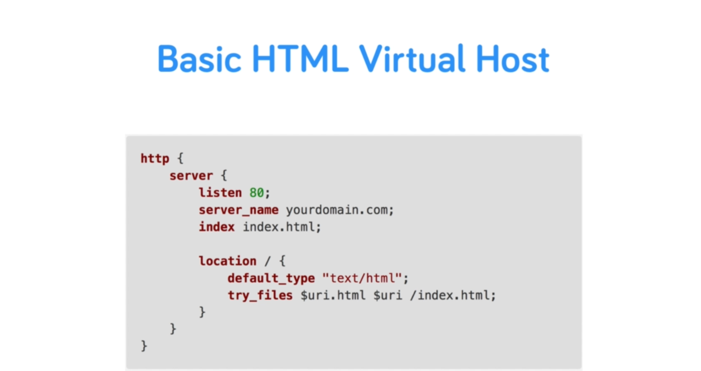
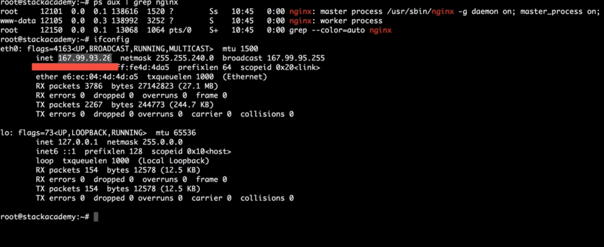
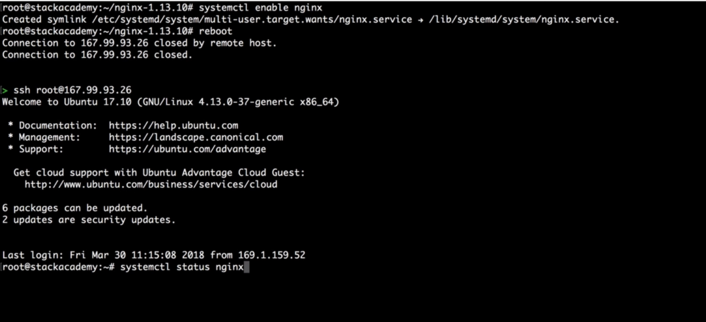
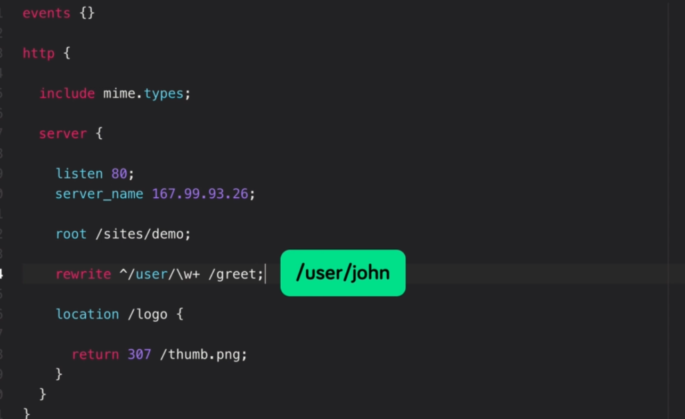
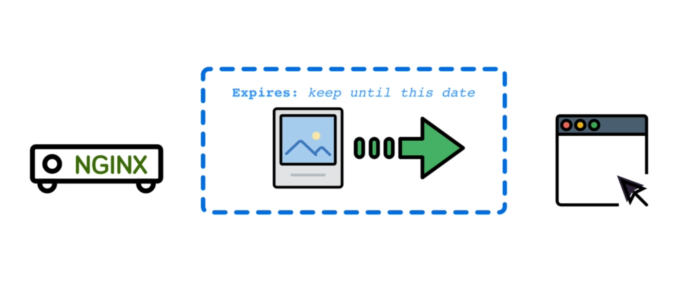
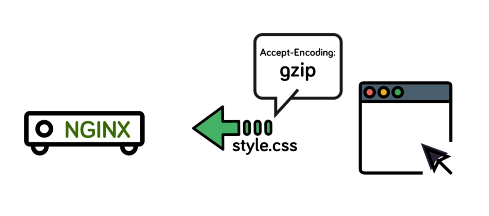
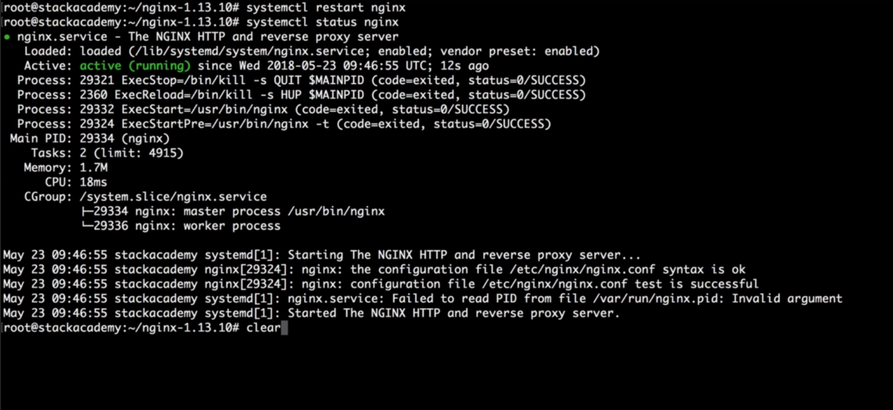

https://www.tecmint.com/tag/nginx-tips/page/2/


# Nginx Fundamentals High Performance Servers from Scratch

## 1. Overview

### 2. About NGINX




https://en.wikipedia.org/wiki/C10k_problem

https://www.nginx.com/resources/glossary/nginx/

### 3. NGINX vs Apache

we'll take a look at nginx design as a reverse proxy server and see how it compares
to Apache.
By default, Apache is configured in what's called prefork mode meaning that had spawned a set number of processors
each of which can **serve a single request at a time** regardless of whether that request is for appear to be script or an image.
nginx on the other hand deals that requests asynchronously meaning that a single nginx process **can serve multiple requests concurrently with that number basically just depending on the system resources available to the engine x process**.
That said because if there's asynchronous design nginx unlike Apache can't embed server-side programming
languages into its own processes meaning that all requests for Dynamic Content has to be dealt with by a completely separate process like p.h.p and then reverse proxy back to the client via nginx


Now this might sound somewhat overcomplicated but it's actually fairly simple to set up and will cover it in depth.
Of course not having to deal directly with embedded programming languages like Apache does makes nginx a lot less resource hungry.
Now this doesn't mean that the resources used for the processing of server side languages is simply free up.
Rather they are being allocated elsewhere like in the most common case of php to the php process.
But it does mean that unlike Apache server side language modules don't need to be run for every single request the server receives instead.


**Performance**


nginx will handle serving static resources without php ever knowing about it.
Whereas Apache will handle every request with that costly overhead.
 => And this is exactly where the real-world savings on system resources come into effect.


So essentially a well-configured nginx web server serving mixed content meaning both static and dynamic resources should always be more efficient and less demanding on system resources than a similar
Apache set up.
How does this relate to performance then you most likely read or heard that engine X is faster than Apache.
After all one of nginx Corps develop and focus this was that of performance.
But it's really important to first define what's meant by fast.
Engine X can't magically deliver data to the client any faster than the internet connection will allow.
But it can serve static resources much faster than Apache and B handle a much larger number of concurrent
requests.


Remember nginx will **serve static resources** without the need to involve any server side languages.
And this gives it quite an advantage over Apache.
And as for handling concurrent requests nginx can potentially receive thousands of requests on a single processing thread and respond to them as fast as it can without turning down any of those requests.
Apache on the other hand will accept a request up to the preconfigured number and then simply reject the rest.
So if we define the performance or being fast in terms of how many clients can be served under high load assuming the usual mix of static and dynamic resources then yes engine exist differently faster than Apache.


nginx is configuration also takes a very different approach to have patches in their requests.
Locations first whereas Apache default to and highly favors filesystem locations.
This preference for file system locations can also be seen in the use of .htaccess files for overriding specific directory configurations.
Engine X doesn't offer any similar functionality.
But seeing as apache's .htaccess overrides significant performance penalty.
They shouldn't really be considered an advantage.


https://trends.google.com/trends/explore?date=all&q=nginx


It's also because of this very design of interpreting requests.
As you are locations that allows engine extra easily function as not only a web server but anything
from a load balancer to a mail server.
That brings us to the end of this video and hopefully you now have a better understanding of what nginx is and why we want to use it in the next section of the Course we'll get started with installing nginx.

## 2. Installation

### 1. Server Overview


Create new server

```shell

## run to connect to the server
ssh root@167.128.1.24

```

https://filezilla-project.org/

https://cyberduck.io/

https://panic.com/transmit/

https://www.digitalocean.com/

### 2. Installing with a Package Manager


=> apt package manager 

```shell
apt-get update
apt-get install nginx

ps aux | grep nginx

```


choose Yes





All users listing detailed information and X include boot processors which we can then byp through grep to only see the engine X results and there we have it the engine X master process and a single worker process.

Then copy IP address

 Navigate to that IP in the browser.

---


- yum - alternative solution + cenos
- `ls -l /etc/nginx/`
- `yum check update`


https://fedoraproject.org/wiki/EPEL

### 3. Building Nginx from Source & Adding Modules

http://nginx.org/en/docs/configure.html

http://nginx.org/en/download.html

Vào download


run `./configure` again


Run


Then run `make` command

```shell
make
```


### 4. Adding an NGINX Service

Xem systemd

https://www.nginx.com/resources/wiki/start/topics/examples/initscripts/

https://www.nginx.com/resources/wiki/start/topics/examples/systemd/

https://www.freedesktop.org/wiki/Software/systemd/


=> stop nginx


create file nginx.service

```ini
[Unit]
Description=The NGINX HTTP and reverse proxy server
After=syslog.target network-online.target remote-fs.target nss-lookup.target
Wants=network-online.target

[Service]
Type=forking
PIDFile=var/run/nginx.pid
ExecStartPre=/usr/bin/nginx -t
ExecStart=/usr/bin/nginx
ExecReload=/usr/bin/nginx -s reload
ExecStop=/bin/kill -s QUIT $MAINPID
PrivateTmp=true

[Install]
WantedBy=multi-user.target
```


run `systemctl stop nginx`




=> check status again

**nginx for Windows**

http://nginx.org/en/docs/windows.html

## 3. Configuration

### 1. Understanding Configuration Terms


Main context


The two main configuration terms is **context** and **directive**.
**Directive**: A specific configuration options that get set in the configuration files and consist of a name and a
value context on the other hand a sections within the configuration where directives can be set for
that given context.(e.g: `listen 80`)
Essentially **context** is the same as scope and like scope context are also nested and inherit from their
parents with the topmost context simply being the configuration file itself.
This is called the main context and is where we configure global directives that apply to the master
process.


Are there important contexts include the HTTP context for anything HTTP related the server context which
is where we define a virtual host similar to an Apache V host and location contexts for matching.
You are right locations on incoming requests to the parent server context again when using the engineer's
documentation.
These terms will be used for each directive so they are important to understand.
In the next lesson we'll start putting all this into practice by creating our very first virtual host.

### 2. Creating a Virtual Host


nginx.conf

```ini
events {}

http {

  include mime.types;

  server {

    listen 80;
    server_name 167.99.93.26;

    root /sites/demo;
  }
}

```

Then first thing we're going to want to define a **virtual host**.
Each virtual host being a new server context or server block like so a virtual host or server context
is essentially responsible for listening on a port typically bought 80 four http or 443 https for a given IP address or domain.


Now you could leave out this **listen** directive.
In which case engineers will assume port 80 by default but it is considered good practice to include
it anyway.

Next we'll said the **server name** which is the domain sub domain or IP address for which the server context exists.
In our case not having the domain name configured.
I'll simply use the IP address of this machine now.

> Note that server names can also include wildcard characters asterisks which in the case of this example
> will accept connections for any sub domain of this domain.
> Not ever common use case but just something to be aware of.


 Finally will define the **root** directive.
> This being the root path from which engine X will be serving requests or interpreting static requests
> from.
> For example say the server receives a request for images slash cat dog PRNG by default engine X will
> look for that file in the root path.
> So whatever we said this root directive to slash images slash cat.png. Meaning we'll said this
> to slash sites slash demo in order to serve static requests from that demo directory.
> Save that and now for these changes to take effect will have to reload the and XT configuration using
> our system D service.


We use the reload command over the restart command as this way we prevent any downtime.
If the configuration contains any errors the reload will simply fail but not stop engine X with the
current configuration.

```shell
reload nginx
```

Where's a restart will first stop engine X and then should the new configuration contain any errors.
Refuse to start back up.
Not what we want.

```shell
restart nginx
# not run => reload is ok
```

We could of course also manually verify this new configuration by running nginx with a T flag.
Like so syntax is okay.

```powershell
nginx -t

reload nginx
```


Then run `reload nginx`

> Lúc này check page html không apply được css dù có load rồi vì content type là text/plain


Check mine.types


=> work fine

### 3. Location blocks

as.conf

```ini
events {}

http {

  include mime.types;

  server {

    listen 80;
    server_name 167.99.93.26;

    root /sites/demo;

    # Preferential Prefix match
    location ^~ /Greet2 {
      return 200 'Hello from NGINX "/greet" location.';
    }

    # # Exact match
    # location = /greet {
    #   return 200 'Hello from NGINX "/greet" location - EXACT MATCH.';
    # }

    # # REGEX match - case sensitive
    # location ~ /greet[0-9] {
    #   return 200 'Hello from NGINX "/greet" location - REGEX MATCH.';
    # }

    # REGEX match - case insensitive
    location ~* /greet[0-9] {
      return 200 'Hello from NGINX "/greet" location - REGEX MATCH INSENSITIVE.';
    }
  }
}

```


This is the most used context in any nginx configuration and it's how will define and configure
the behaviour of specific URI of requests.
Think of location blocks as intercepting a request based on its value and then doing something other
than just trying to serve a matching file relative to the root directory as we saw in the previous lesson.
This standard behaviour is great for static resources such as our style sheet to this image etc..

```ini
# # Prefix match
location /greet {
  return 200 'Hello from NGINX "/greet" location - EXACT MATCH.';
}
# => all startWiths greet will be matched

# # Exact match
location = /greet {
  return 200 'Hello from NGINX "/greet" location - EXACT MATCH.';
}
```

Run `systemctl reload nginx` 

> There are several ways of matching you our eyes on location blocks and the one we just used is called
> the prefix match.

```ini
# # REGEX match - case sensitive
    # location ~ /greet[0-9] {
    #   return 200 'Hello from NGINX "/greet" location - REGEX MATCH.';
    # }

    # REGEX match - case insensitive
    location ~* /greet[0-9] {
      return 200 'Hello from NGINX "/greet" location - REGEX MATCH INSENSITIVE.';
    }
```

Note that this told a modifier is case sensitive.

> To use insensitive regex, you can use `~*` instead of `~`

```ini
 # Preferential Prefix match
 #   location /Greet2 {
 #     return 200 'Hello from NGINX "/greet" location.';
 #   }
 # => change to because if we have ~* /greet[0-9] it will get it when we navigate to /Greet2
 
  # Preferential Prefix match
    location ^~ /Greet2 {
      return 200 'Hello from NGINX "/greet" location.';
    }
```


Reload and the regular expression matched all ones regardless even if the order in which these location
blocks are configured the final modifier is what's called preferential prefix which we write as carit
told her.
This is essentially the same as the basic prefix modifier only **more important than a regular expression**
**match** save and reload.
The prefix wins over the regular expression.
It's important to understand the order of priority in which nginx matches requests.


### 4. Variables

https://www.nginx.com/resources/wiki/start/topics/depth/ifisevil/

test.conf

```ini
events {}

http {

  include mime.types;

  server {

    listen 80;
    server_name 167.99.93.26;

    root /sites/demo;

    set $mon 'No';

    # Check if weekend
    if ( $date_local ~ 'Monday' ) {
      set $mon 'Yes';
    }


    location /is_monday {

      return 200 $mon;
    }
  }
}

```


https://nginx.org/

=> documentation => 

- [Alphabetical index of directives](https://nginx.org/en/docs/dirindex.html)
- [Alphabetical index of variables](https://nginx.org/en/docs/varindex.html)


```ini
events {}

http {

  include mime.types;

  server {

    listen 80;
    server_name 167.99.93.26;

    root /sites/demo;

    location /inspect {

      return 200 "$host\n$uri\n$args";
    }
  }
}

```

Run `systemctl reload nginx` 


```ini
events {}

http {

  include mime.types;

  server {

    listen 80;
    server_name 167.99.93.26;

    root /sites/demo;

    location /inspect {

      return 200 "Name: $arg_name";
    }
  }
}

```


```ini
events {}

http {

  include mime.types;

  server {

    listen 80;
    server_name 167.99.93.26;

    root /sites/demo;

    set $mon 'YES';

    # Check if weekend
    if ( $date_local ~ 'Saturday|Sunday' ) {
      set $mon 'NO';
    }


    location /is_monday {

      return 200 $mon;
    }
  }
}
```

local date hold ISO datetime string


### 5. Rewrites & Redirects

https://developer.mozilla.org/en-US/docs/Web/HTTP/Status


Now that we have an understanding of nginX variables we can move on to rewrites or simply redirect. 
In some cases the two directives we can use for rewriting requests is the rewrite directive and the return directive which we've already used several times throughout this course and being the same bluff.
The two very important however the return statement as we've been using it takes a status code and response data or strings.


But in the case of that response code being a 300 variant which is four redirects the return directives behaviour changes in it then except a URI as the second parameter.

To which the client should be redirected.

```ini
events {}

http {

  include mime.types;

  server {

    listen 80;
    server_name 167.99.93.26;

    root /sites/demo;
    
    location /logo {

      return 307 ./thumb.png;
    }
  }
}

```

now go to 167.99.93.26/logo you can redirect to image


I'll say Carrott So starting with Slash user slash and then `w+`.
So more than one word character with the second argument being the new you are try to rewrite this to
slash greet.



The rewritten greet you are I start to right from the top again and will get re-evaluated again.


```ini
events {}

http {

  include mime.types;

  server {

    listen 80;
    server_name 167.99.93.26;

    root /sites/demo;

	# rewrite ^/user/(\w+)/(abc) /greet/$1 $2 last;
    rewrite ^/user/(\w+) /greet/$1 last;
    rewrite ^/greet/john /thumb.png;

    location /greet {

      return 200 "Hello User";
    }

    location = /greet/john {
      return 200 "Hello John";
    }
  }
}

```


Navigate .../user/john => go to image => add `last`

Now what the `last` flag allows us to do is essentially tell nginX not to allow you are right to be
rewritten any more on this first rewrite add lost.
So still re-evaluate the new you are right after the rewrite but make sure this is the last time it
gets rewritten meaning it should skip over the second rewrite save reload request that same you are
row with a reload and we're back to hello John.

### 6. Try Files & Named Locations


try files as with the return and rewrite directives can be used in the server context.
So applying to all incoming requests or inside a location context with trifles allows us to do is have nginX check for a resource to respond worth in any number of locations relative to the root directory with a final argument that results in a rewrite and re-evaluation.
As with the rewrite directive.
This is a directive that is so unique in its behaviour.
I'd suggest you really try out in a number of ways using a simple test configuration but nonetheless will cover some arbitrary examples.


```ini
events {}

http {

  include mime.types;

  server {

    listen 80;
    server_name 167.99.93.26;

    root /sites/demo;


    try_files /thumb.png /greet;

    location /greet {
      return 200 "Hello User";
    }

  }
}

```


So what this directive is doing then all the time being in the server context is checking whether `sites/demo/` thumb.png exists and if it does serve it.
If however this first argument doesn't exist move on and try the next one and so on.
In our case some thumb.png definitely exists relative to the root directory so this should be served
for all requests.
Save this and reload the configuration.

Navigate to `167.99.93.26` : if we have thumb.png => show thumb image

change `try_files /thumb.png /greet;` => `try_files /cat.png /greet;`

Navigate to `167.99.93.26/style.css` : if we don't have cat.png => show /greet res

```ini
events {}

http {

  include mime.types;

  server {

    listen 80;
    server_name 167.99.93.26;

    root /sites/demo;


    try_files $uri /cat.png /greet @friendly_404;

    location @friendly_404 {
      return 404 "Sorry, that file could not be found.";
    }


    location /greet {
      return 200 "Hello User";
    }

  }
}

```

Navigate to `167.99.93.26/thumb.png`, `167.99.93.26/style.css`, `167.99.93.26/index.html` : if we have thumb.png => show corresponding page


`@`

Very last thing I want to show in this lesson is named locations.
This being a concept which you might run into at some point and name location simply means assigning
a name to a location context and using a directive such as Try files.
Use that location by its name ensuring no revaluation has to happen on that final argument but instead
just a definite call to the name location to name a location then more specifically this friendly underscore
404 for use an at sign with a name at friendly underscore 404 for doing the same on the location in
order to you name it.


### 7. Logging

http://nginx.org/en/docs/ngx_core_module.html#error_log

https://docs.nginx.com/nginx/admin-guide/monitoring/logging/

http://nginx.org/en/docs/http/ngx_http_log_module.html


> log_format is only allowed in the http part of the nginx config. I changed the example accordingly

```ini
log_format upstreamlog '[$time_local] $remote_addr - $remote_user - $server_name '
                        'to: $upstream_addr: $request upstream_response_time $upstream_response_time '
                        'msec $msec request_time $request_time';
```


NGINX provides us two log types error logs and access logs a log.
As the name suggests for anything that failed or didn't happen as expected and access logs to log all
requests to the server.
Logging is an extremely important aspect of not only in generics but web servers in general as logs
allow us to track down errors or even identify malicious users.
Logging has also enabled by default.


So for that reason most of the time leaving the lock configuration as is will be fine but understanding
how to change them is definitely important and disabling logs for certain conditions or creating resource
specific logs can both help lower resource usage and improve the log file structure.


Test


Xóa hết location trong file conf và anvigate lại rồi check log


```ini
    root /sites/demo other/test;
# reload
```


Change


Navigate to `/secure`


```ini
events {}

http {

  include mime.types;

  server {

    listen 80;
    server_name 167.99.93.26;

    root /sites/demo;

    location /secure {

      # Add context specific log
      access_log /var/log/nginx/secure.access.log;
      
      # Another file
      access_log /var/log/nginx/access.log;

      # Disable logs for context
      #access_log off;

      return 200 "Welcome to secure area.";
    }

  }
}

```

### 8. Inheritance & Directive types


Gồm 3 loại


```ini
events {}

######################
# (1) Array Directive
######################
# Can be specified multiple times without overriding a previous setting
# Gets inherited by all child contexts
# Child context can override inheritance by re-declaring directive
access_log /var/log/nginx/access.log;
access_log /var/log/nginx/custom.log.gz custom_format;

http {

  # Include statement - non directive
  include mime.types;

  server {
    listen 80;
    server_name site1.com;

    # Inherits access_log from parent context (1)
  }

  server {
    listen 80;
    server_name site2.com;

    #########################
    # (2) Standard Directive
    #########################
    # Can only be declared once. A second declaration overrides the first
    # Gets inherited by all child contexts
    # Child context can override inheritance by re-declaring directive
    root /sites/site2;

    # Completely overrides inheritance from (1)
    access_log off;

    location /images {

      # Uses root directive inherited from (2)
      try_files $uri /stock.png;
    }

    location /secret {
      #######################
      # (3) Action Directive
      #######################
      # Invokes an action such as a rewrite or redirect
      # Inheritance does not apply as the request is either stopped (redirect/response) or re-evaluated (rewrite)
      return 403 "You do not have permission to view this.";
    }
  }
}

```

### 9. PHP Processing

```ini
user www-data;

events {}

http {

  include mime.types;

  server {

    listen 80;
    server_name 167.99.93.26;

    root /sites/demo;

    index index.php index.html;

    location / {
      try_files $uri $uri/ =404;
    }

	# all file end with .php
    location ~\.php$ {
      # Pass php requests to the php-fpm service (fastcgi)
      include fastcgi.conf;
      fastcgi_pass unix:/run/php/php7.1-fpm.sock;
    }

  }
}

```


If you recall from the first section of this course I mentioned that NGINX isn't able to embed its
server side language processors so instead then we'll configure a standalone PHP service namely phpfpm to which engine X will pass the request for processing and then upon receiving the response typically has html return there to the client.
This is essentially engine X functioning as a reverse proxy server.


One of the strong points but we'll dig into that specific topic later on in the course.

Install


Check


Sau khi reload run lại `.../info.php` thì err

=> Check log


=> nobody


add `user www-data;` into conf => reload


Check it again


### 9.1 Understanding and Implementing FastCGI Proxying in Nginx

https://www.digitalocean.com/community/tutorials/understanding-and-implementing-fastcgi-proxying-in-nginx


### 10. Worker Processes


Throughout this course when checking their engineers processor status via either `systemctl` we've
seen this differentiation between a **master process and a worker process**.
So in this case and we'll cover what we're seeing here and how to optimize these engine X processors.


First off know that the master process is the actual nginx service or software instance which we
started that **Master process** or NGINX itself.
Then **Spawn's work processes** which listens for and respond to client requests.
The *default number of worker processes for NGINX being 1* which is what we are seeing here to change
the number of worker processes engine exported.
Then we can use the `worker_processes` directive over the engine next of kin.

Change `worker_processes 2;`


>Now increasing the number of workers engineers Spawn's doesn't necessarily equate to better performance.
>If you recall from earlier in the course when we discussed the architecture of NGINX and NGINX
>process specifically these worker process S handling requests is asynchronous meaning they will handle
>incoming requests as fast as the hardware is capable of and creating a second worker process simply
>does not increase the hardware's ability.


So a dual core quad core or even OK to core those cores cannot share processes meaning a single NGINX worker process can only ever run on a single CPU call.
And with that basic knowledge then we can.
99% of the time configure NGINX to run the exact number of processes as the server see you has.


Cause it's just that simple.
So if you're tempted to create a higher number of worker processes in the hope that your server will
perform better.
Think of two worker processes on a single core as having two workers capable of only running at 50 percent
instead of one dedicated process running optimally at 100 percent.

A much better alternative which will see demonstrated in the configuration in a second.
At this point you might very well know how many cores your server has but if not we have two basic commands
that will tell us first that the simplest of the two run `nproc` and I get one as this is a very basic
single core digital ocean virtual machine.
The second command which will give you some more detailed information is `lscpu` and there we have it quite verbose but useful to know with the number of CPU caused.


The next related directive will finally jump us into this **event** context worker connections.
This sets the number of connections.
Each worker process can except again not a number we can simply increase your server has a limit to
how many files can be opened at once.


For again each CPU Core we can again quickly check that open fire limit by running `ulimit -n`.


Meaning that we can set this directive to that number in order to really Max out the server.
Very importantly note that we now also have the maximum number of concurrent requests.


Our server should be able to accept work processes times worker connections as each of these worker
processes can open this many connections or requests. => set 1024 into file conf

```ini
user www-data;

worker_processes auto;

events {
  worker_connections 1024;
}

http {

  include mime.types;

  server {

    listen 80;
    server_name 167.99.93.26;

    root /sites/demo;

    index index.php index.html;

    location / {
      try_files $uri $uri/ =404;
    }

    location ~\.php$ {
      # Pass php requests to the php-fpm service (fastcgi)
      include fastcgi.conf;
      fastcgi_pass unix:/run/php/php7.1-fpm.sock;
    }

  }
}

```


If you recall from the installation section of the Course we set the default location for the engine
next process **pid** during the configure step.
What this directive allows us to do then is reconfigure the process.
**pid** location via the configuration file 


But let's say for whichever reason we need to change this without rebuilding in generics we can use
this directive. 

```ini
pid /var/run/new-nginx.pid
```

Reload.


### 11. Buffers & Timeouts

http://nginx.org/en/docs/syntax.html

#### Configuration file measurement units
Sizes can be specified in bytes, kilobytes (suffixes k and K) or megabytes (suffixes m and M), for example, “1024”, “8k”, “1m”.

Offsets may be also specified in gigabytes using g or G suffixes.

Time intervals can be specified in milliseconds, seconds, minutes, hours, days and so on, using the following suffixes:

> ms	milliseconds
> s	seconds
> m	minutes
> h	hours
> d	days
> w	weeks
> M	months, 30 days
> y	years, 365 days

Multiple units can be combined in a single value by specifying them in the order from the most to the least significant, and optionally separated by whitespace. For example, “1h 30m” specifies the same time as “90m” or “5400s”. A value without a suffix means seconds. It is recommended to always specify a suffix.

Some of the time intervals can be specified only with a seconds resolution.


```ini
user www-data;

worker_processes auto;

events {
  worker_connections 1024;
}

http {

  include mime.types;

  # Buffer size for POST submissions
  client_body_buffer_size 10K;
  client_max_body_size 8m;

  # Buffer size for Headers
  client_header_buffer_size 1k;

  # Max time to receive client headers/body
  client_body_timeout 12;
  client_header_timeout 12;

  # Max time to keep a connection open for
  keepalive_timeout 15;

  # Max time for the client accept/receive a response
  send_timeout 10;

  # Skip buffering for static files
  sendfile on;

  # Optimise sendfile packets
  tcp_nopush on;

  server {

    listen 80;
    server_name 167.99.93.26;

    root /sites/demo;

    index index.php index.html;

    location / {
      try_files $uri $uri/ =404;
    }

    location ~\.php$ {
      # Pass php requests to the php-fpm service (fastcgi)
      include fastcgi.conf;
      fastcgi_pass unix:/run/php/php7.1-fpm.sock;
    }

  }
}

```

#### Buffering


Buffering is when a process or an NGINX worker in this case reads data into memory or RAM before
writing it to its next destination.


For example NGINX receives a request which it reads from tcp port 80 in this case writes
that request data to memory which is buffering.
Or if the buffer is too small for the amount of data being read write some of it to disk.


The opposite of this then is that NGINX response to a request with say a static file which it reads
from disk into memory so buffering the file and send that data to the client from memory.
This happens as the name implies to create a buffer or layer of protection between reading and writing
of data.

A process which can get extremely complicated but for the purposes of configuring NGINX just have
an understanding of what it is.
In order to better understand configuring these directives timeouts are pretty self-explanatory.


Timeouts simply suggest a cut off time for a given event.


If receiving a request from a client stop after a certain number of seconds thus preventing a client
from sending an endless stream of data and eventually breaking the server.
OK.
The first directive we have here then in the HTP context so essentially applying to our entire configuration
is the client body buffer size.

```ini
# Buffer size for POST submissions
  client_body_buffer_size 10K;
  client_max_body_size 8m;
```

This directive then setting the amount of memory to allocate for buffering the post data from a client
post data most likely coming from a form submission which in this case is set to 10 k or 10 kilobits
for data sizes.


Well in this case no reason other than a basic form submission should be well under that.
Increasing this number to more than what we need will allocate and essentially waste memory on our server
and making a too small will require NGINX to write part of this buffer to disk which is a lot slower
than writing it to memory.
Your website might very well rely on much larger form submissions in which case you'll definitely want
to increase this.


Second Then we have client Max body size set to 8 megabytes.
Meaning don't accept post requests of more than 8 megabytes.
If it is larger than 8 Make the server will respond with a 4 1 3 error which is request entity too large.

  

Again this being a safety measure to ensure a user doesn't mistakenly or maliciously send a very large
post request which could cause the server to slow down.
Use up a lot of disk space etc..
8m being a fairly safe element that should still allow most standard images to be uploaded and so
on.

```ini
# Buffer size for Headers
  client_header_buffer_size 1k;
```

Those two directives dealing with post requests the next one is **the client header buffer size** as the
name suggests the amount of memory to allocate to reading request headers.
One killer by being more than enough for 99 percent of requests.  

It is typically being a small amount of data.
Then still fine tuning incoming requests.

```ini
# Max time to receive client headers/body
  client_body_timeout 12;
  client_header_timeout 12;
```


We have the two major client timeouts client body time out and client header time out both of which
I have set to a very short 12 milliseconds.
Importantly in this case the body timeout does not refer to the time it takes to transmit the entire
request body but rather the time between consecutive read operations.
Those reads that happen to the buffer.
Both of these default to 60 seconds which in my opinion is way too long but again feel free to adjust
as you see fit as before.
NGINX allows us to sit times as either a number only like this which indicates milliseconds with
an S for seconds all the way up to years which will obviously not ever be applicable to Directive such
as these timeouts.


```ini
# Max time to keep a connection open for
  keepalive_timeout 15;
```

This directive sets the amount of time engineers should keep a connection to a clear and open for in
case more data is on the way.
This is extremely useful when say a client is requesting a number of files and keeping a connection
open reduces the time it takes to open another new connection.
Equally not wanting to leave connections open for too long as this can result in a pool of max connections
this time.
This being used up. Unlikely but quite disastrous.
Should it happen for the most part.
There's no reason a connection would have to stay open beyond a few milliseconds before continuing.
And most clients will close connections properly meaning this time out won't even apply.
But giving you have the server resources.
Feel free to increase this number to even a couple of seconds.

```ini
# Max time for the client accept/receive a response
  send_timeout 10;
```

And our last time out being the all important send time out.
Meaning if a client does not receive any of the response data in this amount of time doesn't have to
be all of the response data. But none offered at all.

```ini
# Skip buffering for static files
  sendfile on;

  # Optimise sendfile packets
  tcp_nopush on;
```

Send file meaning we're sending a client data from dusk.
So typically a static fire like an image etc..
Don't use a buffer.


Read their data from the desk and write it directly to the response.
With dcb no push enabling engine X to optimize the size of those data packets being sent to the client.
Two very simple but incredibly valuable directives that will especially help optimize site with a large
number of static resources.

### 12. Adding Dynamic Modules

http://nginx.org/en/docs/http/ngx_http_image_filter_module.html


Now that you have a good understanding of installing and configuring NGINX one of the final configuration
tasks is that of making more functionality available or in other words adding new engineers modules
in this place and then we'll see how to add modules to an existing engineers install by rebuilding the
source.


But more specifically do so with a dynamic module dynamic modules being modules we can load selectively
from the engine configuration unlike static modules which is always loaded before we start.
Note that adding standard modules is exactly the same as adding dynamic modules as is upgrading NGINX itself to a newer version just something to keep in mind.
As I mentioned then in order to add new modules to engine X will have to rebuild engine X from source
meaning as with the installation section of the course.


I still have the original source I downloaded right here in the root users home directory including
that extracted directory containing the actual source code.
I'll change into this directory this being where we originally built this install from.
And it's perfectly reusable.
Of course at this point should nginx have released a new version.
You could also download that in bold the newer version instead which is all there is to upgrading nginx.
**Step 1** to rebuilding in X then is making sure we don't change any of the existing configuration which
we can very easily get by running `nginx -V`

This being the configuration with which the current install was built.
So immediately copy that as we all want to use the exact same configuration.
Only adding are new modules having copied that

Run `./configure --help`


But this time filter through grep looking for only lines containing dynamic.
And there we have it not many but still a few to choose from.
I'll add this HTTP image filter module to demonstrate so post the original configuration command.
We copied a minute ago and simply add to this the module flag as it's listed here in order to have this
module compiled into nginx
With that equals dynamic string telling engine X to compile this as a dynamic module.
Now whilst running this as is will be fine.


We've configured our engineers install to have all its configuration files at slash iti see slash nginx meaning to have these dynamic modules at that same location which is going to make enabling them much
easier.
We also have to specify the module spark off which we can do by adding a flag modules Poff setting that
`etc/nginx/modules`.

> Run will be failed
>
> And very quickly the configuration files HTP image filter module **requires the GD library** which is
> an image processing module for Linux.
> A dependency of this image filter module clear this install that module via a peetie by running apt
> get install labbd-dev.

```shell
apt-get install libgd-dev

# After that run above command again to make it success
./ configure .....
```


```shell
# run this command
make
make install
```

Try configuring the NGINX source again fast forward and this time it works confirming all other configuration
paths including that new modules directory compile the newly configured source code by running `make`
as we did during the installation.
Fast forward again as this is quite a long process.
And once that's done run `make install` which installs the newly compiled source over the existing engine
exe install.


navigate to `.../thumb.png`

```ini
user www-data;

worker_processes auto;

load_module modules/ngx_http_image_filter_module.so;

events {
  worker_connections 1024;
}

http {

  include mime.types;

  # Buffer size for POST submissions
  client_body_buffer_size 10K;
  client_max_body_size 8m;

  # Buffer size for Headers
  client_header_buffer_size 1k;

  # Max time to receive client headers/body
  client_body_timeout 12;
  client_header_timeout 12;

  # Max time to keep a connection open for
  keepalive_timeout 15;

  # Max time for the client accept/receive a response
  send_timeout 10;

  # Skip buffering for static files
  sendfile on;

  # Optimise sendfile packets
  tcp_nopush on;

  server {

    listen 80;
    server_name 167.99.93.26;

    root /sites/demo;

    index index.php index.html;

    location / {
      try_files $uri $uri/ =404;
    }

    location ~\.php$ {
      # Pass php requests to the php-fpm service (fastcgi)
      include fastcgi.conf;
      fastcgi_pass unix:/run/php/php7.1-fpm.sock;
    }

	# add
    location = /thumb.png {
      image_filter rotate 180;
    }

  }
}

```

reload

Save this and before reloading in generics as I know this isn't going to work.
Check the configuration syntax with `nginx -t`.


Image underscore or falter that they're active we just added the should of course be available as we've
added that h.t. dp image full to module.

  


But remember we added it as a dynamic module meaning that module is not being loaded into INJ and X
by default the module itself exists in the modules part directory we defined list the contents of that
rectory nginx modules and there it is modules having a common dot s o extension so to enable this
module and have engine X load it we can add to the configuration in the main context load underscore
module the path to that module which is why I said having it in the same directory as the engine X configuration
simplifies loading it modules slash hgt body image filter module dot s o.
Relative to this engine X dot com file safe.

```ini
# add
load_module modules/ngx_http_image_filter_module.so;

```


## 4. Performance

### 1. Headers & Expires


Now if you're not familiar with expires headers they're essentially a response header informing the
client or browser how long it can cached that response for.




So for example let's say we have an image or more specifically a photo on our website that photo data
isn't realistically going to change all that often meaning we can tell the browser to cache a copy of
the photo for a relatively long time.


And in doing so avoid any future requests for that photo drastically improving Web site load times and
often overlooked a reduction in requests to our server.


Another resource like a style sheet however which could very well change more frequently.
We could say to a shorter time but still have the browser cache it none the less.

```ini
user www-data;

worker_processes auto;

events {
  worker_connections 1024;
}

http {

  include mime.types;

  server {

    listen 80;
    server_name 167.99.93.26;

    root /sites/demo;

    index index.php index.html;

    location / {
      try_files $uri $uri/ =404;
    }

    location ~\.php$ {
      # Pass php requests to the php-fpm service (fastcgi)
      include fastcgi.conf;
      fastcgi_pass unix:/run/php/php7.1-fpm.sock;
    }

    location = /thumb.png {
      add_header add_header "Hello world";
    }

  }
}

```


So knowing how to said headers we can configure this location as a typical static resource by first
setting the **cache control header** to public telling the receiving client that this resource or response
can be cached in any way.
Then the **pragma header** also to public.
Essentially *just an older version of this cache control header* 

then else relate it but equally important **header vary** meaning the content of this response can vary with the value being except encoding.
This is something we'll cover in more depth in the next lesson but essentially saying the response can
vary based on the value of the request header except encoding.
And finally to set the expires head up on this response.
Engine X provides us a very convenient directive called expires.

```ini
location = /thumb.png {
      add_header Cache-Control public;
      add_header Pragma public;
      add_header Vary Accept-Encoding;
      expires 1M;
    }
```


Make that same call request again and this time we get an expires header with the date set to exactly
one month ahead of this recording including those additional headers we said and another cache control
header added by the expires directive.
With this being the number of seconds in 30 days or one month as we set it.

```ini
location ~* \.(css|js|jpg|png)$ {
      access_log off;
      add_header Cache-Control public;
      add_header Pragma public;
      add_header Vary Accept-Encoding;
      expires 1M;
    }
```


### 2. Compressed Responses with gzip

http://nginx.org/en/docs/http/ngx_http_gzip_module.html



What this means is when a client requests a resource typically a static file such as Javascript or C
S S that client can indicate its ability to accept compressed data.
All modern browsers been capable of this meaning we can compress a response on the server typically
using geyser which drastically reduce its size and as a result reduces the time it takes for the client
to receive that response which the client or browser.


```ini
user www-data;

worker_processes auto;

events {
  worker_connections 1024;
}

http {

  include mime.types;

  # add
  gzip on;
  gzip_comp_level 3;

  gzip_types text/css;
  gzip_types text/javascript;

  server {

    listen 80;
    server_name 167.99.93.26;

    root /sites/demo;

    index index.php index.html;

    location / {
      try_files $uri $uri/ =404;
    }

    location ~\.php$ {
      # Pass php requests to the php-fpm service (fastcgi)
      include fastcgi.conf;
      fastcgi_pass unix:/run/php/php7.1-fpm.sock;
    }

    location ~* \.(css|js|jpg|png)$ {
      access_log off;
      add_header Cache-Control public;
      add_header Pragma public;
      add_header Vary Accept-Encoding;
      expires 1M;
    }

  }
}

```


Also note that this is a standard directive type so enabling that in the HTP context like this means
any child context can very easily override it.
Something to keep in mind.
Next then we need to configure the compression we've just enabled the first direct default set is `gzip_comp_level` which is the amount of compression used a lower number resulting in larger files but requiring
less server resources and a larger number resulting in smaller files but requiring more server resources.
It's important to note however that at levels over 5 the reduction in file size or response size becomes
very minor.


I'll make this three and then we have to sit the file types or mime types to apply this compression
to G's up types setting.
Any number of mime types as arguments for example text slash C assess and text slash javascript Jesus
types is an array directive so we could also write it like this.

> But remember the client still needs to indicate that they're willing to accept a compressed response
> before this will happen.


Nothing about compression in the headers as we did not indicate that we're willing to accept a compressed
response so to do that then as per this very header this time set our own header on this request using
a capital H flag.


Enter and this time having indicated that we can accept compressed responses we get content encoding.
Up meaning this response is encoded with gzip.

Run `curl http://167.99.93.26/style.css` => can watch the res body


So just how much did we save then download these two versions of style dutty assess uncompressed first
as Style.css.
And then compressed as style.mim.css there nine hundred eighty bytes for the uncompressed style
sheet and four hundred eighty seven bytes for the gzip styles which we can confirm by listing the
two files Alice style asterisk.
This might not seem lucky yugio amount of data saved but it's more than half the size of this file.
So when dealing with multiple larger files this can really have a massive impact on load times for the
client.

### 3. FastCGI Cache

3.2 Apache Bench

https://httpd.apache.org/docs/2.4/programs/ab.html

3.3 NGINX Docs ngx_http_fastcgi_module

http://nginx.org/en/docs/http/ngx_http_fastcgi_module.html


  

An NGINX Micro cache is a symbol server side cash that allows us to store dynamic language responses
in order to avoid or at least minimize server side language processing for websites relying heavily
on server side languages and database access such as PHP and MYSQL.
This cash can provide incredible performance benefits and drastically reduce server load.

  

Then let's say a user makes a request for dynamic content nginx passes that request to PHP => respond


Dear Mal at which point NGINX using a micro cache can write that response to disk meaning next time
a user makes the same request.
There's no need at all to even contest PHP
The response can be read from disk.
As with any other static resource and sent to the client.
Of course it's not always going to be quite the straight forward as Dynamic Content is dynamic for a
reason but in this case and we'll see how to configure a micro cache for Patch be using engine X as
fast CGI cache as before.

```ini
user www-data;

worker_processes auto;

events {
  worker_connections 1024;
}

http {

  include mime.types;

  # Configure microcache (fastcgi)
  fastcgi_cache_path /tmp/nginx_cache levels=1:2 keys_zone=ZONE_1:100m inactive=60m;
  fastcgi_cache_key "$scheme$request_method$host$request_uri";
  add_header X-Cache $upstream_cache_status;

  server {

    listen 80;
    server_name 167.99.93.26;

    root /sites/demo;

    index index.php index.html;

    # Cache by default
    set $no_cache 0;

    # Check for cache bypass
    if ($arg_skipcache = 1) {
      set $no_cache 1;
    }

    location / {
      try_files $uri $uri/ =404;
    }

    location ~\.php$ {
      # Pass php requests to the php-fpm service (fastcgi)
      include fastcgi.conf;
      fastcgi_pass unix:/run/php/php7.1-fpm.sock;

      # Enable cache
      fastcgi_cache ZONE_1;
      fastcgi_cache_valid 200 60m;
      fastcgi_cache_bypass $no_cache;
      fastcgi_no_cache $no_cache;
    }

  }
}

```

`fastcgi_cache_path` Start by setting fast CGI cache path which as the name suggests takes a filesystem location to which these cash increase can be written.

Then on the same directive add a parameter called levels.
Setting that to `1:2` to like so now the levels parameter is a very poorly documented parameter.
But essentially what it allows us to configure is the depth of directory's to split the cash increase
in two.


If you leave this out engine X will simply write every cash entry directly to this cash path at the
directory which is fine for smaller sites but setting that to this means storing the cache entry in a
directory equal to one character off the end of the cache entry name and then again in another directories
equal to two characters off the end of the cache injury name and so on.
This cache entry name will discuss in a second but it will look something like this.


```ini
  fastcgi_cache_path /tmp/nginx_cache levels=1:2 keys_zone=ZONE_1:100m inactive=60m;
```


Next still on this directive add another parameter keys underscore zone equals the name of this cache.
This can be any descriptive name you choose.
For example my cash or zone 1 etc. followed by a colon character and the size of this cache.
Zone 100 megabytes which should be ample for most sites.
And finally an optional parameter in active which sets how long to keep a cache entry after the last
time it's accessed.
This defaults to 10 minutes if admitted but Al.
Up to 60 minutes.
That's all I'll sit on the cash bath directive although a no more optional parameters does exist.
These just being the key ones.


The second directive we need to configure our `fastcgi_cache_key` a standard directive
that takes a string format from which to create cache entries for example.


Adding this scheme as we did will create to increase one for each http and one for https an important
concept to understand.


Another important point to mention in regard to this cash key format is that this string is hashed or
more specifically m.d. five hashed to create the entry name I referenced earlier when setting the levels.


Okay that's how a microcap configured.

```ini
 # Enable cache
      fastcgi_cache ZONE_1;
      fastcgi_cache_valid 200 60m;
      # fastcgi_cache_valid 404 10m;
      fastcgi_cache_bypass $no_cache;
      fastcgi_no_cache $no_cache;
```

Next then we have to implement this where we want dynamic content to be cached.
And secondly to fine tune the validity of these cash responses.

Let's test the current performance with out our new micro cache.
Now to test this we can use a number of tools but the simplest and preferred one for me is a **Apache bench**.

```shell
apt-get install apache2-utils
# yum install httpd-tools

# test install successfully
# run ab
ab
```


Run


See flag 10 meaning with a concurrency of 10 connections to that I P enter and done.


```shell
# run
nano /sites/demo/index.php
```


add the first line and test again

=> Result like that


Reload the config agian and run `ab ....` again to test


Then with the added benefit of the server not having to use nearly as many resources at the moment.
However we still have no way other than these really fast response times to know whether the request
was actually served from the cache.
Luckily the fast cji Cache module allows us to check the status of a response meaning whether it was
served from cash or not by means of a variable.
**Upstream cash status** which we can pass with the response as a header will add this to all responses.
So in that HTTP context say add header.

I'll call this `X-Cache` x being a naming convention for custom headers upstream cash status.
Save this reload the configuration and now do call request for the headers enter.
And there we have it `x-cache: hit` meaning this was served from the cache so to see a cache Merse we can
simply change the U R L.


**Catch exception**

```ini
# Cache by default
    set $no_cache 0;

    # Check for cache bypass
    if ($arg_skipcache = 1) {
      set $no_cache 1;
    }
    
    location ~\.php$ {
      # Pass php requests to the php-fpm service (fastcgi)
      include fastcgi.conf;
      fastcgi_pass unix:/run/php/php7.1-fpm.sock;

      # Enable cache
      fastcgi_cache ZONE_1;
      fastcgi_cache_valid 200 60m;
      fastcgi_cache_bypass $no_cache;
      fastcgi_no_cache $no_cache;
    }
```

=> Meaning if this variable one by serving this from the caches and don't write the response to the cash
either.


### 4. HTTP2

4.1 How To Create a Self-Signed SSL Certificate for Nginx in Ubuntu 16.04

https://www.digitalocean.com/community/tutorials/how-to-create-a-self-signed-ssl-certificate-for-nginx-in-ubuntu-16-04


NGINX includes a new HTTP 2 module.
And then this lesson we'll take a look at how to enable this module.
After first discussing what http 2 is and why it's worth upgrading from the age old age http1 point
one first off HTTP 2 is a binary protocol where HTTP1 is a textual protocol.
Binary data or ones and zeros is a far more compact way of transferring data.
And it greatly reduces the chance of errors during data transfer.


Secondly HTP to compress this response headers which again reduces transfer time then the single most
important feature for performance is the fact that HTP 2 uses persistent connections and those persistent
connections are also multiplexed meaning that multiple assets such as stylesheets scripts and css, html


l can be combined into a single stream of binary data and transmitted over a single connection.
A http be one of course requiring a dedicated connection for each resource but we'll discuss this
in more detail in a second.
Finally HTTP 2 can perform a **server push** meaning that the client the browser can be informed if assets
such as scripts images or stylesheets along with the initial request for the page will look at this
in the next lesson however.


Connections of HTP to remember that opening a new connection is a time consuming process which is why
developers concatenate multiple javascript or CSS files into single files.
Opening a connection requires a handshake between the client and the server.
And for this to happen headers need to be passed on both ends each time.
There is also a limit to how many concurrent connections a browser can open to a particular domain at
once.
Making these connections even more valuable when trying to maximize client side performance.
In this diagram.

That's one connection the browser now has to process that h.t. email data.
After receiving it from which it can then identify linked resources required by their h.t. email page.
For example two files namely style dotsie assess and script Dodger Es.
So again the browser opens a new connection to the server and requests style dotsie says To which the
server response with the C Ss data that's two connections and the same for script.
RJ es remember h t t be one point one uses simplex streaming.
So one connection handles one request.
That means we use three connections in total to load a very simple web page.
Of course most modern websites will require multiple script files style sheets and images so we can
easily be using 15 plus connections for such a page.
And at that point connection limits in the browser will start coming into effect as well meaning that
some new connections might have to wait for others to be closed first.
All in all this is just not an ideal way of transferring data.


Very importantly a requirement of HTTP2 is S S L or H T T P S meaning before we are able to use H T
T P to will also have to configure the most basic SSL connection which will do.


Add `--with-http_v2_module`


> I mentioned that we also need SSL to be able to use HTP too but that's already been added here.
> Just be aware of that SSL underscore module enter asked forward through this done compile with make
> this being the really long one so fast forward again.

Restart the server after we build fine




Http 1.1


**HTTP2**

Create new folder


No need to really understand what is happening here.
But I'll give a brief rundown anyway.
Open SSL request. To request a new certificate signing `x509` being the cert standard we're requesting days being how
long to make this certificate valid for.
I'll just make this 10 days note which allows us to leave out a pass phrase or password for the key
file `new key` meaning generate a new private key for the signing request at the same time that nuki being
off type `rsa`.
With a length of 2048 bytes writing the key out to slash see slash engine X
slash SSL slash self dot key.
So in that new SSL directory we created and out being where to write the this is difficult to also slash
ebc slash engine X s s l self-taught c r t again.
No need to really understand this.
Just a convenient way to create this private key.
An artist's certificate.
Enter a private key get created and then we get a few questions for the signing request.
Not that important being a test certificate.
Country Code province city organization steck academy a TV business section a name and an email address.
Done.
List the contents of that SSL the rectory to check our files accessed and there it is a private key
and a self signed SSL certificate.
So with that let's first enable SSL or https in the configuration file.
Change the listen directive to.

```ini
listen 443 ssl http2;

ssl_certificate /etc/nginx/ssl/self.crt;
    ssl_certificate_key /etc/nginx/ssl/self.key;
```

Now listen on port `4 4 3` being the standard HTTP board for SSL encrypted connections and add s s l
referring to the SSL module being used for this.
Listen DirecTV configure the location to that SSL certificate we generated again in that HTP context
SSL so difficult out ATC slash engine X slash SSL self dot c r t and in combination with the certificate
tell engine X where to find the signing key SSL certificate key slash EDC slash engine X slash SSL self
dot key.
That's all we need for basic SSL so safe reload the configuration. `systemctl reload nginx`
Back to the browser change url to `https://167.99.93.26/index.html`

```ini
user www-data;

worker_processes auto;

events {
  worker_connections 1024;
}

http {

  include mime.types;

  server {

    listen 443 ssl http2;
    server_name 167.99.93.26;

    root /sites/demo;

    index index.php index.html;

    ssl_certificate /etc/nginx/ssl/self.crt;
    ssl_certificate_key /etc/nginx/ssl/self.key;

    location / {
      try_files $uri $uri/ =404;
    }

    location ~\.php$ {
      # Pass php requests to the php-fpm service (fastcgi)
      include fastcgi.conf;
      fastcgi_pass unix:/run/php/php7.1-fpm.sock;
    }

  }
}

```


Add `http2` after `ssl`


K flag to allow that insecure self signed to difficult enter. And we get automatic fall back to HTTP one.

### 5. Server Push

Nghttp2: HTTP/2 C Library

https://nghttp2.org/

https://www.nginx.com/blog/nginx-1-13-9-http2-server-push/


Disable browser caches


What we can do with a server push implementation then is send these two files style.css and
thumb.png along with this response for index.html
Note however that these browser tools isn't particularly good at displaying how pushed files are delivered.
So instead I'll use a command line tool called N G H T T P.
This is available for all Linux distributions or even for your local development machine.

Run

```shell
apt-get install nghttp2-client
```


With a couple of flags.
N to discard the responses.
Meaning we're only testing them and not saving them to disk.
Why to ignore the self science certificate and S meaning print the response.
Statistics.
Which is exactly what we're interested in.
Post that `index.html` url you are role enter and we see here.
A simple response breakdown confirming that only indexed.
The email was downloaded.
Do that same test again this time.


Adding in `a` flag meaning also request linked assets for this request so style.css and thumb.png

And again as with the browser we see from the timings that these two files were requested and downloaded
at the same time immediately after receiving index.html what we want to achieve then is to run
the first test.
So not requesting these two linked files but still receive them as a result of requesting index.html over to the engine configuration file.


```ini
user www-data;

worker_processes auto;

events {
  worker_connections 1024;
}

http {

  include mime.types;

  server {

    listen 443 ssl http2;
    server_name 167.99.93.26;

    root /sites/demo;

    index index.php index.html;

    ssl_certificate /etc/nginx/ssl/self.crt;
    ssl_certificate_key /etc/nginx/ssl/self.key;

    location = /index.html {
      http2_push /style.css;
      http2_push /thumb.png;
    }

    location / {
      try_files $uri $uri/ =404;
    }

    location ~\.php$ {
      # Pass php requests to the php-fpm service (fastcgi)
      include fastcgi.conf;
      fastcgi_pass unix:/run/php/php7.1-fpm.sock;
    }

  }
}

```

Add new location

That's very rudimentary but essentially all we need to push these two files when indexed hard edged
here mail is requested.
Note that we are not specifying the resource itself but rather the request for the resource.
An important distinction.
Save reload the configuration.

Run that first test with out the a flag.
So the one that only gave us inde.html enter and this time we get all three files automatically
with this asterisk indicating a pushed response.
Also note the significant reduction in process times and the total time for these linked resources to
be received.
So overall a much faster and more efficient way of delivering Web based content for both the server
and the client.

## 5. Security

### 1. HTTPS (SSL)

#### Algorithms Explained: Diffie-Hellman

https://hackernoon.com/algorithms-explained-diffie-hellman-1034210d5100

https://en.wikipedia.org/wiki/Diffie%E2%80%93Hellman_key_exchange


```ini
user www-data;

worker_processes auto;

events {
  worker_connections 1024;
}

http {

  include mime.types;

  server {

    listen 443 ssl http2;
    server_name 167.99.93.26;

    root /sites/demo;

    index index.html;

    ssl_certificate /etc/nginx/ssl/self.crt;
    ssl_certificate_key /etc/nginx/ssl/self.key;

    location / {
      try_files $uri $uri/ =404;
    }

    location ~\.php$ {
      # Pass php requests to the php-fpm service (fastcgi)
      include fastcgi.conf;
      fastcgi_pass unix:/run/php/php7.1-fpm.sock;
    }

  }
}

```

Remove `index.php` keep `index index.html;`


This being as the request is going to our IP address on port 80 for HTP and our server not having any
lesson directives on port 80 to prevent this from happening then we have two options.
Number one is to also listen on port 80 or in other words making our server available over an insecure
connection.
Now whilst this might have been fine just a couple of years ago https has become a standard and really
there's no legitimate reason to use HTP any longer.

=> run `http://167.99.93.26` => err


And on top of security and search engine optimization reasons you'll also sacrifice the added performance
of HTTP 2 as it's only available over SSL option number two then.


And by far the best option is to redirect all http requests to the equivalent HTTP s request.
There's a few ways of achieving this but again the most reliable and easiest is going to be creating
a dedicated virtual host or server context in the http context.
Then I'll add a new server which listens on port 80.

```ini
user www-data;

worker_processes auto;

events {
  worker_connections 1024;
}

http {

  include mime.types;

  # Redirect all traffic to HTTPS
  server {
    listen 80;
    server_name 167.99.93.26;
    return 301 https://$host$request_uri;
  }

  server {

    listen 443 ssl http2;
    server_name 167.99.93.26;

    root /sites/demo;

    index index.html;

    ssl_certificate /etc/nginx/ssl/self.crt;
    ssl_certificate_key /etc/nginx/ssl/self.key;

    # Disable SSL
    ssl_protocols TLSv1 TLSv1.1 TLSv1.2;

    # Optimise cipher suits
    ssl_prefer_server_ciphers on;
    ssl_ciphers ECDH+AESGCM:ECDH+AES256:ECDH+AES128:DH+3DES:!ADH:!AECDH:!MD5;

    # Enable DH Params
    ssl_dhparam /etc/nginx/ssl/dhparam.pem;

    # Enable HSTS
    add_header Strict-Transport-Security "max-age=31536000" always;

    # SSL sessions
    ssl_session_cache shared:SSL:40m;
    ssl_session_timeout 4h;
    ssl_session_tickets on;

    location / {
      try_files $uri $uri/ =404;
    }

    location ~\.php$ {
      # Pass php requests to the php-fpm service (fastcgi)
      include fastcgi.conf;
      fastcgi_pass unix:/run/php/php7.1-fpm.sock;
    }

  }
}

```


Let's see how to improve upon this as Al encryption and make our server more secure in the server context.


The first thing we'll do is disable `S S L` or more specifically the S S L protocol C whilst we still
refer to and write this as s s l the SSL protocol or secure sockets layer has been outdated and replaced
for the most part by the newer and better `t l s` or transport.

```ini
# Disable SSL
    ssl_protocols TLSv1 TLSv1.1 TLSv1.2;

    # Optimise cipher suits
    ssl_prefer_server_ciphers on;
    ssl_ciphers ECDH+AESGCM:ECDH+AES256:ECDH+AES128:DH+3DES:!ADH:!AECDH:!MD5;
```


Lay a security protocol which to an able leaving the SSL protocol out we can do by specifying SSL protocols
`TLS v1` or `TLS v.11` version one point one and `TLS v1.2` there were hgt
be connections now being encrypted using t l s only.
Rather than the older s s l protocol.


Next we can set which cipher suite should be used by the t o s protocol to encrypt our connection.
First we need to tell engine X that we are going to do this by setting the SSL prefer `ssl_prefer_server_ciphers`
directive 2 on then using the SSL scifres directive.
We can set a string of suites to use and ones which should not be used.
Like so each suite year being separated by a colon and the want not to use being prefixed with an exclamation
like this simple m.d.5

```ini
# Enable DH Params
    ssl_dhparam /etc/nginx/ssl/dhparam.pem;

    # Enable HSTS
    add_header Strict-Transport-Security "max-age=31536000" always;

    # SSL sessions
    ssl_session_cache shared:SSL:40m;
    ssl_session_timeout 4h;
    ssl_session_tickets on;
```

`ssl_dhparam` and specify where our generator d.h. parameters can be found.

RUN


Very simple configuration to improve an exclusively SSL enabled side is enabling h s t s or `strict transport
security`. This is a header that tells the browser not to load anything of HDD.
Be meaning we can minimize redirects from Port 80 to board for 4 3.
Just a very small but valuable tweak add a header with the name strict transport security.
And the value of Max age equals one year in seconds.


Next we can enable a simple cash for our `SSL sessions`.
If you recall from a previous lesson I mentioned that the SSL connection involves a handshake between
the client and the server in order to be able to read each other's encrypted data.
This session cash then allows the server to cash those handshakes for a set amount of time.

Thus improving SSL connection times so to configure a session cache zone say SSL session cash the default
cashed I've been bowled in but this is limited to a specific worker process and really not very useful.
So instead then we'll set this to a cash type of shared meaning the session cash is kept in memory and
can be accessed by any worker process.


If there's memory zone and name s s l and a size Auty Meg should be ample for most sites worth an S
S L session time out meaning how long to keep a session cashed for off for hours.
Again this not being a strict setting but 4 hours provides a decent amount of time for returning
users.
And lastly in order to use this session cache with out actually having the server access the cache we
can enable S s l.

Session tickets.
This basically means provide the browser with a ticket which validates the SSL session.
This ticket is issued by the server so it's trusted and allows us to bypass reading from the session
cache.
It does however mean we can disable the memory cache as we cannot be sure the client holds a ticket
but it optimize server resources in reducing SSL session lookups that covers the very most important
parts of fine tuning and optimizing your SSL connection.
So let's make sure this is all still working before finishing up.
Save all this check the current configuration for any errors.
Everything is fine reload and when I perform a call request we get that expected indexed.


