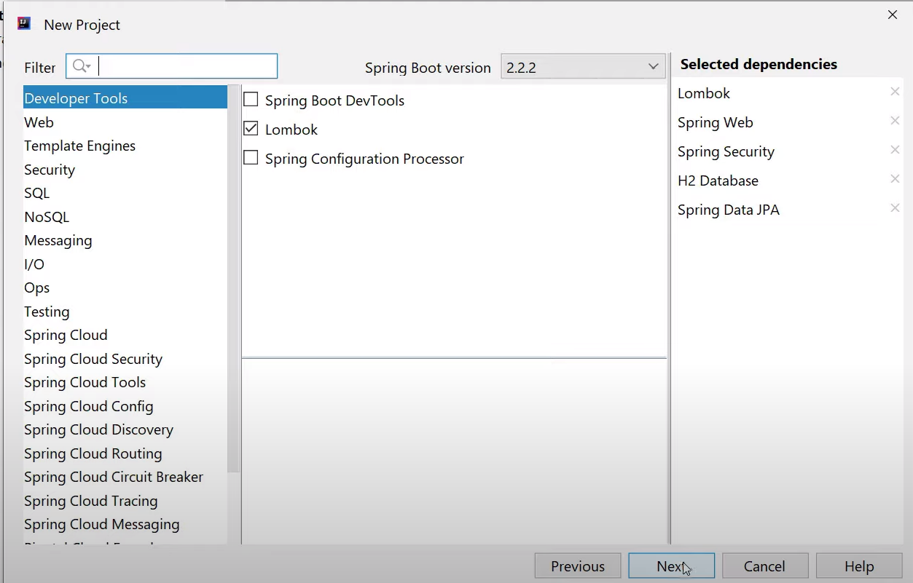
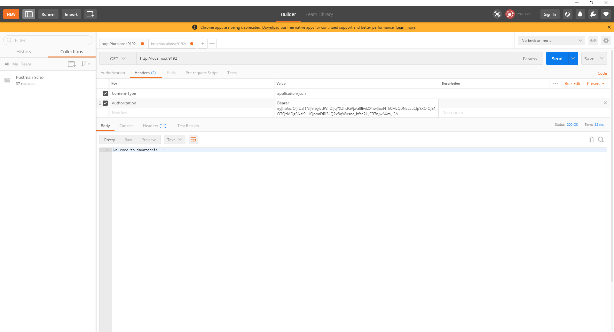
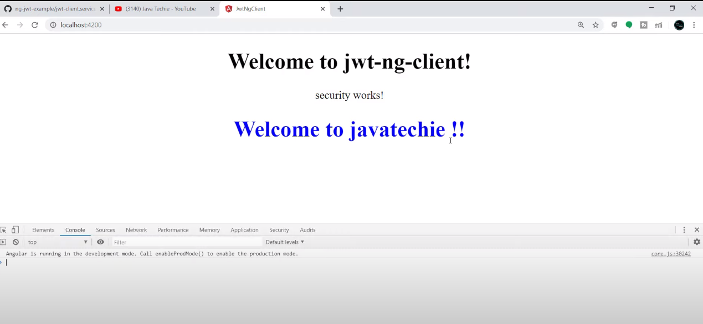

# Angular + Spring Boot JWT Authentication Example | JavaTechie

https://www.youtube.com/watch?v=rBNOc4ymd1E

https://www.youtube.com/watch?v=-Aob4HfEWg4&t=2s

https://github.com/Java-Techie-jt/spring-security-jwt-example

https://github.com/Java-Techie-jt/angular-jwt-client

Reference : https://jwt.io/

## Create new project

  

## Create User class


User.java

```java
package com.javatechie.jwt.api.entity;

import lombok.AllArgsConstructor;
import lombok.Data;
import lombok.NoArgsConstructor;

import javax.persistence.Entity;
import javax.persistence.Id;
import javax.persistence.Table;

@Data
@AllArgsConstructor
@NoArgsConstructor
@Entity
@Table(name = "USER_TBL")
public class User {
    @Id
    private int id;
    private String userName;
    private String password;
    private String email;
}

```

## CustomUserDetailsService

UserRepository

```java
package com.javatechie.jwt.api.repository;

import com.javatechie.jwt.api.entity.User;
import org.springframework.data.jpa.repository.JpaRepository;

public interface UserRepository extends JpaRepository<User,Integer> {
    User findByUserName(String username);
}
```

CustomUserDetailsService

```java
package com.javatechie.jwt.api.service;

import com.javatechie.jwt.api.entity.User;
import com.javatechie.jwt.api.repository.UserRepository;
import org.springframework.beans.factory.annotation.Autowired;
import org.springframework.security.core.userdetails.UserDetails;
import org.springframework.security.core.userdetails.UserDetailsService;
import org.springframework.security.core.userdetails.UsernameNotFoundException;
import org.springframework.stereotype.Service;

import java.util.ArrayList;

@Service
public class CustomUserDetailsService implements UserDetailsService {
    @Autowired
    private UserRepository repository;

    @Override
    public UserDetails loadUserByUsername(String username) throws UsernameNotFoundException {
        User user = repository.findByUserName(username);
        return new org.springframework.security.core.userdetails.User(user.getUserName(), user.getPassword(), new ArrayList<>());
    }
}
```

SecurityConfig

```java
package com.javatechie.jwt.api.config;

import com.javatechie.jwt.api.filter.JwtFilter;
import com.javatechie.jwt.api.service.CustomUserDetailsService;
import org.springframework.beans.factory.annotation.Autowired;
import org.springframework.context.annotation.Bean;
import org.springframework.context.annotation.Configuration;
import org.springframework.security.authentication.AuthenticationManager;
import org.springframework.security.config.BeanIds;
import org.springframework.security.config.annotation.authentication.builders.AuthenticationManagerBuilder;
import org.springframework.security.config.annotation.web.builders.HttpSecurity;
import org.springframework.security.config.annotation.web.configuration.EnableWebSecurity;
import org.springframework.security.config.annotation.web.configuration.WebSecurityConfigurerAdapter;
import org.springframework.security.config.http.SessionCreationPolicy;
import org.springframework.security.crypto.password.NoOpPasswordEncoder;
import org.springframework.security.crypto.password.PasswordEncoder;
import org.springframework.security.web.authentication.UsernamePasswordAuthenticationFilter;

@Configuration
@EnableWebSecurity
public class SecurityConfig extends WebSecurityConfigurerAdapter {

    @Autowired
    private CustomUserDetailsService userDetailsService;

    @Autowired
    private JwtFilter jwtFilter;

    @Override
    protected void configure(AuthenticationManagerBuilder auth) throws Exception {
        auth.userDetailsService(userDetailsService);
    }
    @Bean
    public PasswordEncoder passwordEncoder(){
        return NoOpPasswordEncoder.getInstance();
    }

    @Bean(name = BeanIds.AUTHENTICATION_MANAGER)
    @Override
    public AuthenticationManager authenticationManagerBean() throws Exception {
        return super.authenticationManagerBean();
    }

    @Override
    protected void configure(HttpSecurity http) throws Exception {
        http.csrf().disable().authorizeRequests().antMatchers("/authenticate")
                .permitAll().anyRequest().authenticated()
                .and().exceptionHandling().and().sessionManagement()
                .sessionCreationPolicy(SessionCreationPolicy.STATELESS);
        http.addFilterBefore(jwtFilter, UsernamePasswordAuthenticationFilter.class);;
    }
}
```


## Edit main class

SpringSecurityJwtExampleApplication

```java
package com.javatechie.jwt.api;

import com.javatechie.jwt.api.entity.User;
import com.javatechie.jwt.api.repository.UserRepository;
import org.springframework.beans.factory.annotation.Autowired;
import org.springframework.boot.SpringApplication;
import org.springframework.boot.autoconfigure.SpringBootApplication;

import javax.annotation.PostConstruct;
import java.util.List;
import java.util.stream.Collectors;
import java.util.stream.Stream;

@SpringBootApplication
public class SpringSecurityJwtExampleApplication {
    @Autowired
    private UserRepository repository;

    @PostConstruct
    public void initUsers() {
        List<User> users = Stream.of(
                new User(101, "javatechie", "password", "javatechie@gmail.com"),
                new User(102, "user1", "pwd1", "user1@gmail.com"),
                new User(103, "user2", "pwd2", "user2@gmail.com"),
                new User(104, "user3", "pwd3", "user3@gmail.com")
        ).collect(Collectors.toList());
        repository.saveAll(users);
    }

    public static void main(String[] args) {
        SpringApplication.run(SpringSecurityJwtExampleApplication.class, args);
    }

}
```

## Generate token

JwtUtil

```java
package com.javatechie.jwt.api.util;

import io.jsonwebtoken.Claims;
import io.jsonwebtoken.Jwts;
import io.jsonwebtoken.SignatureAlgorithm;
import org.springframework.security.core.userdetails.UserDetails;
import org.springframework.stereotype.Service;

import java.util.Date;
import java.util.HashMap;
import java.util.Map;
import java.util.function.Function;

@Service
public class JwtUtil {

    private String secret = "javatechie";

    public String extractUsername(String token) {
        return extractClaim(token, Claims::getSubject);
    }

    public Date extractExpiration(String token) {
        return extractClaim(token, Claims::getExpiration);
    }

    public <T> T extractClaim(String token, Function<Claims, T> claimsResolver) {
        final Claims claims = extractAllClaims(token);
        return claimsResolver.apply(claims);
    }
    private Claims extractAllClaims(String token) {
        return Jwts.parser().setSigningKey(secret).parseClaimsJws(token).getBody();
    }

    private Boolean isTokenExpired(String token) {
        return extractExpiration(token).before(new Date());
    }

    public String generateToken(String username) {
        Map<String, Object> claims = new HashMap<>();
        return createToken(claims, username);
    }

    private String createToken(Map<String, Object> claims, String subject) {

        return Jwts.builder().setClaims(claims).setSubject(subject).setIssuedAt(new Date(System.currentTimeMillis()))
                .setExpiration(new Date(System.currentTimeMillis() + 1000 * 60 * 60 * 10))
                .signWith(SignatureAlgorithm.HS256, secret).compact();
    }

    public Boolean validateToken(String token, UserDetails userDetails) {
        final String username = extractUsername(token);
        return (username.equals(userDetails.getUsername()) && !isTokenExpired(token));
    }
}
```

## Create Filter

JwtFilter

```java
package com.javatechie.jwt.api.filter;

import com.javatechie.jwt.api.service.CustomUserDetailsService;
import com.javatechie.jwt.api.util.JwtUtil;
import org.springframework.beans.factory.annotation.Autowired;
import org.springframework.security.authentication.UsernamePasswordAuthenticationToken;
import org.springframework.security.core.context.SecurityContextHolder;
import org.springframework.security.core.userdetails.UserDetails;
import org.springframework.security.web.authentication.WebAuthenticationDetailsSource;
import org.springframework.stereotype.Component;
import org.springframework.web.filter.OncePerRequestFilter;

import javax.servlet.FilterChain;
import javax.servlet.ServletException;
import javax.servlet.http.HttpServletRequest;
import javax.servlet.http.HttpServletResponse;
import java.io.IOException;

@Component
public class JwtFilter extends OncePerRequestFilter {

    @Autowired
    private JwtUtil jwtUtil;
    @Autowired
    private CustomUserDetailsService service;


    @Override
    protected void doFilterInternal(HttpServletRequest httpServletRequest, HttpServletResponse httpServletResponse, FilterChain filterChain) throws ServletException, IOException {

        String authorizationHeader = httpServletRequest.getHeader("Authorization");

        String token = null;
        String userName = null;

        if (authorizationHeader != null && authorizationHeader.startsWith("Bearer ")) {
            token = authorizationHeader.substring(7);
            userName = jwtUtil.extractUsername(token);
        }

        if (userName != null && SecurityContextHolder.getContext().getAuthentication() == null) {

            UserDetails userDetails = service.loadUserByUsername(userName);

            if (jwtUtil.validateToken(token, userDetails)) {

                UsernamePasswordAuthenticationToken usernamePasswordAuthenticationToken =
                        new UsernamePasswordAuthenticationToken(userDetails, null, userDetails.getAuthorities());
                usernamePasswordAuthenticationToken
                        .setDetails(new WebAuthenticationDetailsSource().buildDetails(httpServletRequest));
                SecurityContextHolder.getContext().setAuthentication(usernamePasswordAuthenticationToken);
            }
        }
        filterChain.doFilter(httpServletRequest, httpServletResponse);
    }
}
```

## Controller

```java
package com.javatechie.jwt.api.controller;

import com.javatechie.jwt.api.entity.AuthRequest;
import com.javatechie.jwt.api.util.JwtUtil;
import org.springframework.beans.factory.annotation.Autowired;
import org.springframework.security.authentication.AuthenticationManager;
import org.springframework.security.authentication.UsernamePasswordAuthenticationToken;
import org.springframework.web.bind.annotation.GetMapping;
import org.springframework.web.bind.annotation.PostMapping;
import org.springframework.web.bind.annotation.RequestBody;
import org.springframework.web.bind.annotation.RestController;

@RestController
public class WelcomeController {

    @Autowired
    private JwtUtil jwtUtil;
    @Autowired
    private AuthenticationManager authenticationManager;

    @GetMapping("/")
    public String welcome() {
        return "Welcome to javatechie !!";
    }

    @PostMapping("/authenticate")
    public String generateToken(@RequestBody AuthRequest authRequest) throws Exception {
        try {
            authenticationManager.authenticate(
                    new UsernamePasswordAuthenticationToken(authRequest.getUserName(), authRequest.getPassword())
            );
        } catch (Exception ex) {
            throw new Exception("inavalid username/password");
        }
        return jwtUtil.generateToken(authRequest.getUserName());
    }
}
```


  

  

## Angular app


security.component.ts

```ts
import { Component, OnInit } from '@angular/core';
import { JwtClientService } from '../jwt-client.service';

@Component({
  selector: 'app-security',
  templateUrl: './security.component.html',
  styleUrls: ['./security.component.css'],
})
export class SecurityComponent implements OnInit {
  authRequest: any = {
    userName: 'javatechie',
    password: 'password',
  };

  response: any;

  constructor(private service: JwtClientService) {}

  ngOnInit() {
    this.getAccessToken(this.authRequest);
  }

  public getAccessToken(authRequest) {
    let resp = this.service.generateToken(authRequest);
    resp.subscribe((data) => this.accessApi(data));
  }

  public accessApi(token) {
    let resp = this.service.welcome(token);
    resp.subscribe((data) => (this.response = data));
  }
}

```

jwt-client.service.ts

```ts
import { Injectable } from '@angular/core';
import { HttpClient, HttpHeaders } from '@angular/common/http';


@Injectable({
  providedIn: 'root'
})
export class JwtClientService {

  constructor(private httpClient: HttpClient) { }


  public generateToken(request) {
    return this.httpClient.post<string>("http://localhost:9191/authenticate", request, {  responseType: 'text' as 'json' });
  }


  public welcome(token) {
    let tokenStr = 'Bearer ' + token;
    const headers = new HttpHeaders().set('Authorization', tokenStr);
    return this.httpClient.get<string>("http://localhost:9191/", {headers, responseType: 'text' as 'json' });
  }
}

```

  

# Spring Security using JWT in Spring Boot App | Tech Primers

This video covers the Spring Security using JWT in Spring Boot App with an example. 

https://www.youtube.com/watch?v=-HYrUs1ZCLI

🔗Github Code for the example:

https://github.com/TechPrimers/jwt-security-example

This Project uses JWT to secure the REST endpoints.

The Following are the REST end points available in the example.

- `/token` - Generates the JWT token based on the JSON sent. Its a POST method which expects the JSON: `{ "username": "name", "id": 123, "role": "admin"}`
- `/rest/hello` - Requires a JWT Token with Header `key - "Authorisation"` and `value - "Token <JWT_Token>"`


https://www.youtube.com/watch?v=X80nJ5T7YpE

https://www.youtube.com/watch?v=sm-8qfMWEV8&list=PLqq-6Pq4lTTYTEooakHchTGglSvkZAjnE


# Spring Security | FULL COURSE -4h

https://www.youtube.com/watch?v=her_7pa0vrg

https://www.youtube.com/watch?v=yefmcX57Eyg

many branch

https://github.com/amigoscode/spring-boot-security-course

## Branch 1

StudentController

```java
package com.example.demo.student;

import org.springframework.web.bind.annotation.GetMapping;
import org.springframework.web.bind.annotation.PathVariable;
import org.springframework.web.bind.annotation.RequestMapping;
import org.springframework.web.bind.annotation.RestController;

import java.util.Arrays;
import java.util.List;

@RestController
@RequestMapping("api/v1/students")
public class StudentController {

    private static final List<Student> STUDENTS = Arrays.asList(
      new Student(1, "James Bond"),
      new Student(2, "Maria Jones"),
      new Student(3, "Anna Smith")
    );

    @GetMapping(path = "{studentId}")
    public Student getStudent(@PathVariable("studentId") Integer studentId) {
        return STUDENTS.stream()
                .filter(student -> studentId.equals(student.getStudentId()))
                .findFirst()
                .orElseThrow(() -> new IllegalStateException(
                        "Student " + studentId + " does not exists"
                ));
    }
}

```

## Branch 2

ApplicationSecurityConfig.java

```java
package com.example.demo.security;

import org.springframework.context.annotation.Configuration;
import org.springframework.security.config.annotation.web.builders.HttpSecurity;
import org.springframework.security.config.annotation.web.configuration.EnableWebSecurity;
import org.springframework.security.config.annotation.web.configuration.WebSecurityConfigurerAdapter;

@Configuration
@EnableWebSecurity
public class ApplicationSecurityConfig extends WebSecurityConfigurerAdapter {

    @Override
    protected void configure(HttpSecurity http) throws Exception {
        http
                .authorizeRequests()
                .antMatchers("/", "index", "/css/*", "/js/*")
                .permitAll()
                .anyRequest()
                .authenticated()
                .and()
                .httpBasic();
    }

}

```

## Branch 3

PasswordConfig

```java
package com.example.demo.security;

import org.springframework.context.annotation.Bean;
import org.springframework.context.annotation.Configuration;
import org.springframework.security.crypto.bcrypt.BCryptPasswordEncoder;
import org.springframework.security.crypto.password.PasswordEncoder;

@Configuration
public class PasswordConfig {

    @Bean
    public PasswordEncoder passwordEncoder() {
        return new BCryptPasswordEncoder(10);
    }
}

```

ApplicationUserPermission

```java
package com.example.demo.security;

public enum ApplicationUserPermission {
    STUDENT_READ("student:read"),
    STUDENT_WRITE("student:write"),
    COURSE_READ("course:read"),
    COURSE_WRITE("course:write");

    private final String permission;

    ApplicationUserPermission(String permission) {
        this.permission = permission;
    }

    public String getPermission() {
        return permission;
    }
}

```

ApplicationUserRole

```java
package com.example.demo.security;

import com.google.common.collect.Sets;

import java.util.Set;

import static com.example.demo.security.ApplicationUserPermission.*;

public enum ApplicationUserRole {
    STUDENT(Sets.newHashSet()),
    ADMIN(Sets.newHashSet(COURSE_READ, COURSE_WRITE, STUDENT_READ, STUDENT_WRITE)),
    ADMINTRAINEE(Sets.newHashSet(COURSE_READ, STUDENT_READ));

    private final Set<ApplicationUserPermission> permissions;

    ApplicationUserRole(Set<ApplicationUserPermission> permissions) {
        this.permissions = permissions;
    }

    public Set<ApplicationUserPermission> getPermissions() {
        return permissions;
    }
}

```

ApplicationSecurityConfig

```java
package com.example.demo.security;

import org.springframework.beans.factory.annotation.Autowired;
import org.springframework.context.annotation.Bean;
import org.springframework.context.annotation.Configuration;
import org.springframework.http.HttpMethod;
import org.springframework.security.config.annotation.web.builders.HttpSecurity;
import org.springframework.security.config.annotation.web.configuration.EnableWebSecurity;
import org.springframework.security.config.annotation.web.configuration.WebSecurityConfigurerAdapter;
import org.springframework.security.core.authority.SimpleGrantedAuthority;
import org.springframework.security.core.userdetails.User;
import org.springframework.security.core.userdetails.UserDetails;
import org.springframework.security.core.userdetails.UserDetailsService;
import org.springframework.security.crypto.password.PasswordEncoder;
import org.springframework.security.provisioning.InMemoryUserDetailsManager;

import static com.example.demo.security.ApplicationUserRole.*;


@Configuration
@EnableWebSecurity
public class ApplicationSecurityConfig extends WebSecurityConfigurerAdapter {

    private final PasswordEncoder passwordEncoder;

    @Autowired
    public ApplicationSecurityConfig(PasswordEncoder passwordEncoder) {
        this.passwordEncoder = passwordEncoder;
    }

    @Override
    protected void configure(HttpSecurity http) throws Exception {
        http
                .authorizeRequests()
                .antMatchers("/", "index", "/css/*", "/js/*").permitAll()
                .antMatchers("/api/**").hasRole(STUDENT.name())
                .anyRequest()
                .authenticated()
                .and()
                .httpBasic();
    }

    @Override
    @Bean
    protected UserDetailsService userDetailsService() {
        UserDetails annaSmithUser = User.builder()
                .username("annasmith")
                .password(passwordEncoder.encode("password"))
                .roles(STUDENT.name()) // ROLE_STUDENT
                .build();

        UserDetails lindaUser = User.builder()
                .username("linda")
                .password(passwordEncoder.encode("password123"))
                .roles(ADMIN.name()) // ROLE_ADMIN
                .build();

        UserDetails tomUser = User.builder()
                .username("tom")
                .password(passwordEncoder.encode("password123"))
                .roles(ADMINTRAINEE.name()) // ROLE_ADMINTRAINEE
                .build();

        return new InMemoryUserDetailsManager(
                annaSmithUser,
                lindaUser,
                tomUser
        );

    }
}

```


